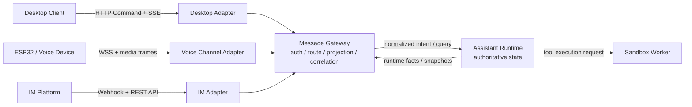

# 多终端通信协议与 Gateway 边界讨论

- 记录日期：260827
- 状态：已纳入版本
- 来源：用户会话讨论；`agent-robot` 长期规划与 `ez-assistant` 现有 Runtime Host 通信实现的只读调研
- 目标版本：`v0.21.0`

> 本文保留进入版本设计前的讨论过程；已确认范围由
> [`v0.21.0 功能设计`](../versions/v0.21.0/功能设计.md)统一承载。功能设计获得确认前，仍不表示
> 现行 HTTP Command + SSE 产品契约、Gateway 或新协议类型已经完成实现。

## 一、问题起点

`agent-robot` 的长期接入需求引出了一个问题：是否应将 `ez-assistant` 现有的 SSE
通信全面替换为 WebSocket，以便接入 ESP32 语音终端，并为后续的多用户、服务器部署、
执行环境隔离和 IM 终端做准备。

讨论中逐步明确，真正需要解决的不是 SSE 和 WebSocket 的二选一，而是：

1. Gateway 与 Runtime Host 的定位存在重叠；
2. 当前 Host 事件直接面向桌面客户端，缺少面向多种终端的统一消息语义边界；
3. 桌面、语音设备和 IM 的连接形态、实时性与可靠性要求不同，不应强制共用一种
   wire transport。

## 二、已达成的核心认识

### 2.1 不全面将 SSE 替换为 WebSocket

现有 `ez-assistant` 已形成一套明确的本地客户端契约：

- HTTP Command 承载用户意图和查询；
- SSE 承载可丢失的实时观察事件；
- Streaming Upload 承载附件等大字节流；
- 首次加载、断线重连或出现事件缺口时，客户端从 Runtime 权威快照重建状态，
  不将 SSE 视为权威存储或重放日志。

这套契约适合 Desktop 到 loopback Runtime Host 的本地通信。将它全面换成 WebSocket
不会自动解决多终端适配问题，反而需要重做认证、重连、缺口恢复、背压和客户端
生命周期。特别是浏览器/WebView 原生 WebSocket 不能像 `fetch` 一样任意设置
`Authorization` header，若替换还会连带改变现有鉴权方式。

因此，“设备需要 WSS”不等于“Runtime 对所有客户端都必须使用 WebSocket”。

### 2.2 统一的应当是消息语义，不是传输协议

用户提出的方向是：将现有所有 host-event 降级为统一消息基线，通过多态的适配层
接收和输出不同形态的终端消息。

这个方向的核心是成立的，但需要明确“统一”的层次：

- Runtime 对外发布稳定、与终端无关的业务事实和意图语义；
- Channel Adapter 负责将 HTTP/SSE、WSS、IM Webhook/API 等具体形态转换为这些语义；
- 各终端只获取自己能够消费且有权消费的投影，不要求所有终端复制 Desktop
  的完整事件流；
- 传输心跳、WebSocket ping/pong、IM 签名、HTTP header、音频 frame 等仍属于
  Adapter 私有细节，不进入统一应用消息基线。

统一基线不应直接被设计成“包容所有通道字段的万能消息”。应优先复用
`assistant-protocol` 中已有的 Runtime Command、Result、Event Envelope、Snapshot 和稳定错误，
只在出现两个及以上真实 Channel Adapter 的稳定共性后，再提取新的公共 envelope 或 trait。

### 2.3 Gateway 和 Host 不应在第一阶段成为两套重复服务

若新增独立 Gateway 进程，同时保留当前 Runtime Host 的接入职责，容易重复实现：

- 进程启停、健康检查、发现和配置；
- 鉴权、连接管理、重连与协议版本协商；
- Runtime Client、错误映射、诊断和观测；
- 事件订阅、路由、流控和缺口恢复。

候选方向是在当前 Runtime Host 进程内将职责逻辑拆分，而不立即增加一个 Gateway
产品进程：

| 逻辑职责 | 边界 |
| --- | --- |
| Process Host | Runtime 装配、进程生命周期、listener 和受控关闭 |
| Message Gateway | 认证上下文、能力投影、路由、关联、订阅、脱敏与恢复边界 |
| Channel Adapter | Desktop HTTP/SSE、设备 WSS、IM Webhook/API 等具体协议与终端语义转换 |
| Assistant Runtime | Session、Run、调度、持久化和业务状态的唯一权威来源 |

这是“一个产品进程、清晰模块边界”的候选形态。Runtime Host 只做组合和监督，
Gateway 不持有 Session/Run 的第二份权威状态。只有当多用户、公网暴露、多实例路由或
独立伸缩成为已确认需求时，才评估将 Gateway 拆成独立服务。

## 三、候选的通信分层

该分层中：

- Adapter 解决“怎么连接和翻译”；
- Gateway 解决“这是谁、能做什么、路由到哪里、返回什么投影”；
- Runtime 解决“业务事实是什么”；
- Sandbox Worker 解决“代码在哪个隔离环境中执行”，不参与终端通信协议定义。

Gateway 向 Runtime 传递的信任上下文应由服务端根据连接和凭据创建，不接受客户端
自报的 `user_id`、`tenant_id` 或权限作为信任事实。可能需要的语义包括 principal、
tenant、channel identity、capabilities 和 authorization scope，但具体类型要在纳入
目标版本后再设计。

## 四、各终端的协议与投影

| 终端 | 候选传输 | 输入特征 | 输出投影 | 恢复/可靠性 |
| --- | --- | --- | --- | --- |
| Desktop | loopback HTTP Command + SSE + Streaming Upload | 完整交互意图、查询和附件 | 丰富的 Run、Text Delta、Tool、Approval 等事件 | SSE 可丢；依靠 sequence/gap 和权威快照重建 |
| ESP32 / Voice | LAN WSS，可另配 mTLS/设备身份 | 音频帧、设备控制、会话绑定 | 经裁剪的状态、语音播放控制和媒体流 | Adapter 负责连接和媒体背压；业务状态仍回到 Runtime 查询 |
| IM | Webhook 入站 + 平台 REST API 出站 | 文本/附件、外部消息 ID、频道和用户绑定 | 通常只需 start/typing 和 finish/终态回复 | 入站幂等；终态出站需可重试的交付记录 |

### 4.1 设备 WSS 的边界

WSS 对语音设备有价值，因为它需要持久双向连接、设备状态和媒体帧。但音频/二进制
frame 不应伪装成 Runtime Event，它们应保留在 Voice Channel Adapter 内；只有转写后的
用户意图、会话绑定和必要的播放状态进入统一应用语义层。

`agent-robot` 目前规划可解读为设备到 Voice Channel Adapter 使用 WSS，Adapter 到
Runtime Host 复用现有 HTTP Command + SSE；它本身不构成“全面替换 Runtime SSE”的必然要求。

### 4.2 IM 不消费完整流式事件

IM 终端比 Desktop 更简单，大多数情况下不支持或不需要 token 级流式输出。其 Adapter
通常只需消费：

- `start` 或 typing 类短暂状态，这类状态可丢失；
- `finish` / failed / cancelled 等终态；
- 终态到达后查询权威 Run/Conversation，组装一次最终回复。

不应为了保证 IM 交付而持久化每一个 `TextDelta`、`ReasoningDelta` 或工具输出分片。
IM 需要的可靠性是最终消息交付可重试，而不是将桌面实时观察流变成持久日志。

候选方向是保留 `external_message_id -> input_id/run_id -> delivery_status` 的幂等和交付关联，
并为最终回复建立可重试的 Outbox/交付记录。这仅是多用户 IM 阶段的候选方案，
不表示当前版本已需要新增表或持久化机制。

## 五、多用户、服务器化和执行沙箱的影响

未来升级多用户和服务器部署时，传输适配层可以继续保留，但 Gateway 语义需要补齐：

- 用户/租户身份、Channel 绑定、ACL 和能力范围；
- 跨 Runtime 实例路由、会话归属和连接恢复；
- 限流、配额、审计、脱敏与外部消息幂等；
- 面向不同终端的 capability negotiation 和事件投影。

文件和 Shell 执行环境则应从 Runtime 权威状态中分离，通过明确的工具执行契约路由到
按用户或 Workspace 装配的 Sandbox Worker。沙箱后端是 Rootless OCI、gVisor 还是 VM，
不应改变 Desktop/设备/IM 与 Runtime 之间的应用消息语义。

当出现下列已确认需求时，才值得将 Gateway 从 Runtime Host 进程独立拆出：

- 一个 Gateway 需要路由到多个 Runtime 实例；
- 公网入口和 Runtime 必须有独立安全边界；
- Channel 连接数需要独立水平伸缩；
- Gateway 与 Runtime 的发布节奏、故障域或运维归属已经不同。

## 六、推荐的渐进演进顺序

1. **保持现状**：Desktop 继续使用 HTTP Command + SSE + Streaming Upload，不开始全面
   WebSocket 迁移。
2. **先澄清语义**：盘点现有 Runtime Command、Result、Event 和 Snapshot，区分权威事实、
   可丢失观察和传输私有消息。
3. **增加第二个真实 Adapter**：根据 `agent-robot` 的实际能力增加 Voice Channel Adapter，
   保留 WSS/媒体处理的私有边界。
4. **再提取稳定共性**：根据 Desktop 与 Voice 两个真实 Adapter 的重复点，决定是否需要
   公共 Channel trait、鉴权上下文或消息 envelope，不为假想终端预先建立通用总线。
5. **按需加入 IM**：仅投影 start/typing 和终态，以权威查询和最终交付记录保证回复，
   不持久化 token delta。
6. **有证据再拆服务**：只在路由、安全、伸缩或故障域证据出现后，将进程内 Gateway
   拆为独立服务。

## 七、明确不采用的方向

- 不因 ESP32 需要 WSS 而全面废弃 Desktop SSE；
- 不让 Gateway 和 Runtime Host 同时持有 Session、Run 或调度状态；
- 不将媒体帧、传输心跳、IM 签名等塞入 Runtime Event；
- 不要求 IM 消费或持久化 Desktop 的完整 token/tool 流；
- 不将 SSE 或 WebSocket 事件流当作权威业务存储；
- 不在只有一个实现时，为未来可能存在的终端先建巨大的通用插件总线。

## 八、待后续版本设计确认的问题

1. Message Gateway 是 Runtime Host 中的私有模块，还是需要形成可复用 crate；
2. 现有 `RuntimeEventEnvelope` 是否已足以承载多 Adapter 共性，还是需要增加
   `message_id`、`correlation_id` 或协议版本字段；
3. Channel 能力如何表达，以避免将不可消费的事件投影给设备或 IM；
4. Voice Channel Adapter 是与 Runtime Host 同进程的可选模块，还是由 `agent-robot` 产品独立承载；
5. 多用户阶段会话归属、租户路由和 Runtime 实例选择的权威存储位于哪一层；
6. IM 平台具体支持哪些 start/typing/终态能力，以及最终交付失败的重试和对账策略。

## 九、讨论结论

当前不需要为了“协议统一”而将 Runtime 的 SSE 全面替换为 WebSocket。更稳妥的方向是：

**将 Runtime Command、Result、Event 和 Snapshot 收敛为与终端无关的应用语义基线，
在 Runtime Host 进程内以清晰的 Gateway 边界组合多种 Channel Adapter；Desktop 保留
HTTP/SSE，语音设备使用 WSS，IM 使用 Webhook/API，并由各 Adapter 进行能力裁剪、
协议转换和交付处理。**

这一方向可以先以进程内模块化形式实现，避免 Gateway/Host 重复带来的维护负担；
后续若真正出现多实例路由、公网安全边界或独立伸缩需求，再将 Gateway 拆分为独立服务。
