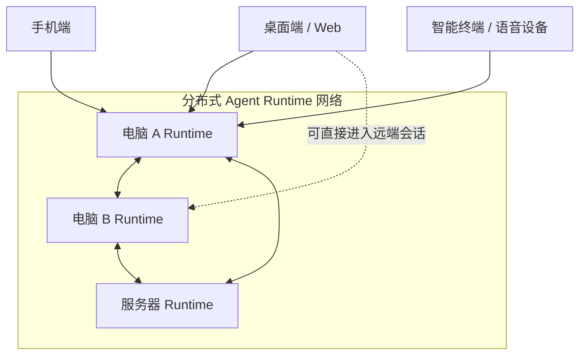
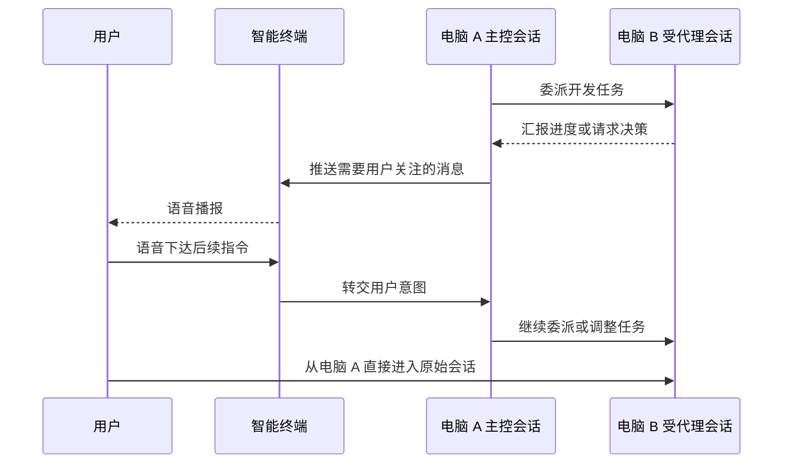

# 分布式 Agent 网络与融合文件系统愿景

- 记录日期：260904
- 状态：待评估
- 来源：用户会话讨论及用户提供的架构示意图
- 目标版本：待定

> 本文只记录项目的长期愿景和典型使用场景，不讨论当前项目状态、具体实现路径或版本范围。
> 节点发现、通信拓扑、安全授权、数据同步和一致性等技术问题均留待未来版本设计。

## 一、总体愿景

ez-assistant 的长期目标是形成一个由多个 Runtime 节点组成的分布式 Agent 网络。

运行 Runtime 的电脑和服务器都是网络中的 Agent 节点，彼此没有本质区别。每个节点可以承载
Agent 会话、处理任务，并与其他节点上的会话协作。

手机、智能终端等设备不一定运行 Runtime。它们可以只是前端交互层，通过文字、图形界面、
通知或语音接入 Agent 网络。



这个愿景不是简单地让多台设备同步聊天记录，而是让 Agent 会话脱离单个交互界面存在：

- Agent 可以在适合的 Runtime 节点上持续工作；
- 用户可以从任意已接入的终端了解进展和下达指令；
- 用户可以从一个终端直接进入另一个 Runtime 节点上的原始会话；
- 不同 Runtime 节点上的 Agent 会话可以互相委派、汇报和协作。

## 二、Runtime 节点与交互终端

### 2.1 Runtime 节点

电脑 A、电脑 B 和服务器只要运行 Runtime，就属于分布式 Agent 网络中的节点。它们均可：

- 承载一个或多个 Agent 会话；
- 接受用户或其他会话发出的任务；
- 将任务委派给其他节点上的会话；
- 对外提供会话状态、进度和产物；
- 暴露经过授权的本地文件。

“主控”和“受代理”是会话在特定协作关系中的角色，不是某类设备的固定身份。同一个会话在
不同任务中可以发起委派，也可以接受其他会话的委派。

### 2.2 交互终端

手机和智能终端可以只承担交互职责，而不运行 Agent Runtime。它们可用于：

- 查看会话及任务状态；
- 接收文字、声音或其他形式的提醒；
- 输入文字或语音指令；
- 打开或切换到具体 Agent 会话；
- 展示 Runtime 节点提供的文件和任务产物。

同一设备也可以同时运行 Runtime 和交互前端，例如电脑 A 既承载本地 Agent，也通过桌面端或
Web 端访问电脑 B 的会话。

### 2.3 Runtime 提供 Web 入口

Runtime 节点以 HTTP 协议提供能力，因此在长期愿景中，每个 Runtime 节点都可以同时分发
Web 端。用户可以通过浏览器或其他 Web 容器进入该节点，也可以通过一个终端访问不同节点上的
会话。

Web、桌面端、手机端和智能终端都是 Agent 网络的交互入口；是否运行 Runtime 与是否能够访问
Agent 会话是两个独立维度。

## 三、场景一：跨节点委派与跨终端介入

### 3.1 场景背景

- 电脑 B 上的 Agent 会话正在开发软件；
- 用户正在电脑 A 上打游戏；
- 电脑 A 上存在负责协调的主控会话；
- 用户身边还有可以进行语音交互的智能终端。

### 3.2 使用过程

1. 主控会话将开发任务委派给电脑 B 上的受代理会话。
2. 电脑 B 的会话持续工作，并向主控会话报告进度、阻塞、待决策事项或完成结果。
3. 主控会话持续知悉受代理会话的状态，并判断哪些变化需要用户关注。
4. 当出现重要进展或需要用户决策时，智能终端通过语音向用户播报。
5. 用户无需离开当前活动，可以直接通过智能终端下达后续指令。
6. 指令进入主控会话，由主控会话继续协调或委派电脑 B 的会话工作。
7. 如果需要更具体的交流，用户可以切出游戏，打开电脑 A 上的 ez-assistant。
8. 用户从电脑 A 直接打开电脑 B 上正在工作的原始会话，查看完整上下文并继续交流。



### 3.3 核心体验

- 工作不会因为用户关闭或离开某个界面而中断；
- 重要进展可以主动到达用户当前所在的终端；
- 用户可以先通过轻量终端快速决策，再通过完整界面进入工作现场；
- 跨终端进入的是同一个持续工作的会话，而不是一份脱离原会话的记录副本。

## 四、场景二：分布式文件系统融合

每个 Runtime 节点都拥有本地文件和虚拟文件：

- **本地文件**：实际位于当前 Runtime 节点上的文件；
- **虚拟文件**：分布式网络中其他 Runtime 节点的文件在当前节点上的呈现。

用户和 Agent 可以通过统一的文件空间访问多个 Runtime 节点上的资源。例如：

```text
Agent 文件空间
├── 电脑 A
│   ├── 桌面
│   └── projects/
├── 电脑 B
│   └── projects/ez-assistant/
├── 家庭服务器
│   ├── documents/
│   └── media/
└── 云端 Runtime
    └── agent-artifacts/
```

虚拟文件指向其他设备上的文件。文件可以保留在原 Runtime 节点，同时被其他获得授权的节点和
会话发现、引用和使用。

### 4.1 典型使用过程

1. 项目源代码实际存储在电脑 B。
2. 用户在电脑 A 的融合文件空间中看到电脑 B 上的项目。
3. 电脑 A 的主控会话可以引用项目中的文件，并理解这些文件来自电脑 B。
4. 用户可以要求系统检查、修改、测试或整理该项目，而不必先手动传输整个目录。
5. 相关任务可以交给电脑 B 上的 Agent 会话执行。
6. 日志、报告和其他产物重新出现在统一文件空间中，供其他终端查看和使用。

### 4.2 核心体验

- 用户不必先判断文件在哪台设备上，再手动上传或下载；
- Agent 不仅能够识别文件，还能够理解文件所在的 Runtime 节点；
- 会话协作与文件访问可以结合：任务能够被委派给拥有相关文件的节点；
- 手机和智能终端即使不运行 Runtime，也可以通过所连接的 Runtime 查看文件或获取文件摘要；
- 多台设备共同组成一个连续的工作空间，而不是多个相互割裂的本地目录。

## 五、统一的产品图景

这一愿景由三个彼此配合的部分组成：

1. **会话跨终端进入**：用户可以从任意交互终端进入分布式网络中的 Agent 会话；
2. **任务跨 Agent 委派**：不同 Runtime 节点上的会话可以互相委派、汇报和协作；
3. **文件跨 Runtime 使用**：各节点的本地文件共同形成可发现、可引用的融合文件空间。

最终，用户面对的不再是若干台彼此孤立的设备，而是一个由多台设备共同组成、持续运行的智能
工作空间：Agent 可以在不同节点上协同工作，文件可以跨节点使用，用户则可以在身边任意终端
观察、指挥并进入具体工作现场。

## 六、愿景表述

> ez-assistant 是一个本地优先的分布式 Agent 网络。运行 Runtime 的电脑和服务器共同承载
> Agent 会话、任务与文件；桌面端、Web、手机和智能终端提供随处可用的交互入口。会话可以跨
> 终端进入，任务可以跨 Agent 委派，文件可以跨 Runtime 使用，让多台设备共同形成一个连续、
> 可协作的智能工作空间。

## 七、尚未讨论的内容

以下内容不属于本次愿景总结，后续纳入具体版本时再讨论：

- Runtime 节点的发现、连接和组网方式；
- 用户、设备、节点和会话的身份与授权模型；
- 会话归属、迁移、接管和状态一致性；
- Runtime 之间的通信协议及事件传递机制；
- Web 端的分发、访问和版本关系；
- 虚拟文件的路径模型、读写语义、缓存、同步和冲突处理；
- 节点离线时的会话与文件表现；
- 语音通知的触发规则以及用户注意力管理；
- 该愿景应拆分为哪些产品版本和建设阶段。

## 八、相关背景

- [`多终端通信协议与 Gateway 边界讨论`](260827-多终端通信协议与Gateway边界讨论.md)：此前围绕
  多终端接入和 Gateway 边界形成的版本输入。该文档服务于具体版本范围，不代替本文记录的长期
  分布式愿景。
