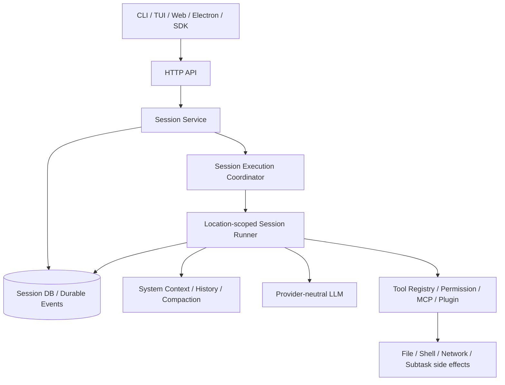
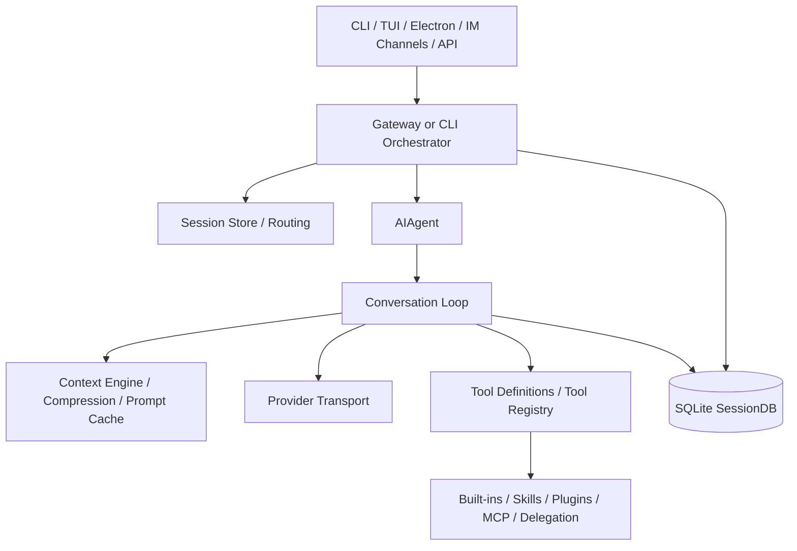

# OpenCode、Hermes Agent 与 ez-assistant 架构综合分析

> 研究日期：2026-07-30
>
> 研究方式：直接阅读三个本地仓库的设计文档、入口、核心执行循环、模型适配、
> 工具系统、上下文系统、持久化与测试代码。本文讨论的是所列本地快照，不把 README
> 宣传语或尚未接线的设计目标当成已实现能力。

## 一、结论先行

三个项目代表了三种很有代表性的 Agent 工程路线：

- **OpenCode** 是“编码 Agent 平台”路线。它把 Session、HTTP 协议、客户端、模型、
  工具、权限和工作区位置做成完整平台；现状是成熟 V1 与事件驱动 V2 并存。它最值得
  学习的是持久化输入准入、会话串行执行、协议分层和工具调用事件化；最大代价是双栈
  迁移、Effect 技术栈和平台规模共同带来的复杂度。
- **Hermes Agent** 是“个人 Agent 产品”路线。它优先解决真实用户要用的问题：
  多渠道、多 Provider、技能、记忆、定时任务、子 Agent、插件、审批、故障恢复和提示词
  缓存。它最值得学习的是能力向边缘扩展、缓存纪律和生产故障防御；最大问题是核心循环、
  Gateway、CLI 和持久化已形成巨型模块，状态与兼容逻辑很难局部推理。
- **ez-assistant** 是“先建立可靠内核，再建设产品”路线。它以 Rust crate 强制隔离
  规范类型、单次模型 Turn、Agent Loop、工具 SPI、Context 和应用 Runtime。它目前的
  Core/Provider/Testkit 设计干净，工具副作用前落账、唯一终态和 Provider 状态保真也很
  扎实；但正式 Runtime、持久化、权限实现和桌面业务链尚未完成，所以当前不是与前两者
  同等成熟的应用。

从三个项目可以归纳出当前成熟 Agent 系统的共同结构：

```text
交互面：CLI / TUI / Desktop / IM / HTTP API
                    │
控制面：Session / Run / durable admission / queue / cancel / recovery
                    │
执行面：context → one model turn → tool settlement → continuation
                    │
能力面：provider / tools / skills / memory / MCP / plugins
                    │
事实面：conversation journal / events / usage / audit / checkpoints
```

真正困难的部分不是写出 `while model_wants_tool`，而是保证：

1. 用户输入只接收一次；
2. 同一会话只有一个上下文写者；
3. 工具副作用发生前已经留下可恢复事实；
4. 失败、取消、压缩和重启后仍能判断下一步；
5. UI 断线不影响执行，流式事件丢失不破坏权威会话；
6. Provider、工具和扩展可以增长，而不把差异塞回 Agent Loop。

## 二、研究范围与快照

| 项目 | 本地路径 | Git 快照 | 工作树口径 |
| --- | --- | --- | --- |
| OpenCode | `~/github/opencode` | `7565e03536d1`，`dev` | 读取当前提交 |
| Hermes Agent | `~/github/hermes-agent` | `707f31668740`，`main` | 读取当前提交 |
| ez-assistant | 当前仓库 | `0637a5e43ebb`，`main` | 同时纳入尚未提交的 v0.3.0 代码 |

本报告是架构和实现审阅，不是性能压测，也不以文件数量或代码行数直接判断质量。
OpenCode V2 仍在迁移，Hermes 已积累大量平台兼容逻辑，ez-assistant 则处在内核优先的
早期版本；比较时会明确区分“设计先进性”和“产品完成度”。OpenCode 与 Hermes 首先是
成熟 Agent 应用而不是纯框架库，因此“当前开发思想”是从这两个样本和 ez-assistant
实现中提炼的工程结论，不是对整个行业项目的统计排名。

## 三、OpenCode

### 3.1 定位与总体架构

OpenCode 是面向软件开发任务的多入口 Agent 平台。仓库包含 CLI/TUI、Web、Electron
Desktop、HTTP Server、SDK、Provider、工具、权限、MCP、插件和持久化 Session。

当前必须区分两套实现：

1. `packages/opencode` 是成熟的 V1 生产实现，入口和能力覆盖完整。
2. `packages/core`、`packages/protocol`、`packages/server`、`packages/client` 是 V2
   目标架构，重点转向 Effect 服务分层、持久化事件、幂等输入准入和 Location-scoped
   Runner。



V1 更接近一个成熟但较集中的 Session Prompt 服务；V2 则把输入、执行、历史投影、
Location、工具物化和事件发布拆成独立服务。

### 3.2 V1 主要调用链

关键入口包括：

- `packages/opencode/src/index.ts`
- `packages/opencode/src/server/routes/instance/httpapi/handlers/session.ts`
- `packages/opencode/src/session/prompt.ts`
- `packages/opencode/src/session/processor.ts`
- `packages/opencode/src/session/llm.ts`
- `packages/opencode/src/tool/registry.ts`

一次典型调用如下：

1. CLI、TUI、Desktop 或 SDK 调用 Session HTTP API。
2. HTTP handler 转交 `SessionPrompt.Service.prompt`。
3. Prompt 服务创建并持久化 User message，进入按 Session 管理的 loop/run state。
4. Loop 读取压缩后的历史，解析 Agent、模型、系统指令、技能、MCP 和工具。
5. `SessionTools.resolve` 依据 Agent 权限、Provider 能力和配置生成本轮工具集合。
6. `LLM.Service.stream` 发起一个 Provider Turn。默认路径基于 AI SDK，实验路径使用
   `@opencode-ai/llm`，两者都归一为内部 LLM 事件。
7. `SessionProcessor` 增量处理 reasoning、text、tool call、usage、snapshot 和 patch。
8. 若模型产生工具调用，处理器记录状态、执行工具、保存结果，再回到下一 Provider
   Turn；无工具调用则完成 Session 响应。
9. Context overflow、重试、压缩、权限拒绝、重复调用检测和中断都在这一执行链周边
   收敛。

V1 的优势是功能闭环完整；问题是 `session/prompt.ts`、`session/processor.ts` 等文件
承担了过多编排职责，修改一个会话行为时往往需要理解大段共享状态。

### 3.3 V2 主要调用链

关键入口包括：

- `packages/server/src/handlers/session.ts`
- `packages/core/src/session.ts`
- `packages/core/src/session/input.ts`
- `packages/core/src/session/execution.ts`
- `packages/core/src/session/runner/llm.ts`
- `packages/core/src/session/history.ts`
- `packages/core/src/tool/registry.ts`

V2 的调用链更接近现代持久化 Agent Runtime：

1. Server handler 调用 `SessionV2.Service.prompt`。
2. `SessionInput.admit` 在不可中断区间先写入持久化输入事件。调用方可以传 message ID；
   相同 ID 和等价内容重试得到同一事实，不等价则返回 conflict。
3. `SessionExecution.wake` 只发出“该 Session 有工作”的信号；重复 wake 可以合并。
4. 进程内 Coordinator 保证同一 Session 只有一个 active drain，不同 Session 可并发。
5. `SessionStore` 根据 Session 的 Location 选择对应的 Location-scoped Runner。
6. Runner 先把 `steer` 或一条 `queue` 输入提升为当前上下文，再加载 Context Epoch、
   Agent、模型和持久化历史。
7. Tool Registry 按权限物化本轮快照；请求使用稳定 Session 派生的 prompt cache key。
8. 自动压缩检查通过后，Runner 对本轮只调用一次 `llm.stream(request)`。
9. LLM 事件被增量发布为持久化 Session 事件；本地工具调用在记录之后启动，并在继续
   前全部结算。
10. 若有工具结果、steer、queue 或压缩后的 continuation，Runner 明确开始下一 Turn；
    否则 Session drain 结束。

这条链把“输入已接收”和“模型现在是否运行”分开，是 V2 最重要的设计改进。

### 3.4 状态、并发与持久化

- V1 已有成熟 Session 数据和增量消息状态，但服务边界比较集中。
- V2 采用 durable event + projector：输入、消息、工具调用和执行结果是可投影事实。
- `SessionExecution` 的当前所有权仍是进程内的；代码注释明确把多节点 durable
  ownership、完整 durable status、重试上限和后台收口列为后续工作。
- 同一 Session 串行 drain，不同 Session 并发；历史 Session 不需要永久线程。
- `steer` 表示给当前工作补充方向，`queue` 表示排队的下一项工作，二者有明确提升
  规则，而不是直接修改正在发送的模型请求。

### 3.5 模型、上下文与工具

- Provider 差异在模型层归一；V1 兼容广，V2 正迁移到统一 `@opencode-ai/llm`。
- 工具来源包括内置工具、本地配置工具、插件、MCP 和结构化输出工具。
- V1 权限匹配成熟，工具执行前有 permission ask；V2 Tool Registry 进一步引入
  物化快照和身份校验，避免旧调用误用变化后的工具。
- Context 包括系统环境、项目规则、技能、引用、历史、压缩结果和 Provider 特有状态。
- Snapshot/patch 与编码任务深度结合，这是通用个人 Agent 不一定需要的领域能力。

### 3.6 优点

1. **控制面意识强**：V2 的 durable admission、wake/drain、幂等 message ID 和冲突
   检测是可靠 Agent Runtime 的正确方向。
2. **会话并发语义明确**：同会话单写者、跨会话并发，且执行归属与工作区 Location
   绑定。
3. **协议和客户端完整**：HTTP、SDK、TUI、Web、Desktop 共用服务契约，UI 不直接
   持有执行权威状态。
4. **工具生态成熟**：权限、MCP、插件、技能、Shell、文件、子任务和结构化输出均有
   实际调用方。
5. **增量事件与持久化结合**：工具调用先记录再副作用，模型和工具状态可供 UI 重建。
6. **编码领域闭环完整**：文件快照、patch、revert、workspace/location 是真正的
   产品能力，不只是通用 Agent 抽象。

### 3.7 缺点与风险

1. **V1/V2 双栈成本高**：两套 Session、工具和模型链并存，文档注释与实现进度也可能
   短期不同步。
2. **V1 编排过于集中**：Prompt/Processor 文件体积大，Provider、上下文、工具和会话
   策略相互靠近。
3. **V2 仍未完全替代 V1**：手动 compact、wait、部分 shell/skill API 仍返回
   unavailable；集群所有权、完整恢复和工具生态等仍有待迁移。
4. **Effect 学习和调试成本高**：Layer、Context、Effect error channel、fiber 和
   scope 提供很强的组合能力，但对普通 TypeScript 团队并不轻量。
5. **平台规模大**：多 package、多前端、多迁移层使简单改动也需要较广回归。
6. **Desktop/Server 进程形态复杂**：对需要严格单进程、本地优先的小型产品，不应
   原样复制其 Electron、server 和 sidecar 组合。

## 四、Hermes Agent

### 4.1 定位与总体架构

Hermes 是面向个人长期使用的 Agent 产品。它同时支持 CLI、TUI、Electron Desktop、
Gateway 和大量消息渠道，具备 Provider 路由、工具、技能、记忆、插件、MCP、定时任务、
委派子 Agent、审批、搜索和会话恢复。



Hermes 的核心哲学不是把所有能力做成 Core feature，而是保持一个“窄腰”：
Agent Loop 只认消息、模型和工具；新能力优先通过 CLI、skill、按需 service tool、
plugin 或 MCP 加入。实践中，长期兼容和产品需求仍让窄腰周边变得很厚。

### 4.2 主要调用链

关键入口包括：

- `run_agent.py`
- `agent/agent_init.py`
- `agent/conversation_loop.py`
- `agent/transports/base.py`
- `model_tools.py`
- `tools/registry.py`
- `gateway/run.py`
- `gateway/session.py`
- `hermes_state.py`

Gateway 场景的一次调用大致如下：

1. 渠道 Adapter 将消息交给 `GatewayRunner`。
2. Gateway 做来源鉴权、配对、控制命令、审批回复、busy/queue/steer 和会话路由。
3. `SessionStore` 用 platform/chat/user/thread/profile 生成 Session key，恢复或创建
   Session，并保证同一会话不会被多个活跃执行同时修改。
4. Gateway 生成带防提示注入处理的 `SessionContext`，加载历史、技能提示和渠道侧
   附件；创建或复用 `AIAgent`。
5. 同步 `AIAgent.run_conversation` 被放入 worker thread，避免阻塞异步 Gateway。
6. `run_conversation` 建立任务、观测、计费、Portal tag、父子 Agent 等 ContextVar，
   再进入 `agent.conversation_loop.run_conversation`。
7. Conversation Loop 恢复或构建稳定 system prompt，执行 prompt-cache 装饰、上下文
   预检/压缩、memory prefetch、插件 pre-LLM hook 和用户消息持久化。
8. Provider Transport 把内部消息转换为 Chat Completions、Anthropic、Codex、Gemini
   等协议，再把返回值归一为 `NormalizedResponse`。
9. 如果模型产生工具调用，`model_tools.handle_function_call` 做参数修复、可用性检查、
   审批和 hook，然后交 Tool Registry dispatch。
10. 同批工具按“连续可并行段 + 顺序屏障”执行；调用前后增量保存，结果加入历史。
11. 循环处理重试、fallback、context overflow、空响应、残缺流、验证提醒和停止条件，
    最终持久化 Assistant 响应并返回 Gateway。
12. Gateway 发送文本、附件和媒体，更新 Session routing；若压缩旋转了 Session，
    同步新的 lineage/binding。

### 4.3 Provider 与提示词缓存

Hermes 的 Provider 层采用 transport/profile 适配：

- `ProviderTransport` 负责消息转换、工具定义、请求参数和响应归一。
- `NormalizedResponse`、`ToolCall`、`Usage` 作为内部公共形状。
- Chat Completions 是重要默认路径，Anthropic、Codex、Gemini 等通过专用适配或插件
  扩展。
- Provider profile 可由内置和用户插件注册，用户覆盖按明确优先级生效。

Hermes 把 prompt caching 当成架构约束：

- system prompt 按 Session 原样持久化；
- Provider、模型、cwd 或平台发生实质变化才判定旧 prompt 失效；
- 技能正文尽量以 user message 注入，避免改变稳定 system prefix；
- Anthropic 等 Provider 的 cache control 在适配层重建；
- 工具集或技能变化通常不在 Session 中途偷偷改变。

这是降低成本、延迟和缓存失效率的有效工程思想，比“每轮重新拼一个看似相同的长
system prompt”更成熟。

### 4.4 工具、技能和插件

- `tools/registry.py` 是中心注册表。内置工具通过模块注册，Registry 维护工具集、
  schema、handler、availability check 和插件覆盖策略。
- `model_tools.py` 负责本轮工具定义筛选、缓存、参数修复、Tool Search 延迟暴露和
  调用中间件。
- 工具执行支持并行安全分段；有顺序要求的调用形成 barrier。
- Skills 是提示词和工作流层扩展；Plugin 可注册 hook、工具和 CLI；MCP 适合外部
  服务集成。
- Delegation 创建隔离的子 Agent，上层可并行委派并收集结果。
- Cron、Kanban 和 Gateway 把 Agent 从单次问答扩展为长期运行的工作系统。

### 4.5 状态、持久化与恢复

`hermes_state.py` 的 SQLite SessionDB 已是完整产品数据库，主要包含：

- Session、Message、模型 usage、Gateway routing、压缩锁、异步委派等数据；
- system prompt、tool calls、reasoning、Provider 字段、API content 和展示元数据；
- WAL/DELETE fallback、写锁、备份、修复和 macOS durability 处理；
- Session lineage：压缩、分支和子 Agent 可形成父子链；
- soft rewind、全文检索、CJK/Trigram 路径和会话导入导出。

Gateway 对重启恢复做了大量防御：识别未完成工具尾部、`resume_pending`、新旧会话
绑定和压缩后 Session 旋转，再按渠道是否交互式决定继续或提示用户。

### 4.6 优点

1. **产品能力最完整**：多渠道、多 Provider、工具、技能、记忆、定时任务、委派和
   审批均为真实使用路径。
2. **生产故障经验丰富**：对 Provider 怪异响应、超时、限流、空流、上下文超限、
   重启、SQLite 文件系统差异和渠道限制有大量防御。
3. **提示词缓存纪律强**：稳定前缀、Session 固化和技能注入方式均围绕真实成本设计。
4. **扩展路径分级合理**：优先 skill/plugin/MCP，而不是遇到功能就修改 Agent Loop。
5. **持久化和搜索成熟**：不仅能续聊，还能管理、搜索、回退、归档和迁移历史。
6. **并行工具与子 Agent 可用**：不是只在架构图中预留。

### 4.7 缺点与风险

1. **核心对象参数过多**：`AIAgent.__init__` 接收大量配置、回调、平台字段和策略，
   说明装配边界已高度耦合。
2. **巨型模块明显**：Conversation Loop、Gateway、CLI 和 SessionDB 都包含数千至
   上万行代码，局部修改需要理解大量隐含状态。
3. **同步/异步/线程桥接复杂**：同步 Agent Loop、异步 Gateway、worker thread、
   ContextVar 和 async-to-sync bridge 同时存在，取消与清理难以形式化保证。
4. **全局和导入副作用较多**：中心 Registry、模块自动发现、缓存和当前 Session
   Context 提高了扩展便利性，也降低了测试隔离和可推理性。
5. **内部消息仍接近 Provider 字典**：虽然 transport 做了归一，但历史中保留大量
   Provider/展示兼容字段，协议正确性更多依靠防御代码而不是类型边界。
6. **恢复策略带启发式色彩**：例如依据 transcript 尾部和 freshness 决定恢复说明，
   能解决现实问题，但不如持久化 Run 状态机精确。
7. **能力面过宽**：安全面、依赖面和回归矩阵都很大，个人项目很容易被兼容维护拖慢。

## 五、ez-assistant

### 5.1 定位与总体架构

ez-assistant 采用本地优先、Tauri 2、单进程模块化架构。目标依赖方向是：

```text
desktop
  → assistant-runtime
    → agent-core
      → agent-tools
        → agent-types

agent-core ─┐
            ├→ agent-context → agent-model → agent-types
runtime ────┘

provider adapter → agent-model + agent-types
desktop/runtime → assistant-protocol
```

当前实现成熟度不均衡：

- `agent-types`、`agent-model`、OpenAI-compatible Provider、`agent-tools`、
  `agent-core`、`agent-context` 和 testkit 已有较完整代码与离线测试。
- `assistant-runtime` 已实现 v0.3.0 的 Context Store SPI、Checkpoint 投影和 Run
  压缩规划，但这些属于当前阶段的临时验证实现；Session、Scheduler、Config 仍为空
  模块，后续正式 Runtime 需要重新设计，不能直接从当前类型推断产品契约。
- `assistant-protocol` 只有 crate 注释，没有应用 DTO。
- Desktop 只有 `health` command 和一个健康检查页面，尚未连接 Agent。
- `runtime-harness` 是当前真正能装配 Core、模型、内存 Journal 和 debug-viewer 的
  临时开发宿主，按设计不属于产品 Runtime，也不应演化为产品 Runtime。

### 5.2 Agent Core 调用链

关键代码：

- [`crates/agent-core/src/execution.rs`](../../crates/agent-core/src/execution.rs)
- [`crates/agent-core/src/engine.rs`](../../crates/agent-core/src/engine.rs)
- [`crates/agent-core/src/recorder.rs`](../../crates/agent-core/src/recorder.rs)
- [`crates/agent-context/src/window.rs`](../../crates/agent-context/src/window.rs)
- [`crates/agent-model/src/service.rs`](../../crates/agent-model/src/service.rs)
- [`crates/agent-tools/src/dispatch.rs`](../../crates/agent-tools/src/dispatch.rs)

调用链如下：

1. Runtime 准备不可变 `ExecutionSpec`、完整 `ConversationSnapshot` 和
   `ExecutionContext`。
2. `AgentExecution::start` 创建子取消令牌、观察事件流、可靠完成 Future，并只 spawn
   一个 Engine task。
3. Engine 检查 `max_steps`，使用共享 `ContextWindowEvaluator` 做 Step 前预检。
4. 机械构造 `ModelRequest`，调用一个 `ModelService::stream`。
5. `LifecycleValidator` 强制 Provider 流遵守 Part 生命周期和唯一终态；delta 只发布为
   观察事件，完整 `TurnFinished` 才成为规范消息。
6. 没有 Tool Call 时，以 `Completed(AssistantMessage)` 交回 Runtime。
7. 有 Tool Call 时，Recorder 先 `begin_tool_exchange` 持久化 pending Assistant。
8. 每个调用依次经过 Authorizer；Deny 转为模型可读错误 ToolResult，Allow 才 dispatch。
9. Tool 执行结束后，整批 ToolMessage 通过 `complete_tool_exchange` 原子完成，再进入
   下一 Model Step。
10. 取消时补齐未结算调用的 interrupted ToolResult；预算、模型错误和压缩需求都收敛
    到四种唯一终态之一。

这条链的核心优点是“规范事实”和“观察事件”分离，以及工具副作用前后的持久化边界
非常明确。

### 5.3 Context 与 continuation 调用链

关键代码：

- [`crates/agent-context/src/layout.rs`](../../crates/agent-context/src/layout.rs)
- [`crates/agent-context/src/rolling.rs`](../../crates/agent-context/src/rolling.rs)
- [`tools/runtime-harness/src/context.rs`](../../tools/runtime-harness/src/context.rs)
- [`tools/runtime-harness/src/journal.rs`](../../tools/runtime-harness/src/journal.rs)
- [`tools/runtime-harness/src/runtime.rs`](../../tools/runtime-harness/src/runtime.rs)

流程如下：

1. `runtime-harness` 先把 UserMessage 写入私有 `HarnessJournal`，读取 effective
   snapshot；这是 v0.3.0 能力验证流程，不代表未来正式 Runtime 的存储接口。
2. 最近完整 Assistant usage 达到阈值时，调用唯一 `compact_context`；usage 缺失则
   继续，由 Provider ContextOverflow 兜底。
3. `ContextLayout` 保留 system prefix，把历史切成完整 User Turn/Tool Exchange，
   ProviderState 所在块和最近轮次进入 protected tail。
4. `RollingSummarySameModel` 使用当前模型、正常 system instructions、空工具和临时
   injected user instruction，对 compressible head 生成一次摘要。
5. Harness 私有协调器再次校验 replacement，向内存 Journal 原子提交只含完整
   replacement 的 Checkpoint。
6. Run 前压缩成功后创建 initial Run；Core 报 `CompactionRequired` 时创建不同 Run ID
   的 continuation；用户主动压缩永不自动续跑。
7. `HarnessTaskChain` 限制一项用户任务内的自动压缩次数，避免 overflow 隐藏循环。

### 5.4 优点

1. **职责边界清楚**：Runtime Run 与 Core `AgentExecution` 分开，Provider、Tool、
   Context 都有单向依赖。
2. **协议正确性强**：ToolCall/Result 双向配对、Part 生命周期、唯一终态和 Provider
   state 边界都有类型与测试。
3. **工具副作用前落账**：pending/completed 两阶段 Recorder 比“执行完再保存”更适合
   恢复。
4. **取消语义严谨**：模型、授权和工具都观察取消，工具 future 不被直接丢弃，未结算
   调用会补齐错误结果。
5. **事件背压设计合理**：普通 delta 可丢弃，最终结果走独立可靠通道；订阅断开不
   取消执行。
6. **Context 所有权清晰**：Core 只交接，当前由 Harness 私有入口统一验证压缩和
   continuation，正式 Runtime 接口留待总体设计，避免在 Provider/Core/上层各写一套
   恢复逻辑。
7. **确定性测试优先**：scripted model、fake tool、recorded transport 和 fixture
   使关键失败路径无需真实网络。
8. **单进程形态适合本地产品**：无需为了“架构先进”复制 OpenCode/Hermes 的多进程
   Gateway 或本地服务。

### 5.5 缺点与当前限制

1. **产品调用链尚未成立**：Desktop → Runtime → Core 目前只有依赖关系，没有会话和
   Agent command。
2. **正式 Runtime 仍是局部能力库**：没有 Session aggregate、Run 状态机、同会话
   Coordinator、全局并发、恢复和 Repository 实现。
3. **应用协议为空**：UI 无法订阅 Run 事件、查询快照、取消或恢复。
4. **无正式持久化**：M5 的 Store 是 SPI 和测试内存实现，尚无数据库 schema 与迁移。
5. **真实工具与安全策略未实现**：现有是能力契约和桥接工具，产品不能安全执行真实
   File/Shell。
6. **扩展生态很早期**：没有 Skills、MCP、Plugin、Memory 的实际实现。
7. **Provider 覆盖窄**：当前重点是 OpenAI-compatible/DeepSeek；尚未经历多 Provider
   兼容压力。
8. **部分文档描述超前于代码**：例如 Runtime 模块文档描述了完整调度和持久化职责，
   但代码尚未落地；阅读者必须结合版本进度判断。

## 六、横向比较

| 维度 | OpenCode | Hermes Agent | ez-assistant |
| --- | --- | --- | --- |
| 核心定位 | 编码 Agent 平台 | 多渠道个人 Agent 产品 | 本地桌面 Agent 内核与产品 |
| 主要语言 | TypeScript | Python | Rust + TypeScript |
| 运行形态 | CLI/Server/Web/Electron，多入口 | CLI/Gateway/TUI/Electron，多进程/线程桥接 | Tauri 单进程目标；Harness 独立开发工具 |
| Agent Loop | V1 成熟集中；V2 Effect Runner | 同步大型 Conversation Loop | 小型显式 Engine 状态机 |
| 输入准入 | V2 durable + 幂等 ID | Gateway/DB 持久化，兼容逻辑丰富 | UserMessage 先 append，但未形成幂等 admission |
| 同会话并发 | V2 单 active drain | Gateway busy/queue/steer + Session Store | 文档规定串行，正式 Coordinator 未实现 |
| 规范消息 | V2 强类型 LLM/Session 事件 | Provider-neutral response + 字典历史 | 强类型规范 Conversation/Part |
| 工具结算 | 记录、权限、执行、持久化事件 | Registry + middleware + 并行段 | pending recorder → authorize → serial dispatch → atomic complete |
| Context | 自动压缩、系统上下文、领域状态 | 压缩、lineage、缓存、记忆、启发式恢复 | usage evaluator、原子布局、rolling summary、checkpoint SPI |
| 持久化 | 完整 DB/event projector | 成熟 SQLite SessionDB | 尚无产品 Store |
| Provider | 广泛 | 非常广泛 | OpenAI-compatible 为主 |
| 扩展 | 插件、MCP、技能、工具 | skill、plugin、MCP、memory provider、model provider | SPI 边界存在，生态未实现 |
| 权限 | 成熟 permission rules | 审批与渠道交互成熟 | Core Authorizer SPI；Runtime 策略未实现 |
| 可观察性 | Session events、usage、snapshot/patch | callbacks、日志、usage、Gateway 状态 | Model/Agent/Runtime 三通道 debug harness |
| 测试风格 | 大型集成 + Effect 服务测试 | 大量兼容/回归测试 | 小而确定性的契约/Harness 测试 |
| 当前产品成熟度 | 高，V2 迁移中 | 高，复杂度高 | Core 中早期，Desktop 很早期 |

## 七、当前 Agent 框架的核心开发思想

### 7.1 Durable control plane 与短生命周期 execution plane 分离

当产品承诺 Session、Run 或已接收工作可跨重启恢复时，它们是长期事实；单次模型和工具
循环只是一次可取消执行。OpenCode V2 的 admit + wake、ez-assistant 的
Run/AgentExecution 分离都符合这一方向。Hermes 虽未完全类型化，但 Gateway/SessionDB
与 AIAgent 也形成了类似分工。未承诺持久恢复的 draft 或排队请求仍可只保留在内存中。

### 7.2 先定义“已接收”的承诺，再决定是否持久化

模型调用会超时、进程会退出、调用方也可能重试，但不是所有排队请求都必须入库。边界
取决于产品对“已接收”的承诺：

```text
draft / pending（允许退出后丢失）
  → 内存排队，提升为当前工作后再记录

accepted durable work（承诺退出后恢复）
  → optional client idempotency key
  → Runtime 生成 MessageId / WorkId
  → atomic admit + equivalence check
  → durable pending work
  → wake execution
```

OpenCode V2 选择了第二种强承诺，因此 durable admission 最完整；本地优先的
ez-assistant 不必照搬。未来正式 Runtime 应先决定排队请求能否跨重启恢复，再选择纯
内存队列或持久化 WorkAdmission。前端最多提供不透明幂等键，不拥有 Runtime 的业务 ID。

### 7.3 同会话单写者，跨会话并发

对话上下文是有序日志。允许同一 Session 两个 Run 同时写入，会让工具配对、Checkpoint、
usage 和 Assistant 顺序全部失去确定性。成熟方案通常是 keyed coordinator/actor：

- Session 内串行 drain；
- Session 间并发；
- 模型、工具、Shell 再分别设全局 semaphore；
- 历史 Session 不绑定永久线程。

### 7.4 单次 Provider Turn 必须是窄接口

Provider 只完成一次模型 Turn，Agent Loop 决定是否执行工具并继续。这样才能：

- 统一重试和取消边界；
- 测试工具循环；
- 适配不同 Provider；
- 保存 reasoning、tool call 和 continuation state；
- 防止 SDK 隐藏多轮副作用。

### 7.5 工具是事务式结算，不是函数调用列表

可靠顺序应当是：

```text
完整 Tool Call 事实
→ 权限决策
→ 副作用
→ 结果持久化
→ continuation
```

是否并行只是调度策略，不能破坏每个调用的 identity、权限和结算状态。OpenCode V2 和
ez-assistant 的“先记录再副作用”尤其值得保留；Hermes 的并行安全分段则适合在此基础上
作为后续优化。

### 7.6 Context 是独立子系统，不是截断数组

上下文需要同时处理：

- 稳定 system prefix 和 prompt cache；
- 完整 User Turn 与 Tool Exchange；
- Provider continuation/reasoning state；
- recent tail；
- tool output pruning；
- rolling summary；
- Provider overflow；
- Checkpoint、审计和恢复次数。

简单地按字符数删除旧消息，通常会破坏 Tool Call/Result 或缓存。ez-assistant 的原子
布局最严格，Hermes 的产品经验最丰富，OpenCode 则把编码上下文和事件结合得最深。

### 7.7 工具集合应在一次执行或 Turn 前物化

模型看到的工具定义与真正可执行的工具必须一致。成熟系统会在运行前把插件、MCP、
权限、可用性和 Provider 限制编译成快照，并带上稳定身份。执行中随意热切换工具集会
破坏 prompt cache，也可能让旧 Tool Call 指向新实现。

### 7.8 观察事件不能替代权威记录

Token delta、进度和日志可以因背压丢失；User/Assistant/Tool/Run terminal 不可以只
存在于 WebSocket 或内存回调。UI 重连应先读快照，再接增量。ez-assistant 已在 Core
明确这一边界，下一步是由正式 Runtime 把它完成。

### 7.9 扩展能力应优先放在边缘

推荐扩展阶梯：

1. 复用已有工具；
2. 增加 Skill/Prompt workflow；
3. 增加按需 CLI 或 service-backed tool；
4. 增加 Plugin；
5. 接入 MCP；
6. 只有涉及 Agent Loop 不变量时才修改 Core。

Hermes 在这方面的原则最明确。ez-assistant 后续建设 Skills/MCP 时应保持同样克制。

### 7.10 可靠性来自显式状态，而不是更多异常捕获

异常捕获不可替代：

- admitted/running/retrying/interrupted/terminal 状态；
- tool pending/running/completed/failed；
- 运行代次或 ownership token；
- 幂等 message ID；
- bounded retry/compaction count；
- 可恢复 Checkpoint；
- 清晰的终态和审计。

Hermes 展示了大量生产故障的现实复杂度；OpenCode V2 展示了将这些经验重新编码成
显式状态的方向。

## 八、对 ez-assistant 的直接启示

应吸收：

1. OpenCode V2 将“工作准入”和 wake/drain 分离的思想；是否持久化全部排队请求应按
   ez-assistant 的产品承诺决定；
2. Hermes 的稳定 system prefix、技能注入、Provider profile 和扩展阶梯；
3. 两者共同采用的同会话串行、跨会话并发；
4. OpenCode 的工具物化身份与事件投影；
5. Hermes 的真实故障 fixture、Provider fallback 经验和可搜索会话；
6. 工具并行应建立在显式安全元数据和完整结算之上；
7. Desktop 只做意图与展示，Runtime 保持权威。

不应照搬：

1. 不照搬 OpenCode 的 V1/V2 双栈或为了本地应用引入本地 HTTP server；
2. 不照搬 Hermes 的巨型 `AIAgent`、全局 Registry 和同步/异步/线程多重桥接；
3. 不在正式 Runtime 完成前扩展二十种 Provider、渠道或插件；
4. 不把启发式恢复说明当成持久化 Run 状态机；
5. 不为未来集群过早引入分布式 ownership，但接口中要避免堵死后路；
6. 不让“Core crate 很干净”掩盖产品链尚未完成这一事实。

更详细的 ez-assistant 问题清单、优先级和验收建议见
[《ez-assistant 架构与实现审查报告》](ez-assistant-architecture-review.md)。

## 九、主要源码索引

### OpenCode

- `packages/opencode/src/session/prompt.ts`
- `packages/opencode/src/session/processor.ts`
- `packages/opencode/src/session/llm.ts`
- `packages/opencode/src/tool/registry.ts`
- `packages/core/src/session.ts`
- `packages/core/src/session/input.ts`
- `packages/core/src/session/execution.ts`
- `packages/core/src/session/runner/llm.ts`
- `packages/core/src/tool/registry.ts`
- `packages/server/src/handlers/session.ts`

### Hermes Agent

- `run_agent.py`
- `agent/agent_init.py`
- `agent/conversation_loop.py`
- `agent/transports/base.py`
- `model_tools.py`
- `tools/registry.py`
- `gateway/run.py`
- `gateway/session.py`
- `hermes_state.py`
- `memory/memory_manager.py`

### ez-assistant

- [`docs/modules/agent-system.md`](../modules/agent-system.md)
- [`crates/agent-core/src/engine.rs`](../../crates/agent-core/src/engine.rs)
- [`crates/agent-context/src/rolling.rs`](../../crates/agent-context/src/rolling.rs)
- [`crates/assistant-runtime/src/run.rs`](../../crates/assistant-runtime/src/run.rs)
- [`crates/agent-provider-openai-compatible/src/service.rs`](../../crates/agent-provider-openai-compatible/src/service.rs)
- [`tools/runtime-harness/src/runtime.rs`](../../tools/runtime-harness/src/runtime.rs)
