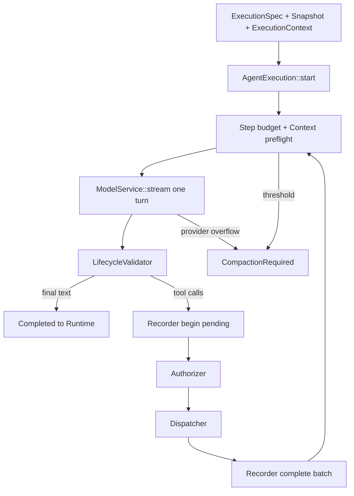

# ez-assistant 架构与实现审查报告

> 审查日期：2026-07-30
>
> 审查基线：Git `0637a5e43ebb` 加当前工作树中的 v0.3.0 M0–M5 变更。
>
> 参照项目：本地 OpenCode `7565e03536d1`、Hermes Agent `707f31668740`。
>
> 本报告只提出审查结论和后续建议，不修改当前版本计划、实现或数据库。
>
> 重要口径：当前 `assistant-runtime` 实现和 `runtime-harness` 都是阶段性验证代码；
> 后续正式 Runtime 需要结合产品语义重新设计。本文关于 Session、Run、准入、持久化
> 和恢复的建议面向未来正式 Runtime，不要求在当前临时实现上继续堆叠。

## 一、审查结论

ez-assistant 的**上位架构方向是正确的**：单进程不等于单模块；Runtime 与 Core 分离、
Provider-neutral 规范消息、一次 Provider Turn、工具副作用前落账、可靠终态、Context
由 Runtime 编排，这些决定比许多先做产品后补内核的 Agent 项目更稳。

当前最需要警惕的不是 Agent Loop，而是“干净内核已经完成，产品 Runtime 以后接一下
即可”的错觉。实际状态是：

| 层 | 评价 | 当前状态 |
| --- | --- | --- |
| 规范类型与 Provider Codec | 良好 | 有明确不变量、fixture 和离线测试 |
| Agent Core | 良好 | 多轮工具、取消、预算、Recorder、唯一终态已闭环 |
| Context | 良好但早期 | 原子布局、rolling summary、checkpoint 编排已实现 |
| Tool Runtime/Safety | 未完成 | 只有 SPI、桥接和 fake；真实副作用策略未实现 |
| Assistant Runtime | 临时验证实现 | 只有 Context/Run 规划局部；后续正式 Runtime 需重新设计 |
| 持久化与恢复 | 未完成 | 无正式 Repository、schema、迁移或恢复程序 |
| 应用协议 | 未开始 | `assistant-protocol` 无 DTO |
| Desktop 产品链 | 未开始 | 只有 health check |
| 扩展生态 | 未开始 | Memory/Skills/MCP/Plugin 均为规划或边界 |

因此整体判断是：

- **架构设计质量：高。**
- **Core 当前实现质量：中高。**
- **当前临时 Runtime 对正式产品语义的覆盖度：低。**
- **桌面 Agent 产品完整度：很低。**

完成当前 Core/Context 验证后，下一阶段的关键任务应是重新设计正式控制面，而不是把
临时 Runtime/Harness 直接扩建成产品 Runtime，或先横向增加大量 Provider。

## 二、值得保留的设计

### 2.1 Runtime Run 与 AgentExecution 分离

[`docs/modules/agent-system.md`](../modules/agent-system.md) 把业务 `RunId` 留在 Runtime，
Core 只负责一次 `AgentExecution`。这是正确边界：

- Core 可在 Tauri、CLI、测试或未来服务端复用；
- Session 排队、重试、恢复不会污染模型/工具循环；
- 单次执行取消不会天然等同于用户任务终止；
- Context compaction 可以结束当前 Run，再由 Runtime 建 continuation。

不建议为了减少类型数量把二者重新合并。

### 2.2 Provider-neutral Conversation 是可靠性的基础

[`crates/agent-types/src/conversation.rs`](../../crates/agent-types/src/conversation.rs)
保留 reasoning、text、tool call、tool result 和带 Provider/Protocol/版本边界的不透明
ProviderState，优于直接保存某家 API 的 `role/content` 字典。

尤其应保留：

- ToolCallId 全局唯一和结果顺序校验；
- Tool Call/Result 双向一一配对；
- Assistant Part 原始顺序；
- ContextSummary 的独立语义；
- ProviderState 的显式格式边界。

Hermes 的长期兼容成本说明，这些边界越晚补越贵。

### 2.3 ModelService 一次只完成一个 Turn

[`crates/agent-model/src/service.rs`](../../crates/agent-model/src/service.rs) 的窄接口使模型
适配、工具循环、取消和测试彼此独立。OpenAI-compatible Adapter 又把 Profile、Codec、
Transport、SSE Decoder 分开，Provider 差异没有进入 Core。

这是应继续坚持的“窄腰”，后续 Anthropic、Responses API 或本地模型都应通过新的
Adapter/Profile 接入，不在 Engine 中按 Provider 名称分支。

### 2.4 工具副作用边界设计扎实

[`crates/agent-core/src/recorder.rs`](../../crates/agent-core/src/recorder.rs) 和
[`crates/agent-core/src/engine.rs`](../../crates/agent-core/src/engine.rs) 明确了：

```text
begin pending exchange
→ authorize
→ execute
→ complete results atomically
```

begin 失败阻止副作用；取消和预算也要补齐未结算 ToolResult。这比工具执行完成后再
“尽量保存”的方案更可恢复。

### 2.5 观察事件与事实源分离

普通 AgentEvent 使用有限通道并允许丢弃，四种终态通过独立通道可靠交付；UI 断线不会
取消执行。这个取舍合理，因为 token delta 本来就不应承担恢复责任。

正式 Runtime 需要继续完成“持久化快照 + 事件游标”的上半部分，而不是改变 Core 事件
通道去追求所有 delta 永不丢失。

### 2.6 Context 原子布局优于简单截断

[`crates/agent-context/src/layout.rs`](../../crates/agent-context/src/layout.rs) 不拆完整
User Turn 和 Tool Exchange，并保护 active turn、ProviderState 与 recent tail；
[`crates/agent-context/src/rolling.rs`](../../crates/agent-context/src/rolling.rs) 保持正常
system instructions 以利于提示词缓存。

这两个决定都应保留。后续 Tool Result pruning 应作为 Strategy 或布局扩展，不应在
Runtime 另写一套消息裁剪。

## 三、当前实际调用链与缺口

### 3.1 已成立的 Core 调用链



这条链已由 testkit 和 Harness 验证。

### 3.2 尚未成立的产品调用链

目标应是：

```text
WebView intent
→ thin Tauri command
→ message/work acceptance（是否持久化由产品语义决定）
→ per-session coordinator
→ Runtime Run
→ compile ExecutionSpec
→ AgentExecution
→ persist/broadcast Runtime event
→ final message + terminal state
→ UI snapshot/query
```

当前实际只有：

```text
WebView button → Tauri health() → "Rust runtime connected"
```

`assistant-runtime::session`、`scheduler`、`config` 为空文件，
`assistant-protocol` 也没有 Session/Run command 或 event DTO。因此模块文档描述的是
目标职责，不是已可运行的产品架构；当前 Runtime/Harness 代码也只用于验证已有版本
能力，不能直接视为未来产品 Runtime 的数据模型。

## 四、优先级问题清单

以下优先级按“如果现在开始接真实桌面 Agent，是否会影响数据正确性或安全”判断。

## 五、P0：未来正式 Runtime 设计时必须解决

### P0-1：明确 Message、Work 与 Run 的接收及幂等边界

**证据**

[`crates/assistant-runtime/src/run.rs`](../../crates/assistant-runtime/src/run.rs) 的
`prepare_user_run` 先 `append_message`，之后才执行窗口判断、压缩和 Run 分配。若压缩
NoOp、取消或 Store commit 失败，可能留下没有 Run 的 UserMessage。没有 Run 本身可以
是合法状态；问题是当前临时接口没有表达该消息是否只是注入上下文、是否代表待执行
工作、是否已取消，以及调用方重试会不会重复追加。该代码用于阶段性验证，不应直接
固化为未来产品契约。

**风险**

- 如果未来存在自动重试或多入口提交，可能重复写入同一消息或重复调度；
- 调度器若仅根据 UserMessage role 推断工作，会错误执行自动注入消息；
- 若产品承诺排队任务可跨重启恢复，却只放在内存中，承诺与实现会不一致；
- 若产品不承诺持久队列，却把所有排队请求都写入数据库，会引入不必要的状态和恢复
  复杂度。

**建议**

先确定产品承诺，再选择最小模型：

1. **不承诺排队任务跨重启恢复**：排队请求可只在 UI/Runtime 内存中存在；只有提升为
   当前工作时才写入规范 Conversation 并创建 Run。退出或崩溃后允许丢失，但 UI 必须
   明确它只是 pending/draft。
2. **承诺“已接收”后可跨重启恢复**：才需要持久化 Work/Admission；保存 Message 与
   待执行意图，但仍允许在 Run 创建前取消，所以 Work 可以合法地拥有零个 Run。
3. **自动注入消息**：可以进入 Conversation，但必须带明确 origin/kind，默认不创建
   Work，也不触发 Run。

如果选择第二种语义，可使用：

```text
WorkAdmission {
  session_id,
  message_id,
  optional idempotency_key,
  canonical payload hash,
  delivery,
  admitted_seq,
  scheduling_state
}
```

其中 `MessageId`、`WorkId` 和 `RunId` 均由 Runtime 生成。前端不决定业务 ID；只有在
确实需要处理 IPC 超时重试时，前端才可提供一个不透明 `idempotency_key`，Runtime
负责校验其作用域、格式和“同 key 同 payload”语义。

持久化准入启用后，事务语义才需要满足：

1. 相同 idempotency key + 等价 payload：返回既有 admission；
2. 相同 key + 不等价 payload：返回 conflict；
3. 首次输入：追加 UserMessage 和 pending work；
4. 提交成功后再 wake Session；
5. Run 分配或压缩失败不撤销“输入已接收”事实，由 durable work 状态决定重试。

OpenCode V2 的 `SessionInput.admit → SessionExecution.wake` 是可参考的形状，但无需复制
其 Effect 实现。

**未来正式 Runtime 的验收**

- Message、Work 和 Run 不是一一对应关系，自动注入和 Run 前取消均有明确语义；
- 已经开始 Provider 调用的执行一定有 Runtime Run，首个 chunk 不是创建 Run 的边界；
- 若未承诺持久队列，退出时对 pending 请求采用明确的丢弃/退回策略；
- 若承诺持久队列，重启能发现已接收但未开始的 Work；
- 启用幂等键时，重复 command 不重复追加消息或调度工作。

### P0-2：重新设计 Session aggregate、Run 状态机和单会话 Coordinator

**证据**

模块文档要求“不同 Session 并发、同 Session 串行”，但 `session.rs`、
`scheduler.rs` 为空；当前 `RunIdSequence` 只是调用方持有的内存计数器，没有正式
Session ownership、active run、queue 或恢复。

**风险**

- 两个 Tauri command 可同时为同一 Session 构造 snapshot 和执行；
- Checkpoint 设计依赖同会话串行，没有 revision；并发提交会产生 stale replacement；
- 同一 Session 中 Assistant、Tool 和 User 顺序可能交错；
- 取消、关闭窗口、退出进程和重启语义无法落地。

**建议**

后续重新设计的最小正式 Runtime 应包含：

- `SessionAggregate`：配置引用、最后序号、active/pending work；
- `RunRecord`：Queued/Running/CompactionRequired/Completed/Failed/Cancelled/Interrupted；
- keyed `SessionCoordinator`：每 Session 最多一个 drain，wake 合并；
- 不同 Session 并发；
- model/tool/shell 各自全局 semaphore；
- execution ownership generation，避免旧任务在替换后继续写；
- 历史 Session 不创建永久 task。

单机 Tauri 不需要分布式 lease。一个按 Session ID 索引、空闲可回收的协调器即可。

**验收**

- 同一 Session 两个并发输入按 admitted seq 串行；
- 不同 Session 能真实并发；
- 重复 wake 不创建两个 drain；
- 旧 Run 被 cancel/replace 后不能提交最终消息；
- WebView 关闭和事件订阅断开不影响 Run。

### P0-3：统一 Conversation Journal、Context Store 与 Recorder 的事实模型

**证据**

当前存在三组局部语义：

- `ContextStateStore`：Message/Checkpoint；
- `ExecutionRecorder`：pending/completed tool exchange；
- Runtime 最终应保存 User、最终 Assistant、Run terminal 和事件。

目前没有一个生产 Repository 说明它们如何共享事务、序号和恢复边界。Core 正常完成时
最终 Assistant 不经 Recorder，而是通过 `ExecutionOutcome::Completed` 交给 Runtime。

**风险**

- 工具 exchange、Context record 和 Session message 可能使用不同顺序源；
- 最终模型响应已完成但尚未持久化时崩溃，重启无法判断是否应重新调用模型；
- Run terminal 成功但最终 Assistant 写入失败，或反过来；
- Checkpoint 可能基于没有完整提交的对话。

**建议**

先设计单一有序 Journal，再适配两个 SPI。建议记录至少包括：

```text
UserAdmitted
AssistantFinal
ToolExchangePending
ToolExchangeCompleted
ContextCheckpoint
RunStateChanged
```

不要求所有内容放同一表，但必须共享：

- Session sequence；
- 原子事务边界；
- pending 恢复规则；
- effective conversation projector；
- final Assistant 与 Run terminal 的一致性策略。

正常完成建议由 Runtime 在一个事务中追加 final Assistant 并把 Run 置为 Completed。
若无法完全同事务，需要明确 intermediate state 和幂等恢复，不可直接报告成功。

**验收**

- 任意记录点注入崩溃，恢复后不会出现孤立 ToolResult 或重复 User；
- pending tool exchange 恢复成明确 interrupted/unknown，不进入未配对 snapshot；
- final message 与 Run terminal 不会一边成功一边永久丢失；
- Context effective snapshot 只投影完整事实。

### P0-4：修复跨 AgentExecution 的 ToolMessage ID 冲突

**证据**

[`crates/agent-core/src/engine.rs`](../../crates/agent-core/src/engine.rs) 的
`tool_messages` 每次 `AgentExecution` 从 0 开始，并生成 `toolmsg_1`、
`toolmsg_2`。同一 Session 的下一次用户 Run或压缩 continuation 会重新从
`toolmsg_1` 开始。

`ConversationSnapshot` 当前只校验 ToolCallId，不校验 MessageId 全局唯一，因此测试
不会发现该冲突。

**风险**

- 持久化表若以 Session + MessageId 唯一，会写入失败或覆盖；
- UI keyed rendering、游标和增量更新会关联到旧消息；
- 后续 revert、引用和事件关联不可靠。

**建议**

Core 不应依赖 Runtime `RunId`，但仍可使用注入的协议 ID 生成器或随机/单调唯一 ID：

- 在 `ExecutionContext` 注入 `MessageIdFactory`；或
- Recorder 为 ToolResult 分配 ToolMessage ID，并把完整消息返回给 Core；或
- 使用不可碰撞的 UUID/ULID。

不要用“把 RunId 拼进 ID”破坏 Core/Runtime 边界。

同时给 `ConversationSnapshot` 增加 MessageId 唯一性校验，至少覆盖 User、Assistant、
Tool 和 ContextSummary 的同一命名空间。

**验收**

- 同一 Session 连续 100 个 Execution 不产生重复 MessageId；
- continuation 与普通新 Run 都通过；
- 序列化恢复后仍能检测重复 ID；
- Core 仍不知道 RunId。

### P0-5：真实 File/Shell 上线前完成安全与审计闭环

**证据**

`agent-tools` 已有 File/Shell 能力契约和桥接，但没有生产能力实现、Runtime authorizer、
路径策略、进程树清理、敏感环境变量过滤和审计 Store。Desktop 目前也没有审批协议。

**风险**

Shell 以当前用户权限运行，能绕过结构化文件工具的工作目录策略。若为了快速接线直接
使用 `AllowAllAuthorizer` 和 `std::process::Command`，会把“功能可用”误当成“安全边界
成立”。

**建议**

v0.4.0 应作为任何真实副作用工具进入产品前的门槛，至少包括：

- Authorizer 策略：Disabled/Ask/Session trust/Workspace trust/Full trust；
- Runtime 审批 request/response 和无人值守默认；
- File canonicalization、symlink 和授权根；
- Shell 原始命令展示、cwd、超时、取消、进程树清理；
- stdout/stderr 上限和尾部保留；
- 明确的敏感环境变量 allowlist/denylist；
- 审计记录和实际批准依据；
- 文案明确“workspace 不是 OS sandbox”。

**验收**

- 未审批调用不产生副作用；
- 取消后子进程树不存在；
- API key 不进入子进程默认环境、日志、事件或错误；
- 符号链接不能逃逸结构化文件授权根；
- 审计能还原原始命令、cwd、时间、退出码和批准规则。

### P0-6：建立最小应用协议和 Desktop 端到端切片

**证据**

`assistant-protocol` 为空，Desktop 只有 `health`。在没有真实 UI 调用方的情况下，
Runtime API 很容易围绕 Harness 继续演化，而没有验证快照、订阅、重连和错误语义。

**建议**

不要一次建设完整 UI。先做一个垂直切片：

1. create/list/get Session；
2. admit user prompt；
3. query Run；
4. subscribe Runtime event envelope；
5. cancel Run；
6. query Session snapshot；
7. 使用无工具 scripted model 或显式测试 Provider；
8. WebView 重载后恢复已有 Session/Run。

协议 DTO 只含稳定应用事实，不能直接暴露 `AgentEventStream`、trait object 或 Provider
内部错误。

**验收**

- Tauri command 保持薄；
- Runtime 是状态唯一所有者；
- UI 重载不丢 Session 和 Run 终态；
- 同一事件有 `session_id/run_id/seq`；
- 错误对 UI 使用稳定 code 和安全 message。

## 六、P1：首个可用版本前应解决

### P1-1：把恢复流程写成代码，而不只写成 Recorder 注释

当前 Recorder 文档要求 pending exchange 在恢复时补齐 interrupted/unknown，但正式
Runtime 没有 recovery scanner。需要定义：

- 启动时如何发现 Running Run；
- 哪些变成 Interrupted；
- pending tool 是“未知是否执行”还是“确定未执行”；
- 哪些工具允许幂等重试；
- 何时自动 continuation，何时要求用户确认；
- 工具副作用不确定时禁止自动重放。

Hermes 的启发式恢复说明展示了现实复杂度；ez-assistant 应尽量用持久化状态避免依赖
“最后一条消息是不是 tool”来猜。

### P1-2：补全 ExecutionBudget 与 Provider 重试策略

当前 `ExecutionBudget` 只有 `max_steps` 和 `max_tool_calls`，而架构文档还描述 duration、
input/output token、tool output bytes 等。需要二选一：

- 近期实现并测试；或
- 把模块文档明确标成目标字段，避免读者误认为已经可配置。

Provider retry 应放在 Adapter/Runtime 的明确边界：

- 只重试可判定为瞬态且尚无不可重放副作用的调用；
- 指数退避、jitter、次数和总时长有上限；
- retrying 是 Runtime 可观察状态；
- ContextOverflow 不走普通 retry；
- 已开始输出后的重试要明确是否丢弃整 Turn。

### P1-3：为工具快照增加来源、版本和执行策略

当前 `ToolSetSnapshot` 冻结了定义和句柄，这是好基础，但长期还需要：

- Tool identity/version/fingerprint；
- 来源：builtin/plugin/MCP/skill contribution；
- 权限类别和风险元数据；
- `Sequential` / `ParallelSafe` / resource key 等显式策略；
- 最大结果和附件/产物引用；
- 旧 Tool Call 对新 Registry 的 stale protection。

先保持串行是安全选择。只有显式标注 parallel-safe 且权限已结算的工具，才考虑像
Hermes 那样做并行段。

### P1-4：完善 Runtime 事件、快照与重连

Core `AgentEvent` 可丢弃是合理的，但 Runtime 必须定义：

- durable Run state；
- transient event envelope；
- per-Run 或 per-Session sequence；
- 快照查询；
- 订阅从哪个游标开始；
- token delta 丢失后的 UI 处理；
- terminal 与 snapshot 的一致性。

debug-viewer 的三通道适合开发观测，不应直接变成产品协议。

### P1-5：明确 Context usage 滞后的产品策略

Evaluator 只读取最近完整 Assistant 的 `total_tokens`。其后新增的 UserMessage 和
ToolResult 尚未计入，因此可能低估，usage 缺失则直接继续并依赖 Provider overflow。
这是 v0.3.0 的明确取舍，不是实现错误，但需要：

- 把 Provider overflow 作为正常受控路径观测；
- 记录 threshold 与真实 overflow 发生率；
- 压缩请求自身 overflow 时给出明确失败；
- 后续再根据数据决定是否引入 estimator 或 tool-result pruning；
- 不在多个调用方私自估算。

### P1-6：Checkpoint 的无 revision 设计必须由机械串行保证

当前 Checkpoint 只有 replacement，不含 `covers_through` 或 revision。该设计在“同一
Session 只有一个上下文写者，且所有 Message/Checkpoint 共用一条有序 Journal”时可以
成立；在并发 Runtime 中不成立。

建议先完成 P0-2/P0-3，再决定是否需要 CAS sequence：

- 若 Coordinator 和 Store 事务能强制单写者，可维持简单 Checkpoint；
- 若后台压缩、定时任务或多入口可并发，commit 至少要校验读取时的 journal seq。

不要仅靠调用约定或代码注释保证。

### P1-7：建立应用级 tracing 与脱敏测试

`ModelCallContext` 有 trace metadata，debug-viewer 也有分层通道，但正式应用尚无统一
subscriber 和 correlation。建议：

- Runtime 为 Session/Run/Execution/ModelTurn/ToolCall 建 span；
- 只记录 identity、耗时、计数、状态和安全错误类别；
- prompt、响应正文、credential、原始 header 默认不进 tracing；
- 增加“错误链不包含 secret”的自动测试；
- debug 正文能力必须显式开启并标明本地敏感数据风险。

## 七、P2：可以后置，避免过早复杂化

### 7.1 Memory、Skills、Plugin 与 MCP

顺序建议：

1. Skills：主要是可审阅文本与资源，成本最低；
2. MCP/外部 Tool contribution：复用现有 Tool Registry；
3. Plugin：等稳定生命周期、权限和配置格式后再开放；
4. Memory：等 Session/Journal/Context 稳定后实现 recall/observe；
5. 多 Memory Orchestrator：只有出现两个真实实现再抽象。

不要提前复制 Hermes 的多 Registry 和插件发现副作用。

### 7.2 多 Provider

在 Runtime/产品链完成前，新增 Provider 的边际价值低。更合适的顺序是：

1. 用现有 OpenAI-compatible 完成产品垂直切片；
2. 用 DeepSeek reasoning/tool fixture 保持协议保真；
3. 再选择一个协议差异显著的 Provider 验证 SPI，例如 Anthropic；
4. 用真实差异修正公共类型，不为假想 Provider 扩字段。

### 7.3 子 Agent、Cron 和长任务

这些能力都依赖 durable admission、Session coordinator、Run state、权限和恢复。
不应在 P0 控制面之前建设。以后实现时：

- 子 Agent 是独立 Session/Run 或明确 child execution，不共享可变历史；
- Cron 只负责产生 durable work，不直接调用 Core；
- 后台工作有明确 owner、取消和结果投递；
- 父任务不靠进程内 future 永久等待子任务。

### 7.4 分布式 Runtime

当前产品是单机 Tauri，没有必要引入 lease server、分布式锁或消息队列。只需保证：

- Session ownership 不写死到 WebView；
- Repository/Coordinator 有清楚边界；
- ID、状态和 admission 可持久化；
- 未来若拆进程，不必改变 Core。

## 八、设计与实现一致性问题

### 8.1 版本台账已落后

[`docs/版本管理.md`](../版本管理.md) 仍写“当前开发重点 M2，等待确认”，而本地
[`docs/开发进度.md`](../开发进度.md) 与代码已到 M5 待确认。虽然开发进度是本地恢复
文件，但版本台账被定义为共享事实，二者不一致会误导后续审查。

建议在当前里程碑按既有流程确认后同步台账，不在本研究任务中代替版本流程修改。

### 8.2 模块文档混合了职责目标与已实现能力

`assistant-runtime.md` 描述完整 Session、Run、调度、持久化、文件和 Shell 能力，但
代码只实现 Context/Run 规划。模块约束写目标职责本身没有问题，建议增加一小段
“当前实现入口/成熟度由版本台账判断”，避免新人把约束当完成清单。

### 8.3 架构示例与实际 ExecutionSpec 已有差异

`agent-system.md` 的示例 `ExecutionSpec` 包含 context、memory、safety 等完整目标，
当前 Rust 类型只有 instructions、model、context_window、tools、budget。应明确示例是
目标逻辑形状，或在相应版本落地时同步；不要让文档示例被误当成可编译 API。

### 8.4 ToolDefinition 文档提到输出 schema，实际类型只有输入 schema

架构文档说 Tool 使用输入/输出 schema，当前 `agent_types::ToolDefinition` 只有
`input_schema`。这可以是后续范围，但应明确状态；否则调用方可能以为结果已经过结构
校验。短期不要为文档一致性随意新增无调用方字段，先在下一次工具契约版本设计。

## 九、推荐实施顺序

以下顺序不替代现有版本流程；它表示后续版本的依赖关系。

### 阶段 A：完成 v0.3.0

- 按现有 M6/M7 完成 Harness 自动压缩、continuation、`/compact` 和全量回归；
- 修复研究中发现且属于当前范围的契约问题时，仍遵守里程碑确认；
- 明确 v0.3.0 是 Context 能力闭环，不宣称正式产品 Runtime 完成。

### 阶段 B：Runtime 最小事实面

- 重新设计 Message/Work/Run 关系，并决定排队请求采用内存语义还是 durable
  admission；
- Journal/Repository schema；
- Session/Run state；
- pending tool recovery；
- MessageId 全局唯一；
- keyed Session Coordinator；
- final Assistant 与 terminal 一致性。

### 阶段 C：安全执行面

- Runtime Authorizer 和审批协议；
- 真实 File/Shell 机制与策略；
- 超时、取消、输出上限、环境变量过滤；
- 审计与安全测试。

### 阶段 D：Desktop 垂直切片

- 最小 assistant-protocol；
- Session/Run commands；
- 事件 envelope、snapshot 和重连；
- 一个真实 Provider；
- 窗口关闭不终止 Runtime，退出时受控收敛。

### 阶段 E：可靠性与扩展

- Provider retry/fallback；
- skills；
- MCP/tool contribution；
- tool parallel-safe 策略；
- memory；
- cron/subagent；
- 插件生态。

## 十、建议的架构验收清单

### Session 与输入

- [ ] 用户输入有调用方提供的幂等 ID。
- [ ] 输入持久化成功后，即使进程崩溃也能恢复 pending work。
- [ ] 同一 Session 只有一个上下文写者。
- [ ] 不同 Session 可并发。
- [ ] 重复 wake 和重复 command 不会重复执行。

### Run

- [ ] Run 状态转换有持久化约束和非法转换测试。
- [ ] Run terminal 与最终 Assistant 保持一致。
- [ ] cancellation、interruption、failure、compaction 语义不同。
- [ ] continuation 使用新 Run ID 且不重复 UserMessage。
- [ ] 旧 execution 不能在 ownership 变化后写入。

### Conversation 与工具

- [ ] 所有 MessageId 和 ToolCallId 在 Session 内唯一。
- [ ] pending tool exchange 不进入规范 snapshot。
- [ ] 工具副作用前完成记录和授权。
- [ ] 取消、预算和崩溃后 Tool Call/Result 仍配对。
- [ ] 不确定是否执行过的副作用工具不会自动重放。

### Context

- [ ] 所有触发路径复用同一 Context Evaluator 和压缩入口。
- [ ] Checkpoint 提交与 Session 序列化有机械保证。
- [ ] ProviderState、reasoning 和 Tool Exchange 不被裁断。
- [ ] overflow 与自动压缩次数有上限。
- [ ] 原始历史与 effective snapshot 均可查询验证。

### 安全

- [ ] 真实工具没有默认 AllowAll。
- [ ] Shell 明确不是文件沙盒。
- [ ] 路径、symlink、cwd、环境变量和进程树策略有测试。
- [ ] 审批可取消，且 UI 断线有明确默认。
- [ ] credential 不进入请求 DTO、事件、错误、日志和子进程默认环境。

### UI 与观测

- [ ] WebView 不持有 Session/Run 权威状态。
- [ ] UI 重载后通过快照恢复，再订阅增量。
- [ ] Runtime 事件带 SessionId、RunId 和 sequence。
- [ ] delta 丢失不会破坏最终消息。
- [ ] 关闭窗口不自动取消后台 Run。

## 十一、最终建议

ez-assistant 不需要变成 OpenCode 或 Hermes 的缩小版。它最有价值的差异是：

- Rust 类型和 crate 依赖直接表达正确性边界；
- 单进程本地应用减少部署和通信复杂度；
- Core 不拥有业务 Session；
- Context 和工具结算从一开始就可恢复、可测试。

下一阶段应坚持“**纵向闭环优先于横向功能**”：

1. 先让一条用户消息以幂等、持久化、可取消、可恢复的方式走完
   Desktop → Runtime → Core → Runtime → Desktop；
2. 再开放真实 File/Shell；
3. 再增加 Skills/MCP/Memory/子 Agent。

如果控制面没有先完成，后续每增加一种工具、渠道或 Provider，都会把恢复、安全和状态
问题按倍数放大；如果控制面先完成，现有干净 Core 才真正转化为产品优势。
