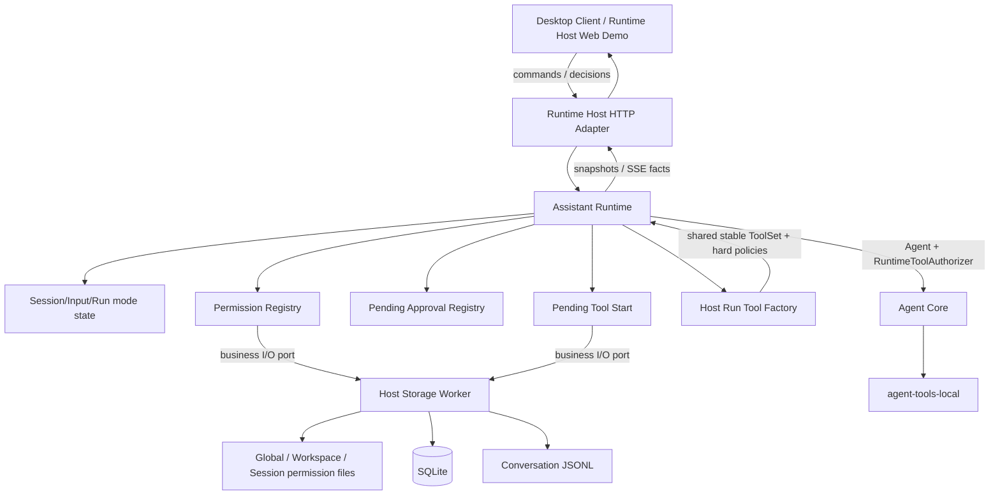

# v0.12.0 技术方案：Plan/Build、分层权限与正式工具策略

## 一、方案信息

- 版本：`v0.12.0`
- 状态：已确认
- 关联功能设计：[`功能设计`](功能设计.md)
- 影响范围：`assistant-runtime`、`assistant-protocol`、`apps/runtime-host`、
  `agent-core`、`agent-tools`、`agent-types`
- 核查依据：2026-08-11 实际源码、`v0.11.0` 持久化与 HTTP 基线、
  `v0.4.0` Safety Demo 已验证的 Resolved Invocation、Authorizer 和 Guardrail 接缝

本文只承接实现级内容：状态归属、应用协议、权限文件格式、SQLite 迁移、审批与工具中断恢复
状态机、工具装配、并发恢复和验证方法。产品语义与范围以功能设计为准，不在本文重新
讨论正式 UI、可扩展变体或 OS 沙箱。

## 二、现状核查与复用结论

### 2.1 可以直接复用的边界

当前实现已经具备本版本需要的主要底座：

- `UserPart::Injected` 已是可序列化规范 Part，OpenAI-compatible Codec 会与其他
  User Part 一样保序编码为 user content；不需要新增模型私有消息类型。
- `RunToolFactory` 已按 Session 冻结环境为每个 Run 构造独立 ToolSet 与 Authorizer，
  不同 Workspace 不共享可变路径解析器。
- Core 只认识 `ToolAuthorization::Allow/Deny`；异步等待可以完全封装在 Runtime
  Authorizer 内，不需要把 Ask 或 pending approval 加入 Agent Loop 状态机。
- `ResolvedToolInvocation` 已携带 General、File、Shell 类型化授权事实，权限匹配
  不需要重新解析模型 JSON 参数。
- `ExecutionRecorder` 已保证完整 Assistant Tool Call 在副作用前形成 pending，
  Tool Result 整批提交后才进入规范 Conversation。
- `GuardrailConfig`、完全相同调用与连续失败检测已经在 Core 实现，只缺正式 Runtime
  的配置编译和事件投影。
- Host 的单一阻塞存储 worker 已串行管理 SQLite 与 Runtime Home 文件 I/O，可继续承接
  权限文件和 pending tool start，不再建立第二个数据库连接所有者。

### 2.2 必须调整的现有边界

当前 `RunToolBundle` 直接包含一个 Host Authorizer，显式危险模式会放行几乎全部本地工具。
本版本需要把它收敛为：

1. Host 只提供真实工具和基础设施硬策略；
2. Runtime 组合 Plan/Build 能力上限、三级规则、Ask/Auto 和审批；
3. Core 最终仍只得到一个不可变 `Arc<dyn ToolAuthorizer>`。

当前 Session、Input 和 Run 也没有变体或审批方式字段。仅在 Session 保存“当前变体”不足以
恢复历史执行：排队 Input 和重试 attempt 都必须能定位提交时的变体。因此变体以 Input
为历史事实，审批方式以 Run attempt 为冻结事实；Session 只保存下一次交互的当前选择。

### 2.3 不采用的实现

- 不新增 `agent-safety` crate：当前只有正式 Runtime 一个业务调用方，权限文件、审批和
  Session/Workspace 作用域都属于 Runtime。
- 不把规则复制到 SQLite：文件是唯一规则源，SQLite 只保存 Session 状态与中断恢复所需的
  临时 started 事实。
- 不把 pending approval 持久化：它没有重启续跑语义，重启后对应 Run 按既有规则中断。
- 不建立永久工具审计投影：持久权限由 JSON 规则表达，正式工具历史由
  Conversation Tool Call/Tool Result 表达，实时审批由 Runtime 内存和 SSE 投影。
- 不把 Plan/Build 加入 `agent-core` 或 `agent-tools-local`：它们继续消费所有变体共享的稳定
  ToolSet、冻结 Authorizer 和普通工具能力。

## 三、目标架构



权威状态保持单一：

- Runtime 持有当前 Session 模式、Input/Run 冻结语义、有效权限快照和 pending approval；
- Host Store 持有权限文件、SQLite 和 JSONL 的物理 I/O，不解释 Plan/Build 或审批状态机；
- Core 持有单次 AgentExecution 与 Guardrail 状态，只观察最终 Allow/Deny；
- 客户端只提交意图、审批决定和展示 Runtime 投影。

## 四、模式领域类型与冻结位置

### 4.1 公共类型

`assistant-protocol` 新增稳定枚举：

```rust
#[serde(rename_all = "snake_case")]
pub enum AgentVariant {
    Plan,
    Build,
}

#[serde(rename_all = "snake_case")]
pub enum ApprovalMode {
    Ask,
    Auto,
}
```

`AgentVariant` 是产品工作流，`ApprovalMode` 是未命中权限时的处理方式。二者不合并成
`PlanAsk` 等组合枚举。

### 4.2 状态归属

| 状态 | 持久位置 | 用途 |
| --- | --- | --- |
| Session 当前变体 | `sessions.current_variant` | 客户端重建与下一次提交默认选择 |
| Session 当前审批方式 | `sessions.approval_mode` | 下一次 Run 捕获 Ask/Auto |
| Input 变体 | `inputs.agent_variant` | 对应 User Message 注入和所有 attempt 的历史事实 |
| Run 审批方式 | `runs.approval_mode` | 单次 attempt 的冻结 fallback |
| Run 变体 | 通过 `runs.input_id -> inputs.agent_variant` 取得 | 避免重复持久同一事实 |

Runtime 内存中的 `SessionState` 保存当前变体和审批方式；`InputRecord` 保存提交变体；
`RunRecord` 保存由 Input 得到的变体和该 attempt 的审批方式。`RunSnapshot` 同时投影两者，
便于历史查询，不要求客户端从 Session 当前状态反推。

### 4.3 更新规则

- 新 Session 默认 `Build + Ask`。
- `SetSessionVariant` 允许在活动 Run 存在时执行，只持久化并更新 Session 当前状态。
- `SetSessionApprovalMode` 同样只影响之后创建的 Run，不改变当前 pending approval。
- `SubmitInput` 必须携带 `variant`；Store 在同一个 SQLite 事务中更新 Session 当前变体、
  插入带变体 Input 和带当前审批方式的首次 Run。
- 同 Session 幂等 key 命中时直接返回首次 Input/Run，不根据重试请求再次更新当前变体。
- `RetryRun` 继承原 Input 变体，并在创建新 attempt 时捕获 Session 当前审批方式。
- 历史重新输入必须显式携带新变体；generation 切换事务同时更新 Session 当前变体并
  创建带该变体的新 Input。

## 五、变体注入与 Provider 编码

### 5.1 User Message Part 顺序

`create_user_message` 调整为确定性构造：

```text
UserMessage.parts
├── Text                       用户正文
├── FileReferences?            用户可见附件引用
└── Injected                   本次 AgentVariant 指令
```

Injected 必须在 `accept_input` 前创建并进入 `queued_message_json`；Input 被领取后原样进入
Conversation JSONL。恢复、重试、压缩和 Provider 编码都读取持久化 Part，不查询 Session
当前变体重新生成。

正式客户端隐藏 `Injected`，但保留 File References 附属组件。Conversation 的内部诊断查询
可以区分 Part 类型，不把注入文本拼回用户正文。

### 5.2 内置模板

代码中保留两个版本化常量，例如 `PLAN_INJECTION_V1` 与 `BUILD_INJECTION_V1`。模板使用
稳定英文和明确边界：

- Plan：调查上下文、必要时使用文件工具或受控 Shell；允许在 Agent 私有目录创建分析脚本
  和中间文件，不得修改用户 Workspace 或附件并开始实施；最终向用户提供可执行计划；明确
  Shell 不是只读沙箱。
- Build：根据当前请求和历史计划实施、使用可用工具、完成必要验证并汇报结果。

模板名和版本不进入协议；真正发给模型的成品文本已经由 `Injected` Part 持久化。模板变更
只影响新 User Message，必须有精确快照测试。

OpenAI-compatible Codec 继续按 Part 顺序编码文本数组，不新增 Provider 分支。File References
维持现有 XML 渲染，Injected 直接作为独立 text part；不得在 Codec 中按 Session 状态插入模式。

## 六、工具集、能力上限与 Guardrail

### 6.1 RunToolFactory 调整

保持现有按 Session 环境构造工具的输入；AgentVariant 不传入 Factory，避免 Host 根据变体
产生不同 Tool Definition。输出扩展为工具集和基础设施策略：

```rust
pub struct RunToolBundle {
    tools: ToolSetSnapshot,
    infrastructure_policies: Vec<Arc<dyn ToolPolicy>>,
}
```

Host 为 Plan 和 Build 注册完全相同的模型可见工具：

| 工具 | Plan | Build |
| --- | --- | --- |
| read/list/find/search | 可见 | 可见 |
| write/edit/delete | 可见；Agent 私有路径按权限决策，其他路径硬拒绝 | 可见，按权限决策 |
| shell | 可见 | 可见 |
| 其他已正式注册工具 | 可见 | 可见 |

Tool Definition 的名称、说明、参数 Schema 和顺序在两种变体间必须一致；变体切换只改变
持久化 Injected Part 和 Runtime Authorizer 的执行决策，从而避免破坏模型侧 Prompt Cache。
Plan Capability Policy 按规范化目标路径判断结构化 File Mutation：Session 私有目录和可选的
Workspace Agent 私有目录进入普通权限决策；用户 Workspace、附件目录及其他路径硬拒绝，且
不能被权限文件、AllowOnce 或 Auto 覆盖。拒绝通过现有 Tool Result 契约反馈给模型，不伪装成
“工具不存在”。路径包含关系必须使用现有解析后的类型化事实，不能用字符串前缀判断；实际
执行前继续复用文件工具的路径与 symlink 校验，防止私有目录内链接逃逸。

Host 的附件静态保护由 `UnrestrictedLocalAuthorizer` 改成同步 infrastructure policy：
对 Runtime Home 下任意 Session attachments 的 Write/Edit/Delete 返回 Deny，其他调用返回
Continue。Host 不再对普通文件和 Shell 返回最终 Allow。

`--unsafe-unrestricted-local-tools` 在本版本完成后删除；正式 Host 默认装配上述真实工具和
Runtime 权限体系。Web Demo 是否启用仍由现有 feature/启动参数控制，不改变产品工具装配。

### 6.2 RuntimeToolAuthorizer 顺序

每个 Run 创建一个不可变 `RuntimeToolAuthorizer`，冻结：

- Session ID、Workspace ID、Run ID；
- Input 的 AgentVariant；
- Run 的 ApprovalMode；
- Host 提供的 infrastructure policies；
- 指向共享 Permission Registry、Approval Registry、RuntimeStore 和取消令牌的句柄。

每个 resolved invocation 按以下顺序处理：

```text
写入初始 Audit
→ Plan Capability Policy
→ Host Infrastructure Policies
→ 当前 Permission Registry 快照
   ├── 任一 Deny：Deny
   ├── 任一 Ask：进入审批
   └── 最具体 Allow：Allow
→ 无匹配
   ├── Ask：进入审批
   └── Auto：Allow
→ 持久化最终授权决定
→ 向 Core 返回 Allow / Deny
```

未知授权 facts 直接 Deny，不进入审批。硬策略和明确 Deny 永远先于 Allow；明确 Ask 会覆盖
历史 Allow 与 Auto，但用户对当前 pending approval 的 AllowOnce 可以解除这一次 Ask。

### 6.3 Guardrail 配置

现有 `agent-core` 检测器不改算法，只由 Runtime 配置编译正式启用。模型无关配置放在：

```toml
[agent.defaults.guardrails]
repeated_invocation = { mode = "enforce", threshold = 4 }
consecutive_failures = { mode = "enforce", threshold = 5 }
```

Raw schema 的 `mode` 支持 `off | observe | enforce`；`off` 编译为 Core detector `None`，
Core 不新增 Off 枚举。配置段缺失时使用上面的产品默认值；阈值必须非零。该配置与模型、
Plan/Build 和权限文件分离，并随每个 Run 使用的配置快照冻结。

## 七、权限文件布局与格式

### 7.1 固定布局

```text
~/.ez-assistant/
├── permissions.json                                  # Global
└── data/
    ├── workspaces/<workspace_id>/agent/permissions.json
    └── sessions/<session_id>/private/permissions.json
```

Workspace 和 Session 文件位于既有 Agent 私有目录，不污染用户工作目录。Workspace 假删、
Session 归档和恢复都不移动或删除文件。

程序创建父目录时延续私有目录约定；新权限文件在 Unix 上以当前用户可读写方式创建。加载时
拒绝 symlink 和非普通文件，避免原子替换越过目标；仅因已有文件权限比建议值更宽不拒绝
启动，但返回安全诊断，后续可由正式客户端引导修复。

### 7.2 JSON schema

```json
{
  "schema_version": 1,
  "rules": [
    {
      "id": "rule_01",
      "effect": "allow",
      "variants": ["build"],
      "matcher": {
        "type": "file",
        "operation": "write",
        "path": "/absolute/logical/path",
        "path_match": "exact"
      }
    },
    {
      "id": "rule_02",
      "effect": "ask",
      "variants": ["plan", "build"],
      "matcher": {
        "type": "shell",
        "command": "cargo test --workspace",
        "command_match": "exact",
        "working_directory": "/absolute/logical/workdir",
        "process_mode": "managed"
      }
    },
    {
      "id": "rule_03",
      "effect": "deny",
      "variants": ["plan", "build"],
      "matcher": {
        "type": "general",
        "tool_name": "external_tool"
      }
    }
  ]
}
```

约束如下：

- `schema_version` 当前只接受 `1`，不存在并行 V2 文件。
- `id` 在单文件内唯一，用于诊断和人工检查；不编码作用域或路径。
- `variants` 非空、去重，只接受内置 Plan/Build。
- File 使用 resolved `FileOperation + AbsolutePath`；`recursive` 用路径组件判断，禁止字符串
  前缀匹配。
- Shell 使用完整原始 command、resolved workdir 和 process mode。交互审批只生成 `exact`；
  `prefix` 只允许用户手工编写，并明确它不是 Shell AST 安全分析。
- timeout 不参与 Shell 授权匹配；process mode 必须参与，避免 managed 授权放大为 detached。
- General 只按稳定 tool name 精确匹配。
- 使用严格 JSON，不接受注释、尾随逗号或 JSONC 扩展；文件由 Runtime 以固定缩进和末尾换行
  格式化写回。
- 未知字段、未知 effect/matcher、相对路径、重复 ID 或无效组合令整个文件无效，不部分加载。

### 7.3 审批生成规则

AllowSession/AllowWorkspace 只生成当前变体的 exact Allow：

- File：当前 operation + 当前绝对逻辑 path；
- Shell：完整 command + workdir + process mode；
- General：tool name。

若完全相同的 Allow 已存在，直接复用其 rule ID，不重复写入。Runtime 完整解析当前 JSON，
在结构化 rules 数组末尾加入新规则，经完整校验后格式化并原子覆盖。权限文件不承诺保留
用户的空白排版；严格 JSON 本身不支持注释。

## 八、权限文件 I/O、Registry 与重载

### 8.1 PermissionFileStore 端口

在 `assistant-runtime` 定义独立的基础设施端口，避免把原始路径或通用文件 API 暴露给业务：

```text
load_permission_file(scope) -> content + opaque revision + diagnostics
replace_permission_file(scope, expected_revision, content) -> new revision
```

Scope 只接受 Global、WorkspaceId 或 SessionId。Host Store 根据 SQLite/冻结资源关系解析实际
目录；Runtime 不拼接 Runtime Home。

revision 由 Host 根据原始字节计算，不进入公共协议。replace 使用同目录临时文件、flush、
原子 rename 和父目录同步，并在替换前再次核对 expected revision。外部编辑造成 revision
冲突时，不覆盖用户文件；Runtime 重新加载一次，仍冲突则让本次持久授权失败并保持审批待定。

### 8.2 PermissionRegistry

Runtime 使用 `PermissionRegistry` 保存按作用域编译的不可变 `Arc<PermissionDocument>`：

- Global 一份；
- 每个 Workspace ID 一份；
- 每个 Session ID 一份；
- 缺失文件等价于该层空文档。

Registry 是内存编译快照，不是第二规则源。Runtime 启动时加载现有作用域；文件无效且没有旧
快照时把对应作用域标为 Invalid，相关 Run 在模型调用前返回稳定权限配置错误，不能让 Auto
绕过未知规则。

Authorizer 在每个 Tool Call 开始时读取一次当前 Registry revision。Run 冻结的是作用域和模式，
不是整份规则，因此显式 reload 可以影响活动 Run 尚未开始授权的后续调用。

### 8.3 写入与显式重载

`PermissionCoordinator` 使用一个短期异步 mutation gate 串行以下操作：

- Runtime 生成 Session/Workspace Allow；
- 用户显式 reload；
- Runtime shutdown 前仍在进行的权限写入。

持久授权流程为：

```text
读取磁盘最新文件与 revision
→ 完整解析、校验和编译
→ 去重或向结构化 rules 数组加入 exact Allow
→ CAS 原子替换文件
→ 用 Host 返回的新内容更新 Registry
→ 才允许当前 pending Tool Call 继续
```

显式 reload 以目标 Session 为入口，作为一个 cohort 读取 Global、绑定 Workspace（如有）和
Session 三份文件。三份都有效才一次性替换相关 Registry 快照；任一失败保留 reload 前全部
快照并返回文件作用域、稳定错误码和安全消息。Global 快照替换后自然影响所有 Session 的
后续 Tool Call。

reload 不重建 Session、System Prompt、Conversation、ModelService 或活动 AgentExecution。

## 九、审批状态机

### 9.1 内存状态

`ApprovalRegistry` 由 Runtime 持有：

```text
ApprovalId
SessionId / RunId / ToolCallId
AgentVariant / ApprovalMode
ToolApprovalSubject
available_scopes
created_at
state: pending | resolving
oneshot sender
```

`ToolApprovalSubject` 是由 resolved facts 构造的公共安全投影：File 展示 operation/path，Shell
展示完整 command/workdir/timeout/process mode，General 展示 tool name。客户端不重新解析原始
Tool Call JSON。

### 9.2 决策流程

当 Authorizer 需要 Ask：

1. 在 Approval Registry 注册唯一 ID；
2. 发布 `ApprovalRequested`，然后等待 decision 或 Run cancellation；
3. decision 使用原子状态转换，重复、过期或跨 Session 请求返回稳定错误；
4. AllowSession/AllowWorkspace 先完成权限文件 CAS 与 Registry 更新；失败时保持 pending，
   用户仍可改选 AllowOnce 或 Deny；
5. 返回 Allow 前重新读取当前规则，硬策略或新 Deny 命中时改为 Deny；当前审批只解除 Ask，
   不覆盖硬策略或 Deny；
6. 以 Authorizer 返回 Allow 为授权线性化点。此后发生的 reload 不回滚已经开始的调用。

AllowWorkspace 在 Session 未绑定 Workspace 时不会出现在 available scopes，服务端收到伪造
请求仍返回 `PermissionScopeUnavailable`。协议没有 AllowGlobal。

### 9.3 取消、断线与重启

- Authorizer 使用 Run cancellation 与 approval receiver 做 race；取消胜出即移除 pending
  并发布 `ApprovalCancelled`。
- HTTP/SSE 断线不触发决定；`ListPendingApprovals(session_id)` 可重建卡片。
- Run 终结和 Runtime shutdown 必须清空所属 pending 并关闭 sender。
- pending 不写数据库；Runtime 重启沿用现有 Run interrupted 恢复，不重新弹出旧审批。
- 审批不设置隐式允许超时。技术实现可配置仅用于 fail-closed 拒绝/取消的等待上限，不能超时放行。

## 十、Pending Tool Start 与中断恢复

### 10.1 最小临时事实

Runtime 不持久每个 Authorizer 决策、resolved facts 或审批选择，也不提供独立工具审计查询。
对一个已经 begin 但尚未正式提交 Tool Results 的 pending tool exchange，SQLite 只保存：

- exchange receipt；
- 已经越过副作用边界的 call ID；
- 开始时间，只用于恢复和诊断。

该记录的生命周期严格从 pending exchange 开始到正式 Tool Result 落盘。父 exchange 删除时
通过外键级联清理，不形成长期日志、历史投影或数据量持续增长点。

### 10.2 可靠写入边界

`ExecutionRecorder` 增加 `mark_tool_execution_started(receipt, call_id)`；Core 在获得 Allow 后、
调用 execute 前等待它成功。记录失败进入 Recorder 的 fail-closed 结算路径，
不发生工具副作用。`complete_tool_exchange` 将完整 Tool Results 写入 Conversation，
并在结算成功后清除 pending exchange 及其 started 记录。

新的 Core 顺序为：

```text
begin_tool_exchange
→ resolve
→ RuntimeToolAuthorizer
→ mark_tool_execution_started
→ execute
→ complete_tool_exchange（Conversation + 清理 pending）
```

In-memory Recorder 和其他验证宿主实现该新方法时可以记录内存事实，但不能默认跳过接口。
这仍是实现无关的副作用记录接缝，不向 Core 暴露 Session、Run、SQLite 或权限规则。

启动修复 pending tool exchange 时：没有 started 记录的调用生成“重启前尚未执行”错误
Tool Result；已有 started 记录但没有完整结果的调用生成“执行结果未知”错误 Tool Result；
已有 ready results 则按实际结果结算。三种路径都不重新执行工具，并在完成修复后清理临时记录。

## 十一、SQLite 格式与迁移

### 11.1 现有表增量列

```sql
ALTER TABLE sessions ADD COLUMN current_variant TEXT NOT NULL DEFAULT 'build';
ALTER TABLE sessions ADD COLUMN approval_mode TEXT NOT NULL DEFAULT 'ask';
ALTER TABLE inputs ADD COLUMN agent_variant TEXT NOT NULL DEFAULT 'build';
ALTER TABLE runs ADD COLUMN approval_mode TEXT NOT NULL DEFAULT 'ask';
```

初始化通过 `PRAGMA table_info` 检查列是否存在，仅对缺失列执行一次 `ALTER TABLE`，全部放在
现有 `BEGIN IMMEDIATE` schema 事务中。随后 `REQUIRED_PROJECTIONS` 校验最新投影和枚举值读取。

默认值只用于兼容历史数据：旧 Session/Input/Run 统一解释为 Build + Ask，不为历史 User Message
伪造 Injected Part。新写入路径始终显式提供字段。

新增列都有默认值，因此迁移后短期回退到 v0.11 二进制时，旧 INSERT 仍可执行且会得到安全
默认；v0.11 会忽略新列和 pending tool start 表。回退运行期间产生的数据再次由 v0.12
解释为 Build + Ask。

### 11.2 Pending Tool Start 表

```sql
CREATE TABLE IF NOT EXISTS pending_tool_starts (
    receipt_id    TEXT NOT NULL
                  REFERENCES pending_tool_exchanges(receipt_id) ON DELETE CASCADE,
    call_id       TEXT NOT NULL,
    started_at_ms INTEGER NOT NULL,
    PRIMARY KEY (receipt_id, call_id)
);
```

不建立长期查询索引、facts JSON 或状态枚举。外键级联保证 exchange 结算后不遗留
started 记录，Conversation 顺序仍以 JSONL 为准。

### 11.3 RuntimeStore 业务操作

现有 Store DTO 增加模式字段，并新增最小业务操作：

```text
set_session_variant
set_session_approval_mode
mark_tool_execution_started
```

`complete_tool_exchange` 在已有结算路径中清理 pending exchange，started 记录由外键级联同步清理；
不增加通用 SQL、审计 patch 或 Message/Part CRUD。PermissionFileStore 保持独立文件端口，
不把 JSON 塞进 SQLite Store DTO。

## 十二、应用协议与事件

### 12.1 命令调整

新增：

```text
SetSessionVariant(session_id, variant)
SetSessionApprovalMode(session_id, approval_mode)
ListPendingApprovals(session_id)
DecideApproval(session_id, approval_id, decision)
ReloadPermissions(session_id)
```

调整：

```text
SubmitInput(..., variant)                       # variant 必填
ReenterFromUserMessage(..., variant)            # variant 必填
SessionSummary(..., current_variant, approval_mode)
RunSnapshot(..., variant, approval_mode)
```

`SubmitInput.variant` 不设置 serde default，确保新客户端每次明确表达实际提交变体。项目仍处
早期同步演进阶段，Runtime Host 与客户端一起更新，`PROTOCOL_VERSION` 保持 `1`，不建立 V2
或双轨命令。

### 12.2 审批 DTO

```text
ApprovalDecision = allow_once | allow_session | allow_workspace | deny
ApprovalStatus = pending | resolving
ToolApprovalSubject = file | shell | general
PermissionScope = session | workspace | global
```

Global 只出现在规则命中和 reload 诊断，不进入 `ApprovalDecision`。审批快照携带 Runtime
已经确定的 `available_decisions` 与 exact rule preview，客户端不自行推导 Workspace 是否可用。

### 12.3 事件

新增事实事件：

```text
SessionVariantChanged
SessionApprovalModeChanged
ApprovalRequested
ApprovalResolved
ApprovalCancelled
PermissionReloaded
```

这些事件允许丢失：Session 快照和 pending approval 查询是重建来源。事件不携带
完整权限文件、原始 JSON 或隐藏注入文本。Shell command 只在面向当前授权用户的审批快照中
返回，不写普通 Host 日志。

### 12.4 稳定错误

新增客户端需要分支的错误：

```text
ApprovalNotFound
ApprovalExpired
PermissionScopeUnavailable
PermissionFileInvalid
PermissionFileConflict
PermissionReloadFailed
PermissionPersistenceFailed
```

底层文件路径、JSON 原文、SQLite 错误和命令内容不进入通用错误消息；reload 结果可用作用域和
规则 ID 定位问题，但不回显整份敏感文件。

## 十三、关键业务流程与并发

### 13.1 只切换变体

```text
HTTP Command
→ Runtime operation gate
→ Session mutation gate
→ Store UPDATE sessions.current_variant
→ 更新 SessionState
→ 发布 SessionVariantChanged
```

不要求 Session idle，不创建 Input/Run/Message，也不触碰活动 Run 的 Authorizer。

### 13.2 提交输入

```text
校验 active Session、非空正文、必填 variant
→ Session mutation gate
→ 幂等 key 命中则返回首次结果
→ 解析附件
→ Text + FileReferences? + Injected(variant)
→ 捕获当前 approval_mode
→ Store 原子更新 Session variant + 创建 Input + Run
→ 更新 Registry 并唤醒队列
```

Store 成功是状态切换点；内存更新失败沿用 Session fail-closed 与重启恢复机制。

### 13.3 Run 准备

queue driver 从 `InputRecord` 和 `RunRecord` 取得冻结值，而不是读取 Session 当前变体：

```text
加载 Conversation
→ 取得 Input.variant + Run.approval_mode
→ 编译 Model/Guardrail
→ Host RunToolFactory(environment)
→ RuntimeToolAuthorizer(scope ids, variant, approval mode)
→ commit User Message
→ 启动 Core
```

工具定义在 Run 内冻结；权限 Registry 在每个调用时读取当前完整快照。二者的不同生命周期是
显式设计，不属于半新半旧配置。

### 13.4 审批与存储并发

- Session mutation gate 不跨越模型、工具或审批等待，避免一个 pending approval 阻塞模式切换、
  查询或取消。
- Approval Registry 的同步锁只保护 map 和状态转换，不跨越文件/SQLite await。
- Permission mutation gate 串行规则写入与 reload，避免 Runtime 自己覆盖自己；CAS revision
  继续防止外部编辑竞态。
- Host 单一 storage worker 维持 SQLite/权限文件阻塞 I/O 所有权；Tokio 任务只经有界命令队列
  等待结果。
- shutdown 先停止新命令、取消 Run 和审批，再等待权限写入与正在结算的
  tool exchange，最后 flush/join Store；
  沿用现有有界关闭上限。

## 十四、失败、恢复与安全边界

### 14.1 失败语义

- Session 模式 UPDATE 失败：不更新内存、不发布成功事件。
- Input 接受事务失败：不留下当前变体已改变但 Input 未创建的半状态。
- 权限文件写入失败或外部冲突：不返回持久授权、不执行工具，pending 保持可决策。
- pending tool start 记录失败：工具不执行，形成错误 Tool Result。
- Tool 执行后完整结算失败：沿用 pending tool exchange，Session fail-closed，启动恢复标记
  outcome unknown。
- reload 失败：保留上一个 cohort 的完整权限快照，不部分套用。

### 14.2 启动恢复

Host 开放 HTTP 前完成：

1. SQLite schema 增量迁移与 required projections；
2. 既有 pending tool exchange、body append 和 Run 恢复；
3. 恢复 Session/Input/Run 的模式默认与显式值；
4. 加载 Global、Workspace 和 Session 权限文件；
5. 根据 pending tool start 区分未开始与结果未知，并形成成对 Tool Result；
6. Runtime Registry 完整建立后才提供命令服务。

恢复不创建 pending approval、不自动 ResumeSession，也不动态补历史 Injected Part。

### 14.3 信任边界

- Plan 的结构化写限制以 Agent 私有目录为允许范围，是应用能力边界而不是 OS 沙箱；Shell
  仍以当前用户权限运行。
- Permission 文件可被同一 OS 用户修改；显式 reload 是有意的用户控制面，不防御同用户恶意进程。
- 普通权限规则使用词法 `AbsolutePath` 做稳定匹配；Plan 的 Agent 私有目录硬边界还必须
  在执行前检查已存在路径组件和 symlink，无法证明目标仍在私有根目录内时 fail-closed。
  这仍不得表述为 OS 物理隔离，Shell 和同用户并发修改不在结构化路径策略的强沙箱能力内。
- 审批完整展示 Shell command、cwd、timeout 和 process mode；不得只显示推测出的程序名。
- credential 不进入规则、审批 DTO、Injected Part、Shell 环境或日志。
- Auto 仍经过 hard policy、明确 Deny/Ask 和 Guardrail。

## 十五、代码组织与依赖

### 15.1 assistant-runtime

```text
crates/assistant-runtime/src/
├── agent_variant.rs               # AgentVariant 模板与 User Part 构造
├── permission/
│   ├── mod.rs                     # 领域入口与 PermissionFileStore 端口
│   ├── document.rs                # JSON schema、校验和规范化渲染
│   ├── matcher.rs                 # typed facts 匹配与冲突优先级
│   ├── registry.rs                # immutable snapshots / reload cohort
│   ├── authorizer.rs              # RuntimeToolAuthorizer
│   └── approval.rs                # pending registry 与决策状态机
├── runtime/
│   ├── mode.rs                    # Session variant / approval mode commands
│   ├── permission.rs              # reload / decide / query
│   └── input/commands.rs          # 带 variant 的提交
├── run/model.rs                   # Run settings 编译
└── storage.rs                     # 模式与 pending tool exchange 业务端口
```

文件是否进一步拆分以共同不变量和实际长度为准；`runtime.rs`、`storage.rs` 与 queue driver
不直接堆入 JSON parser、matcher 或 approval map 细节。

### 15.2 runtime-host

```text
apps/runtime-host/src/
├── resources/tools/
│   ├── mod.rs                     # HostRunToolFactory
│   └── infrastructure_policy.rs  # 附件静态保护
├── storage/
│   ├── permission.rs              # scope 定位、revision、CAS 原子替换
│   ├── tool_exchange.rs           # pending exchange/start 与恢复
│   ├── schema.rs                  # 增量列/表与投影验证
│   └── worker.rs                  # 有界命令转发
└── http/
    ├── commands.rs                # 新正式命令 dispatch
    └── web_demo/                  # 私有验收交互
```

Host 不新增权限规则解析、approval registry 或 Session 模式状态。

### 15.3 其他 crate

- `assistant-protocol`：新增枚举、命令、快照、事件和稳定错误，不依赖 JSON 文件 I/O/SQLite。
- `agent-core`：只扩展 Recorder 的 tool-started 可靠记录点，并继续使用现有 Guardrail；
  不新增 Plan/Build/Ask/Approval 类型。
- `agent-tools`：复用现有 typed facts、ToolPolicy 与 ToolSet；如需公开只读 bundle 辅助方法，
  保持实现无关。
- `agent-tools-local`：不修改授权语义，只继续执行已放行的真实文件与 Shell。
- 不新增第三方 crate；Runtime 已有 Serde/serde_json，Host 已有 SHA-256、rusqlite 和原子文件能力。

## 十六、验证方案

### 16.1 assistant-protocol

- 新 enum、命令、事件和审批 subject round-trip；
- Submit/Reenter 缺失 variant 必须反序列化失败；
- 旧 Session/Run snapshot 的兼容读取只在明确带 default 的投影字段上测试；
- 错误不包含原始 JSON、完整文件或内部数据库信息。

### 16.2 assistant-runtime

- 只切换变体不创建 Input/Run/Message，活动 Run 冻结值不变；
- 幂等提交不因重复请求 variant 改变 Session；
- Text/FileReferences/Injected 顺序和历史模板不重算；
- Plan/Build Tool Definition 完全一致，切换变体不会改变名称、Schema 或顺序；
- Plan hard policy 只允许 Agent 私有目录内的结构化 mutation 进入权限决策，拒绝用户
  Workspace、附件和其他路径，并形成普通错误 Tool Result；
- Rule Deny > Ask > Allow、Session > Workspace > Global、variant 精确匹配；
- Ask/Auto、AllowOnce/Session/Workspace、无 Workspace、重复和过期决定；
- reload cohort 原子替换、旧快照保留、pending 再校验；
- 取消、断线重建和 Runtime 重启不恢复 approval；
- Guardrail 默认、off/observe/enforce 与 Run 冻结。

### 16.3 Host Store 集成

全部使用 `tempfile` Runtime Home 和临时 Workspace：

- v0.11 schema 增量迁移后历史数据均为 Build + Ask；重复启动幂等；
- 回退形状测试确认旧 INSERT 可依赖数据库默认值；
- 三层权限文件路径、普通文件校验、缺失文件、无效 JSON 和权限诊断；
- revision 冲突不覆盖外部编辑，结构化追加 exact rule 后产生稳定格式化 JSON；
- 文件 write/flush/rename/dir sync 任一步失败时 Registry 不提前更新；
- pending tool start 在工具副作用前落盘，complete tool exchange 后被清理；
- begun 且未开始、begun 且已开始、ready pending 启动修复分别得到未执行、
  outcome unknown 和实际结果。

### 16.4 正式 Host 离线端到端

使用真实 Host HTTP、临时 fake Provider 和真实文件/Shell Adapter：

1. 创建 Session，切 Plan 不提交，重启后状态仍为 Plan 且无新消息；
2. 以 Plan 提交，核对持久 Injected Part、私有目录分析文件、用户 Workspace 写入拒绝和
   受审批 Shell；
3. AllowOnce 后相同调用再次询问；AllowSession 只在 Plan 命中；
4. 切 Build 提交，同一规则不命中；AllowWorkspace 在第二个同 Workspace Session 命中；
5. 手工写 Global 两变体规则，reload 后两个 Session 后续调用生效；
6. 写入无效文件，reload 失败且旧规则继续有效；
7. pending 期间取消，旧 approval ID 再决定不会执行工具；
8. Auto 不能越过附件 mutation、Plan 非私有路径 mutation、Deny、Ask 或 Guardrail；
9. 关闭再启动，Conversation 与 Session 当前模式可恢复，pending approval 不恢复；
   未结算工具依 started 事实形成中断 Tool Result。

端到端完成后只读核对 SQLite、Conversation JSONL 和三层权限文件；不得依赖 Web Demo
内存状态作为验收证据。

### 16.5 Web Demo 与真实 LLM smoke

Web Demo 增加 Plan/Build、Ask/Auto、pending approval、四种决策与 reload。页面刷新后
从 Session、Run、Conversation 和 pending approval 正式投影恢复，不重放自己的决定。

默认忽略的真实 LLM smoke 只读使用用户明确允许的 `~/.ez-assistant/config.toml`，Runtime Home、
Workspace、数据库和权限文件全部位于临时目录。至少验证：Plan 调查并输出计划、用户以 Build
普通消息开始实施、一次真实 Shell 审批和一个文件修改；设置整体超时并清理临时目录。

### 16.6 完成验证

```bash
cargo fmt --all --check
cargo clippy --workspace --all-targets --all-features -- -D warnings
cargo test --workspace

cd apps/desktop
npm run build
npm run tauri -- build --no-bundle
```

实现和自动测试不得对用户当前 `~/.ez-assistant/data/runtime.sqlite3` 或真实权限文件执行写入、
迁移、覆盖或批量更新。真实默认目录验证需要单独列明目标并再次取得用户确认。

## 十七、兼容、回滚与遗留

### 17.1 兼容与回滚

- 不建立 V2 协议、第二套权限格式或旧/新双写。
- 历史 Session/Input/Run 通过新增列默认解释为 Build + Ask；历史消息保持原样。
- 权限文件缺失是空规则；无效文件不是空规则。
- SQLite 增量列保留 default，使旧 Host 二进制可以忽略新数据；`pending_tool_starts`
  只与 pending exchange 关联，旧 Host 不查询该表。
- 回滚不会删除权限文件或重写 Conversation。旧版本运行期间新建的事实按默认
  Build + Ask 恢复。

### 17.2 明确遗留

- 正式桌面端模式、审批和权限交互；
- 权限文件自动 watch、远程管理、云同步和多用户身份；
- Global 图形化编辑或由交互审批产生 Global 规则；
- Shell AST/程序级安全策略、OS 沙箱与容器执行；
- 自定义 Agent 变体与可安装权限 Profile；
- 独立长期工具审计投影、查询、导出与保留策略；
- prefix/recursive 之外更复杂的表达式、网络/桌面工具专用 matcher；
- 无人值守审批策略与长期后台任务。

## 十八、重点 Review 项

1. **冻结位置**：Session 只保存当前选择；Input 保存变体；Run 保存审批方式。历史 Run 不从
   Session 当前状态反推，也不在 runs 表重复保存 Input 变体。
2. **规则唯一来源**：Global、Workspace、Session 三份 JSON 是唯一可执行规则；SQLite 只保存
   模式与 pending tool start 等结构化事实。
3. **活动 Run 的规则更新**：共享 ToolSet、variant 和 approval mode 按 Run 冻结，权限 Registry
   按每个 Tool Call 读取最新完整快照；reload 不重建 Agent。
4. **审批落盘顺序**：Session/Workspace Allow 必须先 CAS 写文件并更新 Registry，再向 Core
   返回 Allow；失败时工具不执行。
5. **最小中断事实**：Recorder 在副作用前写入 started，complete_tool_exchange 清理它；
   重启只用该事实区分未开始与结果未知，不建立永久审计副本。
6. **Plan/Build 缓存稳定性与 Shell 边界**：两种变体共享 Tool Definition；Plan 仅允许 Agent
   私有目录内的结构化修改进入权限决策，对其他路径硬拒绝并保留 Shell。Shell 能绕过文件策略，
   因此方案只承诺应用授权，不承诺只读沙箱。
7. **兼容迁移**：SQLite 只做带安全默认值的增量列和新表；不重写历史 Conversation，也不制造
   V2 数据目录。
