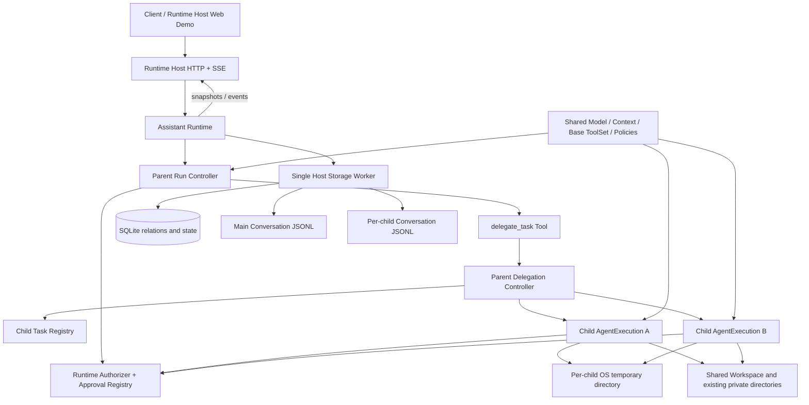

# v0.13.0 技术方案：单层子 Agent 与同步任务委派

## 一、方案信息

- 版本：`v0.13.0`
- 状态：已确认
- 关联功能设计：[`功能设计`](功能设计.md)
- 影响范围：`agent-core`、`agent-tools`、`assistant-runtime`、`assistant-protocol`、
  `apps/runtime-host`
- 核查依据：2026-08-12 实际源码、`v0.12.0` Plan/Build 与权限基线、现有
  `AgentExecution`、`ExecutionRecorder`、`RunToolFactory`、Runtime supervisor、
  SQLite/JSONL 存储和 HTTP/SSE 实现

本文只承接实现级问题：委派工具、同批并行接缝、子执行装配、状态所有权、持久化、恢复、
取消、权限、预算、协议和验证。产品范围、单层同步语义及非目标以功能设计为准。

## 二、现状核查与核心结论

### 2.1 可以直接复用的能力

当前代码已经具备子 Agent 所需的大部分执行底座：

- `AgentExecution::start` 已提供事件流、可靠 completion 和单次执行取消句柄；子 Agent
  不需要新的推理循环。
- `ExecutionSpec` 已冻结模型、System Prompt、Context Window、ToolSet、请求配置、预算和
  Guardrail；父子执行可以共享同一批不可变组件。
- `ExecutionContext` 已把取消、Recorder 和 Authorizer 从 Agent 规格中分离；每个子任务可用
  独立控制面启动同一个 Agent 规格。
- `ExecutionRecorder` 已定义工具副作用前 `begin -> started -> complete` 的可靠落账协议；
  子任务只需要绑定到另一份 Conversation，而不是定义第二套 Recorder 语义。
- `RunToolFactory` 已按 Session 冻结环境创建真实文件与 Shell 工具；子任务继续使用同一套
  `agent-tools-local` 实例和路径解析规则。
- `RuntimeToolAuthorizer` 已组合 Plan/Build 硬边界、Host 基础设施策略、三级权限规则和审批；
  子任务只需复用父 Run 的作用域，并增加任务临时目录作为 Plan 私有根。
- Host 的单一阻塞存储 worker 已同时拥有 SQLite 与 JSONL 文件 I/O；子任务存储继续进入该
  worker，不新增连接、后台数据库所有者或独立存储进程。
- 现有 HTTP Command、SSE、Runtime 权威查询和 Web Demo 均可按相同模式扩展。

### 2.2 必须新增的最小接缝

实际代码同时暴露出四个无法只靠装配解决的问题：

1. 模型一次响应可以同时返回多个 Tool Call，但 Core 目前会按返回顺序逐个等待工具完成。例如
   模型同时返回两个 `delegate_task`，现在会先等子任务 A 完成，才启动子任务 B，无法获得并行
   收益。又不能把全部工具统一改成并行，否则两个文件写入或 Shell 调用的既有执行顺序会被
   改变。因此需要给工具实现增加一个仅供 Core 使用的执行模式：默认仍为串行，只有
   `delegate_task` 明确声明具备并行调度资格。这个模式不写入模型可见的 Tool Definition，不改变
   Tool Schema，也不影响模型缓存。
2. Host 当前完成文件、Shell 等工具注册后，直接把不可再修改的 `ToolSetSnapshot` 交给 Runtime。
   本版本实际需要从同一套 Host 基础工具派生两个集合：子 Agent 直接使用基础集合，因此看不到
   `delegate_task`；父 Agent 使用“基础集合 + 排在末尾的 `delegate_task`”。这里不是先构造父
   ToolSet 再从子 Agent 中删除工具，而是让冻结快照支持一次受校验的消费式追加：Runtime 保留
   基础快照给子 Agent，并基于其副本只为父 Agent 追加委派工具。Host 工具的名称、Schema、顺序
   和实现句柄都原样复用，Runtime 不解析或重新注册它们。
3. `RuntimeRecorder` 目前固定绑定主 Session Journal。需要把其公共算法抽成一个私有
   `RecorderTarget`，分别绑定主 Run 或子任务 Journal；Core 的 Recorder trait 不变。
4. Runtime 当前只有 Session/Run Registry。需要新增子任务 Registry 和父 Run 级委派控制器，
   负责数量、并发、单独取消、查询及父级级联取消。

### 2.3 明确不采用的实现

- 不把子任务保存成隐藏 Session 或普通 Run。那会污染 Session/Run 查询、队列、归档、权限
  scope 和正文 generation，并迫使大量代码识别“伪 Session”。
- 不新增 child-agent crate、第二套 Agent Loop、Provider、Context、文件工具、Shell、权限器或
  存储 worker。
- 不把全部 Tool Call 改成并行。文件、Shell 等现有工具仍保持串行，避免改变既有副作用顺序。
- 不把子任务中间消息写入主 Conversation，也不通过父 Tool Result 回传完整执行轨迹。
- 不在 SQLite 保存完整子对话或父 Run 聚合 usage；正文继续使用 JSONL，usage 保留在实际
  Assistant Message 中。
- 不持久化运行中的 Tokio 句柄、取消令牌、Semaphore permit、临时目录 lease 或 pending
  approval。

## 三、目标架构



权威状态保持单一：

- Runtime 持有活动父 Run、子任务关系、子任务状态、并发配额和取消关系；
- Core 只持有一次 `AgentExecution`，不知道 Session、Run 或 ChildTask ID；
- Host Store 只实现 Runtime 的业务存储操作，不持有第二份调度状态；
- 客户端只查询、展示和提交取消/审批意图，不推断子任务终态。

## 四、领域标识、状态与内存所有权

### 4.1 公共标识和状态

`assistant-protocol` 新增 `ChildTaskId`，格式沿用现有不透明标识，Runtime 使用 `ct_` 前缀生成。

子任务状态使用独立枚举：

```text
accepted -> running -> completed
                    -> failed
                    -> cancelled
                    -> interrupted
```

- `accepted`：父委派 Tool Call 已获授权，子任务关系已可靠创建，但尚未开始模型执行；
- `running`：任务输入已经写入子任务 JSONL，子 `AgentExecution` 已启动；
- `completed`：最终 Assistant Message 与状态均已可靠提交；
- `failed`：模型、预算、Guardrail、上下文、存储准备或超时失败；
- `cancelled`：收到单独取消或父 Run 取消，且执行已经协作式收敛；
- `interrupted`：Runtime 重启前没有可靠终态，不自动续跑。

超时使用 `failed + timeout` 错误码，不额外引入与失败重叠的状态。`cancel_requested` 单独保存，
避免把“已请求取消”和“已经取消完成”混为一谈。

### 4.2 Runtime 内存结构

Runtime 增加两个私有控制器：

- `ChildTaskRegistry`：进程内全部子任务的权威索引，按 `ChildTaskId` 查询，并按
  `(SessionId, parent RunId)` 建立只读列表索引；恢复时从 Store 重建。
- `ParentDelegationController`：只在父 Run 活动期间存在，冻结父 Run 的模型资源、变体、权限
  scope、预算和取消令牌；使用短 Mutex 保护已创建数量，使用 Tokio `Semaphore` 控制并发。

每个 `ChildTaskController` 自己持有：

- 结构化状态和执行观察投影；
- 独立 `InMemoryJournal` 与短 mutation gate；
- 父取消令牌的子令牌；
- 活动期间的临时目录 lease；
- 仅用于活动执行的 completion/control 关联。

子任务不放入父 `SessionState.active_run`，也不取得主 Session 的 mutation gate。这样多个子任务
可并行写各自 Journal，而主 Conversation 仍只有父 Run 一条串行修改链。

## 五、`delegate_task` 工具契约

### 5.1 模型输入 Schema

Runtime 实现一个普通 `agent_tools::Tool`：

```rust
struct DelegateTaskInput {
    title: String,
    task: String,
    context: Option<String>,
    expected_output: Option<String>,
}
```

约束如下：

- `title` 是客户端和父 Agent 可读的短标题，trim 后非空，最多 256 UTF-8 字节；
- `task` 是自包含目标，trim 后非空，最多 32 KiB；
- `context` 只承载父 Agent 明确选择的背景，最多 64 KiB；
- `expected_output` 最多 16 KiB；
- 总参数经 serde/schema 校验，不允许模型传 model、provider、variant、tools、budget、depth、
  background 或 workspace 等控制字段；
- `resolve` 产生 `DelegationAuthorizationFacts`，既能按 General `delegate_task` 规则匹配，也能
  在审批界面展示 title 和 task 摘要。

工具名称、说明、Schema 和注册顺序不包含运行时预算值，Plan/Build 始终得到字节等价的 Tool
Definition。

### 5.2 父模型可见结果

成功结果使用 JSON：

```json
{
  "task_id": "ct_example",
  "status": "completed",
  "result": "子 Agent 的最终结论"
}
```

失败、取消、超时和中断使用现有 `ToolResultStatus::Error` 及结构化 details：

```json
{
  "error": {
    "message": "child task did not complete",
    "details": {
      "task_id": "ct_example",
      "status": "failed",
      "code": "timeout"
    }
  }
}
```

结果不携带 reasoning、内部 Tool Call、usage、临时目录或权限信息。信息不足是子 Agent 的正常
结论时可以 `completed` 返回，由父 Agent 判断是否询问用户；基础设施或执行失败才使用错误结果。

## 六、ToolSet 装配与同批并行

### 6.1 ToolSet 的父子差异

Host `RunToolFactory` 仍只编译现有文件、Shell 等基础工具和基础设施策略。`agent-tools` 为
`ToolSetSnapshot` 增加消费式 `with_tool`/`append_tool` 能力，内部继续执行重复名称、Schema 和
冻结定义校验。

Runtime 的装配顺序固定为：

```text
Host Base ToolSet
├── Child Agent ToolSet = Base ToolSet
└── Parent Agent ToolSet = Base ToolSet + delegate_task
```

先用 Base ToolSet 构造可复用的 `Arc<Agent>` 子规格，再让 `DelegateTaskTool` 捕获父 Run 的
`ParentDelegationController` 和该子规格，最后追加到父 ToolSet。由此不存在父 Agent 构造与
委派工具之间的循环依赖，子 Agent 也从能力层面看不到 `delegate_task`。

父子 Agent 共享同一 `Arc<dyn ModelService>`、Context Window Evaluator、模型请求配置、
Provider options 和 Guardrail 配置；只在 System Prompt、ToolSet、执行预算和
`ExecutionContext` 上形成必要差异。

### 6.2 最小并行调度接缝

`agent-tools::Tool` 增加内部执行属性，默认值为 `Serial`：

```text
ToolExecutionMode::Serial
ToolExecutionMode::ParallelEligible
```

该属性冻结在 ToolSet 的擦除记录中，不进入 Provider 可见 `ToolDefinition`，也不成为权限规则
字段。只有 `delegate_task` 声明 `ParallelEligible`，现有文件、Shell 和其他工具全部沿用
默认串行。`ParallelEligible` 只表示工具实现允许 Core 将同批同类调用并发启动，不表示
Runtime 已验证不同调用的外部副作用一定互不冲突。本版本尤其不因该标记推导 Workspace 文件
不重叠；任务独立性仍由父 Agent 拆分约定、并发上限和最终复核共同控制。

Core 对一个 Tool Call batch 的处理规则为：

1. 继续先完整落 pending Assistant Message、整批 resolve 并按原顺序做 Guardrail 预检；
2. 普通调用维持现有逐项授权、started、dispatch 和结算；
3. 连续的 `ParallelEligible` 调用组成一个并行组，授权 future 可以同时等待，避免一个子任务
   审批阻塞其他审批的出现；
4. 并行组授权结果齐备后，在启动任何 future 前为全部获准调用统一预留工具预算；预算不足时
   不启动超额调用，并为其形成确定的预算错误；
5. 每个获得预算的调用仍独立写 started，随后启动自己的 future；
6. 并行 future 共享父执行取消令牌，结果按原 Tool Call 顺序收集；
7. 组内全部 future 收敛后才原子 complete 当前 Tool exchange，父模型随后进入下一步；
8. 混合 batch 只对连续显式并行组并发，不跨越普通工具重排副作用顺序。

并行组开始前预留 Core tool-call 预算，防止多个 future 同时越过上限。结果 Guardrail 在全部结果
齐备后按原顺序观察；它可以阻止父 Agent 继续下一模型步骤，但不会声称回滚已经并发发生的副作用。

## 七、子 Agent 输入、System Prompt 与冻结资源

### 7.1 冻结 System Prompt

子 Agent 的 System Prompt 由两部分构成：

1. 父 Session 创建时已经冻结的 `SystemPromptSnapshot`；
2. 版本化 `CHILD_AGENT_INSTRUCTION_V1`，说明它只完成给定任务、不能再次委派、不能直接联系
   用户、需要报告结论/修改/验证、需要保留的文件必须写到稳定目录。

该成品 Snapshot 在创建子任务时保存，恢复查询不根据当前代码模板重算。Workspace 文件列表不
注入；子 Agent 继续按需使用现有工具读取。

### 7.2 独立 Conversation

子任务初始 Conversation 只包含一个由 Runtime 构造的 User Message：

```text
UserMessage
├── Text: task + optional context + expected output
└── Injected: inherited Plan/Build instruction + stable directories + task temporary path
```

不复制父 Conversation、父 reasoning、历史 Tool Result 或父附件 Part。Session 附件和 Workspace
稳定路径已经存在于冻结 Session Prompt；父 Agent 如要求子任务关注某个附件，应在 task/context
中明确写出对应稳定路径。

初始 User Message、Injected Part 和子 System Prompt 都是执行历史事实。临时目录以后被清理也
不修改历史记录。

### 7.3 模型与请求配置继承

父 Run 启动时从同一配置快照构造一次 `FrozenRunResources`。父 Agent 与所有子 Agent 使用同一个
ModelService 实例，因此配置 reload、Session model 切换或 API Key 变化不会在父 Run 中途让子
任务漂移到新模型。

DeepSeek profile、reasoning、tool choice、generation 和 retry 都沿用父 Run 冻结值。子 Agent
不新增 Provider 分支；OpenAI-compatible Adapter 只会看到另一份标准 Conversation 和 ToolSet。

## 八、权限、审批与能力上限

### 8.1 委派自身授权

`delegate_task` 使用专用授权 facts，但权限规则仍映射为现有 General matcher：

```json
{
  "type": "general",
  "tool_name": "delegate_task"
}
```

因此 Session/Workspace/Global 权限文件格式不升级。Approval 的 subject 新增 delegation 展示
分支，包含工具名、任务标题和受限摘要；`AllowSession`/`AllowWorkspace` 仍只写精确 General
Allow，不把具体任务正文写入权限文件。

### 8.2 子任务内部授权

每个子任务创建独立 `RuntimeToolAuthorizer`，冻结并复用：

- 父 Input 的 AgentVariant；
- 父 Run 的 ApprovalMode；
- 父 Session 和可选 Workspace permission scopes；
- 父 Run 编译出的 Host infrastructure policies；
- 同一个 PermissionCoordinator 与 ApprovalRegistry；
- 父 Session 环境，以及当前子任务临时目录形成的额外 Plan 私有根。

子任务审批仍以父 `SessionId` 和父 `RunId` 对外展示，并额外携带 `child_task_id`。这样现有按
Session 查询审批和父 Run 级取消仍可工作；单独取消子任务时，Registry 按 `child_task_id` 只取消
其审批。旧的父 Run 审批字段新增可选值，保持现有序列化兼容。

Plan 硬边界、附件保护、显式 Deny、审批后二次检查及规则 reload 顺序不变。允许
`delegate_task` 只启动子任务，子任务内每个文件/Shell 调用仍重新过闸。

## 九、子任务临时工作空间

### 9.1 基础设施端口

Runtime 不直接调用文件系统创建临时目录。`assistant-runtime` 定义最小
`ChildTaskWorkspaceFactory` 端口，Host 返回一个持有绝对 UTF-8 路径的 opaque lease：

```text
create(child_task_id) -> ChildTaskWorkspaceLease
lease.path() -> absolute path
drop lease -> best-effort recursive cleanup
```

Host 使用 `tempfile::TempDir` 在操作系统临时根下创建独立目录，名称带固定应用前缀和随机部分。
Unix 下目录按当前用户私有方式创建。不会把子任务文件直接散落到 `/tmp` 顶层，也不把路径写进
Runtime Home、Session 归档或 SQLite 资源表。

### 9.2 生命周期

- task 被允许并取得并发 permit 后创建临时目录；排队任务不提前占用目录；
- lease 保持到子任务完成、失败、取消或超时的全部清理结束；
- 形成可靠子任务终态后立即 drop，正常路径 best-effort 删除；
- 进程 crash 可能留下 OS 临时目录，本版本交由操作系统临时目录生命周期回收，不建立持久清理
  注册表或扫描任意 `/tmp` 路径；
- 需要保留的文件由子 Agent写入共享 Workspace、Workspace 私有目录或 Session 私有目录。

工具默认 workdir 仍是共享 Workspace；子 Agent 通过输入中提供的绝对临时路径显式选择该目录。
这既能复用现有路径解析和工具定义，也不会让临时目录误替代用户 Workspace。

## 十、持久化布局与数据格式

### 10.1 SQLite 只保存关系和状态

Host Schema 以兼容性添加方式新增以下逻辑表，不改写现有 Session/Run 表：

```text
child_tasks
├── child_task_id                 PK
├── session_id                    FK -> sessions
├── parent_run_id                 FK -> runs
├── parent_tool_call_id
├── title
├── system_prompt_json
├── agent_variant
├── status / cancel_requested
├── body_generation / message_count
├── final_message_id?
├── error_code? / error_message?
└── created_at / started_at? / finished_at?

UNIQUE(parent_run_id, parent_tool_call_id)
INDEX(session_id, parent_run_id, created_at, child_task_id)
```

另外新增 child 版 pending/tool-start/body-append 表，外键指向 `child_tasks`。它们不是新的业务
概念，而是现有两阶段 Recorder 和 staged append 在独立 Conversation 目标上的可靠临时事实。

旧数据库只执行 `CREATE TABLE IF NOT EXISTS` 和 REQUIRED_PROJECTIONS 校验，不需要复制、删除或
改写历史表，`config.toml schema_version = 1` 也不因新增可选配置段升级。旧 Session 不推断任何
子任务。

### 10.2 子任务正文

每个子任务使用现有 `ConversationMessage` JSONL 编码：

```text
~/.ez-assistant/data/sessions/<session_id>/child-tasks/<child_task_id>/body-1.jsonl
```

内容依次包括：初始 User Message、每个完整 Assistant Tool Call batch、配对 Tool Message，以及
最终 Assistant Message。只写完整规范消息，不按模型 chunk 持久化。reasoning、text 和 usage
跟随实际 Assistant Message 保存，Tool Call/Result 结构与父 Conversation 完全一致。

子任务没有历史重新输入、分支或多次 Run；但长工具链达到本地阈值或收到 Provider Context
Overflow 时，会复用正式 Runtime 的 Rolling Summary，以新 generation 原子替换有效正文并在同一
子任务内续跑。generation 因而从 1 单调递增；旧 generation 在 SQLite 切换后 best-effort 清理。

### 10.3 代码复用方式

Host 不复制 JSONL 编解码和恢复算法：

- `conversation.rs` 的 encode/decode/validate/reconcile 原语直接复用；
- `append_effect.rs` 抽取 `ConversationStorageTarget::{Session, ChildTask}` 路径与元数据适配；
- `tool_exchange.rs` 抽取同一套 begun/started/ready/commit 算法，表选择由内部 target 决定；
- Runtime `RuntimeRecorder` 重命名/抽取为一个带私有
  `RecorderTarget::{ParentRun, ChildTask}` 的实现；
- 父 Run settlement 保持原入口，子任务 settlement 复用消息提取、错误映射和 Journal 校验函数。

只新增 child-specific Store 业务操作和表，不新增通用 SQL/KV 接口，也不让 Runtime 知道物理路径。

## 十一、可靠提交顺序与重启修复

### 11.1 正常执行可靠点

一个委派 batch 的顺序为：

```text
父 Recorder begin：父 Assistant + delegate calls 进入 pending
→ delegate 调用授权
→ 父 Recorder mark started
→ create child_tasks 关系
→ 创建临时目录
→ 子初始 User Message staged append + child running
→ 启动并监督 Child AgentExecution
→ 子内部工具沿 child Recorder 两阶段落盘
→ 子最终 Assistant / 失败事实 + child 终态可靠提交
→ delegate Tool future 返回稳定 Tool Result
→ 父 Recorder complete：全部 delegate results 原子进入主 Conversation
→ 父 Agent 继续下一次模型调用
```

子任务终态必须先于父 Tool Result 返回。由此一旦父结果可见，对应子记录必然已经存在；如果子
任务已经可靠完成但父结果尚未提交，启动恢复可以从子记录重建同一结果。

### 11.2 恢复顺序

Host 启动恢复严格按下列顺序执行：

1. 修复主 Session 和所有子任务未完成的 staged append；
2. 修复子任务内部 pending tool exchange：未 started 补“未开始”，已 started 补“结果未知”，
   ready 直接完成；不重放工具；
3. 把仍非终态的子任务结算为 `interrupted`，保留已经完成的规范消息；
4. 修复父 Run pending tool exchange：普通工具沿用现有规则；`delegate_task` 根据
   `(parent_run_id, parent_tool_call_id)` 查子任务，已终态则重建其稳定结果，缺失或未完成则补
   interrupted 结果；
5. 将仍非终态的父 Run 标记为 `interrupted`；
6. 加载 Session、Run、ChildTask Registry，Runtime 开放 HTTP 入口。

旧 pending approval 不持久化；其 receiver 随进程退出失效，不会在恢复后唤醒任何工具。

### 11.3 异常矩阵

| 中断位置 | 恢复结果 |
| --- | --- |
| 父 delegate call 尚未 started | 父 pending 补“执行未开始”；没有子任务 |
| started 已写、子关系尚未创建 | 父 delegate result 补 interrupted；不创建伪历史任务 |
| 子关系已创建、尚未 running | 子任务 interrupted；父结果引用该 task id |
| 子内部工具已 started、未完成 | 子 Journal 补 outcome unknown，再把子任务 interrupted |
| 子任务终态已可靠提交、父结果未提交 | 从子终态和最终消息重建父 Tool Result |
| 父 pending 已 ready、正文尚未 append | 先完成父 staged append，再加载历史 |
| 父取消与子完成竞态 | 谁先完成可靠终态提交谁胜出；状态只能写一次，取消不覆盖已完成 |

任何修复失败只隔离受影响 Session，不继续执行历史副作用，也不根据模型文本猜测完成状态。

## 十二、并发、取消、超时与预算

### 12.1 并发和等待

父 Run 的 `ParentDelegationController` 使用两个独立边界：

- `max_tasks_per_run`：创建关系前原子计数，超过后当前 Tool Call 直接形成预算错误；
- `max_concurrent_tasks`：每个获准调用等待 Semaphore permit，permit 只覆盖实际子执行。

并发排队发生在父 Tool future 内，不创建后台 Job。父模型必须等待当前 batch 所有结果。一个子
任务等待审批不会持有其他子任务的锁，其他已有 permit 的任务继续执行。

### 12.2 取消树

取消令牌关系为：

```text
Runtime root
└── parent Run token
    ├── child task token A
    ├── child task token B
    └── child task token C
```

- `CancelChildTask` 只取消指定 child token，并按 child id 清理其 pending approval；
- `CancelRun` 延续现有父 Run 流程，父 token 自动传播到全部子任务，同时取消父 Run 下所有审批；
- 父取消后 delegate futures 等待各子 Agent 与工具完成协作式清理，再让父 Core 补齐 Tool Result
  并收敛为 cancelled；不会再发起父模型汇总；
- Runtime shutdown 通过 root token 级联，现有有界 `RuntimeTasks` 等待和强制中止策略保持兜底；
- 单个子任务取消或失败只形成其 Tool Result，不取消 sibling 或 parent token。

### 12.3 配置与默认值

在可选 `[agent.defaults.delegation]` 中增加：

```toml
[agent.defaults.delegation]
max_tasks_per_run = 8
max_concurrent_tasks = 4
task_timeout_ms = 900000
max_steps = 40
max_tool_calls = 100
max_output_tokens = 16384
```

规则如下：

- 表缺失使用上述产品默认值；所有值必须大于 0，且并发数不得超过总数；
- 父 Run 的每个 `delegate_task` 仍计入父 Core `max_tool_calls`；
- 子 `max_steps`/`max_tool_calls` 与父 Run 冻结的全局执行上限分别取较小值；父值为 `None` 时只
  使用 delegation 上限；
- 子单轮 `max_output_tokens` 与父 Run 已计算的 generation 上限、模型硬上限取最小值；
- task timeout 从取得并发 permit、准备临时目录开始计时，不包含等待 permit 的时间；父 Run
  取消仍可在排队阶段立即终止；
- timeout 覆盖模型调用、审批等待和工具执行的工作阶段。到期时先取消 child token，再等待既有
  下层完成协作式清理后形成 `failed/timeout`；清理耗时不伪装成仍可继续工作的预算，Runtime
  shutdown 的既有有界等待仍是无法协作退出时的最终兜底；
- Context Window 使用同一模型静态上限和 0.8 evaluator。父 Run 与子任务触发
  `CompactionRequired` 后，由 Runtime 复用同一模型、冻结 System Prompt 和
  `RollingSummarySameModel` 生成 replacement，以正文 generation 原子切换后继续原业务执行；
- 父会话 replacement 优先保留最近一个完整 User Turn；若首个活动 Turn 自身已经溢出，则退回到
  整体摘要当前工具链。子任务只有一个自包含 User Turn，直接允许整体摘要，否则单 Turn 子任务
  永远不存在可压缩 head；整体摘要活动 Turn 后追加并持久化一条 UI 隐藏的 Injected User
  continuation 锚点，使续跑结果仍处于合法 User Turn 中；
- 每个业务执行最多自动压缩两次，且 continuation 使用累计后的剩余 step/tool-call 预算，不能借
  压缩重置资源限制；已消费量直接取 Core CompactionRequired 终态中的可靠 Step/实际 dispatch
  计数，不从可丢弃事件反推；达到恢复上限或摘要/持久化失败，以 `context_compaction_failed` 结算，并在
  安全错误消息中保留 `threshold_reached` 或 `provider_overflow` 触发原因；
- 摘要模型 identity 与 usage 跟随 `ContextSummary` 持久化，Web Demo 动态统计时一并计算，SQLite
  仍不保存父子 aggregate usage。

这些值是模型无关的 Agent 调度配置，不进入任一 model 表，也不能由 Tool Call 覆盖。

## 十三、usage 语义

每个模型 Turn 的 usage 继续只保存在产生它的 Assistant Message，并实时投影
`UsageUpdated`：

- 父模型 usage 留在主 Conversation；
- 子模型 usage 留在对应 child JSONL；
- SQLite 不新增 `input_tokens`、`total_tokens` 或父级 aggregate 字段；
- 父 Tool Result 不复制子 usage；
- Web Demo 加载父 Conversation 和各 child Conversation 后在内存求和；实时阶段按
  `(run_id, child_task_id?, step)` 去重更新，刷新后重新从正文计算。

Provider 未提供 cached token 时继续使用 `None`，客户端不能用 `total - input - output` 推导。

## 十四、正式协议、HTTP 与事件

### 14.1 Command

`assistant-protocol::RuntimeCommand` 增加：

- `ListChildTasks { session_id, parent_run_id }`；
- `GetChildTask { session_id, child_task_id }`；
- `CancelChildTask { session_id, child_task_id }`。

所有命令同时核对 Session 和父子所有权，跨 Session 猜测 ID 返回 NotFound。归档 Session 允许
查询，不允许取消已经终态的任务；对终态重复取消幂等返回当前快照。

`ChildTaskSnapshot` 至少包含父 Session/Run/Tool Call、标题、状态、变体、取消标记、最终文本、
错误和时间。它不返回内部物理 JSONL 路径或临时目录。

完整 Conversation DTO 仍不提前进入公共协议。Web Demo 仿照现有父 Conversation 私有查询，
增加 Host-private `ChildTaskConversationSnapshot`，只用于验收展示内部 reasoning、Tool Call、
Tool Result 和 per-message usage；正式桌面端出现时再统一设计公共 Conversation DTO。

### 14.2 SSE

`RuntimeEvent` 增加一个嵌套的 `ChildTaskEvent` 分支，公共 envelope 固定携带：

- `session_id`；
- `parent_run_id`；
- `child_task_id`；
- child event payload。

payload 覆盖 created、started、text/reasoning delta、usage、tool proposed/started/output/completed、
finished。事件是有界观察通道，丢失后客户端必须使用 List/Get 和私有 Conversation 查询重建；
不能把 SSE 当恢复来源。

`ApprovalSnapshot`、ApprovalRequested/Resolved/Cancelled 增加可选 `child_task_id`。父 Run 审批为
None，保持现有客户端反序列化兼容。

### 14.3 HTTP 与 Web Demo

Host 仍使用单一 `/commands` 和 `/events`，不增加第二套 transport。Web Demo 只增加：

- 父 Run 下的子任务列表和展开详情；
- 子任务实时 reasoning/text/tool/usage；
- 子任务取消按钮；
- 审批卡片的 child 标识；
- 父、子分项 usage 和前端动态合计；
- 刷新/SSE 重连后的权威查询重建。

Demo 沿用现有逐帧批处理和增量 DOM 更新，不因子事件重新渲染全部消息树。

## 十五、模块与源码落点

建议按现有归属扩展，不新增 crate：

```text
crates/agent-tools/src/
├── tool.rs                       ToolExecutionMode 默认值
├── registry.rs                   ToolSet 消费式追加
└── resolution.rs                 resolved execution mode

crates/agent-core/src/
├── engine.rs                     Agent Loop 与 Tool Batch 调用入口
└── engine/tool_batch.rs          串行位置、显式并行组与有序结算

crates/assistant-protocol/src/
├── id.rs                         ChildTaskId
├── snapshot.rs                   ChildTaskSnapshot / status
├── command.rs                    list/get/cancel
└── event.rs                      ChildTaskEvent + approval association

crates/assistant-runtime/src/
├── delegation.rs                 模块入口与公共内部类型
├── delegation/tool.rs            delegate_task Tool
├── delegation/controller.rs      父 Run 配额、并发和取消
├── delegation/task.rs            ChildTaskController / Registry
├── delegation/supervisor.rs      子 Agent 事件投影与结算
├── delegation/workspace.rs       临时目录基础设施端口
├── run/recorder.rs               抽取 RecorderTarget
├── runtime/model.rs              FrozenRunResources 与父子 Agent 装配
├── runtime/approval.rs           child approval 取消
├── runtime/input/mod.rs           父 Run controller 生命周期
├── storage.rs                    child 业务存储 DTO/port
└── config/*                      delegation 配置编译

apps/runtime-host/src/
├── resources/tools.rs            继续只构造 Base ToolSet
├── resources/environment.rs      ChildTaskWorkspaceFactory 实现
├── storage/child_task.rs         关系、状态与查询
├── storage/conversation.rs       复用通用 JSONL 原语
├── storage/append_effect.rs      多 Conversation target
├── storage/tool_exchange.rs      父/子共享恢复算法
├── storage/schema.rs             兼容性新增表
├── storage/worker.rs             child 业务命令
├── http/commands.rs              薄转发和私有详情查询
└── http/web_demo/*               验收展示
```

如实现中单个文件再次明显过长，应按上面职责拆分；不把边缘查询、状态投影和存储 SQL重新塞回
`runtime.rs`、`server.rs` 或现有 `run_state.rs`。

## 十六、验证方案

### 16.1 单元与组件测试

- `agent-tools`：执行模式默认串行、ToolSet 追加稳定、重复名失败、Provider Definition 不含模式；
- `agent-core`：多个 delegate-like 工具确实重叠执行，普通工具保持顺序，结果顺序稳定，预算、
  Deny、started 失败、取消和并行组 Guardrail 均成对结算；
- Runtime：输入构造、单层 ToolSet、模型/变体继承、独立 Journal、总数/并发/超时、单独取消、
  父级级联、审批 child 关联和 sibling 隔离；
- Store：新增 schema、子 JSONL append、pending begun/ready、started unknown、父结果修复、旧库
  无子表升级和跨 Session 所有权拒绝；
- Protocol：全部新 command/result/event/status serde 稳定，旧 approval JSON 缺 child 字段可读；
- Web Demo：事件批处理、刷新恢复、长子任务不会全屏重绘或重复累计 usage。

### 16.2 确定性集成场景

使用 `agent-testkit` 和临时 Runtime Home 覆盖：

1. 单子任务成功并由父模型汇总；
2. 两个子任务并行，壁钟/同步栅栏证明重叠；
3. 一个完成、一个失败，父 Run 继续；
4. 一个等待审批，另一个继续；
5. 单独取消 child，sibling 与 parent 不取消；
6. 取消 parent，全部 child 和 approval 收敛；
7. Plan child 只能修改任务临时目录和既有 Agent 私有目录；
8. 达到总数、并发、step、tool、output 和 timeout 限制；
9. 在各可靠点构造 crash 状态，恢复后父 Tool Call/Result 成对且不重放工具；
10. 归档/恢复保留 child 历史，普通 Session/Run 列表不出现伪记录。

### 16.3 真实验收

在隔离的临时 Runtime Home 复制用户模型配置，使用正式 Runtime Host 和 Web Demo 验证：

- 真实 LLM 单任务、并行探索、文件读取和父结果汇总；
- Build 子任务在不重叠文件范围内修改并验证；
- Plan 子任务在临时/Agent 私有目录写分析脚本，拒绝用户 Workspace 修改；
- 子任务 Shell 审批、Session/Workspace Allow 和 Deny；
- 单独取消、父取消、浏览器刷新、SSE 重连和 Host 重启中断；
- 父子 usage 分项与客户端动态合计。

开发时只使用临时数据库和临时 Runtime Home。若最终验收需要启动真实 `~/.ez-assistant`，必须先
按项目数据库安全规则核对并备份 SQLite，再经用户确认后执行任何可能触发 schema 写入的启动。

最终门禁：

```bash
cargo fmt --all --check
cargo clippy --workspace --all-targets --all-features -- -D warnings
cargo test --workspace

cd apps/desktop
npm run build
npm run tauri -- build --no-bundle
```

## 十七、主要风险与控制

- **Core 并行语义扩大**：执行模式默认串行，只给 `delegate_task` 显式启用；用普通工具顺序回归
  锁定兼容性。
- **跨介质恢复复杂**：子终态先于父结果，启动按 child -> parent 顺序修复；所有测试都检查
  Tool Call/Result 配对和零副作用重放。
- **共享 Workspace 冲突**：本版本不追踪文件；Prompt 明确要求不重叠拆分，父 Agent 最终复核。
- **并行成本放大**：父工具预算、任务总数、Semaphore、子预算和 task timeout 五层共同限制。
- **审批归属混乱**：继续以父 Session/Run 为公开主线，只增加可选 child id；规则 scope 不变。
- **临时目录泄漏**：正常终态立即释放 lease；crash 遗留交由 OS 临时目录清理，不扫描宽泛路径。
- **代码重复**：Recorder、JSONL、append、pending exchange、事件投影和 settlement 先抽取共同内核，
  child 模块只承载差异状态，不复制完整父 Run 实现。

## 十八、技术方案确认结论

以下实现选择已经确认，并作为开发计划的拆分依据：

1. 用显式 `ToolExecutionMode` 只并行 `delegate_task`，普通工具继续串行；
2. 子任务是 Runtime 独立控制器和 JSONL 目标，不伪装成 Session/Run；
3. 子 Agent 复用父 Run 冻结资源，Base ToolSet 不含 `delegate_task`；
4. 临时工作空间使用 Host 创建的 OS 临时目录 lease，终态立即清理，crash 遗留交 OS 回收；
5. SQLite 只兼容性新增 child 表，完整执行正文继续保存为现有 ConversationMessage JSONL；
6. 子终态先可靠提交，再返回父 Tool Result，并按 child -> parent 顺序修复；
7. 使用本文的 delegation 默认预算和配置位置；
8. 公共协议提供 child list/get/cancel 和事件，完整 child Conversation 暂为 Host Web Demo 私有查询。
