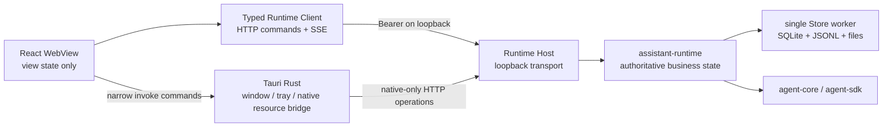

# v0.14.0 技术方案：正式桌面端 MVP

## 一、方案信息

- 设计基线版本：`v0.14.0`
- 实施覆盖：`v0.14.0`–`v0.14.2`
- 状态：已确认；`v0.14.0` 已完成，继续作为 `v0.14.1`–`v0.14.2` 的统一技术基线
- 关联功能设计：[`功能设计`](功能设计.md)
- 视觉基准：[`桌面端设计语言`](../../resources/桌面端设计语言.md) 与
  `tmp/product-experience-demo/` 当前亮色 Demo
- 影响范围：`apps/desktop`、`apps/runtime-host`、`crates/assistant-protocol`、
  `crates/assistant-runtime`；涉及 Runtime Host 的平台适配边界和 Tauri 原生能力
- 核查依据：2026-08-13 实际源码、`v0.13.0` 已实现的 Session/Run、Workspace、附件、
  队列、审批、权限和单层子 Agent 基线，以及 Tauri 2 官方的外部二进制、窗口、菜单和
  托盘能力

本文只落实功能设计中的工程决策、跨层契约、状态所有权、持久化、并发、平台、安全和
验证方法。页面内容、交互语义和视觉验收仍以功能设计、设计语言和已确认 Demo 为准；
本文不重新设计一套 UI，也不等同于开发计划或代码实现授权。

`v0.13.0` 已完成并归档。本方案是三个连续实施版本共用的工程基线，不为补丁版本复制技术方案。
除非正文显式指向某个补丁版本，“本版本”均指 `v0.14.0`–`v0.14.2` 完成后的统一桌面 MVP。
各版本只在开发计划中切分交付和验收边界；开发计划获得确认前不开始代码实现。

## 二、现状核查

### 2.1 可以直接复用的正式能力

- Runtime Host 已具备单实例锁、动态 IPv4 loopback 端口、私有发现文件、Bearer Token、
  Host/Origin 校验、HTTP Command、SSE、流式附件上传和受控关闭。
- `assistant-runtime` 已经是 Session、Run、输入队列、Workspace、Attachment、审批、权限、
  子任务、配置快照和恢复的唯一业务权威；Desktop 无需也不得复制这些控制器。
- 同一 Session 中改变 Conversation 的父 Run 已默认串行，不同 Session 可并发；子 Agent
  在父 Run 内拥有独立对话与观察事件。
- SQLite 关系状态与 JSONL Conversation 已由 Host 的单一阻塞 Store Worker 串行拥有，
  可继续承担桌面产品所需的持久化扩展。
- Runtime 事件明确允许丢失，客户端必须通过快照恢复；这与正式桌面端的重连模型一致。
- 配置编译已严格区分带凭据的进程内快照和脱敏投影，权限已有 Session、Workspace、Global
  三层文档、CAS 和原子替换基础。

### 2.2 不能由前端模拟的缺口

| 领域 | 当前实现 | v0.14.0 必须补齐 |
| --- | --- | --- |
| Desktop | Vanilla TypeScript + Vite，仅有 `health` invoke | React 产品壳、Runtime Client、原生桥、连接与窗口生命周期 |
| Runtime Host | 正式 HTTP/SSE 已存在，入口和安全文件操作整体为 Unix-only | 补齐当前 Unix 目标平台的独立启动、资源能力和打包；保留 Windows 私有适配边界 |
| Conversation | Host 只有 Web Demo 私有的整份 Conversation 查询 | 公共分页消息投影、主/子消息视图、工具详情、Fork 点和用量投影 |
| Session | 可创建、查询、归档、恢复和切换模型/模式 | 重命名、固定、永久删除、Fork、反馈、空会话换目录和时间/状态摘要 |
| 队列 | 持久串行、取消、重启后整体恢复 | 可见队列快照、单项优先、手动中断后暂停、指定项恢复和队列修订 |
| 审批 | 单项审批已可查询和决策 | 每 Session 有序队列、队首约束、拒绝并停止、规则写入后的安全重核 |
| 模型配置 | 只读列表/查询、重载和连接测试 | 新增、编辑、删除、默认值、内容修订、冲突和安全写入 |
| 权限配置 | Runtime 内部可加载，协议仅有摘要与重载 | Session/Workspace 文档读取与 CAS 替换、Global 只读投影 |
| 事件同步 | 裸 `RuntimeEvent`，无序号 | 实例内严格递增事件 envelope 和带水位的组合快照 |
| 文件能力 | 上传已正式化，预览/导出/系统打开未正式化 | 受控内容路由、Markdown 导出和 Tauri 原生资源桥 |

### 2.3 现有实现与功能设计的处理结论

1. `agent-types::ConversationSnapshot` 继续作为 Core/Runtime 内部规范快照；Host 私有的
   `ConversationSnapshot` 与 `ChildTaskConversationSnapshot` 命令不提升为产品接口。正式 Desktop
   切换到分页、分组和脱敏的产品投影并通过验收后，删除这两条命令及其结果类型。
2. 不让 WebView 直接读取 Runtime Home、Workspace 或用户文件，也不向前端开放通用 Shell、
   文件系统或任意路径 opener 权限。
3. 不把队列、审批、消息折叠、任务树或模型配置做成只存在于前端内存中的业务事实。
4. 不把 Runtime Host 合并进 Tauri 进程；桌面 UI 与 Runtime 继续保持正式双进程架构。
5. 不沿用 Demo 的单文件 `App.tsx`、Mock 数据和一次性事件处理；只复用视觉参数、页面结构和
   已确认交互。
6. Windows 不属于本版本的正式开发、打包和验收平台；Protocol 与 Runtime 保持平台中立，Host 与
   Desktop 将操作系统差异收敛到私有适配边界，但不以空壳实现或交叉编译结果宣称 Windows 可用。

## 三、总体技术决策

### 3.1 目标拓扑



权威状态和依赖方向保持不变：

- 前端只持有 Runtime 投影，以及路由、展开、焦点、草稿、选择器和弹窗等界面状态；
- Runtime 查询结果是服务端状态缓存，不被 MobX 当成第二份可独立提交的业务状态；
- Tauri Rust 只负责桌面平台能力、Runtime 进程发现/拉起和需要原生文件访问的窄桥接；
- Host 继续只做传输、鉴权、资源流和装配，不建立 Session/Run 的第二份权威状态；
- Runtime 执行业务校验、状态变更和快照组装；Store 只执行明确的业务存储操作。

### 3.2 Desktop 技术栈

正式 Desktop 从 Vanilla TypeScript 调整为：

- React 19 + React DOM + TypeScript + Vite；
- MobX + `mobx-react-lite` 管理 Runtime 快照投影、请求状态、SSE 增量和纯界面状态；
- Dart Sass（`sass` 包，不使用 `node-sass`）编译 SCSS，使用 Sass module system、CSS Modules
  和运行时 CSS Custom Properties 落实设计 Token，不引入会覆盖 Demo 视觉的成套组件库；
- Streamdown 负责 Assistant 流式 Markdown，按需启用 `@streamdown/code`（Shiki）、
  `@streamdown/mermaid` 和 `@streamdown/math`；其视觉由本项目组件、Sass Module 和 `--ez-*`
  Token 接管，不引入 Tailwind/shadcn 作为第二套样式体系；
- Vitest + Testing Library 做组件和状态测试，Playwright 驱动 Vite 页面连接临时正式 Host
  做浏览器级流程测试。

M0 已将工程基线锁定为以下具体版本；`package-lock.json` 和 `Cargo.lock` 是安装权威：

| 能力 | 锁定版本 | 许可证与运行基线 |
| --- | --- | --- |
| React / React DOM | `19.2.8` | MIT |
| MobX / `mobx-react-lite` | `7.0.0` / `5.0.0` | MIT；React 19 peer 范围有效 |
| Dart Sass | `1.102.0` | MIT；Node `>=20.19` |
| Streamdown / Code / Math / Mermaid | `2.5.0` / `1.1.1` / `1.0.2` / `1.0.2` | Apache-2.0 |
| Vite / React plugin | `8.2.1` / `6.0.5` | MIT；当前 Node `22.16` 满足要求 |
| Vitest / Testing Library / jsdom | `4.1.10` / `16.3.2` / `29.1.1` | MIT；jsdom 选择 Node `22.16` 可用版本 |
| Playwright | `1.62.1` | Apache-2.0；Node `>=20` |
| Oxlint | `1.78.0` | MIT；Node `>=22.12` |
| `ts-rs` | `12.0.1` | MIT；Rust `>=1.78` |

当前 Vanilla 壳未引用 React 或 Streamdown，M0 生产构建仍只有约 `1.08 kB` JavaScript；这不代表
后续消息页的最终体积。Streamdown 及 Code/Math/Mermaid 必须在 M3 按内容路径加载并重新记录目标
WebView 的产物体积与渲染性能，不能因为依赖已锁定就无条件进入首屏 bundle。

采用 React 的理由不是复用 Demo 代码，而是正式范围已经包含多页面设置、多个有状态浮层、
主/子消息切换、流式消息、审批抢占和组合快照，继续使用手写 DOM 会产生难以验证的隐式状态。
React 只解决视图组合；服务端状态仍由 Runtime 持有。

MobX 只组织客户端投影，不改变 Runtime 权威边界。状态分为三类：

1. Runtime 快照：由 `RuntimeProjectionStore` 按实体 ID、revision 和 observed sequence 保存；
2. 未结算流式增量：由 `LiveExecutionStore` 按 `(session_id, run_id, child_task_id)` 索引；
3. 纯 UI 状态：由按 feature 拆分的 UI Store 管理；只在单组件生命周期内使用的值保留为 React
   local state。

Store 使用显式 Root Store 装配依赖，通过 React Context 注入；禁止从任意模块导入可变全局单例。
同步 mutation 使用 `action`，异步流程使用 `flow` 或在 await 后进入 `runInAction`，开启
`enforceActions: 'always'`。派生值使用 `computed`，网络和 Tauri 调用不放进 computed。

### 3.3 前端目录边界

目标目录按业务能力而不是组件类别堆叠：

```text
apps/desktop/src/
├── app/                 # AppShell、连接门、顶层错误边界
├── runtime-client/      # bootstrap、HTTP、SSE、错误映射
├── native-bridge/       # 唯一 Tauri invoke 包装
├── stores/              # RootStore、连接、权威投影与跨 feature 协调
├── features/
│   ├── sessions/
│   ├── conversation/
│   ├── composer/
│   ├── approvals/
│   ├── child-tasks/
│   ├── context-panel/
│   └── settings/
├── components/          # 已有两个以上稳定使用方的无业务原子组件
├── styles/              # Sass modules、tokens、reset、layout、motion、platform
└── generated/           # assistant-protocol 生成的只读 TS 类型
```

业务组件留在各自 feature 中。只有 Button、IconButton、Dialog、Popover、Listbox、Tooltip、
Disclosure、RadioGroup、Menu、InlineEdit 等确实跨页面稳定复用的原子组件才提升到
`components/`。不为了“原子化”提前建立无调用方的抽象。

SCSS 统一使用 `@use`/`@forward`，不使用已弃用的 `@import`。全局入口只生成 reset、基础字体、
CSS Custom Properties 和 AppShell 布局；feature/component 样式使用 `*.module.scss` 限定作用域。
Sass 变量负责构建期计算，颜色、间距、字号和圆角等可被运行时复用的设计 Token 输出为
`--ez-*` Custom Properties，避免在 TypeScript 和 SCSS 各维护一份数值。

### 3.4 协议类型单一来源

`assistant-protocol` 中公开的 serde DTO 是 HTTP 业务类型唯一来源。为这些 DTO 增加
`ts-rs` 导出，在协议 crate 的测试/生成入口中产生
`apps/desktop/src/generated/assistant-protocol.ts`：

- 生成文件纳入版本控制但禁止手改；
- CI 重新生成后执行 diff 检查，Rust/TypeScript 契约漂移即失败；
- Host 私有传输 envelope 只手写极小 TypeScript 外壳，业务 payload 全部引用生成类型；
- 凭据更新请求使用专门 DTO，任何安全投影都没有 `api_key` 字段。

### 3.5 布局与本机偏好

窗口几何使用 Rust 侧 `tauri-plugin-window-state` 保存，并在启动时按当前显示器工作区校正；
插件不向 WebView 暴露 JS permission。左/右栏开关、
Workspace 分组展开、专注模式及“专注前布局”写入同一个 `DesktopPreferences` 原子 JSON：

- 专注模式只覆盖显示状态，退出时恢复进入专注前的左右栏组合；
- 窄窗口由 CSS container/media query 先压缩栏宽，再把右栏切为 overlay panel；
- 中部 Conversation 与 Composer 共用一个 `--conversation-content-width` 和水平 padding token，
  禁止各自计算宽度；
- Session Header 使用 CSS Grid 的 `auto minmax(0, 1fr) auto`，InlineEdit 只占中间弹性轨道，
  不会挤压状态和右侧按钮组；
- 设置 Header 采用统一 `min-height`，内容增多时自然撑高，不按页面写不同固定高度。

这些都是设备级展示偏好，缺失或损坏时回到设计语言默认值，不进入 Runtime 业务协议。

### 3.6 设置与当前上下文的页面状态

- 设置弹窗是 AppShell 内的 modal route，`runtime | models | model-edit | permissions` 使用显式枚举，
  浏览器刷新不要求恢复到深层表单；
- 每个设置页 Header 共用 `SettingsPageHeader`，返回按钮占固定图标槽，标题区使用相同 min-height；
- 模型/权限表单保存前有 dirty guard，关闭或返回时提示未保存内容；API Key 不进入可恢复 draft；
- 当前上下文的会话、Workspace、附件、子任务和运行记录全部从 `GetSessionView` 派生；区块展开是
  UI 状态，字段不存在时不渲染无效区块；
- 区块展开状态按 Session ID 保存在当前 Desktop 进程，不写入 Runtime。切换 Session 时恢复各自
  状态，应用重启可回默认，避免把大量瞬时 disclosure 状态写进用户配置。

## 四、Desktop 与 Runtime 进程生命周期

### 4.1 Runtime Host 打包与启动

Runtime Host 作为 Tauri `bundle.externalBin` 打包，按本版本发布目标的 triple 生成对应二进制。产品不能把
“退出客户端后 Runtime 继续运行”寄托在 Tauri 受管 child handle 的隐式清理行为上，因此长期
运行的 Host 不直接留作 Desktop 持有的受管子进程。

采用“两段启动、单实例收敛”：

1. Tauri Rust 先读取 `<runtime-home>/run/runtime.json`，验证文件安全、PID、loopback 地址、
   capabilities 和实例响应；有效则连接既有 Host。
2. 未发现有效实例时，Tauri 从 Rust 侧启动已打包的 Runtime Host `launch` 模式；WebView 不取得
   Shell/sidecar 权限。
3. `launch` 进程在最小同步入口中启动一个脱离 Desktop 生命周期的 `serve` 进程后退出：
   Unix 使用新 session/process group；该动作经 Host 私有平台边界封装，后续 Windows Adapter
   可改用 detached/new process group。标准输入输出不继承 WebView，启动错误写入 Runtime 自身诊断日志。
4. 多个 Desktop 窗口或快速重复启动仍由 Runtime Home 的单实例锁收敛；失败为
   `AlreadyRunning` 时回到发现轮询，不杀未知 PID、不抢锁。
5. Tauri 有界等待发现文件与健康检查；超时只报告启动失败，不清理非本进程拥有的文件。

这只是“由桌面按需拉起的独立产品进程”，不引入系统 daemon、登录自启或崩溃常驻拉起。

### 4.2 Desktop 启动状态机

```text
booting
  -> discovering
  -> starting_runtime (only when absent)
  -> connecting
  -> connected

connected -> reconnecting -> connected
connected -> disconnected
connected -> stopping_runtime -> runtime_stopped
```

- `instance_id` 改变表示 Runtime 重启，必须丢弃全部事件水位与活动流缓存并重取快照；
- 普通 SSE 重连不改变 Session 队列暂停、审批或 Run 状态；
- 断线期间保留最后成功快照但统一标为 stale，所有业务 mutation 禁用；
- 重连采用带抖动的有界指数退避，用户点击“重新连接”立即开始新一轮；
- 不在前端自动无限重启崩溃 Host。连续启动失败进入可诊断状态，由用户显式重试。

### 4.3 关闭、退出和停止

三种动作保持独立：

| 动作 | Desktop 行为 | Runtime 行为 |
| --- | --- | --- |
| 关闭窗口 | 按用户偏好隐藏到托盘；若偏好为退出客户端，则进入同一退出确认 | 隐藏时不发送 shutdown；进入退出流程后服从当次明确选择 |
| 退出桌面客户端 | 打开退出确认，默认关闭全部 WebView/Tauri 窗口和客户端进程 | 默认不发送 shutdown；用户当次勾选“同时停止 Runtime”后才进入停止确认流程 |
| 停止 Runtime | 保留客户端，先展示活动 Run/队列/审批影响，确认后发送 `ShutdownRuntime` | Runtime 受控收敛并移除自身 discovery |

“退出 Assistant”不作为独立产品概念或菜单项。退出确认中的“同时停止 Runtime”默认不选中；选中后
主按钮改为“退出并停止 Runtime”，并复用“停止 Runtime”的影响查询、确认和受控收敛流程。Runtime
停止成功后才退出客户端；停止失败则保留客户端和诊断入口，不把失败隐藏在进程退出之后。

所有入口——原生关闭按钮、自绘按钮、快捷键、系统菜单和托盘菜单——都调用同一个 Tauri Rust
生命周期协调器。关闭窗口时隐藏或退出客户端的偏好属于设备级 UI 配置，保存到 Tauri App Config
的原子 JSON 文件，不写入 Runtime 业务数据库；“同时停止 Runtime”是当次危险操作选择，不持久化为
默认偏好。

“重启 Runtime”由 Tauri 原生协调器执行：查询影响摘要、让用户确认、发送 shutdown、等待旧
`instance_id` 消失、重新 launch、连接新实例。不得直接按 PID 强杀；只有 Host 已无响应且用户
在二次风险确认后，才允许后续版本增加强制终止，本版本不提供该按钮。

### 4.4 窗口、菜单和托盘

- macOS 保留系统 traffic lights，使用 overlay/transparent title bar 让 Web 内容与标题栏视觉融合；
- Linux 使用无边框窗口和 Demo 中的窗口按钮，按钮调用 Tauri Window API；拖动区只放
  `data-tauri-drag-region`，交互元素排除拖动；
- 当前平台差异通过 `tauri.macos.conf.json` 和 `tauri.linux.conf.json` 表达，不在运行时用 CSS
  猜测；后续启用 Windows 时新增独立的 `tauri.windows.conf.json`，不改写共享业务组件；
- 应用菜单和托盘菜单使用 Tauri 原生 Menu/Tray API。macOS 标准编辑、窗口和应用菜单保持系统
  习惯，页面内“更多操作”仍是 Web UI 菜单；
- 启用 Tauri `tray-icon` feature。托盘项至少包含显示主窗口、Runtime 状态、停止 Runtime 和
  退出客户端；禁用状态由连接快照驱动。

## 五、Runtime Client、SSE 与权威快照

### 5.1 Bootstrap 与凭据

Tauri Rust 负责读取并验证 discovery，只向受信任主 WebView 返回一次内存态 bootstrap：

```text
RuntimeBootstrap {
  base_url,
  instance_id,
  access_token,
  capabilities
}
```

- `access_token` 只保存在 `RuntimeClient` 模块闭包内，不进入 MobX observable、React state、URL、
  localStorage、错误对象或日志；
- Desktop 只接受 IPv4 loopback 动态地址；discovery 中的非 loopback 地址直接判无效；
- Host 继续校验 Bearer、Host 和 Origin；生产构建只允许正式 Tauri WebView origin；
- 随包 Host 缺少 Desktop 必需 capability 时停止业务加载，显示组件不匹配，不尝试猜测或模拟缺失能力。

### 5.2 事件 envelope 与快照水位

现有裸事件无法证明“快照后哪些 delta 仍需应用”。新增：

```text
RuntimeEventEnvelope {
  sequence: u64,
  emitted_at_ms: i64,
  event: RuntimeEvent
}

ObservedSnapshot<T> {
  observed_sequence: u64,
  value: T
}
```

Runtime 内部增加 `ObservationCoordinator`：

- 一切会改变产品可观察状态并发布事件的路径，必须先提交权威状态，再在同一短发布边界中分配严格
  递增 `sequence` 并发布 envelope；绝不允许先发布事件后提交状态；
- 组合快照不持有全局锁跨 Store I/O，而是读取 `start_sequence`、组装投影、再读取
  `end_sequence`。两者不同即有界重试；超过次数返回可重试 `SnapshotBusy`；
- mutation 恰好在状态提交后、sequence 分配前被快照读到时，快照可能随后再收到一次等价事件，
  但不会漏掉状态。MobX Store 的 `applySnapshot/applyEvent` 必须按实体 ID/修订幂等；
- sequence 只在当前 Runtime 实例内有效，不持久化；重启依赖 `instance_id` 换代；
- SSE broadcaster lag 继续发送 `stream_gap` 并关闭该流，客户端收到后放弃增量、重取相关快照。

客户端先建立 SSE 并缓冲，再读取应用快照；装载后丢弃 `sequence <= observed_sequence` 的事件，
按序应用剩余事件。`instance_id` 仍只来自经过 Tauri 验证的 bootstrap，由客户端与 snapshot/stream
绑定；Runtime 业务 DTO 不持有 transport 实例身份。重复或逆序 envelope 直接忽略；sequence
跳号触发快照恢复。

### 5.3 组合查询而非瀑布请求

新增三个主要产品查询：

1. `GetApplicationSnapshot`：Runtime 生命周期、配置状态、模型安全投影、Workspace、活动/归档
   Session 摘要和全局能力；
2. `GetSessionView`：一个 Session 的摘要、活动 Run、队列、审批队列、子任务、附件、运行记录、
   用量与最近一页主 Conversation；
3. `GetChildTaskView`：子任务摘要、活动观察投影、审批引用和最近一页子 Conversation。

每个结果均包装 `ObservedSnapshot`。Conversation 历史页、工具详情、权限文档和设置详情仍按需查询，
不塞入应用首屏。组合查询是产品领域投影，不依赖具体页面像素，不把前端状态反向塞进 Runtime。

### 5.4 MobX 权威投影与流式层合并

- `RuntimeProjectionStore` 以 `observable.map` 保存 Application、Session、Child、Conversation Page
  和 Tool Detail，索引键只使用不透明业务 ID、generation 与 cursor；大块协议 DTO 使用
  `observable.ref`/`observable.shallow`，不把每层 JSON 深度代理；
- Store 的公开异步 action 调用 `RuntimeClient`。Command 成功后用返回快照替换受影响投影，或把
  明确的实体标为 stale 并调度 refetch；事件只作为及时通知；
- Text/Reasoning/Tool delta 进入 `LiveExecutionStore`，按 sequence 和 part/call ID 缓冲，在
  `requestAnimationFrame` 中用一次 action 批量提交，避免每个 token 触发整棵消息树更新；
- Run/Child 终结后把对应 Session/Conversation 标为 stale 并重取；权威消息落地后删除临时流投影；
- `observer` 只包裹实际读取 observable 的叶级或 feature 组件，不把整个 App 无差别 observer；
- 任何 stream gap、instance 变更或 Store 不认识的事件都走快照恢复，不继续拼接旧字符串；
- 不对审批完成、删除、模型保存等业务 mutation 先行显示成功。Store 可记录 pending command，
  但成功事实以 Runtime 响应/快照为准。

每个 Store 显式实现 `dispose()`，统一释放 SSE、reaction、autorun、AbortController 和 animation
frame。Session 切换只取消不再需要的读取请求，不取消 Runtime Run。

### 5.5 协议增量清单

本项目仍在开发期，现有 `assistant-protocol` 直接随 Desktop 与随包 Runtime Host 同步演进，不建立
新的协议代际、兼容分支或迁移层。已有版本字段只保留为 Host 诊断信息，不进入 WebView bootstrap
或业务状态。Desktop 仅检查实际依赖的 capability；缺失时要求修复随包组件，不尝试按旧字段降级。

新增或扩展的 Runtime Command 按领域固定如下：

| 领域 | 查询 | Mutation |
| --- | --- | --- |
| 应用/会话 | `GetApplicationSnapshot`、`GetSessionView`、`GetChildTaskView` | — |
| Conversation | `ListConversationPage`、`GetConversationPageAroundRun`、`GetToolDetail` | `SetMessageFeedback`、`ForkSession` |
| Session | 既有 get/list 继续兼容 | `RenameSession`、`SetSessionPinned`、`PrepareDeleteSession`、`DeleteSession`、`SetEmptySessionWorkspace`、带 replacement model 的 `RestoreSession` |
| Queue/Run | Session View 内含 queue | `PrioritizeQueuedInput`、`InterruptRun`、`ResumeQueuedInput`；既有 cancel/retry 保留 |
| Approval | Session View 内含有序队列；既有 list 兼容 | `RejectApprovalAndStopRun`；既有 `DecideApproval` 保留 |
| Model | 既有 status/list/get/validate | `CreateModel`、`UpdateModel`、`DeleteModel`、`SetDefaultModel`、既有 reload |
| Permission | `GetPermissionDocument` | `ReplacePermissionDocument`、既有 reload |

现有 `RuntimeCommand`/`RuntimeCommandResult` 的 tagged enum 继续一一对应，禁止成功返回另一 variant。
新增 mutation 结果至少返回受影响实体的最新安全快照和 revision，避免客户端成功后再猜一次状态。

新增聚合事件只用于失效通知：`SessionChanged`、`QueueChanged`、`ConversationCommitted`、
`ConfigChanged`、`PermissionChanged`。Text/Reasoning/Tool/Usage 的既有细粒度事件继续承载活动流。
稳定快照事件若没有单调实体 revision，不直接覆盖 MobX 中的实体投影，只将目标标为 stale 并触发
精确 refetch。

## 六、Conversation、消息与工具投影

### 6.1 公共产品投影

不把 `agent-types::ConversationSnapshot` 暴露给 Desktop。`assistant-protocol` 新增：

```text
ConversationPage
├── owner: MainSession | ChildTask
├── generation
├── items: Vec<ConversationItem>
├── previous_cursor
└── has_more

ConversationItem
├── UserMessageSnapshot
└── AssistantMessageSnapshot

AssistantMessageSnapshot
├── message_id / run_id / attempt / timestamp / status
├── segments: Vec<Reasoning | Text | ToolGroup>
├── usage
├── can_fork / fork_point
└── feedback
```

`segments` 保留实际发生顺序，因此可表达
`reasoning -> text -> tools -> reasoning -> text -> tools`，不生成不存在的 step 标题或 reasoning
摘要。相邻 Tool Call/Tool Result 由 Runtime 合并为可显示的 `ToolEventSnapshot`，但原始规范消息
仍保留在 JSONL，不为 UI 重写 Agent Conversation。

历史记录缺少 usage、reasoning 或完整工具字段时用 `Option` 表达“不存在”，不填 `0` 或伪文本。

### 6.2 分页、索引与恢复

- 查询以不透明 cursor 向前加载，首屏默认返回最近一页；前端滚到顶部时 prepend，并维护视觉锚点；
- cursor 绑定 Conversation generation。压缩或其他 generation 变化后旧 cursor 返回
  `SnapshotStale`，客户端清空页缓存重新取最近页；
- Store Worker 为每个 generation 懒构建 JSONL 字节偏移索引并有界缓存；索引是可重建加速数据，
  不是新的权威存储，也不进入公共协议；
- 主 Conversation 通过现有 Run message refs 恢复 `run_id/input_id` 归属；子 Conversation 通过
  `child_task_id` 归属；
- 活动 Run 的未结算内容来自 `RunSnapshot + LiveExecutionStore`，终结后只显示已可靠提交的
  Conversation。

运行记录点击旧 Run 时使用 `GetConversationPageAroundRun(run_id)` 返回包含目标消息的页和 anchor ID，
前端装载后再滚动定位；不假设目标已存在于当前 DOM，也不为了定位一次性加载整份 Conversation。

### 6.3 Markdown 与内容安全

Assistant 正文使用 Streamdown 渲染 CommonMark/GFM，并区分活动流和可靠历史内容：

- 活动 Text segment 使用 streaming mode，`isAnimating` 只表达当前仍在流式生成，不启用逐字或弹性
  展示动效；MobX 仍按 animation frame 批量提交，只有当前活动 segment 更新；
- 终态正文和已加载历史页切换为 static mode，并由消息/segment 稳定 ID 建立 memo 边界，避免滚动
  或其他消息增量导致已完成 Markdown 重解析；
- 启用 `@streamdown/code`、`@streamdown/mermaid` 和 `@streamdown/math`。插件实例在模块级创建；
  Shiki 语言按需加载并缓存结果，未闭合代码围栏不高亮；Mermaid 和公式仅在对应块语法稳定后增强
  渲染，流式尾块先展示源码或稳定占位；
- Streamdown 只提供解析和流式块能力。所有元素通过自定义 component map 接入本项目语义组件与
  `*.module.scss`；不扫描依赖包中的 Tailwind class，也不引入其默认 shadcn Token；
- 覆盖默认安全配置：不启用 raw HTML，使用明确的 sanitize/harden schema，禁止脚本、iframe、
  远程图片、data image 和任意协议链接；
- `http/https` 链接通过 Rust 侧 `tauri-plugin-opener` 的受控外部打开命令，`file:`、
  `javascript:`、`data:` 链接拒绝；插件不向 WebView 开放任意 opener permission；
- Shiki 只生成样式化 token，代码块仍是不可执行的只读文本，支持复制但不提供内嵌编辑器；
- Mermaid 使用严格安全配置，禁用 HTML label、链接、点击回调和外部资源；生成内容经过安全约束，
  渲染失败回退为原始代码块；Math 不启用信任型 HTML/URL 能力，失败回退为源码；
- Reasoning 与 Tool 输出一律按不可信文本处理。

### 6.4 工具详情

工具单行事件只包含低干扰摘要；点击使用稳定的 `(conversation_owner, message_id, call_id)` 查询
`GetToolDetail`。Runtime 从规范 Conversation 和已解析工具事实形成：

- 工具名、状态和所属主/子 Run；
- 经安全投影的输入；File 显示已解析路径与操作，Shell 显示完整命令、工作目录、超时和进程模式；
- 结果摘要、stdout/stderr、错误和可用文件引用；
- 输出是否截断、字段是否因历史版本缺失。

协议不暴露工具实现对象、权限内部 matcher、凭据、未过滤环境变量或物理 JSONL 偏移。活动工具的
输出采用既有有界观察快照；历史记录只展示可靠落账内容。

### 6.5 Usage 投影

Runtime 按 Conversation Owner 分别从实际 Assistant Message usage 和对应模型安全配置派生投影：

- `SessionUsageSnapshot` 只包含主 Session 的累计输入、输出、总量、缓存命中，主会话上一轮完整
  请求的数据，以及主会话当前上下文已占用 token、模型上下文上限和百分比；
- `ChildTaskUsageSnapshot` 只包含单个 Child Task 自身的输入、输出、总量、缓存命中及可获得的
  上下文占用信息，并随对应任务卡片/子 Agent 视图投影返回；
- 不生成父子合计字段，Desktop Store 也不得读取可见任务后自行求和。右侧“会话”区消费
  `SessionUsageSnapshot`，子任务卡片和子 Agent 视图只消费对应 `ChildTaskUsageSnapshot`。

只采用 Provider 已确认 usage；无数据保持 `None`。上下文百分比只在分子和模型上限都有效时计算，
环图是该精确值的视觉近似。各 Owner 的用量投影分别随其 Conversation generation 缓存于
Store Worker 内存，不新增可漂移的累计数据库字段，也不建立跨 Owner 的 UI 聚合状态。

### 6.6 Reasoning、消息折叠与反馈

- `ReasoningDisclosure` 用一个父容器同时绘制 Header 与 Content 边框，避免视觉上形成两个卡片；
  展开正文使用较小横向 padding、设计 Token 的固定 `max-block-size` 和 `overflow-y:auto`；
- Reasoning 标题固定为“思考过程”，不接收 Runtime 摘要或秒数字段；圆点颜色只表示所属 Run 状态；
- Assistant Message 整条折叠属于当前页面 UI 状态，以 message ID 索引；折叠后保留一行 box 和原
  操作栏，重新加载页面可回到展开，不为此新增持久化业务字段；
- Copy、Fork、赞同、反对和折叠全部位于助手消息左下操作栏。Copy/折叠即时处理，Fork 进入 Runtime
  mutation，赞同/反对调用 `SetMessageFeedback`；
- 用户与助手正文使用同一 typography token，用户气泡只覆盖背景、圆角和更紧凑 padding。

### 6.7 长列表与滚动锚点

Conversation 采用分页加虚拟化窗口；动态高度由 ResizeObserver 回写测量缓存：

- 用户主动停留底部附近时流式 delta 跟随到底部；用户向上阅读后不抢滚动，只显示“回到底部”；
- prepend 历史页、Reasoning 展开、消息折叠和 Tool Detail 关闭都通过 anchor message ID + 相对偏移
  修正 scrollTop；
- Slash/listbox 的活动项使用 `scrollIntoView({block:'nearest'})`，只滚动浮层列表而不是消息页面；
- 组件卸载前保存当前 Session 的 anchor，切回时优先恢复；generation 变化则丢弃旧 anchor。

## 七、Session 与 Workspace

### 7.1 Session 摘要扩展

`SessionSummary` 增加：

- `created_at_ms`、`updated_at_ms`、`archived_at_ms`；
- `is_pinned`、`title_origin`；
- `queue_state`、`pending_approval_count`、`active_child_count`；
- 当前 Run 的稳定状态摘要；
- 当前模型的可显示身份或“配置已不可用”。

左栏排序在 Runtime 投影中固定为：Workspace 展示顺序 -> 固定会话优先 -> `updated_at` 倒序。
搜索可以在已加载摘要上前端过滤标题和 Workspace 名；归档列表按需加载。运行中的时间位由前端
根据状态替换成 loading 图标，不引入额外状态文本。

### 7.2 会话 mutation

新增正式命令：

- `RenameSession`：trim 后非空、Unicode 字符上限；成功设置 `title_origin=user`；
- `SetSessionPinned`：显式传目标布尔值，重复调用幂等；
- `DeleteSession`：仅终态且无 pending approval/queue 时允许，永久删除；
- `ForkSession`：从 Runtime 返回的安全 fork point 创建新 Session；
- `SetMessageFeedback`：本地保存 assistant message 的 up/down/none；
- `SetEmptySessionWorkspace`：只允许零消息、零 Run、零队列、零附件的 Session；
- 既有 Archive/Restore 保持软生命周期。

首条输入被可靠接受后，如果标题仍为系统默认，Runtime 用首个非空文本行生成有界标题；用户手动
重命名后永不被自动标题覆盖。

### 7.3 Fork 语义

- Fork 按钮只在 Runtime 标记为 safe 的完整 assistant message 上可用；
- 请求只传不透明 `fork_point`，Runtime 验证它仍属于当前 generation，客户端不能传物理消息
  序号或 JSONL offset；
- Runtime 复制到该点为止的规范对话闭包，保证 Tool Call/Tool Result 不悬空，不重新执行工具；
- 新 Session 继承 Workspace、当前可用模型和 Agent 模式，不复制 Session 级允许规则；
- 前缀中的 Attachment 引用建立新 Session 引用并复用内容寻址 blob，不复制用户原文件；
- 原 Session 保持不变。模型已删除或 Workspace 不可用时返回明确冲突，要求用户先处理。

### 7.4 永久删除的跨介质边界

永久删除不直接先删 JSONL 再删数据库：

1. Runtime 在 Session mutation gate 内复核无活动事实；
2. Store 把 Session 私有 Conversation/附件视图目录原子改名到 Runtime Home 内的 deletion staging；
3. SQLite 事务删除 Session、Run、Input、Child、Attachment 引用和 feedback 等领域记录；
4. 事务失败则把 staging 恢复原名并返回失败；
5. 事务成功后删除 staging。最后清理失败只形成不再可访问的诊断残留，不恢复已删除会话；
6. 用户 Workspace 文件和被其他 Session 引用的 blob 不删除。孤立 blob 的通用 GC 不进入本版本。

删除确认快照由 Runtime 给出影响数量，UI 不自行估算。删除命令带一次性确认 token，token 绑定
Session、影响摘要和短有效期，避免确认后状态变化仍执行旧删除。

### 7.5 Workspace 选择与系统打开

- 目录选择由 Tauri 原生对话框完成，选择结果交给 Tauri Rust 校验为绝对目录，再登记 Runtime；
- 有历史的 Session 不能换绑，Desktop 使用目标 Workspace 创建新 Session；
- 空 Session 换绑由 Runtime 原子替换 Session resource 与冻结环境事实；
- “在文件管理器中打开”只接受 Workspace ID、Attachment ID 或 Conversation Resource Ref，
  Tauri Rust 使用内存态 Runtime bootstrap 回查安全路径后调用系统 opener；
- WebView 不能把任意字符串路径传给 opener。

### 7.6 新建与切换会话

- 全局“新对话”和 `/new` 复用同一 `CreateSessionFlow`；Workspace 行入口只预填并锁定该
  Workspace；
- 新目录先经原生选择和 `RegisterWorkspace`，再以 Workspace ID 与用户选择的 valid model key
  调用既有幂等 `CreateSession`；
- 创建成功后才把当前导航切到新 Session；失败保留用户选择，不在左栏插入临时假会话；
- Header 最近会话选择器直接使用 Application Snapshot 中按 `updated_at` 排序的活动 Session，
  选择只改变当前路由 ID，不触发 Runtime mutation；
- 已归档 Session 使用同一只读 Session View，恢复成功后再切换为可编辑状态。

## 八、输入、队列与运行控制

### 8.1 提交与草稿边界

输入框草稿、选择器是否展开和 Slash Command 高亮属于 UI 状态；已经提交的输入从 Runtime
返回 `InputId` 起成为权威事实。`SubmitInput` 延续持久化优先与幂等键：

1. Desktop 为一次用户提交生成稳定 idempotency key；网络重试复用同一 key；
2. Runtime 在同一 Store 操作中写入 Input、冻结 variant/approval mode/model key、当前脱敏
   model identity/config revision 与附件引用；
3. 响应区分 `started`、`queued` 和 `already_accepted`，重复请求不重复追加；
4. Desktop 只有收到接受结果后才清空草稿和临时附件选择。

`Enter`、`Shift+Enter`、自适应高度和最大行数仅是 Composer 行为，不进入协议。IME composing
期间 Enter 不提交；Slash Command 菜单打开时 Enter 先选择命令。

输入控件使用原生 `textarea` 而不是 `contenteditable`：以设计 Token 计算两行 `min-height`，每次
value/容器宽度变化时先归零高度再按 `scrollHeight` 调整，最多八行，超过后只让 textarea 自身
滚动。发送按钮保持 `30px` 方形；附件、模式和审批选择器使用更紧凑的控制高度。

Composer 底部统一为 CSS Grid：左侧附件/模式/审批，中间弹性留白，右侧上下文环、模型和发送。
模型名可截断但环与发送按钮不收缩。模型、模式和审批 picker 共用一个 portal listbox positioning
实现，默认在触发器上方水平居中，碰撞后只做必要偏移。

### 8.2 队列投影

`GetSessionView` 返回：

```text
InputQueueSnapshot {
  revision,
  state: AutoRunning | PausedByUser | ResumeRequired,
  active_input_id,
  preferred_next_input_id,
  items: Vec<QueuedInputSnapshot>
}
```

`QueuedInputSnapshot` 只包含 Input ID、序号、用户文本预览、附件数量、冻结模式、接受时间和允许的
操作，不把完整未执行附件内容重复塞入页面。

Queue Drawer 和 Composer Card 同属一个 `ComposerDock`，Drawer 在正常文档流中位于 Composer
上方，不使用把最后一行压到 Composer 下的负 margin。两者可在边框处做视觉叠合，但 Drawer body
额外保留一个 spacing token 的底部 padding，展开内容高度变化由 Dock 整体向上生长；底部工作区
高度变化时消息列表同步调整安全 inset。

### 8.3 自动串行、优先和暂停

- 正常状态继续按持久化接受顺序自动串行；
- `PrioritizeQueuedInput` 只把一个指定输入设为“当前 Run 结束后的下一项”，不任意重写历史
  `queue_order`。Session 新增持久化 `preferred_next_input_id`；
- 选中另一项会替换 preferred，执行或删除该项后自动清空；
- `CancelQueuedInput` 继续按 Input ID 删除尚未启动项；
- Desktop 操作携带 `queue_revision`。修订冲突时重取队列，不猜测最终顺序。

现有 `CancelRun` 保留为底层兼容命令，正式 Desktop 使用新的 `InterruptRun`：它在同一 Session
mutation gate 中先把队列设置为 `PausedByUser`，再请求当前父 Run 取消。由此用户手动中断后不会
自动启动下一项；普通失败、正常完成和工具级“拒绝”不暂停队列。

重启恢复继续使用 `ResumeRequired`，不与 `PausedByUser` 混为一类。`ResumeQueuedInput` 显式指定
下一项：Runtime 验证仍排队后，将它设为 preferred、清除暂停并唤醒 driver；因此暂停后允许用户
乱序选择恢复项。恢复成功后剩余队列重新进入正常自动串行。

### 8.4 Slash Command

Slash Command 由前端注册表描述名称、别名、说明、参数类型、是否立即执行和绑定动作：

- `/model` 打开与底部模型按钮完全相同的 `ModelPicker`；
- `/mode` 与 `/approval` 分别复用 Build/Plan、Ask/Auto picker；
- `/new` 进入与左栏“新对话”相同的新建 Session 流程；
- `/help` 展示当前版本实际注册命令。

选择器是同一 React 组件和同一 Runtime mutation，不实现第二套切换逻辑。模型/模式 mutation
失败时保留原值并展示结构化原因。

## 九、审批队列

### 9.1 权威所有权与排序

审批仍是活动 Run 的内存事实，Runtime 重启时随未完成 Run 一起进入 `interrupted`，不单独持久化。
`ApprovalRegistry` 调整为：

- 全局 `approval_id -> PendingApproval` 查找表；
- 每个父 Session 一个 `VecDeque<ApprovalId>`；
- 在同一个 Registry mutex 下为主/子 Agent 新审批分配 Session 内严格递增
  `approval_sequence` 并入队；
- 快照返回 `revision`、队首、总数、每项 sequence/position 与当前状态。

同一父 Run 的主 Agent 和所有子 Agent 共用父 Session 队列。并发 Tool Call 可以同时产生审批，
但由 Registry 实际接收顺序决定稳定顺序，不把同一模型响应假定成“同时到达”。

### 9.2 队首与底部工作区

- 正常情况下只有队首能从 `Pending` 取得 resolving lease；后续项即使能从消息事件打开详情，也
  只读显示“排队中”，不能越过队首决策；
- 当前导航 Session 从零审批变为非零时，Desktop 默认以队首抢占底部 Composer 区；
- 后续入队只更新数量，不反复展开已最小化面板；后台 Session 事件只更新左栏状态；
- 最小化是 UI 状态，不解除 Tool Call 等待。重新打开总是用最新权威队列；
- 消息列表只保留对应时序工具事件，不再在输入框上方复制第二个阻塞列表。

### 9.3 单项决策与持久允许

`DecideApproval` 继续接受 Runtime 返回的 `available_decisions`。Runtime 在取得 resolving lease 后
再次检查：审批仍为队首、Run/Child 仍活动、当前权限文档修订和硬边界仍有效。重复或并发决策返回
`ApprovalAlreadyResolved`，客户端重取 Session View。

选择 Session/Workspace 持久允许时：

1. 先以现有权限 CAS 写入 Runtime 生成的精确规则；
2. 当前 Tool Call 不因为规则写入就跳过最终硬边界复核；
3. 当前审批完成后，Runtime 从新队首开始重新核验排队项；
4. 只有新写入的精确规则与当前已解析事实精确匹配、适用 scope 相同且硬边界仍允许的项才自动通过；
5. 遇到第一个不匹配项立即停止 drain，不越过它处理更后面的项。

从权限设置页新增的前缀、递归或通用规则不自动放行已经在队列中的审批；它们只影响后续授权检查。
这样避免一个宽规则在用户未看到既有请求时批量释放它们。

### 9.4 拒绝与停止

- “拒绝”只给当前 Tool Call 返回 Deny，移除当前审批并展示下一项；父 Run 是否继续由模型与
  Agent Loop 决定，正常队列不暂停。
- 新增 `RejectApprovalAndStopRun`，不由 Desktop 连续发送“拒绝 + CancelRun”两个命令。

该命令在所属 Session mutation gate 中执行一个原子产品意图：

1. 复核目标审批仍为队首并取得 resolving lease；
2. 将 Session 输入队列设置为 `PausedByUser`；
3. 当前调用返回 Deny；
4. 取消同一父 Run 的其余主/子审批 waiters；
5. 请求父 Run 取消，级联收敛其未完成子任务；
6. 发布审批取消、Run cancelling 和队列变化事件。

“原子”表示从 Runtime 接受该意图起，不会再从该 Run 启动新的 Tool 副作用；SQLite、内存 waiter
和取消令牌不是伪装成一个数据库事务。任何中途基础设施失败都保持 Run cancelling/queue paused，
由快照暴露需要恢复的事实，不回到自动运行。

## 十、子任务与子 Agent 视图

### 10.1 关系和列表投影

沿用 `v0.13.0` 的 `ChildTaskId`、父 Run 关系、独立 JSONL 和单层限制。`GetSessionView` 返回
`ChildTaskTreeSnapshot`，每项含状态、title、Agent 角色展示名、创建/开始/结束时间、自身 usage、
pending approval 数和是否可取消。

连续分叉线完全由扁平列表中的顺序/首尾信息渲染，不为视觉线条新增业务树节点。列表区域保留设计
语言规定的底部 padding。

### 10.2 二级消息列表

点击子任务后主消息区域切到 `ChildTaskView`：

- 顶部只有淡色返回按钮、任务标题、右侧角色短标签和状态；
- 消息、Reasoning、工具事件、折叠和操作布局复用主 Conversation 组件；
- 右侧“当前上下文”保持绑定父 Session，并继续展示 `SessionUsageSnapshot`；子任务自身 Usage
  只随任务卡片和 `ChildTaskView` 的任务信息展示；
- 子 Agent 没有 Composer、队列、模型切换、Workspace 切换或独立归档；
- pending approval 仍由父 Session 底部审批区处理；从子视图打开详情聚焦同一个审批 ID；
- 取消命令仍是既有 `CancelChildTask`，终态任务不显示可执行取消。

父/子 Conversation 共用 `ConversationPage` 和 `GetToolDetail`，通过 owner 判别，不建立另一套
前端消息模型。

## 十一、模型配置

### 11.1 唯一配置源与修订

`<runtime-home>/config.toml` 继续是模型配置唯一源，避免桌面数据库与手工配置文件双向同步。
Runtime Host 将当前只读 `RuntimeConfigSource` 扩展为受控可变配置源：

- 用 `toml_edit` 只修改模型表和 default model，尽量保留未知字段、注释和顺序；
- revision 是原始文件内容的 SHA-256，不使用修改时间；
- 所有写请求携带 `expected_revision`；不匹配返回 `ConfigurationConflict` 和最新安全投影；
- candidate 先完整编译，只有全局结构有效且目标模型满足约束才写临时文件、`fsync`、原子替换；
- 替换成功后再将编译快照原子装入 Registry；若装载异常则返回明确错误，不回退旧凭据悄悄运行。

桌面 CRUD 的 invalid candidate 在写文件前即失败，因此保留原配置；但用户在应用外手工写坏
`config.toml` 后显式 `ReloadConfig` 时，文件仍是唯一权威源：Runtime 发布新的 Invalid/Missing
状态并清除可供新 Run 使用的 resolved snapshot，不能继续使用上一份有效凭据。上一份有效安全投影
只保留在诊断字段中并明确标记 `not_serving`，修复文件并再次 reload 后才恢复服务。

模型 CRUD 正式命令为 `CreateModel`、`UpdateModel`、`DeleteModel`、`SetDefaultModel`。新增和编辑
可在同一 mutation 中原子设置默认模型。连接测试只使用表单 candidate 建立一次临时连接，不先
保存；测试凭据不进入配置 Registry、事件或日志。

`ModelConfiguration` 增加 `origin/editable/deletable`。配置文件模型可编辑；未来内置只读投影由
Runtime 明确返回 false，前端不从名称猜测。`model_key` 创建后保持稳定，编辑页只读；变更 key
采用“新建 + 切换引用 + 删除旧项”的显式流程。

### 11.2 凭据边界

本版本不引入 OS Keychain：Runtime 必须能在 Desktop 退出后独立启动，而现有唯一配置源已经是
用户私有 `config.toml`。API Key 继续保存在该文件，但补齐以下约束：

- Unix 文件固定 `0600` 且拒绝符号链接；Windows 后续实现必须使用当前用户 owner-only DACL 并拒绝
  reparse point，本版本不实现或验收该分支；
- 查询永远只返回 `api_key_configured`；
- 更新 DTO 使用 `Unchanged | Replace(secret) | Clear`，编辑表单留空默认 `Unchanged`；
- secret 类型自定义 `Debug`/错误转换，HTTP body、日志、Toast、诊断复制和生成 TS 示例中不输出值；
- Desktop 收到响应后立即清空表单 secret state；浏览器密码自动填充关闭。

将凭据迁移到系统 Keychain 是后续独立版本，不能在本版本同时保留两份权威 secret。

### 11.3 编辑、删除和冻结引用

保存模型配置前 Runtime 查询实际引用：

- 任何 queued Input 或非终态 Run 正在引用该 model key 时，禁止修改其执行字段或删除；
- 被任一活动 Session 引用时禁止删除，允许在完全无队列/Run 时编辑，编辑只影响后续接受的 Input；
- 修改 default 不改写已有 Session；删除当前 default 时必须在同一 `DeleteModel` 命令提供有效
  replacement default，配置文件不会经过“无默认模型”的中间状态；
- 外部手改后的 `ReloadConfig` 使用同一引用校验，不能绕过桌面 CRUD；不相关模型可正常更新。

`SubmitInput`/Retry/Restore 与配置 mutation 通过全局 `ModelBindingGate` 串行化“接受引用”和“替换
配置”这两个短本地持久化阶段；gate 不覆盖 Provider 请求。这样在线保存不会在引用检查后插入一个
旧定义 Input。Runtime 离线期间仍可能被用户手工修改配置：恢复时若 queued Input 记录的 config
revision 与当前不同，队列保持 `ResumeRequired` 并标记 `model_configuration_changed`；用户显式
确认用当前配置恢复后，Runtime 才更新该 Input 的脱敏 revision 并执行，不静默换配置。

归档 Session 不阻止删除模型；若恢复时原 model key 已不可用，`RestoreSession` 返回
`ModelUnavailable` 和可选模型投影，用户选择替代模型后以一个带 replacement model 的恢复命令
原子恢复，不能先恢复成无法运行的活动 Session。

每个 Run 开始时保存脱敏 `RunModelIdentity`（key、display name、protocol/provider、model、context
limit 和 config revision），用于历史展示。它不包含 endpoint 凭据、API Key 或可用于认证的 header。
旧 Run 没有该字段时显示“历史版本未记录”，不拿当前配置冒充历史事实。

### 11.4 模型选择器

`SetSessionModel` 仍只在 Session 无活动 Run、无 queue、无 pending approval 时接受。底部按钮、
`/model` 和设置后的“用于当前会话”都调用同一命令。列表只展示 valid model；无效配置只在设置页
诊断中可见。删除后历史 Run 仍显示冻结身份，但不能再次选择。

## 十二、权限设置

### 12.1 公共文档 DTO

协议新增与 Runtime 权限领域一一转换但不反向依赖的安全 DTO：

```text
PermissionDocumentSnapshot {
  scope: Session(id) | Workspace(id) | Global,
  revision,
  rules,
  diagnostics,
  editable
}
```

File、Shell、General 和 Delegation matcher 保持现有类型语义，不增加 UI 私有 wildcard。协议字段
使用枚举和不透明 ID，Desktop 不构造 Runtime 私有路径。

### 12.2 读取与替换

- `GetPermissionDocument` 返回一个 scope 的完整安全文档、内容 hash revision 和诊断；
- `ReplacePermissionDocument` 只允许 Session/Workspace，携带完整 draft 与 expected revision；
- Runtime 先进行 schema、重复/冲突、硬边界和 scope 校验，再调用现有 Store CAS 原子替换；
- 成功后重建受影响 cohort 并发布权限 revision 事件；失败保留原文件和 Registry；
- Global 页面只读。打开/编辑原文件与显式 reload 通过 Tauri 原生命令和既有 Runtime reload，
  正式 UI 不提供“全局允许”按钮。

Workspace 注册 Adapter 在权限文件不存在时以 `create_new` 语义创建默认文档；默认规则精确绑定
规范化后的 Workspace 根目录并使用递归路径匹配。恢复旧 Workspace 时采用相同的缺失补建流程，
任何已经存在的文件（包括无效文件）都不被覆盖；无效文档继续由 Runtime fail-closed 并产生诊断。
默认文档只表达结构化文件能力：Plan/Build 可读、列目录、查找和搜索，Build 可写、编辑和删除。
Runtime Authorizer 不增加按路径写死的例外，Shell 与 Workspace 外访问仍由用户规则和 Ask/Auto 决定。

规则表的新增、编辑、删除只是前端 draft 操作，保存时一次 Replace；这样并发冲突可以保留本地
draft、展示服务器新 revision，由用户选择重新应用，而不是静默覆盖。

## 十三、附件、文件预览与导出

### 13.1 原生附件选择与流式上传

WebView 不取得通用文件读取权限。附件流程为：

1. React 调用窄 Tauri command，由 Rust 侧 `tauri-plugin-dialog` 打开系统文件选择器；
2. Tauri Rust 持有选择路径，只返回立即可展示的文件名、大小和临时 selection ID；
3. 用户发送时，Tauri Rust 使用内存态 Runtime bootstrap 将文件流式 multipart 上传到正式 Host，
   得到 Attachment ID；
4. React 再用 Attachment ID 提交 Input；失败时保留 selection 供重试；
5. Tauri 不把文件全部读入 invoke JSON，也不把原始路径放入长期 React/MobX state。

selection ID 只存在于当前 Desktop 进程的有界内存表，上传完成、用户移除、窗口退出或超时后立即
释放；它不是可跨重启恢复的附件事实。

Desktop Rust 的 `NativeResourceBridge` 可以为这些原生操作使用一个最小 HTTP client，但只发送
Attachment、Export、Workspace 解析等窄请求，不缓存 Session/Run，也不成为第二个业务客户端。

### 13.2 内容读取路由

Host 新增带 Bearer 的资源路由，参数只接受稳定身份：

- Attachment preview：`session_id + attachment_id`；
- Conversation file reference：`owner + message_id + resource_ref_id`；
- Tool output download：`owner + message_id + call_id + output_id`。

Runtime 先校验身份关系并解析实际文件；Host 再执行流式读取、Range、大小、MIME、下载名和
`Content-Disposition`。文本/图片等白名单类型可在应用只读预览，其他类型仅下载或系统打开。
不提供“给我一个 path 然后读取”的通用路由。

文件引用投影包含 `origin = attachment_copy | workspace_file`、安全展示名、大小/MIME 和可选展示
路径；界面据此明确“私有附件副本”或“Workspace 文件”，不把两者混为同一来源。

### 13.3 Markdown 导出

导出内容规则属于产品，不由 WebView 抓 DOM 拼接。新增 Host 流式 Markdown export route：

- Runtime 按 Session 当前 generation 读取规范 Conversation，输出用户/助手正文、工具摘要和
  可选时间；
- 默认不导出 Reasoning、完整 Shell 输出、凭据、权限内部事实或隐藏系统消息；
- Host 以 UTF-8 流式返回；Tauri Rust 先弹出 save dialog，再直接下载到同目录临时文件并原子替换；
- 取消保存不创建文件；下载失败不覆盖已有目标文件。

## 十四、Runtime Host 的正式产品补齐

### 14.1 HTTP 边界

保留一个统一 `POST /commands`，业务类型全部来自 `assistant-protocol`。以下内容继续使用独立资源
路由，因为它们需要流式 I/O，不适合 JSON Command：

- `GET /events`；
- Attachment upload/preview；
- Conversation resource preview/download；
- Session Markdown export。

Web Demo 不再作为长期验收入口。相关能力按替代关系逐步退役：

1. 先实现 `ListConversationPage`、`GetConversationPageAroundRun` 和 `GetToolDetail`，并使用正式
   Runtime/Host 测试覆盖主会话、子 Agent 会话、分页恢复和工具详情；
2. Desktop 主、子消息列表全部切换到产品投影，确认不再请求整份规范 Conversation；
3. 删除 Host 私有的 `HostCommand::ConversationSnapshot`、
   `HostCommand::ChildTaskConversationSnapshot` 及对应 Result variant；这些从未成为公共产品协议，
   不设置跨版本弃用期；
4. 在同一版本后续清理中删除 `web-demo` Cargo feature、`--web-demo` CLI 参数、`/demo/*` 路由与
   静态资源、`HttpState.web_demo`、`RuntimeHostCapabilities.private_web_demo` 和专用测试接缝；
5. 将仍有价值的 HTTP 鉴权、SSE、上传和命令测试迁移到正式产品接口后再删除旧测试，不能以删除
   Demo 为由降低产品路径覆盖率。

上述“逐步”只表示实现期间的替换顺序：`v0.14.0` 完成主 Conversation 替代，`v0.14.1` 完成
子 Conversation 替代后立即删除整个 Web Demo。统一桌面 MVP 最终产物不包含可启动的 Web Demo、
兼容命令或能力标志；历史验证事实保留在 v0.11.0/v0.12.0 归档文档和版本记录中，不要求把历史
验证载体永久保留为可编译包。内部 Runtime/Store 继续使用
`agent-types::ConversationSnapshot`，不得因清理传输接缝而破坏 Agent Conversation 校验、恢复和
压缩能力。

所有 JSON、header、路径片段、上传和下载都设置独立上限。`request_id` 仍是传输相关 ID，不当作
业务幂等键；会创建新事实的请求继续携带领域 idempotency key，状态设置命令使用目标值与 revision
获得幂等语义。

### 14.2 平台边界与 Windows 兼容接缝

本版本的正式 Host 实现和验证范围是现有 Unix 路线。无需为了形式上的跨平台移除所有顶层
`#[cfg(unix)]`，也不创建没有真实安全语义的 Windows 空实现；但本次新增的文件安全、单实例、
discovery、进程启动和 PID 检查不得散落到 HTTP handler 或 Runtime 业务编排中，应收敛到
`apps/runtime-host` 私有的平台模块。目录可按实际复用需求演进为：

```text
apps/runtime-host/src/platform/
├── mod.rs       # Host 私有入口与平台无关错误
└── unix.rs      # v0.14.0 正式实现
```

当前 Unix 实现覆盖：

- 安全创建/打开 Runtime Home 私有目录和文件；
- 拒绝既有敏感路径中的 symlink；
- 当前用户私有权限；
- 单实例文件锁；
- 临时文件落盘和原子替换；
- detached `serve` 启动；
- 受控进程退出和 PID 存活检查。

Unix 延续 `O_NOFOLLOW`、`0600/0700` 和现有原子 rename。后续 Windows 正式支持应在同一私有边界
增加真实 Adapter，并落实 Win32 handle、reparse point、当前用户 owner-only DACL、文件锁和
detached process 语义；这些不是 v0.14.0 的开发或验收项。Protocol、Runtime 和 Host 公共业务
接口不得暴露 Win32/POSIX 类型，也不得依赖 Unix 路径权限位来表达跨平台业务状态。

### 14.3 Runtime Home 与 discovery 契约

Runtime Home 默认仍为用户目录下 `.ez-assistant`，Desktop launch 总是显式传同一绝对路径，避免
Host 与 Desktop 各自猜测平台目录。Discovery 仍是 Host 私有本机 transport 文件，不进入
`assistant-protocol` 公共业务契约。

Discovery 验证顺序固定：安全文件 -> 有界 JSON -> 地址为 IPv4 loopback -> PID 存活 ->
Bearer health/capabilities -> `instance_id` 一致。任一步失败都只把它视为无效发现；只有取得实例锁的
Host 才能覆盖或移除文件。

## 十五、持久化与迁移

### 15.1 SQLite additive migration

v0.14.0 只做向后可忽略的 additive migration，不改写历史 JSONL。Store 打开时使用
`PRAGMA user_version` 管理 schema：

1. `user_version=0` 时先验证当前已知 v0.13 表/列，把它识别为 legacy baseline；未知结构拒绝启动；
2. 在单一 SQLite 事务中创建新表/列/索引并提升到 v0.14 schema version；
3. 事务失败保持原 schema/version，不继续 Runtime 恢复；
4. 旧二进制可以忽略新列/表，但不保证读取新版本写出的业务状态，因此降级前必须由用户显式恢复
   兼容备份；本版本不自动执行破坏性 downgrade。

预计新增：

| 位置 | 字段/表 | 用途 |
| --- | --- | --- |
| `sessions` | `is_pinned`、`title_origin` | 导航和自动标题边界 |
| `sessions` | `queue_paused_reason`、`preferred_next_input_id`、`queue_revision` | 手动暂停、指定恢复和并发控制 |
| `runs` | `model_identity_json` | 历史脱敏模型身份 |
| `inputs` | `model_identity_json`、`model_config_revision` | 排队输入的配置漂移诊断与恢复确认 |
| `message_feedback` | session/message/value/timestamps | 仅本地反馈 |
| indexes | workspace/lifecycle/pinned/updated、feedback owner | 列表与消息查询 |

具体列名由实现前 schema patch 再核对现有字段，不能重复创建已有事实。Permission 与 Model 配置
仍是原子文件，不迁入 SQLite。

### 15.2 JSONL 与派生索引

- 不修改 `agent-types` 规范 Message 仅为 UI 添加字段；Run/message 归属继续由关系表保存；
- Conversation cursor index、按 Owner 的 usage projection 和搜索 normalization 都是可重建缓存；
- Fork 新 generation 由 Store Worker 写临时 JSONL、校验完整性、`fsync` 后原子发布，再提交新
  Session 关系；失败清理临时文件且不返回 Session；
- 删除使用第 7.4 节 staging；压缩 generation 与 Fork cursor 通过 generation 冲突显式失败。

### 15.3 配置和权限文件

Model config、Session/Workspace permission 的写入都采用：

```text
safe read + expected revision
-> parse and compile candidate
-> same-directory private temp file
-> fsync file
-> atomic replace
-> fsync parent directory where supported
-> swap in-memory registry
```

任何一步失败都不宣称保存成功。Runtime 事件只在文件发布和 Registry swap 都完成后发送。

Workspace 权限文件的首次生成是上述替换流程之前的初始化动作：Host 使用独占创建、私有文件权限、
文件与父目录同步发布默认文档；若文件已存在则不读取后重写，也不做默认规则合并。新注册 Workspace
在文件就绪后才进入权威 Workspace Store；旧 Workspace 恢复时只补建缺失文件。Runtime 随后加载
实际文档进入 Permission Registry，不能先注册空 scope 而令首个 Run 继续按空规则审批。

## 十六、并发、修订与错误语义

### 16.1 锁和 gate 顺序

继续遵守“不持有短锁跨网络 I/O”。新增操作的顺序为：

1. Runtime lifecycle/readiness；
2. Session mutation gate（只在改变该 Session 时）；
3. Approval/Child/Config 等短 registry lease；
4. Store/配置文件 I/O；
5. 内存提交与事件发布。

`ObservationCoordinator` 只覆盖 sequence 读取/分配和事件发布，不跨 Store、Provider、文件上传、
连接测试、系统对话框或用户审批等待；组合快照用第 5.2 节的乐观双读校验一致性。

Config 使用独立全局 mutation gate；Permission 写入按 cohort gate；不同 Session 的普通运行保持
并发。所有 gate 顺序写入实现注释和并发测试，禁止在 callback 中反向获取 Session gate。

### 16.2 修订类型

- application/session view：`observed_sequence` 解决事件与快照先后；
- queue：Session 内 `queue_revision`；
- config/permission：内容 hash revision；
- conversation：generation + opaque cursor；
- delete：短期确认 token；
- approval：approval ID + queue revision + resolving lease。

这些修订含义不同，不合并成一个虚假的全局数据库版本。

### 16.3 错误分类

`RuntimeErrorCode` 增加或细化：

- `Conflict`：一般状态已变化；
- `ConfigurationConflict`、`PermissionConflict`、`QueueConflict`、`SnapshotStale`；
- `OperationNotAllowed`：状态下不允许，如运行中删模型；
- `ApprovalNotHead`、`ApprovalAlreadyResolved`；
- `ResourceNotPreviewable`、`ResourceTooLarge`；
- `RuntimeUnavailable` 保持 Desktop 本地连接分类；随包 Host 缺少必要 capability 使用现有连接失败
  状态表达，不为开发期协议演进新增版本兼容错误体系。

跨层错误只含安全 message、code、可选 field/path display 和 retryability；底层 SQL、HTTP body、
绝对配置路径、credential 和 OS error chain 只进 Runtime 私有日志。Desktop Toast 只用于瞬时结果，
持续断线、配置无效、审批阻塞和队列暂停进入稳定页面状态。

## 十七、桌面安全与可访问性

### 17.1 Tauri capabilities

主 WebView 只允许实际调用的窗口和窄自定义 command；不授予前端：

- 通用 Shell/sidecar spawn；
- 通用 filesystem read/write；
- 任意 URL/path opener；
- 任意 HTTP 域名访问。

生产 CSP 至少限制：`default-src 'self'`、`script-src 'self'`、图片仅 self/blob/data、连接仅 IPC 与
动态 IPv4 loopback、禁止 object/frame。若实现环图等需要 style attribute，仅在样式维度做最小
放宽，不允许 inline script。外部导航统一拦截。

### 17.2 日志与诊断

- Runtime token、API Key、Authorization header、完整用户输入和工具输出默认不写 Desktop 日志；
- “复制诊断”只包含版本、平台、instance、capabilities、配置安全状态、连接时间和错误 code；
- Runtime Home 入口由 Tauri 以固定受控目录打开；
- 模型 endpoint 的 userinfo/query 在诊断中继续脱敏；
- 浏览器 DevTools 只在开发构建开启。

### 17.3 焦点与键盘

Dialog、Menu、Listbox、RadioGroup、Disclosure、Tooltip 和 InlineEdit 必须实现：

- 语义 role、可见 focus ring、Esc、Tab/Shift+Tab、方向键和 Enter/Space；
- 弹窗 focus trap 和关闭后焦点恢复；
- 上拉选择器通过 portal 浮动到触发器上方并水平居中，边缘碰撞时在安全区内偏移；
- 活动选项跟随键盘自动滚动并完整显示 check icon；
- `prefers-reduced-motion` 下取消非必要过渡；
- 主文本、弹窗正文和用户/助手消息字号使用设计语言基准，不继承浏览器偏小默认值。

## 十八、模块改动边界

### 18.1 `assistant-protocol`

- 增加应用/Session/Child 组合快照、Conversation Page、Tool Detail、Usage、Queue、Permission
  和 Model mutation DTO；
- 增加 Session 管理、队列、审批停止、模型 CRUD、权限替换等 Command/Result；
- 增加 `RuntimeEventEnvelope`、新事件和结构化错误码；
- 从 `RuntimeHostCapabilities` 删除 `private_web_demo`，不为已退役的私有页面保留产品能力位；
- 增加 TS binding 导出；
- 不依赖 Tauri、Axum、SQLite、agent-types 或 Runtime 私有权限实现。

### 18.2 `assistant-runtime`

- 实现产品组合查询和 Conversation/Tool/Usage 安全投影；
- 实现 Session 新 mutation、队列暂停/优先/指定恢复和审批队列；
- 实现配置可变源的 Runtime 编排、权限文档 CRUD 和引用校验；
- 实现 observation sequence、一致快照和新增事件；
- 不读取系统文件选择器、不打开文件管理器、不决定窗口/托盘行为。

### 18.3 `apps/runtime-host`

- 扩展 HostStore 业务操作、schema migration、JSONL 分页索引和资源流；
- 收敛私有平台边界，补齐 Unix detached launch、正式资源路由和严格上限；
- 继续薄 dispatch，不在 HTTP handler 内拼业务状态；
- 正式 Conversation 产品投影完成替代后，删除 Web Demo 私有 Conversation 命令；
- 删除 `web-demo` feature、CLI 开关、路由、静态资源、状态字段和专用测试支持，不在正式 Host 中
  保留历史验证包。

### 18.4 `apps/desktop/src-tauri`

- Runtime discovery/launch/reconnect bootstrap；
- 原生窗口、菜单、托盘和统一关闭生命周期；
- 文件选择+上传、保存导出、系统打开和固定诊断入口；
- 不链接或装配 `assistant-runtime`，只依赖 `assistant-protocol` 与 HTTP transport DTO。

### 18.5 `apps/desktop/src`

- React 产品壳、MobX Root Store 和 Sass 设计语言实现；
- `RuntimeProjectionStore`、`LiveExecutionStore` 和按 feature 划分的 UI Store；
- 主/子 Conversation、Composer、审批工作区、右栏、设置和所有异常状态；
- 不读 SQLite/JSONL/Runtime Home，不推断业务终态。

## 十九、验证方案

### 19.1 协议和 Runtime

- 所有新增 serde enum/DTO 的 wire fixture 和 TS 生成 diff；
- application/session/child 组合快照的水位一致性并发测试；
- SSE 重复、乱序、丢包、lag、断线和 Runtime instance 更换；
- Conversation 多 step 分组、旧消息缺字段、分页锚点、generation stale 和工具详情；
- 产品 Conversation 投影覆盖主/子会话后，断言协议与 Host 命令中不再存在 Demo 整份快照 variant，
  `RuntimeHostCapabilities` 不再包含 Demo 能力位；
- Queue 自动串行、替换 preferred、手动中断暂停、指定恢复、重启 `resume_required`；
- 主/子并发审批入队、队首约束、重复决策、拒绝继续、拒绝并停止、精确规则 drain；
- Session rename/pin/archive/delete/fork、Attachment 引用和删除 staging 失败注入；
- Model config CAS、candidate 编译、secret 脱敏、引用阻塞、外部 reload 冲突；
- Permission document CAS、invalid draft、Global 只读与 Registry 替换失败；
- 历史 model identity、usage 缺失和旧 v0.13 schema additive migration。

### 19.2 Host 与当前目标平台

- macOS、Linux 的 Runtime Home 私有权限、symlink 攻击、lock 和 discovery；
- 当前发布目标打包后的 external binary triple、launch 收敛、Desktop 退出后 Host 仍存活、
  显式停止后退出；
- loopback/Host/Origin/Bearer 拒绝测试；
- 上传、preview、Range、导出、取消、超限和目标原子替换；
- Linux 无边框窗口拖动/最大化/缩放，macOS traffic lights/菜单栏；
- 托盘显示、隐藏、退出客户端、停止 Runtime 的行为矩阵。
- 默认和全 feature 构建均不再包含 `web-demo` feature 或静态资源，`/demo` 返回不存在，CLI 不再接受
  `--web-demo`；正式 HTTP/SSE/上传验收不依赖 Demo 页面。

Windows 不设置构建、交叉编译、安装包、CI 或实机通过门槛。评审只检查平台相关实现是否留在
Host/Desktop 私有适配层，以及 Protocol/Runtime 是否保持平台中立；检查通过不等同于 Windows 支持。

### 19.3 Desktop

- React/MobX 单元测试覆盖选择器、Slash Command、消息折叠、审批最小化、InlineEdit 和 Dialog；
- Store 测试覆盖 action 边界、snapshot watermark、批量 delta 合并、gap 恢复、stale mutation 与
  reaction/dispose 清理；
- Playwright 连接临时正式 Host，覆盖新建/提交/排队/中断/审批/子视图/模型与权限设置；
- 视觉验收逐页对照当前 Demo 和设计语言，检查 100%、125%、150% 缩放与窄窗口；
- 键盘、focus trap、screen reader label、reduced motion 和颜色对比；
- Streamdown 覆盖未闭合 Markdown、流式/静态模式切换、严格 URL/HTML/image 策略，以及 Code、Math、
  Mermaid 的完成后增强和失败降级；在目标 WKWebView 用长消息和连续 delta 记录 render/commit、
  主线程长任务、滚动与输入响应，确认插件不会对每个 token 重复执行昂贵渲染；
- 不以浏览器 Mock 成功替代 Runtime/Host 验收。前端 fixture 只用于孤立组件测试。

### 19.4 最终命令基线

实现阶段至少执行：

```bash
cargo fmt --all --check
cargo clippy --workspace --all-targets --all-features -- -D warnings
cargo test --workspace

cd apps/desktop
npm run lint
npm run test
npm run test:e2e
npm run build
npm run tauri -- build --no-bundle
```

列入本版本发布目标的 macOS/Linux bundle 和实机行为不能被 `--no-bundle` 替代，进入版本最终
验收时另行记录证据；Windows 不纳入本版本证据集。

## 二十、实施顺序约束

开发计划必须遵守以下依赖，不在本文直接划分或授权里程碑：

1. 先稳定 protocol DTO、event envelope、组合快照和 Runtime/Store 契约；
2. 再补齐 Host 平台边界、Unix launch、资源流和 Tauri Runtime bootstrap；
3. React 外壳先接真实应用/Session 快照，再实现消息和 Composer；
4. 主/子消息与工具详情完成正式投影验收后，立即删除私有整份快照命令和整个 Host Web Demo；
5. Queue/Approval/Child、Model/Permission 设置分别以真实 mutation 闭环接入；
6. 最后完成窗口/托盘、当前目标平台 bundle、视觉和全链路恢复验收。

任何阶段都不允许为了先展示页面而在正式 Desktop 写另一套 Session、Queue、Approval 或 Model
Mock Store。需要隔离测试时使用 test-only adapter，生产 bundle 不包含 fixture 数据。

## 二十一、明确不采用的方案

- 不把 `tmp/product-experience-demo` 直接移动到 `apps/desktop`；
- 不让 Desktop 直接打开 SQLite、JSONL、permission 或 config 文件；
- 不用 WebView LocalStorage 保存 Runtime token、Session 权威状态或待执行队列；
- 不把裸 `agent-types::ConversationSnapshot` 当产品协议；
- 不让 SSE delta 成为唯一数据源，也不靠“重连后继续拼字符串”恢复；
- 不让主/子审批各建一个列表，或允许后到审批越过队首；
- 不用连续两个客户端命令模拟“拒绝并停止本轮”；
- 不为模型 CRUD 建第二个桌面数据库，也不同时维护 TOML 与 Keychain 两份凭据；
- 不给 WebView 通用 Shell、文件读写或任意 opener 权限；
- 不让 Tauri 退出默认杀死 Runtime，也不把 Runtime 自动注册成系统服务；
- 不为了页面组件复用改变 Runtime 业务边界或 Protocol 领域类型。

## 二十二、风险与实现前核查点

1. **范围大**：协议、Runtime、Host、Desktop 和当前目标平台都受影响。开发计划必须按可独立回证的
   纵向闭环拆分，不能最后一次性联调。
2. **Windows 延后带来的边界侵蚀**：本版本不做 Windows 严肃开发和验证，但不得让新增的 Unix
   权限、路径、锁或进程类型进入 Protocol、Runtime 或 Desktop 业务状态。代码评审必须检查平台
   差异集中在私有 Adapter；未来 Windows 支持仍需单独设计并进行真实 CI/实机安全验证。
3. **观察水位侵入面**：所有可观察 mutation 和流式事件都必须进入 ObservationCoordinator；漏掉
   一条路径会造成难复现的 snapshot/event 竞态，需要编译期 helper 和并发测试约束。
4. **Conversation 大文件**：懒索引首次扫描可能慢。实现时需要基准阈值和可取消查询，但不因此
   引入第二份权威消息数据库。
5. **模型明文凭据**：本版本维持现有 TOML 权威源并强化文件权限，不等同于静态加密。设置页帮助
   文案应诚实说明；Keychain 迁移另立版本。
6. **跨介质删除/Fork**：必须进行失败注入与残留检查，不能只验证成功路径。
7. **依赖版本**：React、MobX、`mobx-react-lite`、Dart Sass、Streamdown、`@streamdown/code`、
   `@streamdown/mermaid`、`@streamdown/math`、`ts-rs` 和 Tauri 插件的具体小版本在开发计划开始时
   锁定，并检查 Rust/MSRV、WebView 支持、bundle 体积和许可证；本文只固定能力选择。

以上均是实现风险，不是未决产品选择。若源码核查发现需要改变功能设计中的用户语义，必须先回到
功能设计记录差异并由用户确认，不能在开发计划或代码中静默改动。

## 二十三、参考资料

- [Tauri 2：Embedding External Binaries](https://v2.tauri.app/develop/sidecar/)
- [Tauri 2：Configuration Files 与平台配置](https://v2.tauri.app/develop/configuration-files/)
- [Tauri 2：Window Customization](https://v2.tauri.app/learn/window-customization/)
- [Tauri 2：System Tray](https://v2.tauri.app/learn/system-tray/)
- [Tauri 2：Window Menu](https://v2.tauri.app/learn/window-menu/)
- [Tauri 2：Window State](https://v2.tauri.app/plugin/window-state/)
- [Tauri 2：Dialog](https://v2.tauri.app/plugin/dialog/)
- [Tauri 2：Opener](https://v2.tauri.app/plugin/opener/)
- [MobX：React integration](https://mobx.js.org/react-integration.html)
- [Sass：`@use` module system](https://sass-lang.com/documentation/at-rules/use/)
- [Streamdown：流式 Markdown 与配置](https://streamdown.ai/docs/configuration)
- [Streamdown：安全配置](https://streamdown.ai/docs/security)
- [Streamdown：Code、Mermaid 与 Math 插件](https://streamdown.ai/docs/plugins)
