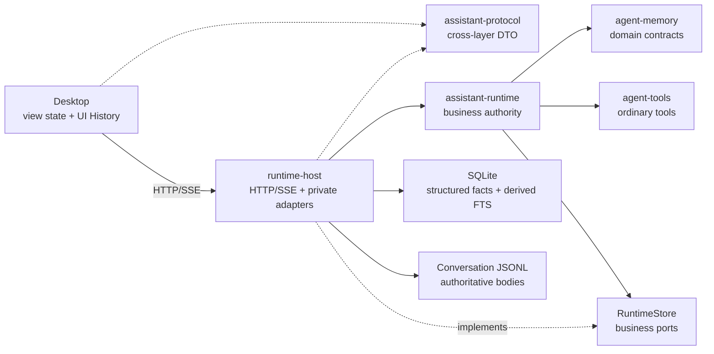

# v0.15.0 技术方案：记忆与长期助手

## 一、方案信息

- 设计基线版本：`v0.15.0`
- 状态：已确认（2026-08-17）
- 关联功能设计：[`v0.15.0 功能设计`](功能设计.md)
- 影响范围：`crates/agent-memory`、`crates/agent-tools`、`crates/assistant-runtime`、
  `crates/assistant-protocol`、`apps/runtime-host`、`apps/desktop`
- 核查依据：2026-08-17 实际源码、`v0.5.0` 记忆候选契约，以及 `v0.14.2` 已完成的正式
  Runtime、SQLite/Conversation JSONL、分页投影、权限、工具详情和 Desktop 基线

本文只把已确认的功能设计落实为领域契约、状态所有权、持久化、检索、协议、并发、安全、
恢复和验证方案。页面信息层级、交互语义和视觉仍以功能设计及桌面端设计语言为准；本文不重新
设计 UI，也不替代后续开发计划。

## 二、现状核查

### 2.1 可直接复用的正式能力

- `agent-memory` 已有实现无关的 `PinnedMemoryStore`、`MemoryRecall`、`RecallSource`、来源、
  截断和部分失败契约；`agent-tools` 已有 `list/pin/update/unpin_pinned_memory` 与
  `recall_memory` 普通工具壳。
- `assistant-runtime` 是 Session、Run、Conversation、权限、审批、子 Agent、配置和恢复的唯一
  业务权威，工具调用已经经过 Resolve、权限、审批、可靠 Tool Exchange 和 Tool Detail 链路。
- Runtime Host 已使用单一阻塞 Store Worker 串行拥有 SQLite 和每个 Conversation 的 JSONL；
  Conversation 按需加载，启动不会把全部历史正文装入内存。
- 主会话和子 Agent 已有正式分页投影、稳定 `MessageId`、Conversation owner、generation、
  around-run 定位及归档只读语义。
- SQLite 使用 `rusqlite` bundled 构建，具备 FTS5 编译能力；无需引入第二个数据库或独立搜索进程。
- Desktop 已采用 React、MobX、Sass、TypeScript 和 Vite，现有 `NavigationStore` 已持有当前
  Session、子 Agent、消息锚点和纯 UI 侧栏状态，可在此基础上增加内存 History 栈。
- `SystemPromptSnapshot` 已按顺序保存最终 `Vec<String>`，不保存来源配置，符合功能设计对
  “只展示冻结原文”的约束。

### 2.2 必须补齐的缺口

| 领域 | 当前状态 | 本版本处理 |
| --- | --- | --- |
| Pinned Memory | 只有候选 trait 和 Demo 私有 Store | 正式 Runtime 业务端口、Host SQLite Adapter、协议与 Desktop 管理 |
| Persona | 无正式领域或持久化 | 单份全局 Persona、修订、启停和未来 Session 装配 |
| System Context | Host Factory 只生成基线与目录 Part | 创建前读取 Persona/Pinned 与 Workspace 根 `AGENTS.md`，Factory 确定性渲染并冻结 |
| Workspace 绑定 | 空 Session 可通过完整协议链路更换 Workspace | Session 创建后绑定不可变，移除重绑定命令与 UI 入口 |
| Conversation Recall | 候选 Source 只有一次检索，无 scope 与续读 | 正式 Conversation Source、三档 scope、签名引用和有限续读 |
| 历史搜索 | 会话列表只按标题过滤 | Runtime 正文检索命令、来源会话定位和 UI History |
| 搜索索引 | 只有分页用的 generation 字节偏移缓存 | SQLite FTS5 派生索引、懒重建、脏状态与降级诊断 |
| Context 查看 | UI 只有摘要 | 读取已持久化的完整 `SystemPromptSnapshot` 并逐 Part 展示 |

### 2.3 不采用的实现

1. 不复用 `tools/memory-demo` 的 JSON Store、Session、Journal、CLI 或 HTTP DTO；Demo 仍是历史
   验证包，可按既定计划删除。
2. 不把 Pinned Memory、Persona、索引或导航栈复制成 Desktop 权威状态。
3. 不把索引提升为 Conversation 权威存储，不在 Runtime 启动时扫描全部 JSONL。
4. 不引入 Embedding、向量数据库、后台自动学习或自动扩大 Recall scope。
5. 不把 UI 搜索、UI 弹窗展开或 UI History 伪装成 `recall_memory` 工具调用。
6. 不为续读创建历史正文副本，也不建立需要清理的“检索结果快照文件”。
7. 不兼容全局 `AGENTS.md`、`CLAUDE.md`、`.hermes.md` 或远程规则，不在工具访问子目录时动态
   追加嵌套规则。
8. 不保留仅隐藏 UI 的 Session Workspace 重绑定后门；协议、Runtime、Store 与 Desktop 调用链
   一并移除。

## 三、总体技术决策

### 3.1 状态所有权



- Persona、Pinned Memory、Recall scope 校验和 Session System Context 由 Runtime 持有业务语义。
- Host 只实现 SQLite、JSONL、签名引用和检索 Adapter，不持有第二份 Session/Memory 控制器。
- `agent-memory` 只承载实现无关领域和能力契约，不依赖 Session ID、Workspace ID、SQLite 或协议。
- Desktop 只缓存投影和纯界面状态；所有保存成功、冲突、容量和检索结果以 Runtime 返回为准。

### 3.2 权威与派生数据

```text
业务正文提交成功
  ├─ Conversation JSONL / 结构化关系事实：权威
  └─ Recall FTS：可重建派生数据
```

权威提交不能依赖索引成功。索引更新失败时，原业务提交仍成功，Store 把对应 owner/generation 标为
`dirty` 并发布稳定诊断；后续检索返回“部分可用”或“索引不可用”，再按有界批次重建。这样不会因
搜索加速数据故障导致模型输出重复提交、Tool Exchange 重试或 Conversation 损坏。

## 四、领域与 Runtime 端口

### 4.1 Pinned Memory

既有 `PinnedMemoryEntry` 继续保留 `id/category/content/attributes`，以维持领域存储和业务接口
兼容；其中 `attributes` 是 Runtime 业务元数据，不属于模型可见记忆内容。正式应用需要的时间、
来源和并发修订由 Runtime 投影包装，不污染可复用领域类型：

```rust
pub struct StoredPinnedMemory {
    pub entry: PinnedMemoryEntry,
    pub created_by: PinnedMemoryCreatedBy,
    pub created_at_ms: i64,
    pub updated_at_ms: i64,
    pub revision: u64,
}

pub enum PinnedMemoryCreatedBy {
    User,
    AgentTool { session_id: SessionId },
}

pub struct PinnedMemoryMutation {
    pub expected_revision: Option<u64>,
    // create/update/delete intent
}
```

- Desktop 编辑和删除必须携带 `expected_revision`，使用 CAS 防止覆盖其他窗口、Agent 工具或重连后的
  更新。
- `created_by` 是创建时写入的不可变来源，只用于产品投影显示“用户添加”或“Agent 添加”；后续编辑
  不改写来源，也不把完整 Tool Call 或会话正文复制进 Pinned Memory。
- Agent 工具按稳定 entry ID 执行原子 Store 操作；失败只形成错误 Tool Result，不更新 UI 权威状态。
- Agent 工具使用只含 `id/category/content` 的模型投影：新增时创建空 `attributes`，更新分类或正文时
  保留既有 `attributes`，所有工具结果均不回传该业务元数据。Pinned Memory 快照渲染同样忽略
  `attributes`，防止把正文的重复结构化表示注入 System Context。
- 容量按“条目数、单条 UTF-8 字节数、总 UTF-8 字节数”在 Runtime 统一校验；Host 数据库约束只做
  最后防线，不产生另一套不同口径。
- 列表排序固定为 `updated_at_ms DESC, id ASC`；搜索只在 Pinned 数据量内做有界、大小写不敏感的
  本地过滤，不为少量条目建立第二套 FTS。

### 4.2 Persona

```rust
pub struct PersonaSnapshot {
    pub enabled: bool,
    pub content: String,
    pub revision: u64,
    pub updated_at_ms: i64,
}
```

- 全局只有一条 Persona；空内容允许保存，但启用空内容不生成 Persona Part。
- 保存采用 CAS；冲突返回当前快照，Desktop 保留未提交草稿并让用户重新确认。
- Persona 不是 Agent 工具，不进入 ToolSet、权限文件或 Conversation；仅 Desktop 管理命令和 Session
  创建流程可以访问。
- Runtime 校验字符、控制字符和最大 UTF-8 字节数；内容作为不可信用户文本进行边界化渲染，不能
  覆盖内置安全提示、工具能力上限或权限规则。

### 4.3 RuntimeStore 扩展

`RuntimeStore` 继续提供业务操作，不暴露 SQL、通用 Repository 或任意查询：

```rust
trait RuntimeStore {
    fn load_memory_context(&self) -> StoreFuture<MemoryContextSnapshot>;
    fn list_pinned_memories(&self, request: PinnedListRequest)
        -> StoreFuture<PinnedListPage>;
    fn mutate_pinned_memory(&self, mutation: PinnedMemoryMutation)
        -> StoreFuture<StoredPinnedMemory>;
    fn get_persona(&self) -> StoreFuture<PersonaSnapshot>;
    fn set_persona(&self, mutation: PersonaMutation)
        -> StoreFuture<PersonaSnapshot>;
    fn search_conversations(&self, request: ConversationSearchRequest)
        -> StoreFuture<ConversationSearchPage>;
    fn read_recall_context(&self, request: RecallContextRequest)
        -> StoreFuture<RecallContextWindow>;
    fn locate_conversation_message(&self, request: MessageLocationRequest)
        -> StoreFuture<StoredConversationWindow>;
}
```

实际命名可在实现时按现有 Store 文件拆分，但必须保持业务意图边界；不得增加 `execute_sql`、
`query_table` 或向 Runtime 泄漏文件路径的接口。

### 4.4 Recall 契约演进

`agent-memory` 将多来源检索与稳定引用续读拆成两个能力边界：

```rust
pub enum RecallScope {
    Session,
    Workspace,
    Global,
}

pub struct MemoryRecallRequest {
    pub query: String,
    pub scope: RecallScope,
    pub limit: NonZeroUsize,
    pub sources: Option<Vec<RecallSourceId>>,
}

pub struct RecallReferenceReadRequest {
    pub reference: String,
    pub direction: RecallReadDirection,
    pub limit: NonZeroUsize,
}

pub trait RecallReferenceReader: Send + Sync {
    fn read_reference(
        &self,
        request: RecallReferenceReadRequest,
        cancellation: CancellationToken,
    ) -> RecallReferenceReadFuture<'_, MemoryRecallResponse>;
}
```

- `RecallScope` 只表达信息边界，不包含 Runtime 的具体 Session/Workspace ID；调用者身份由 Runtime
  装配 Source 时绑定，避免 Agent 伪造 ID。
- `RecallSource` 与 `MemoryRecall` 只承诺搜索；`CoordinatedMemoryRecall` 继续负责多 Source 并发、
  确定合并、截断和部分失败，不感知有序上下文续读。
- 只有能够提供稳定顺序、引用校验和有限正文窗口的数据源才实现 `RecallReferenceReader`。正式
  Conversation Recall 同时实现搜索和续读；普通 Recall Source 不需要伪造“不支持”分支。
- `recall_memory` 工具 schema 使用带 `action = search | read` 的判别联合，避免把互斥字段混在同一
  平面输入；工具内部把 search 路由到 `MemoryRecall`，把 read 路由到可选的
  `RecallReferenceReader`。所有 limit 均显式必填并受冻结 Tool Definition 上限约束。
- 未装配 `RecallReferenceReader` 时由工具层返回稳定的 `recall_read_unsupported`；该错误表示当前
  工具装配缺少可选能力，不进入通用 Memory Recall 领域错误，也不污染普通 Source 契约。
- 工具仍通过 `ToolResolution::general` 进入现有普通权限体系。审批详情展示 action、query、scope 或
  reference 摘要；本版本不新增一套“记忆审批”。未命中规则时保持既有语义：Ask 模式进入审批，
  Auto 模式放行；任意显式 Deny/Ask 仍优先。

### 4.5 正式工具装配

不能让记忆工具直接持有 Host SQLite Adapter，否则 Agent 工具变更会绕过 Runtime 的来源归属、事件
发布和统一错误语义。`assistant-runtime` 增加 `RuntimeMemoryFacade`：

- 对 Desktop 暴露 Persona/Pinned 产品命令；
- 为每个 Run 创建绑定 caller Session 的 `PinnedMemoryStore`、`MemoryRecall` 与
  `RecallReferenceReader` façade；
- façade 调用 `RuntimeStore` 业务端口，成功后发布 revision 事件，失败时映射稳定领域错误；
- Agent 创建 Pinned Memory 时由 façade 写入 `AgentTool { session_id }` 来源，Desktop 创建时写入
  `User` 来源。

现有 `RunToolFactory::compile(environment)` 演进为接收 `RunToolFactoryRequest`，至少包含
`session_id`、冻结的 `environment` 和本 Run 的记忆能力 façade。Host Factory 仍只负责把文件、Shell
和记忆工具编译为不可变 `RunToolBundle`，不读取记忆数据库、不计算 scope。这样 Recall caller 绑定
来自 Runtime 已知 Session，而不是从私有目录路径或模型输入反推。

## 五、System Context 冻结

### 5.1 创建流程

```text
读取同一份 MemoryContextSnapshot（Persona + Pinned）
→ 有 Workspace 时有界读取根目录 AGENTS.md
→ 构造 Session 目录环境
→ 按固定顺序渲染最终 SystemPromptSnapshot
→ Session 与最终快照一次持久化
→ 注册权限作用域
```

固定 Part 顺序：应用内置 Agent 基线；Persona（启用且非空时）；Pinned Memory（存在条目时）；
Workspace `AGENTS.md`（绑定且存在时）；Runtime 目录与运行环境；后续正式设计明确加入的其他
System Part。

Persona 和 Pinned 在同一次 Store 读取中形成一致快照。渲染器对 XML/结构边界转义用户内容，按稳定
ID 排序 Pinned 条目，并在超过 System Context 配额时整体拒绝创建 Session；不能静默截断或只装配
一部分长期记忆。`AGENTS.md` 同时受 64 KiB 单文件上限和 System Context 总配额约束；文件存在但
超限、不是 UTF-8、不可读或规范化后逃逸 Workspace 时返回稳定错误并保持 Session 未创建。文件不
存在是正常状态，不生成空 Part。

### 5.2 Factory 边界调整

现有 `SessionEnvironmentFactory` 是同步 Host Factory，不能自行访问单一异步 Store Worker。Runtime
先异步读取 `MemoryContextSnapshot`，再将冻结输入和 Workspace 传给 Host Factory。其请求
至少包含：

```rust
pub struct SessionEnvironmentFactoryRequest<'a> {
    pub session_id: &'a SessionId,
    pub workspace: Option<WorkspaceEnvironmentSource<'a>>,
    pub memory_context: &'a MemoryContextSnapshot,
}
```

Factory 只负责单次 Session 创建所需的确定性路径生成、项目规则读取、转义、Part 排序和最终
快照构造；不读取 Memory 数据库、不持有最新 Persona/Pinned 缓存，也不在 Session 创建后
观察规则文件。Host 内部的 Workspace 指令读取步骤只检查 `<workspace>/AGENTS.md`：规范化
Workspace 与候选文件，允许目标仍位于 Workspace 内的符号链接，拒绝逃逸目标；先检查元数据
和字节上限，再一次读取并严格解码 UTF-8。正文使用稳定边界包装为真实 Prompt Part，
后续 System Context 原文弹窗展示的仍是模型实际看到的内容。

### 5.3 Fork、子 Agent 与不可变 Workspace

Workspace、项目规则与权限作用域在 Session 创建时形成不可分割的冻结基线：

- 普通新建 Session 读取最新 Persona/Pinned；
- 普通新建且绑定 Workspace 的 Session 同时读取当时的根 `AGENTS.md`；
- Fork 继承来源 Session 的 Workspace、冻结 `AGENTS.md` 和全部非目录 Part，保持可缓存前缀
  稳定，只替换为新 Session 生成的私有目录与附件目录 Part；
- 子 Agent 直接继承父 Session 已冻结的项目规则，并追加既有子任务专属运行目录 Part；
- 恢复、继续和压缩直接复用已保存快照。

移除 `set_empty_session_workspace` 的协议 command/result、Runtime 方法、Store 端口与实现、Host 路由、
Desktop Controller 方法及会话 Header/右侧 Workspace 区块中的“重新选择”入口。Session 创建后没有
重绑定 Workspace 的合法状态迁移；需要其他目录时创建新 Session。Fork 内部仅允许继承原 Workspace，
使用专用的 fork 环境构造更新新 Session 自有目录，不提供通用 `rebind_environment`。

### 5.4 System Context 查看

协议只返回 `session_id`、按冻结顺序排列的 `parts`、Session 创建时间。Desktop 详情弹窗逐 Part
原样展示并允许复制，不拼接、不重新 Markdown 渲染、不标注推断来源。Runtime 只读取 Session 已保存
快照，不访问全局最新 Persona/Pinned。

## 六、正式持久化

### 6.1 SQLite 结构化事实

Host 私有 schema 增加：

```text
persona
  singleton_key PRIMARY KEY CHECK(singleton_key = 1)
  enabled, content, revision, updated_at_ms

memory_state
  singleton_key PRIMARY KEY CHECK(singleton_key = 1)
  pinned_collection_revision

pinned_memories
  id PRIMARY KEY
  category, content, attributes_json
  created_by_kind, created_by_session_id NULL
  revision, created_at_ms, updated_at_ms
```

- Persona 更新和 Pinned 单条变更均在单个 SQLite 事务中完成 CAS、容量复核和写入；每次 Pinned
  变更同时递增 `pinned_collection_revision`，因此新增和删除也有可供 SSE/重连查询的集合修订。
- `attributes_json` 保存 Runtime 业务元数据并使用严格、版本稳定的领域序列化；它不进入 Agent 工具
  投影或 System Context。读取失败标记 Memory 子系统不可用，不跳过坏行后声称完整成功。
- 删除 Pinned 为物理删除，因为条目不是审计日志；历史 Session 已冻结的文本不受影响。
- Runtime 事件只广播 Memory/Persona revision changed，不携带完整敏感正文；Desktop 重新查询投影。

### 6.2 迁移

- schema migration 与现有 Host 数据库迁移一起事务执行；失败阻止 Runtime 进入可写状态。
- 初始 Persona 为 disabled/empty，Pinned 列表为空；既有 Session 不回填、不重建 System Context。
- migration 只创建权威表和索引元数据，不在启动阶段扫描 JSONL 构建全文索引。
- 迁移测试覆盖空库、已有 v0.14.2 数据库、重复启动和中途失败回滚。

## 七、Conversation Recall 索引

### 7.1 索引模型

Conversation JSONL 继续保存主/子 Conversation 正文。SQLite 增加可重建派生表：

```text
conversation_recall_documents
  document_rowid INTEGER PRIMARY KEY
  document_id UNIQUE
  session_id, child_task_id NULL, body_generation
  message_id, message_kind, message_ordinal, created_at_ms
  normalized_text, content_hash

conversation_recall_fts
  FTS5 external-content index over normalized_text

conversation_recall_heads
  owner key + body_generation
  indexed_message_count
  state              -- ready | dirty | rebuilding | unavailable
  updated_at_ms
```

这些表都是派生数据，可以删除重建；它们不替代 Conversation JSONL，也不进入公共协议。

### 7.2 收录规则

- User：消息可靠提交后收录模型可见文本；附件只收录消息中已有的可读文件名，不读取文件正文。
- Assistant：只在完整消息可靠结算后收录最终可见 `Text` Part。
- 不收录 Reasoning、Tool Call/Result、审批、运行状态、System Context、Provider State、未完成 Delta
  或错误详情。
- 主会话和子 Agent 使用相同编码与过滤函数，避免两套正文口径。
- generation 改变后，查询先按当前 owner generation 过滤；旧 generation 派生行即使尚未清理也
  不可见，随后再有界重建。

### 7.3 中文与普通文本检索

使用 SQLite FTS5 `trigram` tokenizer 支持中文连续文本、路径片段、错误码和英文子串，不引入分词
服务。Host migration 在测试与启动校验中实际创建探针虚表确认当前 bundled SQLite 支持该 tokenizer；
若能力缺失，Recall index 标记 `unavailable`，不得静默退化成启动时全量 `%LIKE%` 扫描。

`trigram` 无法可靠处理少于三个 Unicode 字符的全文查询，因此 Conversation 正文搜索与 Agent Recall
在规范化后少于三个字符时返回 `recall_query_too_short`；Desktop 在输入区直接提示“至少输入 3 个
字符”。标题过滤继续使用既有有界 Session 元数据查询，不受该限制。

查询过程：校验并规范化查询；使用绑定参数；按 caller scope、当前 generation、生命周期和可访问性
过滤；以 FTS rank 排序，再用时间、Session/child ID 和 message ordinal 确定性打破同分；最后从权威
Conversation 窗口复核 message ID 与文本并生成有界 snippet。协议不承诺 SQLite rank 数值。

Desktop 普通搜索分成两类结构化结果：标题分支查询既有 Session 元数据，正文分支查询 Recall FTS，
二者以 `match_kind = title | message` 返回并由界面分组，不把标题伪装成 Conversation 消息。Agent
`recall_memory` 只使用正文分支。搜索 cursor 为不透明值，绑定规范化 query、结果类型、生命周期过滤、
scope 和最后一项排序键；请求条件变化后旧 cursor 返回失效错误，不能跨查询复用。

### 7.4 增量更新与重建

- Store 在权威 Conversation 提交成功后尝试更新索引；使用同一 Store Worker，不增加竞争写连接。
- 索引失败只把 owner 标为 dirty 并记录脱敏诊断，不回滚 Conversation。
- 首次搜索、dirty owner 搜索或显式诊断修复触发有界重建；每批读取有限 JSONL 窗口并重新排队，
  避免长时间独占存储线程。
- 搜索可返回 ready owner 的结果，并用 `partial` 和 failures 表达尚不可用范围；全部不可用时返回
  `recall_index_unavailable`。
- 删除 Session、generation 替换和数据清理同时失效派生行；即使清理失败，当前 generation 与
  Session 存在性过滤也保证旧内容不泄漏。

## 八、scope、引用与续读

### 8.1 scope 解析

Runtime 在每次 Run 装配 Conversation Recall Source 时绑定 caller Session：

| scope | 过滤规则 |
| --- | --- |
| `session` | 当前 Session 的主 Conversation 与全部子 Agent Conversation |
| `workspace` | 与当前 Session 同一 Workspace 的所有活动/归档 Session 及其子 Agent |
| `global` | 当前 Runtime Home 中仍可访问的全部活动/归档 Session 及其子 Agent |

- 默认值在工具输入中显式编译为 `session`，不能只藏在执行器里。
- 独立 Session 请求 `workspace` 返回 `recall_scope_unavailable`，不扩大为 global。
- 来源永久删除、损坏或不可访问时不返回；归档来源可检索，但 UI 打开后保持只读。
- `global` 仍受普通工具权限和当前本地用户边界约束，不代表其他 Runtime Home 或系统用户。

### 8.2 稳定引用

检索结果向 Agent 返回不透明、版本化、带完整性保护的 reference。载荷只含：version、source ID、
caller Session、originating scope、source Session、可选 child ID、generation、message ID 和 ordinal。

Host 在 Runtime Home 私有目录维护当前用户可读的随机签名密钥，使用 HMAC-SHA256 对载荷签名并进行
base64url 编码。reference 不含正文、文件路径、凭据或 SQL rowid，因此不复制正文、不管理结果副本
生命周期，重启后仍可验证。

签名密钥首次使用时以密码学安全随机数生成，经“临时文件写入、同步、原子改名”落盘；Unix 权限固定
为仅当前用户可读写，并拒绝符号链接、目录和权限异常的既有目标。密钥不可进入配置投影、日志、协议
或诊断复制内容；无法安全读取时 Recall 续读能力标记不可用，不临时换钥后伪装成旧引用仍有效。

续读时 Runtime 重新验证签名、caller、首次 scope、来源存在性/生命周期、当前访问范围、generation
和 message ID。模型篡改 reference、换 Session 使用、来源删除或权限变化均返回稳定错误；generation
改变后若当前权威正文仍能按 message ID 定位则更新位置，否则返回 `recall_reference_stale`。

### 8.3 有限续读

- `around` 返回命中前后有限消息；`before`、`after` 从引用边界单向读取。
- 只返回与索引相同口径的可检索正文。
- 响应提供 `has_more_before/has_more_after`；到达边界不是错误。
- 相邻续读允许保留一条重叠消息帮助衔接，并返回新的首尾 reference。
- 单次消息数、单条字符数和总 UTF-8 字节数受冻结 Tool Definition 配额；超限按完整消息边界截断。

## 九、应用协议

### 9.1 Memory 与 Persona

`assistant-protocol` 增加 `Get/SetPersona`、Pinned list/create/update/delete、Memory capacity 及 revision
changed 事件。Mutation 请求携带 request ID 和 expected revision，Runtime 保持幂等与 CAS。协议只
表达产品事实，不暴露 SQLite schema、FTS rank、签名密钥或 Runtime Home 文件名。

### 9.2 Recall、搜索与定位

- `SearchConversationHistory`：供 Desktop 普通搜索，返回来源 Session、可选 child、消息 ID、时间、
  snippet 和生命周期。
- `GetConversationRecallWindow`：供 Recall Tool Detail 在弹窗内展开命中附近的有限、过滤后正文；
  每次调用重新校验来源可访问性，但不创建 Tool Call 或向 Agent 上下文追加内容。
- `GetConversationPageAroundMessage`：根据 owner + message ID 返回标准 ConversationPage 与 anchor；
  用于“在原会话中查看”，不要求目标已在当前 DOM，并与弹窗内的过滤窗口保持不同用途。
- 既有 Tool Detail 增加结构化 Recall payload，表达实际 query/scope、候选、partial/truncated/failures
  和 UI 可展开窗口。
- `GetSystemContext`：只返回冻结 parts 和 Session 创建时间。

普通 UI 搜索使用结构化来源位置，不使用给模型的签名 reference；两条契约共享 Runtime 检索能力，
但不共享前端临时状态。UI 展开 Recall 上下文调用只读产品命令，不追加 Tool Result 或改变 Run。

### 9.3 兼容与能力协商

- 协议沿用当前开发中的单一版本，不增加“Protocol v2”命名。
- 新类型通过现有 Rust→TypeScript 生成与漂移检查同步；能力投影增加 memory management、conversation
  recall、system context view，旧 Host 下隐藏对应入口。
- 未知命令、缺少能力或 schema 漂移返回现有稳定协议错误，不由 Desktop 猜测兼容。

## 十、Desktop 状态与交互实现

### 10.1 Store 分工

- `MemoryStore`：Persona、Pinned、容量、查询和 CAS mutation 状态。
- `ConversationSearchStore`：普通搜索 query、scope、分页结果和选择状态。
- `NavigationStore`：当前 location、UI History、前进/后退和滚动恢复。
- 详情弹窗状态就近放在 feature store/component，不把展开内容写入会话投影。

组件只消费 Store 投影和触发意图，不在组件内直连 Runtime Client 或通过 `useEffect` 维护第二份业务
状态。测试统一放在 `apps/desktop/tests/` 对应目录。

### 10.2 轻量 UI History

```ts
interface ConversationLocation {
  session_id: SessionId;
  child_task_id: ChildTaskId | null;
  anchor_message_id: MessageId | null;
  scroll_offset: number | null;
}
```

- 普通选择 Session、进入子 Agent、从搜索/Recall 跳转均 push；同一 location 重复跳转不 push。
- Back/Forward 只移动 index；后退后发生新导航时截断 forward 分支，行为与浏览器一致。
- 离开前记录消息滚动容器 offset；恢复时先加载 around-message 页面并定位 anchor，再恢复 offset，
  不能一次加载完整 Conversation。
- 目标删除或不可访问时展示失效页但保留栈，用户仍可继续后退。
- History 只在 Desktop 进程内存中存在，不持久化、不进协议、不影响 Session 权威状态。

### 10.3 搜索与详情

- 左侧搜索入口支持标题与正文；结果按 Session/子 Agent 展示来源、snippet 和时间。
- Recall Tool 行保持现有简洁文本样式；详情复用通用 Dialog、List、Empty 和 Error 组件。
- 通用 Tool Detail 将请求参数和执行结果格式化为可换行、可滚动的 JSON 代码块；Recall 使用结构化
  结果列表，不向用户直接暴露签名 reference 或整段内部 JSON。
- Recall 详情中的“打开来源会话”只消费 Runtime 返回并再次校验的导航目标，然后复用
  `NavigationStore` 压入 UI History；Desktop 不解析、伪造或缓存签名 reference 的权限语义。
- System Context 弹窗逐 Part 显示可换行原文，Part 间只做视觉分隔，不增加来源标题。
- 索引部分失败、引用失效和 CAS 冲突使用持久 inline/detail 状态，不使用瞬时 Toast 作为唯一诊断。

## 十一、权限与安全

### 11.1 普通工具授权

- 五个记忆工具继续使用 Session→Workspace→Global 权限文档和 Ask/Auto 语义。
- `list_pinned_memories`、`recall_memory` 是读操作；三个 Pinned mutation 是持久全局变更，审批须明确
  展示影响“未来新建 Session”，不能误写为修改当前上下文。
- 新安装生成的默认权限文件可为读工具显式 Allow、为写工具显式 Ask；既有用户权限文件不被 migration
  静默改写，未命中规则继续遵循当前 Ask/Auto fallback。
- Plan/Build、显式 Deny/Ask 和基础设施策略继续先于 fallback；Recall 不能绕过授权读取历史。

### 11.2 数据最小化与防越权

- snippet、Tool Result 和协议错误限制字符/字节数；诊断不记录完整正文、Persona、Pinned 或 reference。
- SQL 全部使用绑定参数；FTS query 经专用编译器转义，不接受原始 SQL/FTS 运算符注入。
- API key、Bearer token、签名密钥、权限文件和 Runtime 私有配置不得编译进 System Prompt。
- scope 只是一条模型意图，最终集合由 Runtime 根据 caller Session 计算；签名 reference 绑定 caller 与
  初始 scope，续读不能把 `session` 引用改成 `global`。
- Desktop WebView 不获得通用文件、数据库、HTTP 或签名能力，继续只调用窄 Runtime/Tauri 命令。

## 十二、并发、错误与恢复

### 12.1 并发

- Persona/Pinned mutation 通过 Store Worker 串行并使用 revision CAS；多个 Agent 工具可以并发发起，
  但按数据库实际提交顺序结算。
- Session 创建先读一致 MemoryContextSnapshot；创建期间后续 Memory 修改只影响更晚的新 Session。
- 搜索和重建通过 Store Worker 有界调度，不持有 Session mutation gate；单批 I/O 设置明确上限。
- UI History 与搜索结果为纯 Desktop 状态，不参与 Runtime 锁顺序。

### 12.2 稳定错误

| 错误 | 含义 |
| --- | --- |
| `memory_unavailable` | Persona/Pinned 权威 Store 不可读或数据损坏 |
| `memory_capacity_exceeded` | 条目数、单条或总字节超过上限 |
| `memory_revision_conflict` | CAS 冲突，响应携带最新投影 |
| `recall_query_too_short` | 规范化后的正文检索词少于 3 个 Unicode 字符 |
| `recall_scope_unavailable` | 独立 Session 请求 Workspace 等无法成立的范围 |
| `recall_index_unavailable` | 当前请求所需索引全部不可用 |
| `recall_partial` | 部分 owner 未索引或读取失败，已有结果仍可用 |
| `recall_reference_invalid` | reference 格式、签名或 caller 绑定不合法 |
| `recall_reference_stale` | 来源 generation/message 已不可定位 |
| `recall_source_unavailable` | 来源删除、损坏或当前不可访问 |
| `recall_read_unsupported` | 当前工具装配未提供稳定引用续读能力 |

Tool 路径映射为稳定错误 Tool Result；产品命令映射为稳定协议错误和脱敏说明。原始 SQLite、路径或
签名错误只进入受控诊断。

### 12.3 重启恢复

- Persona/Pinned 从 SQLite 恢复，不依赖 Desktop 缓存。
- 既有 Session 读取已保存 System Prompt，不访问最新 Persona/Pinned 重建。
- Recall heads 的 `rebuilding` 在异常退出后恢复为 `dirty`；首次需要时有界重建。
- reference 使用持久签名密钥，正常重启后仍可验证；Runtime Home 重建或来源删除后明确失效。
- SSE 丢失时 Desktop 通过现有快照重新查询 Memory revision、当前 Session 和 Tool Detail。

## 十三、迁移与兼容

1. 既有 Session、Fork、归档、压缩和子 Agent Conversation 无正文迁移；冻结 Prompt 原样保留。
2. 新 Session 才装配 Persona/Pinned；不得为了“补齐来源”重写旧 Session。
3. Recall 索引从权威正文懒构建，删除索引表后仍可恢复，不影响会话分页。
4. 移除空 Session 换 Workspace 的完整产品链路；Fork 固定继承原 Workspace、规则快照和长期上下文，
   只更新新 Session 自有目录，不静默注入最新 Memory 或重新读取 `AGENTS.md`。
5. Memory Demo 私有 JSON 不导入正式 Store；未来需要导入时另行设计显式导入与校验。
6. Windows 本版本仍只保留平台中立协议和私有 Host Adapter 边界，不进行严肃开发与验收。

## 十四、验证策略

### 14.1 单元与契约测试

- `agent-memory`：scope 检索请求、多 Source 协调、部分失败和截断，以及独立续读能力契约。
- `agent-tools`：冻结的 search/read 判别 schema、能力分派、limit、空 query、reference、未装配续读
  能力和稳定错误 Tool Result。
- Prompt renderer：Persona/Pinned 转义、稳定排序、容量、Workspace 根 `AGENTS.md` 有界读取与冻结、
  Fork 只更新新 Session 自有目录。
- Permission：五个工具在 Ask/Auto、显式 Allow/Ask/Deny、Plan/Build 下的既有优先级。
- Reference codec：签名、篡改、换 caller、scope 继承、重启密钥和 stale generation。

### 14.2 Store 与集成测试

- SQLite migration、Persona/Pinned CAS、容量事务、重启恢复和损坏数据拒绝。
- 主/子 Conversation 收录过滤、generation 切换、归档、删除和确定性排序。
- FTS5 trigram 中文、英文、路径和错误码样例；绑定参数与特殊字符。
- 索引写失败不回滚 Conversation、dirty 标记、分批重建、部分结果和异常退出恢复。
- 三档 scope 实际边界、独立 Session workspace 错误和 reference 续读不可扩权。
- 新建、恢复、继续、压缩、Fork、子 Agent 的 System Context 稳定性，以及 Session Workspace
  重绑定命令不存在。

### 14.3 Protocol 与 Desktop

- Rust→TypeScript 生成与漂移检查覆盖所有新 DTO/command/result/event。
- MobX Store 覆盖 CAS 冲突、重连、分页搜索、History push/back/forward 和失效目标。
- 真实浏览器验证中文搜索、Recall 详情展开、来源跳转、子 Agent 定位、归档只读和滚动恢复。
- 视觉回归确认 Dialog、列表、错误、空状态和 System Context 原文符合现有简洁设计语言。

### 14.4 最终门禁

```bash
cargo fmt --all --check
cargo clippy --workspace --all-targets --all-features -- -D warnings
cargo test --workspace

cd apps/desktop
npm run test
npm run build
npm run tauri -- build --no-bundle
```

真实 Provider 只用于最小 Recall 工具往返验收；检索、续读、权限、索引和恢复主要由确定性本地场景
覆盖，不依赖模型偶然输出。

## 十五、实现切分原则

后续开发计划可按持久化与 Prompt、Recall Source 与索引、协议与工具、Desktop 管理与导航、综合回归
切分里程碑，但不另拆功能设计或技术方案。具体里程碑与版本号由开发计划确定。

本方案确认后才进入开发计划，不因技术方案完成自动授权代码实现。
