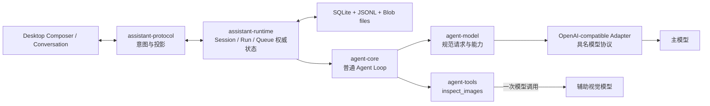

# v0.16.0 技术方案：图片理解、推理协议与可信 macOS 分发

## 一、方案信息

- 版本：`v0.16.0`
- 状态：已确认（2026-08-18）
- 关联设计：[`v0.16.0 功能设计`](功能设计.md)
- 专题附件：
  - [`附件 A：多模态消息、识图工具与模型协议`](技术方案附件A-多模态与模型协议.md)
  - [`附件 B：会话 effort、协议与桌面交互`](技术方案附件B-会话effort与桌面交互.md)
  - [`附件 C：中断后队列暂停状态机修复`](技术方案附件C-队列状态机修复.md)
  - [`附件 D：macOS Developer ID 签名与公证`](技术方案附件D-macOS签名与公证.md)
- 影响范围：`crates/agent-types`、`crates/agent-model`、
  `crates/agent-openai-compatible`（由 `agent-provider-openai-compatible` 重命名）、
  `crates/agent-tools`、
  `crates/assistant-runtime`、`crates/assistant-protocol`、`apps/runtime-host`、
  `apps/desktop`
- 核查基线：2026-08-18 仓库源码、现有 SQLite/JSONL 持久化、Runtime Host 附件链路、
  OpenAI/GLM/Qwen/Kimi/DeepSeek 官方 API 文档、Tauri 2 与 Apple 官方签名公证文档

本文定义跨专题共同成立的工程决策、依赖方向、实施边界和整体验收策略。字段级契约、状态机、
模型协议适配和平台发布步骤分别进入附件，主文档通过稳定链接关联，不复制容易漂移的明细。
本文及附件均不等同于开发计划或代码实现授权；技术方案确认后才编写开发计划。

## 二、现状结论

### 2.1 可直接复用的基线

- `assistant-runtime` 已经持有 Session、Run、输入队列、附件、配置和持久化的权威状态；新增图片、
  effort 和队列语义继续由 Runtime 编排，Desktop 不复制业务状态机。
- 附件已经具备流式上传、稳定 Attachment 引用、Blob 文件存储、会话关联和原生预览桥；图片接入
  扩充同一条链路，不创建另一套“图片上传”系统。
- `agent-types` 已有有序 `FileReferencesPart`，图片可以继续使用现有最小文件引用；`agent-model`
  已有 Provider-neutral 请求和能力契约；OpenAI-compatible Adapter 已集中承担 wire 编解码。
- Tool Registry、Dispatcher、取消、超时、有限重试、审计和工具卡片链路已经存在；辅助识图应作为
  普通工具接入，而不是在 Agent Core 内增加视觉模型特例。
- `assistant-protocol` 的 Rust DTO 是 Desktop TypeScript 类型的单一来源，新增会话配置、附件实际 MIME
  和工具详情仍通过生成类型投影；图片像素尺寸不进入附件 DTO。
- Tauri release 已能打出 macOS arm64 `.app` 与 `.dmg`，Runtime Host 已作为 external binary
  随包；当前缺口是正式 Developer ID、Hardened Runtime、公证、stapling 与可重复验证。

### 2.2 必须重构的边界

1. 当前没有位于 Host 边界的公共图片预处理能力，原生多模态和辅助识图都无法从统一文件引用安全
   取得符合共同限制的图片字节。
2. Provider Adapter 当前不能取得受控图片字节；按照模块约束，它也不能自行读取文件系统、解码、
   缩放或转码。
3. 当前 `Profile` 把 Provider 路由、wire 字段、模型能力和 reasoning 历史策略混在一个扁平结构里，
   无法安全表达 GLM、Qwen、Kimi、DeepSeek 的差异。
4. `ReasoningEffort` 只有三档，Session 没有持久化 effort，也没有 Run 启动时冻结值的审计事实。
5. 用户暂停和 Runtime 重启恢复门禁虽然在内存中已有两个字段，但多个命令仍同时改写二者，导致
   状态语义重新耦合。
6. macOS bundle 当前仍是 ad-hoc 签名，且发布验收没有把随包 Runtime、App、DMG、公证 ticket
   和 Gatekeeper 串成一个失败即停止的门禁。

## 三、总体技术决策

### 3.1 目标拓扑

依赖方向保持现有架构约束：Desktop 只发送意图和展示 Runtime 投影；Host 只做本地传输、资源读取和
具体模型/工具装配；Runtime 持有业务事实；Core 不感知附件数据库、桌面窗口或 Provider 原生字段。

### 3.2 两条识图路径共用一份规范消息

上传完成后，Runtime 把一条用户输入保存为文本和一个保持原始顺序的统一文件引用 Part；图片和普通
文件使用相同引用。调用前由 Host 公共预处理器按实际字节识别图片并生成统一 JPEG，随后根据主模型
能力选择路径：

- 主模型支持图片输入：Adapter 把公共预处理结果编码成对应 Provider 的图片 Part。
- 主模型不支持图片但支持 Tool Call，且已配置辅助视觉模型：Runtime 为本次 Run 注册
  `inspect_images`；主模型通过普通 Tool Call 指定图片、目标和可选背景，工具只调用辅助视觉模型
  一次并返回文本，主模型在既有 Agent Loop 下一轮完成最终回答。
- 条件不满足：Runtime 明确投影“当前不可识图”，图片仍作为附件保存，但不伪装成已被模型理解。

两条路径不创建两份 Conversation，也不在切换模型时改写历史。图片正文不进入 Conversation、
SQLite、配置或普通调试事件。详细契约见[附件 A](技术方案附件A-多模态与模型协议.md)。

历史消息仍由统一文件引用承载。某条历史用户消息继续进入上下文且当前模型原生支持图片时，Host 从
原始 Blob 重新执行公共预处理，Adapter 在原消息位置重新生成图片 Part；不保存或复用上一次请求的
Data URL。文本主模型不接收图片 Part，只使用稳定路径和既有识图 Tool Call/Result。

### 3.3 路由、协议、能力和回放策略分层

现有扁平 `Profile` 重构为四个明确层次：

| 层次 | 权威内容 | 不负责 |
| --- | --- | --- |
| Model Route | `model_key`、`provider`、`protocol`、Endpoint、Model ID、credential 引用 | 协议编码或猜测图片/effort 能力 |
| Protocol Adapter | 图片 Part、thinking 字段、effort wire 值、reasoning、tool/usage 编解码 | Endpoint、credential 或 Session 用户选择 |
| Model Capabilities | 图片输入、Tool Call、reasoning、实际可用 effort 档位、上下文限制 | 原生请求 JSON |
| Reasoning Replay Policy | 不回放、仅工具调用链回放、显式保留全部 | UI 展示与翻译 |

`model_key` 是用户配置实例及 Session 引用；`provider` 只表示实际 API 服务，不再同时表示配置实例或
协议兼容层。例如通过百炼调用的第三方模型，其 `provider` 是 DashScope；具体编码由 `protocol`
选择。随包静态目录以精确 `(provider, protocol, model_id)` 映射 capabilities，用户显式 capability
override 优先；目录未收录时保留当前 `protocol` 并采用该协议的保守能力基线。尚未实现的协议直接使
配置无效，不能静默改用 OpenAI 协议。

### 3.4 Thinking 默认开启，effort 是会话配置

支持 reasoning 的模型由对应协议保证 thinking 默认开启，本版本不提供开关。产品保存五个稳定
强度 key：`low < medium < high < xhigh < max`；“默认”使用 `None` 表示 Session 没有显式选择，
协议适配仍需解析为默认开启档位，不是关闭 thinking。

静态模型目录或高级 override 的 `effort_map` 为实际可用档位提供稳定 key、显示文本和 wire value；
协议 Adapter 校验并编译该映射。Desktop 只有在可用档位
非空时显示 Composer 选择器，并原样展示当前协议文本。切换模型发生不匹配时，Runtime 按稳定 key
向下降级，找不到则回到默认；模型与 effort 在一次持久化变更中提交。

每个 Run 真正启动时冻结 effort 到 Run 记录；运行期间修改只影响后续 Run。协议、持久化和 UI
细节见[附件 B](技术方案附件B-会话effort与桌面交互.md)。

### 3.5 队列门禁使用正交状态

保留两个独立事实：

- `queue_paused_by_user`：用户通过中断或拒绝并停止表达的暂停；新提交输入可清除。
- `resume_required`：Runtime 重启发现未完成队列后建立的恢复门禁；只能显式恢复清除。

所有驱动判定统一为“任一门禁存在即不自动 claim”，但命令只能修改其语义对应的字段。
`resume_queued_input` 接受可选输入 ID：有 ID 时先置顶，无 ID 时保持顺序；两种情况都清除两个门禁并
恢复整条队列。旧 `resume_session` 在协议兼容窗口内转发后移除。详见
[附件 C](技术方案附件C-队列状态机修复.md)。

### 3.6 macOS 发布使用 Tauri 官方签名链

正式 arm64 release 由 Tauri 构建流程使用 `Developer ID Application` 身份、Hardened Runtime
和最小 entitlements 对嵌套 Runtime、App 与 DMG 完成签名，并使用 Apple `notarytool` 对产物公证、
staple。App Store Connect API Key 是推荐凭据方式，Apple ID app-specific password 作为本地
备选；凭据只来自环境或 Keychain，不进入仓库、Tauri 配置明文和日志。

不以手工 `codesign --deep` 作为签名实现；独立验证脚本只检查每层签名、ticket、DMG 完整性和
Gatekeeper。详见[附件 D](技术方案附件D-macOS签名与公证.md)。

## 四、跨模块改动总览

| 模块 | 主要改动 | 权威边界 |
| --- | --- | --- |
| `agent-types` | 保持统一 `FileReference` 的最小结构，扩充五档 effort 等规范类型 | 不增加图片尺寸、字节或 Attachment ID |
| `agent-model` | 图片能力、五档 effort、公共图片预处理契约 | 不访问本地文件系统 |
| `agent-openai-compatible` | 具名协议适配、统一 JPEG 图片编码、thinking/reasoning 编解码与回放 | 不预处理图片，不决定 Session effort |
| `agent-tools` | `inspect_images` Schema、`ImageInspector` 能力壳 | 不依赖具体 Provider |
| `assistant-runtime` | 识图模式判定、Session/Run effort、辅助视觉工具装配、队列状态机 | 业务权威状态 |
| `assistant-protocol` | 附件实际 MIME、识图模式、effort 选项/命令、工具详情、队列命令收敛 | 不增加附件图片尺寸字段，保持轻量 DTO |
| Runtime Host | 公共图片实时预处理、Blob 派生缩略图、具体模型和视觉 Inspector 装配 | 平台/基础设施适配 |
| Desktop | Composer effort、能力提示、消息图片缩略图、既有预览弹窗复用 | 只持有投影和临时 UI 状态 |

不新增顶层产品进程，不把视觉模型做成常驻 Worker，不为单个功能新增 crate；现有 crate 边界足以
容纳本版本职责。

## 五、持久化与兼容总则

### 5.1 增量 schema

SQLite 使用向后可读的加列迁移：

- `attachment_blobs` 增加可空 `media_type`，保存按实际内容检测的通用文件 MIME；
- `sessions` 增加可空 `reasoning_effort`，空值表示默认；
- `runs` 增加可空 `reasoning_effort`，记录启动时冻结值。

`media_type` 是适用于所有附件的文件事实，不是图片业务字段；新 Blob 写入，旧 Blob 保持 `NULL` 且
不批量回填。图片宽高和像素总量在 LLM 公共预处理时从原始 Blob 实时取得，不写 SQLite 或历史
Conversation；缩略图以 `<原 Blob 文件名>.thumbnail.jpg` 作为同目录派生文件保存，也不建立数据库
记录。历史缩略图按请求懒生成。

即使是增量迁移，实施前仍必须按照仓库数据库安全规则只读核对实际 Runtime Home、SQLite 文件、
涉及表及行数，创建独立备份并验证可读和关键表精确数量；取得用户明确确认后才运行写迁移。迁移
任何一步异常立即停止，不自动扩大补救范围。

### 5.2 配置兼容

Runtime Host 随包加载版本化只读资源 `apps/runtime-host/resources/model-catalog.json`，以精确
`(provider, protocol, model_id)` 提供 capability。正常模型配置包含 Provider、Protocol、Model ID、
Endpoint 和 credential，不要求用户手填能力；当前只有一个受支持协议时设置页可以默认选择
`openai_chat_completions`，但配置仍显式持久化它。显式 capability override 优先于静态目录，目录未
命中时使用当前协议的保守能力基线。

reasoning capability 使用结构化 `effort_map`，以五个稳定 key 映射显示 label 和受限 wire value；map
的 key 同时就是支持列表，不再另存 `reasoning_efforts`。用户 reasoning override 必须整体替换该块，
协议 Adapter 负责校验和编码，原生字段名仍不能由静态配置指定。

辅助视觉模型继续使用现有 model key 引用和 credential 管理。

模型列表查询同步返回随包目录的 revision 与脱敏路由建议。Desktop 的 Protocol、Provider 和 Model ID
选项从该投影生成；Provider 与 Model ID 为可输入单选，允许使用静态目录尚未收录的值。
表单型下拉层按受控输入项左对齐，最小宽度与触发项相同，内容较长时可向外扩展。

模型目录不是用户配置，不提供设置页编辑、运行期写回或独立远程更新。它使用现有 `serde_json` 严格
反序列化并随签名 App 发布；用户可编辑内容继续保存在独立的 `config.toml`，两者不共享文件格式。

配置重载必须一次编译 Route、Protocol Adapter、Capabilities 和辅助视觉模型选择；任一引用无效时保留上一
个有效配置快照，并通过现有诊断投影给出字段级错误。厂商在既有协议下新增模型时只更新目录与 fixture；
协议语义变化仍需代码实现。目录作为签名 App 资源更新时仍需重新打包、签名和公证，本版本不做目录
远程热更新。

### 5.3 协议兼容

- 新增 DTO 字段优先使用可空或有默认值的形态，确保旧持久化和已有测试夹具可迁移。
- Rust DTO 修改后重新生成 TypeScript，禁止手改 generated 文件。
- `resume_session` 保留一个版本的传输兼容转发，但 Desktop 与新客户端只调用统一后的
  `resume_queued_input`；归档前在协议文档中标记废弃。
- Provider 私有字段、Base64 图片和凭据不进入 `assistant-protocol`。

## 六、失败、取消、安全与可观察性

- 图片损坏、格式不支持、元数据不一致和资源丢失在模型建流前失败；不得静默丢图并以纯文本继续。
- 原生多模态请求的资源解析继承 Run 取消；辅助识图调用继承工具取消与剩余超时，最多使用现有有限
  模型重试策略，不建立嵌套无限重试。
- `inspect_images` 工具只向辅助模型开放图片和文本目标，不给辅助模型注册任何工具，避免递归 Agent
  Loop 和额外副作用。
- 普通调试、错误和 Trace 只记录图片文件引用、MIME、尺寸、哈希或脱敏长度，不记录 Data URL/字节。
- 辅助模型身份、耗时、token usage 和失败阶段记入工具执行详情；主模型 Session usage 与辅助模型
  usage 分栏，避免把两次调用混成一个不可解释数字。
- 主 Session 每次已可靠提交且返回 Usage 的模型响应写入 `model_request_records` 成功调用事实，并在
  同一 SQLite 事务内增量更新一对一的 `session_usage` 汇总；会话详情直接读取汇总，不在每次投影时
  扫描 Conversation。事实以 Session、正文所有者和 Message ID 幂等，工具中间轮、最终回复、上下文
  摘要及崩溃恢复不会重复累计；Fork 的新 Session 从零开始。旧库仅在首次升级时从当前权威
  Conversation 做一次兼容回填，其中已压缩历史只能以摘要携带的聚合 Usage 形成兼容事实。
- reasoning 原文继续遵循已有可见性与持久化规则；Provider 要求的工具链回放使用原始内容，不以
  占位符替代，也不因调试输出而泄漏凭据或图片正文。
- 签名凭据永不写入仓库；发布验证输出允许出现证书团队信息和产物路径，不打印私钥或 token。

## 七、实施切分建议

技术方案确认后，开发计划建议按以下依赖顺序建立里程碑；每个里程碑完成后仍按仓库流程停止并等待
用户确认：

1. **M0 契约、迁移与协议骨架**：锁定公共图片预处理常量、静态模型目录和用户 override schema，完成
   数据库只读核验、备份确认、协议/类型/能力契约以及 Profile 重构，不接 UI。
2. **M1 原生多模态闭环**：公共图片实时预处理、受控资源解析、统一 JPEG wire Part、Blob 派生
   缩略图、具名协议编码和真实 Provider 隔离验证。
3. **M2 辅助识图工具闭环**：`inspect_images`、辅助模型装配、取消/重试/usage/工具详情。
4. **M3 reasoning 与 Session effort**：五档 key、模型协议映射、Run 冻结、Composer 选择器和模型
   切换降级。
5. **M4 队列状态机修复**：按附件 C 完成协议收敛、恢复迁移和回归矩阵。
6. **M5 图片桌面体验**：消息缩略图、预览复用、识图能力提示和端到端流程。
7. **M6 macOS 可信分发**：Developer ID、Hardened Runtime、公证、staple、Gatekeeper 与干净机器
   验收。
8. **M7 全量回归与版本验收**：workspace 门禁、Desktop 构建、正式 Host、真实 Provider 隔离验证、
   签名产物证据和文档收口。

该顺序是技术依赖建议，不是已确认的开发计划；里程碑大小、是否合并由后续计划确定。

## 八、整体验证策略

### 8.1 自动化验证

- `agent-types`：混合文件引用顺序、旧快照兼容、无图片专属字段和字节正文。
- `agent-model`：五档 effort 排序、由 `effort_map` 派生能力、能力序列化、公共预处理取消和错误映射。
- OpenAI-compatible Adapter：每个具名模型协议的请求 JSON golden、SSE reasoning/tool/usage 解码、
  历史回放、Data URL 不进入观察日志。
- 配置编译：用户 capability override、三元组静态目录精确命中、当前协议保守能力降级、reasoning 块
  整体覆盖，以及 `effort_map` 的 key/label/wire value/default 校验和目录 schema 错误门禁。
- Runtime/Store：schema 迁移、Session effort、Run 冻结、模型切换向下降级、Fork、重启恢复、图片/
  普通附件混排、无图片字段迁移、缩略图派生文件、辅助工具装配和 usage 分栏。
- Protocol/Desktop：生成类型一致、选择器可见性、图片缩略图、预览复用、队列状态矩阵和键盘/
  屏幕阅读器语义。
- macOS：arm64 bundle 的嵌套签名、公证 ticket、DMG 完整性和 Gatekeeper 脚本门禁。

### 8.2 真实链路验证

至少选择：一个 OpenAI-compatible 原生视觉模型、一个国内原生视觉模型协议、一个纯文本主模型加
辅助视觉模型。用同一组本地图片覆盖普通物体、OCR、小字、透明 PNG、错误格式和多图顺序；每次只
验证被授权的 Provider，不把真实 API 测试混入离线 workspace 门禁。

macOS 最终产物必须在没有开发环境变量的干净用户环境中从 DMG 安装并启动，确认 Desktop 能拉起
随包 Runtime；只在构建机执行 `codesign` 成功不能替代最终 Gatekeeper 验收。

### 8.3 文档门禁

- 主文档与四份附件链接有效、结论不互相冲突；
- 功能设计只描述产品能力，技术附件只落实工程契约；
- Provider 和 Apple/Tauri 的易变结论保留官方来源与核查日期；
- 开发计划确认前，版本仍为 `设计中`，不开始代码实现。

## 九、确认点

本方案提交确认的核心决策为：

1. 原生多模态与辅助识图共用现有统一文件引用和 Host 公共图片预处理；Blob 只持久化通用实际 MIME，
   不持久化图片尺寸，Adapter 不读文件或执行 Provider 专属图片转换。
2. `provider` 只表示实际推理服务；扁平 Profile 拆为 Route、Protocol Adapter、Model Capabilities
   和 Reasoning Replay Policy，并通过静态 `(provider, protocol, model_id)` 目录自动编译。
3. effort 使用五个稳定 key，Session 持久化、Run 启动冻结，Desktop 只展示当前协议有效选项。
4. 用户暂停与重启恢复门禁彻底正交，并把两条恢复命令收敛为一个可选目标命令。
5. macOS 使用 Tauri 官方 Developer ID + `notarytool` 链路，凭据外置、逐层验证。
6. 旧附件和历史 Conversation 不批量回填或改写；缩略图作为 Blob 同目录派生文件按需生成；数据库
   增量迁移实施前仍执行备份与人工确认门禁。

上述内容已确认，并作为 `v0.16.0` 开发计划的实施基线。
