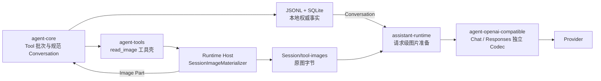

# v0.17.0 技术方案：工具图片回流与 Responses API

## 一、方案信息

- 版本：`v0.17.0`
- 状态：已确认（2026-08-19）
- 关联设计：[`v0.17.0 功能设计`](功能设计.md)
- 真实证据：[`v0.17.0 真实模型验证记录`](真实模型验证记录.md)
- 实现基线：2026-08-19 当前源码、`v0.16.0` 归档设计与真实多模态测试
- 影响模块：`agent-types`、`agent-model`、`agent-core`、`agent-context`、
  `agent-tools`、`agent-tools-local`、`agent-openai-compatible`、`assistant-runtime`、
  `assistant-protocol`、Runtime Host 与 Desktop

本文把已确认的功能边界落到当前代码中的公共类型、能力编译、wire 方言、
持久化和恢复路径。本文不是开发计划；实施顺序与里程碑门禁见
[`v0.17.0 开发计划`](开发计划.md)。

## 二、源码现状与缺口

### 2.1 可复用基线

- `ConversationSnapshot` 已对 Assistant Tool Call 与紧随的 Tool Result 执行严格双向配对，
  Core 也已保证并行工具按原 Tool Call 顺序整批结算。
- `AssistantMessage.parts` 已能按 Provider 输出顺序保存 reasoning、正文、Tool Call 和
  `OpaqueProviderState`。
- `v0.16.0` 已有 Host 唯一图片嗅探、动画拒绝、像素/边长/比例限制、方向归一化、
  alpha 复合、缩放和 JPEG 转码链；Adapter 只接收 `PreparedModelImage`。
- Runtime 已在模型服务外包装 `ImagePreparingModelService`，按请求准备历史附件图片，
  且不把 Base64 持久化。
- Session 目录、Fork、删除暂存、Conversation generation 替换和 pending tool exchange
  均已有可靠提交语义，无需建立第二套存储系统。
- Runtime 已用精确 `(provider, protocol, model_id)` 目录编译模型能力，Host 只消费
  编译结果装配 Adapter。

### 2.2 必须改造的事实

1. `ToolResultContent` 目前只能表示单个 Text 或 JSON，无法表示有序混合 Part。
2. 当前图片预处理器只接受附件 `FileReference`，且只会在 `attachments/` 边界中解析。
3. `SessionExecutionEnvironment` 没有 `tool-images/` 根，Run 工具工厂也没有会话级图片物化能力。
4. `ModelProtocol` 只有 `openai_chat_completions`，当前 Codec、Schema、Service 和流组装器均是
   Chat Completions 专用。
5. `ModelCapabilities` 只有 `image_input/tool_calls/streaming/reasoning`，无法表达
   “可看图但 function output 只能是字符串”与 ToolChoice 子集。
6. `OpaqueProviderState` 只绑定 provider/protocol，且派生 `Debug` 会展开 payload；这不足以
   阻止跨 endpoint/model 回放 Responses reasoning 状态。
7. `ContextLayout` 会从最早的 ProviderState 所在轮次开始保护全部尾部，长会话最终
   无可压缩 head。
8. 现有工具文件详情从 Tool Call 输入路径回查原文件；`read_image` 必须改为从可靠
   Tool Result Image Part 回查会话稳定副本。

## 三、总体拓扑与所有权



所有权固定如下：

- `agent-types` 定义有序 Tool Result Part 和最小图片引用，不知道 Session 根。
- `agent-tools` 定义 `read_image` 壳、路径授权事实和可替换物化端口，不访问本地文件。
- Runtime 根据冻结 Session Environment 决定是否注册 `read_image`、如何选择投影和如何
  编排 Fork/压缩/恢复。
- Host 持有真实文件 I/O、Session 根验证、图片解码、原子物化和预览路由；
  它不保存第二份 Session 状态。
- `agent-model` 只传递已准备的瞬时字节；Chat/Responses Adapter 不读路径、不解码图片。
- Desktop 只根据 Runtime Tool Detail 投影预览，不把工具图片变成附件或通用产物。

## 四、规范 Tool Result Part

### 4.1 Rust 类型

`agent-types` 把 `ToolResultContent` 改为非空有序集合：

```rust
pub struct ToolResultContent {
    parts: Vec<ToolResultPart>,
}

pub enum ToolResultPart {
    Text { text: String },
    Json { value: serde_json::Value },
    Image { image: ToolImageReference },
}

pub struct ToolImageReference {
    relative_path: String,
    media_type: String,
}
```

公共构造器为 `ToolResultContent::text/json/parts`和 `ToolImageReference::new`；字段保持私有，
反序列化必须重走验证。不允许空 Part 列表、空 MIME、空文本 Part 不做额外禁止，
因为部分工具可能合法返回空文本。

Image Part 序列化形状固定为：

```json
{
  "type": "image",
  "relative_path": "0123456789abcdef...89abcdef.png",
  "media_type": "image/png"
}
```

`relative_path` 只接受 `64 位小写十六进制 SHA-256 + 一个规范扩展名`；不接受路径分隔符、
`.`、`..`、绝对路径或额外层级。首版 MIME/扩展名映射为 JPEG/`jpg`、PNG/`png`、
WebP/`webp` 和静态 GIF/`gif`；其他内容不生成 Image Part。

### 4.2 Serde 兼容

新形状为：

```json
{
  "parts": [
    {"type": "text", "text": "done"},
    {"type": "image", "relative_path": "<sha256>.png", "media_type": "image/png"}
  ]
}
```

`ToolResultContent` 使用手写 `Deserialize`，同时接受旧形状
`{"type":"text","value":"..."}` 和 `{"type":"json","value":...}`，并立即归一化为单 Part。
新写入统一使用 `parts` 形状；Fork、历史重入或 Context Replacement 重写 generation 时
可自然完成形状升级，不扫描也不就地改写旧 JSONL。

这个变更不增加 SQLite 列：Tool Result 正文仍只存在 Conversation JSONL、
`pending_tool_exchanges.results_json` 和 staged append payload 中。所有三条反序列化入口
共用同一 `agent-types` 兼容实现。

### 4.3 源路径与引用路径

Image Part 中不保存 `read_image` 的源路径。但规范 Conversation 依照现有审计语义
保存 Assistant Tool Call 的 `path` 参数；否则无法恢复“模型请求读取了什么”。
因此隐私约束的精确表述是：工具结果和图片文件不复制源路径；普通日志与事件
不输出 Tool Call 参数。

## 五、`read_image` 与会话内物化

### 5.1 工具与能力端口

`agent-tools` 新增：

- `ReadImageTool`：只含 `path: String` 的严格 Schema；
- `ReadImageRequest { path: AbsolutePath }`；
- `ImageMaterializer` trait：输入已解析绝对路径和取消令牌，输出
  `ToolImageReference`；
- 与 `read_file` 相同的 `FileAuthorizationFacts { operation: Read, path }`。

`agent-tools-local` 提供可取消、有上限的普通二进制文件读取机制；Host 的
`SessionImageMaterializer` 组合该机制做图片校验和会话存储。该机制不暴露给
Agent Core，也不让 `agent-tools-local` 知道 Session 目录命名。

`resolve` 只用 `SessionPathResolver` 做词法路径解析，真实文件状态和符号链接仍在执行期检查。
`read_image` 显式标记 `ParallelEligible`；并发正确性依赖物化器的不覆盖提交，不依赖
Core 对重复调用做特判。

Runtime 只在下列条件同时成立时向主/子 Agent 的 Base ToolSet 注册 `read_image`：

1. 主模型 `image_input = true`；
2. 当前精确路由已编译出原生或聚合兼容工具图片投影；
3. 模型支持 Tool Call。

文本主模型仍只在有效辅助视觉模型存在时获得 `inspect_images`；两个工具不同时作为
主识图路径注册，`read_image` 也不调用 `ImageInspector`。`inspect_images` 不再使用附件根做
专用路径白名单，而是与 `read_image` 共用 `SessionPathResolver` 和文件 Read 权限。其 1—10 条
路径形成保持顺序的 `FileBatchAuthorizationFacts`：权限规则对每条路径分别求值，Deny 优先于
Ask、Ask 优先于 Allow，只有全部路径获准才执行。持久批准为每条路径生成 exact Read 规则，并在
同一次权限文件 CAS 中原子写入，不能扩大为共同父目录或通用工具授权。

### 5.2 Session Environment 与目录

`SessionExecutionEnvironment` 增加 `session_tool_image_directory: String`。Host 在新建、Fork 和
启动恢复时从 `data/sessions/<session-id>/tool-images` 确定性重建并验证该字段。
它不写入 `session_resources` 新列，避免对可推导路径建立第二份权威事实；因此本项
不需要 SQLite schema 迁移。

Host 的会话目录准备必须同时建立：

```text
data/sessions/<session-id>/
  attachments/
  tool-images/
  private/
```

`tool-images/` 目录权限沿用 Session 私有目录边界。Host 基础设施 Policy 对所有 Session
的 `tool-images/` 拒绝结构化 Write/Edit/Delete，Read/List/Search 仍经正常权限规则；Shell
边界不变。已提交图片设为只读只是防误操作，不是安全沙箱。

### 5.3 校验、去重和原子提交

Host `SessionImageMaterializer` 复用 `image.rs` 的解码安全限制，但保存已验证的原图字节，
不把模型用 JPEG 当作持久产物。执行步骤为：

1. 打开已授权路径的当前普通文件，拒绝目录、设备和无法稳定读取的目标。
2. 最多读取 `64 MiB`，按签名嗅探 MIME，拒绝动画，完成像素、边长、宽高比与解码验证。
3. 对本次实际读取字节计算 SHA-256，根据实际 MIME 选择规范扩展名。
4. 在同一 `tool-images/` 中以随机不冲突 `.part` 名写入，刷新文件后使用不覆盖原子
   提交到 `<sha256>.<ext>`。
5. 目标已存在时重新核对普通文件、字节哈希和 MIME，一致则删除自己的 `.part`
   并复用；不一致则使 Session fail-closed，不覆盖已有文件。
6. 刷新目录并将稳定文件设为只读后，才返回 Image Part。Core 之后按既有
   pending/ready/append 顺序持久化 Tool Result。

取消在稳定文件提交前只留临时文件并立即清理；提交后与 Tool Result 返回之间崩溃
可留下未引用稳定文件，但不会留下指向不存在文件的成功 Tool Result。

### 5.4 启动恢复与孤儿

Host 启动顺序固定为：先完成 staged append 与 pending tool exchange 修复，再扫描
`tool-images/`。扫描规则：

- 删除合法 Session 目录中的 `.part` 文件；
- 从当前主 Conversation 与当前 child Conversation generation 收集有效 Image Part；
- 只有在全部当前 Conversation 都可读时，才删除合法哈希文件中未被任何当前 generation
  引用的文件；任一 Conversation 不可用时保守保留稳定文件；
- 未知文件类型、非法名称或校验失败不自动删除，把该 Session 标记为资源诊断异常。

这只是崩溃恢复的一次性 mark-and-sweep，不是 Session 运行期的逐引用 GC，不增加
引用计数或全局缓存。

## 六、请求级图片准备与三条投影

### 6.1 准备边界

`read_image` 仍只物化一份 Session 私有图片，Image Part 也仍只保存
`relative_path + media_type`。以下区分只是构建单次模型请求时的内存查找键，
不是 Tool Result 新增字段，也不会再复制图片。

`agent-model` 将当前只按 `readable_path` 索引的 `PreparedModelImages` 改为带资源来源的
请求级内部键：

- `file_reference(readable_path)`：用户附件图片；
- `tool_image(relative_path)`：当前 Session 的 Tool Result Image Part。

来源标识只用于选择 `attachments/` 或 `tool-images/` 解析根，并防止两个根下
同名相对路径的预处理缓存键冲突。它不进入 `ModelRequest`、Conversation 或任何持久化。

`ModelImagePreprocessor` 输入扩展为瞬时 `ModelImageResource`；Tool Image 变体同时携带
Session `tool-images/` 绝对根和规范相对引用。绝对根不进入 `ModelRequest`、Conversation
或序列化，只服务当次 Host 资源解析。

`inspect_images` 另使用只存在于该次已授权工具执行中的 `LocalFile` 资源变体。Runtime 在调用
辅助模型前逐张完成公共图片预处理，并把结果放入本次 `ModelCallContext`；辅助请求仍以普通
File Reference 位置编码图片，但 Host 不要求这些路径属于附件 Registry，也不复制、持久化或
投影为 Tool Image。该变体不能由规范 Conversation 自行构造，调用前的多路径 Read 授权是其
信任前提。

当前 `ImagePreparingModelService` 改为按 Session 绑定的包装器：普通连接验证不绑定资源；
主 Run、child Run 与 `inspect_images` 辅助调用在构造时注入当前 Session Environment。
包装器按 Conversation 顺序收集图片，按源身份去重预处理，但 Adapter 仍按 Part 出现次数
投影。单次请求最多 10 个图片 Part，不是 10 个唯一哈希。

每次从 `tool-images/` 取图都重新校验单层路径、普通文件、文件名哈希、实际 MIME 与
Image Part MIME，再进入公共解码链。任一图片失败都在请求建立前返回 `ModelError::Resource`；
不静默省略。

### 6.2 投影选择

Runtime 从已编译精确路由得到 `ToolImageProjection`：

```rust
pub enum ToolImageProjection {
    Unsupported,
    NativeFunctionOutput,
    AggregatedUserInput,
}
```

该值是 protocol + exact route 的编译结果，在一个 Run 内冻结。运行时不根据 HTTP 状态或
模型自然语言答案切换投影。

### 6.3 原生函数结果

Responses 原生路径把每个 Tool Result 编码为一个 `function_call_output`，`output` 按规范
Part 顺序使用 `input_text` 和 `input_image` 数组。JSON Part 使用确定紧凑 JSON 作为
`input_text`，不转成 Provider file ID。

首批只为真实验证通过的 `moonshot + openai_responses + k3` 启用。OpenAI 官方先完成
离线 fixture，取得本项目凭据并通过相同内容断言后才加入默认目录。

### 6.4 聚合兼容投影

对字符串 Tool Result 方言，编码器对一个已完整配对的工具批次执行两阶段投影：

1. 按 Tool Call 原顺序输出全部 tool message / `function_call_output`。Text/JSON 编码为文本；
   Image Part 在字符串中留下确定占位和 `call_id + part_index` 标签，不写 Base64。
2. 如本批存在图片，再输出一条 wire-only user image envelope。其 content 按 Tool Call 顺序、
   再按 Part 顺序排列“标签文本 → 图片”对。

确定占位使用版本化内部文本，例如：

```text
[tool_result_image call_id="call_x" part_index="2" supplied_in_following_batch]
```

这条 user envelope 只是 Provider 视图，不分配规范 MessageId，不进入 Journal、Recall、UI、
message count 或输入幂等，也不发送用户消息新增/恢复类 Runtime 事件。
重试、重启和历史重入只从同一批规范 Tool Result 确定性重建该视图，
不形成新的业务 User Input。编码器必须在处理每个 Assistant Tool Call Message 时一次收集其
紧随的整批 Tool Message，禁止按单条 `ConversationMessage` 边走边插入兼容消息。

首批固定路径：

| 协议与路由 | 投影 |
| --- | --- |
| Chat Completions + Qwen/Kimi 图片模型 | 全部 tool messages 后一个聚合 user image message |
| Responses + DashScope `qwen3.8-max` | 全部 `function_call_output` 后一个聚合 user input item |
| Responses + Kimi `k3` | 原生，不在失败后改走聚合路径 |
| DeepSeek Flash/Pro | 无图片能力，不注册 `read_image` |

Qwen/Kimi Chat 的批次投影已补充真实验证；其他 Chat-compatible 路由仍需逐路由回证。

## 七、Responses API 独立实现

### 7.1 代码组织

`agent-openai-compatible` 不在 `src/` 根目录并排两套协议文件。本版在引入
Responses 时同步把现有 Chat 实现收入 `chat/`，只把两个协议稳定复用的
基础设施收入 `shared/`：

```text
crates/agent-openai-compatible/
  src/
    lib.rs                         # 薄 re-export，不放 Codec 逻辑
    chat/
      mod.rs                       # Chat 对外类型边界
      adapter.rs                   # ChatProtocolAdapter 及其 Provider 方言
      schema.rs                    # message/choice/delta wire DTO
      encode.rs                    # ModelRequest -> Chat request
      decode.rs                    # 非流式响应与错误映射
      stream.rs                    # Chat chunk 组装与终态
      service.rs                   # OpenAiChatCompletionsService
      tests/{encode,decode,stream,round_trip}.rs
    responses/
      mod.rs                       # Responses 对外类型边界
      adapter.rs                   # ResponsesProtocolAdapter 及其 Provider 方言
      schema.rs                    # item/event/response wire DTO
      encode.rs                    # ModelRequest -> Responses input items
      decode.rs                    # 非流式 item 与错误映射
      stream.rs                    # Responses event 状态机与终态
      service.rs                   # OpenAiResponsesService
      tests/{encode,decode,stream,round_trip}.rs
    shared/
      mod.rs
      credential.rs                # BearerCredential 和安全 Debug
      endpoint.rs                  # base URL 校验、规范化与终结点拼接
      transport.rs                 # Transport/Reqwest/ObservedTransport
      sse.rs                       # 只解析 SSE frame，不识别协议事件
      tool_schema.rs               # function schema 稳定公共子集
      image_data.rs                # PreparedModelImage -> Data URL
  tests/
    support/mod.rs                 # 私有 fixture transport/断言帮助
    chat_service.rs                # 只通过公共 Service/Transport 验证
    responses_service.rs           # 只通过公共 Service/Transport 验证
    transport.rs
  fixtures/
    chat/{deepseek,errors}/...
    responses/{openai,deepseek,dashscope,kimi,errors}/...
  examples/
    chat.rs
    responses.rs
```

现有未限定协议的 `ProtocolAdapter` / `OpenAiCompatibleService` 在该里程碑分别改名为
`ChatProtocolAdapter` / `OpenAiChatCompletionsService`，并一次性修改仓库内调用方；
不留一个同时可能指代 Chat 或 Responses 的长期别名。新服务名为
`OpenAiResponsesService`，新方言类型为 `ResponsesProtocolAdapter`。

`lib.rs` 只 re-export 宿主装配所需的 Service、Protocol Adapter、credential、transport 和
wire observation 契约；`schema` DTO、组装器和编解码帮助默认保持协议目录内私有。
需要直接检查 Codec 内部的白盒 fixture 测试收在各协议自己的 `tests/` 子模块，
可访问父模块私有实现；crate 根 `tests/` 只通过正式公共 Service/Transport 做黑盒集成验证。
不为测试扩大公共 API。

两个协议只共享：

- Bearer credential 与 base URL 安全验证；
- `Transport`、wire observer、超时、有限建流前重试和 SSE 字节 parser；
- 工具 JSON Schema 降级器和已准备图片的 Data URL 帮助函数。

Responses item Schema、状态机、终态和 reasoning item 不与 Chat `message/choice/delta`
使用同一枚举分支。Host 依 `ModelProtocol` 构造其中一个 Service，不在单次请求中试错。

目录依赖只允许 `chat -> shared` 和 `responses -> shared`；`chat` 与 `responses` 不得相互引用。
如果某个帮助当时仍只有一个协议调用，就保留在该协议目录，不因“以后可能复用”
提前放入 `shared`。实现该里程碑时同步更新
[`agent-openai-compatible` 模块约束](../../modules/agent-openai-compatible.md)，不让其继续只描述 Chat。

### 7.2 请求形状

每次请求固定：

- URL 为已验证 base URL 追加 `/responses`；
- `store: false`、`stream: true`；
- 不发 `previous_response_id`、`conversation`、`background` 或远程 CRUD 字段；
- `instructions` 为 `SystemPromptSnapshot.parts()` 用 `\n\n` 确定性连接的完整冻结文本；
- `input` 每次由当前规范 Conversation 完整重建；
- 有工具时发 `tools`，`tool_choice: auto` 由精确方言决定显式发送还是省略；
- 需要不透明 reasoning 状态的方言发
  `include: ["reasoning.encrypted_content"]`，其他方言省略。

本地真实验证已证明 DeepSeek/Qwen/Kimi 都接受根级 `instructions`。

Conversation 映射如下：

| 规范事实 | Responses input |
| --- | --- |
| User Text/Injected | user message 的 `input_text` |
| User File Reference image | 原 user message 原位置的 `input_image` |
| Context Summary | 带固定派生说明的 system input message |
| Assistant Text | assistant message/output text item |
| Tool Call | 最小 `function_call {call_id,name,arguments}` |
| Tool Result | `function_call_output` |
| Reasoning summary | reasoning item `type/id/summary` |
| 相容 ProviderState | 保真 reasoning item JSON |

真实验证已确认 function item 的 Provider `id` 可省略，规范 `ToolCallId` 足以重建续接。
Qwen/Kimi 也已通过仅 `type/id/summary` 的 reasoning 回放，不需要伪造加密状态。

### 7.3 Responses 方言

`ResponsesProtocolAdapter` 使用具名构造器，字段保持私有。它至少编译：

- generation 字段支持集与 `max_output_tokens`；
- reasoning effort 映射、summary 事件形态和不透明状态策略；
- ToolChoice 支持集；
- `StringOnly` / `ContentParts` 函数结果形态；
- `Unsupported` / `AggregatedUserInput` / `NativeFunctionOutput` 工具图片投影；
- 缓存和 reasoning usage 字段映射；
- Provider 可安全忽略的诊断扩展白名单。

首批具名方言为 DeepSeek Responses、DashScope Qwen 3.8 Responses 和 Kimi K3 Responses。
OpenAI Responses 实现官方 fixture，但默认目录启用仍受真实凭据门禁限制。

### 7.4 ToolChoice 与能力编译

`agent-model::ModelCapabilities` 和 Runtime `ResolvedModelCapabilities` 增加：

```rust
pub struct ToolChoiceCapabilities {
    pub auto: bool,
    pub none: bool,
    pub required: bool,
    pub named: bool,
}

pub struct ModelCapabilities {
    // existing fields...
    pub multimodal_tool_result: bool,
    pub tool_choice: ToolChoiceCapabilities,
}
```

`responses_api` 不再另设布尔 capability，因为 `ModelProtocol::OpenAiResponses` 本身就是不可混淆的
协议选择。`multimodal_tool_result` 和 `image_input` 必须分开。

Runtime 在构造 `ExecutionSpec` 时验证已选 `ToolChoice`是否属于该路由支持集，Adapter
再做一次 wire 约束校验。当前 Agent 使用 `Auto`；DeepSeek/Qwen/Kimi thinking Responses
的 `Required/Named` 均不得下发。没有工具时的 `None` 继续通过省略 wire 字段表达。

### 7.5 流式状态机

Responses 解码器按 response ID 和 `output_index/item_id/content_index` 组装，不按事件到达时间
推测 Part 顺序。状态机接受：

- `response.created/queued/in_progress`；
- `response.output_item.added/done`；
- output text 与 refusal delta/done；
- function arguments delta/done；
- reasoning text 与 reasoning summary delta/done；
- usage 与 `completed/incomplete/failed/cancelled/error` 终态。

`response.created` 产生唯一 `TurnStarted`；queued/in-progress 只更新内部状态。正文、summary 和
function arguments 映射现有 ModelEvent Part 事件。refusal 作为 Text Part 展示，并把
`FinishReason` 设为 `ContentFilter`，首版不新增只有 Responses 使用的 UI Part。

终态映射：

- `completed` → `TurnFinished`，有 function call 时为 `ToolCalls`，否则为 `Stop`；
- `incomplete` → `TurnFinished` + `FinishReason::Length` 或带结构化原因的 `Other`；
- `failed/error` → `TurnFailed(ModelError)`；
- Provider `cancelled` → `TurnFailed`；只有本地取消令牌触发时映射 `ModelError::Cancelled`。

`incomplete` 是一次可靠结束的模型 Turn，不是传输失败；本版沿用 Core 对 `FinishReason::Length`
的现有结算语义，不在 Adapter 内透明续写。终态后事件、重复终态、缺失 item done、
不完整 arguments、身份变化或未知可执行 output item 均形成唯一 `TurnFailed(Protocol)`。

## 八、Reasoning、ProviderState 与压缩

### 8.1 Opaque state 的唯一作用

`OpaqueProviderState` 是“已完成 Assistant 输出的 Provider 私有续传包”。它解决的唯一
问题是：在 `store: false` 且不使用 `previous_response_id` 时，后续请求如何按原方言
完整回放上一轮不能安全规范化的 reasoning item。

同一个 Provider reasoning item 在本地有两个不同投影：

| 投影 | 作用 | 谁可解释 | 后续用途 |
| --- | --- | --- | --- |
| `ReasoningPart` | 可规范化的 reasoning text/summary | Core/Context/UI | 展示、统一历史和跨路由降级 |
| `OpaqueProviderState` | 原方言续接必须保真的完整 wire item | 对应 Provider Adapter | 仅在精确相容路由上原位回放 |

两者可同时保存，并不代表给模型发送两份 reasoning。
`related_part_id` 把续传包绑定到对应 `ReasoningPart`；相容路由回放完整 opaque item 时，
编码器必须跳过该 `ReasoningPart` 的重建形状，避免重复。切换到不相容路由时，
只使用可规范化的文本/summary，绝不透传 opaque payload。

其生命周期固定为：

```text
Provider 返回 reasoning item
  -> Adapter 提取 ReasoningPart，必要时同时保存 OpaqueProviderState
  -> 与该 Assistant Message 同次可靠提交
  -> 精确相容路由的后续请求原位回放
  -> 所属旧轮被上下文摘要替代后，自然离开活动请求
```

Opaque state 明确不是：

- 可展示或可检索的思维正文；
- Prompt Cache、识图缓存或应用层会话状态；
- `response_id`、`previous_response_id` 或远程 Conversation 句柄；
- 跨 Provider/跨 endpoint/跨 model 可移植的通用 reasoning 格式；
- 必须永久阻止历史压缩的锁。

它是 Conversation 中的高敏 Provider 事实，不进入 UI、Recall、Memory、摘要正文、
全文索引或普通日志。Runtime/Core 只负责保存、路由门禁和生命周期，不解密、
不改写 payload；只有对应 Adapter 能校验并重放它。

### 8.2 不透明状态形状

DeepSeek/OpenAI Responses 的 reasoning summary 仍解码为 `ReasoningPart`，同时将必须保真的
完整 reasoning output item JSON 保存为 `OpaqueProviderState`：

- `state_type = "responses.reasoning_item"`；
- `media_type = "application/json"`；
- `format_version = 1`；
- `related_part_id = reasoning PartId`；
- `route_fingerprint = SHA-256(provider + protocol + normalized base URL + model_id)`；
- `payload = 经结构校验后的完整 reasoning item 紧凑 JSON`。

指纹不含 credential，不以原 endpoint 文本形式进入 Conversation。`OpaqueProviderState` 增加可选
`related_part_id/route_fingerprint`，以 `serde(default)` 读取旧 Chat 状态。Responses 生成的状态
两者必须存在。

base URL 规范化复用配置校验后的 URL 结构：scheme/host 小写、去除默认端口和
末尾斜杠，保留非空 path；userinfo、query 和 fragment 在配置入口即拒绝。
该规则必须用 fixture 锁定，避免等价 endpoint 因文本差异无法恢复状态。

`Debug` 改为只显示 provider、protocol、state type、format version、是否有路由绑定和
payload 字节数，不显示 payload、加密正文或指纹全值。单 item 和单 Turn 的不透明字节
必须有显式上限，超限视为 Provider 协议失败，不截断后回放。
上下文估算还要为实际会回放的 payload 计入保守的字节派生预算，不能因无法
解释其 token 语义就当作零成本；Provider 返回的 usage 仍是结算后权威计量。

Qwen/Kimi 的 `encrypted_content = null` 不生成 ProviderState。它们的 `ReasoningPart.id/text`
足以重建已真实验证的 `type/id/summary`。如未来路由开始返回非空不透明字段，
必须更新方言、fixture 和真实证据后才启用，不由解码器自学习。

### 8.3 回放与路由隔离

Responses 编码器先收集当前 Assistant Message 中的相容 ProviderState：

- provider、protocol、route fingerprint、state type 和 format version 全部匹配时，在原 Part 位置保真输出
  payload，并跳过其 `related_part_id` 对应的重建 reasoning item；
- 路由不相容时不透传 payload，只保留可规范化的文本、summary 和 Tool Call；
- 相容状态存在但无法解析或结构与 `related_part_id` 矛盾时显式失败，不降级。

“没有 ProviderState”本身不是错误：只有当当次响应真实返回了方言声明需续传的
非空不透明内容时才创建。Qwen/Kimi 的 `null encrypted_content` 不产生空状态。
但一旦 Conversation 已持久化一个相容状态，损坏、超限或无法与对应 Part 配对必须
fail-closed，不能静默丢弃后继请求。

这允许空闲 Session 切换模型或 endpoint 后正常使用旧历史，同时确保旧服务不透明状态
不会泄漏给新路由。不相容状态的跳过数只进入脱敏计数观测。

### 8.4 Context Layout 修正

`agent-context::ContextLayout` 删除 `contains_provider_state` 对 split index 的全局提前。
压缩边界只由以下事实决定：

- System prefix 永久保护；
- 最少近期 User Turn 保护；
- 需要时保护当前活动 User Turn；
- Assistant Tool Call 和紧随整批 Tool Result 仍在同一 User Turn Block 内不可拆分。

压缩请求使用当前同一已绑定 ModelService，因此可在 compressible head 中最后一次回放
相容 ProviderState。压缩成功后，`build_replacement` 仍只从压缩响应提取摘要文本和 usage，
不把压缩响应的 ProviderState 写入 Context Summary。head 的旧状态随 generation 替换自然离开
后续活动上下文，protected tail 中的近期状态保持不变。

## 九、配置、目录与首批路由

### 9.1 协议与目录 schema

`ModelProtocol` 增加 `OpenAiResponses`，配置值只接受 `openai_responses`。不为它增加
`responses`、`openai_response` 等模糊别名，也不迁移现有 Chat 配置。

用户 `config.toml` 保持 schema version 1：新协议值与可选 capability override 是向后兼容扩展。
随包 `model-catalog.json` 升为 schema version 2，因为它新增具有默认语义的
`multimodal_tool_result`、`tool_choice` 和精确 Responses 路由；旧随包目录不能被新代码静默解释。

### 9.2 保守基线与精确方言

- 未命中 `openai_responses` 精确路由时：文本、流式和 Auto Tool Call 为保守基线，
  `image_input=false`、`multimodal_tool_result=false`、reasoning/ProviderState 关闭。
- Host 先根据 `(provider, protocol, model_id)` 选择经验证的具名
  `ResponsesProtocolAdapter`；未命中时使用只实现官方基础 wire 形状的保守
  `openai_compatible` 方言，不猜测它属于哪个已知 Provider。
- 用户 override 可在该通用方言上显式开启已实现的标准能力形状，并承担未知
  端点风险；它仍不是“原样透传任意 Responses JSON”，也不会猜测
  DeepSeek reasoning 或 Kimi 原生图片等 Provider 专属形状。

首批默认目录：

| Provider | Model | Responses | Image input | Tool image | Opaque state | ToolChoice |
| --- | --- | --- | --- | --- | --- | --- |
| DeepSeek | `deepseek-v4-flash/pro` | 启用 | 关闭 | 不支持 | 完整 reasoning item | Auto |
| DashScope | `qwen3.8-max` | 启用 | 开启 | 聚合兼容 | 无，只回放 summary | Auto |
| Moonshot/Kimi Code | `k3` | 启用 | 开启 | 原生 | 无，只回放 summary | Auto |
| OpenAI | 官方 Responses 方言 | 代码/fixture | 待真实验证 | 待真实验证 | 待真实验证 | 待验证 |
| Zhipu | `glm-5.2` | 不启用 | 不适用 | 不适用 | 不适用 | 不适用 |

## 十、持久化、Fork、迁移与删除

### 10.1 提交顺序

一个成功 `read_image` 的可靠顺序为：

```text
begin pending exchange
→ authorize / mark started
→ 原子物化图片
→ Tool SPI 返回 Image Part
→ pending ready(results_json)
→ staged append Assistant + 整批 Tool Results
→ 提交 Conversation 并清理 pending
```

不新增图片数据库表、引用表或独立产物记录。图片引用的权威来源是已提交 Tool Result，
图片正文的权威位置是当前 Session `tool-images/`。

### 10.2 Fork

Runtime 在已校验 fork point 的 Conversation 中收集去重 `ToolImageReference`，与附件映射一起
交给 `RuntimeStore::fork_session`。Host Store 在写新 Conversation 前：

1. 验证源 Session 图片哈希和 MIME；
2. 将字节复制到新 Session 的同名 `tool-images/<sha256>.<ext>`，不建立跨 Session
   硬链接、软链接、Blob 引用或计数；
3. 刷新新 Session 目录后才写 body generation 和 SQLite Session 事实。

任一引用图片不可用时 Fork 整体失败并回收新建目录，不生成部分可用会话。

### 10.3 整体迁移与导出边界

本版“可迁移”的技术契约是：按现有数据集边界整体迁移 Runtime Home 中的 SQLite 与
`data/sessions/`，新 Host 从 Session ID 重建 `tool-images/` 根，Conversation 中的相对引用
无需改写。

SQLite 中既有 `session_resources` 和 `workspaces.agent_directory` 仍包含历史绝对路径。Host
启动时只对能严格验证为旧 `data/sessions/<session-id>/{private,attachments}` 或
`data/workspaces/<workspace-id>/agent` 固定形状的 Runtime 私有路径执行重定位，并在一个事务中
写回新根；Session 权限文件中落在旧 `private/`、`attachments/` 下的有效 File matcher 同步
按相对后缀迁移。外部用户 Workspace 路径保持不变，形状不合法的存储路径继续 fail-closed。
该恢复步骤不修改 Conversation 的 Tool Image 相对引用，也不新增 SQLite schema。

现有“导出 Markdown”只是人可读展示，不是会话恢复包，本版不把它扩展为包含私有
ProviderState 和图片的导入/导出协议。如后续实现单 Session 可携带归档，其 manifest 必须包含
Conversation 引用的 `tool-images/` 相对布局；该产品能力不由本版偷渡。

### 10.4 历史重入、压缩和删除

- 历史重入与 Context Replacement 可以让引用离开当前 generation，但 Session 运行期
  不立即删图；只在下次崩溃恢复扫描或删除 Session 时回收。
- Session 删除仍先把整个 Session 目录原子移入 deletion staging，SQLite 提交后再删目录；
  `tool-images/` 自然与会话共生共死。
- 归档 Session 不删图，Runtime 重启不改写 Image Part。

## 十一、产品投影与资源路由

`assistant-protocol::ToolFileResourceOrigin` 增加 `SessionToolImage`。`ToolDetailSnapshot.files`
直接从对应 Tool Result 的 Image Part 生成：

- `resource_ref_id = tool-image-<call-id>-<part-index>`；
- `display_name = relative_path`，`display_path = None`；
- `media_type` 来自 Image Part；Runtime 不访问文件系统，初始 `size_bytes` 保持为空；
- `Available` 表示可靠 Conversation 中存在可解析引用，不代表绕过物理校验。Host 在每次预览时
  校验；缺失或校验失败返回资源不可用，Desktop 将该详情项局部切为 `Unavailable`。

`project_conversation_file_references` 显式排除 `SessionToolImage`，因此它不进右侧 Context Panel、
附件列表或通用产物列表。现有工具详情弹窗复用 `files` 投影显示一个有界缩略图。

Runtime 的 `resolve_tool_file_resource` 对该 origin 不再使用 Tool Call 输入路径，而是按
owner/message/call/part index 回查可靠 Tool Result，再以当前 Session 固定根解析。主会话与
child Conversation 共用算法；child 资源路由增加 owner/child ID，避免只靠 message ID 定位。

缩略图请求使用现有公共解码限制在内存中生成最长边 320 的 JPEG，不在 `tool-images/`
中久久写入 `.thumbnail.jpg`，否则会污染“一个哈希一份原图”的文件数与恢复扫描。
Session Tool Image 只开放应用内预览，不开放 native-path、系统打开或目录揭示；这些能力继续只
服务可公开的普通工具文件。

## 十二、失败、取消、安全与观测

### 12.1 错误分层

- `read_image` 输入、路径与图片限制失败转成普通 Error Tool Result，让 Agent 可修正路径或
  给出说明。
- 已持久 Image Part 在模型请求准备时缺失、损坏或 MIME 不符是
  `ModelError::Resource`，当次 Step 失败，不回原源重读。
- 方言不支持已需求的 ToolChoice、generation 或图片投影是 `ModelError::Config`，请求不发送。
- Responses 非 2xx 继续使用结构化 HTTP 分类；建流后协议或 Provider 终态错误不透明重试。

### 12.2 取消与竞态

- 图片读取/解码/物化和模型准备都观察现有取消令牌；`spawn_blocking` 完成前 Runtime
  仍观察 JoinHandle，不丢弃后台任务。
- 同哈希并发物化只有一个不覆盖提交者；其他调用核对稳定目标后返回同一引用。
- 文件已提交但 Tool exchange 尚未可靠结算时取消，保留稳定文件，由既有 pending
  恢复形成 interrupted/outcome_unknown 结果，后续启动扫描回收未引用副本。

### 12.3 敏感数据与观测

- 普通日志、Runtime 事件、Debug Viewer 不记录图片字节、Data URL、Tool Call 参数、
  ProviderState payload 或完整路由指纹。
- 可记录的脱敏计数包含：请求图片 Part 数、预处理去重数、物化命中/新增、投影种类、
  Responses 事件数、终态、跳过的不相容 ProviderState 数和 payload 字节数。
- Full Trace 如启用仍是高敏副本；wire observer 可按现有保真原则记录请求/响应，但凭据在
  Transport 观察对象构造前永久排除。

## 十三、跨模块改动表

| 模块 | 主要改动 | 不负责 |
| --- | --- | --- |
| `agent-types` | Tool Result Parts、Image Reference、ProviderState 路由绑定/安全 Debug | Session 根、图片 I/O |
| `agent-tools` | `read_image`、`ImageMaterializer`、Read 授权事实 | 本地解码与 Session 目录 |
| `agent-tools-local` | 可取消的有界本地二进制普通文件读取机制 | 会话命名和去重策略 |
| `agent-model` | 图片资源命名空间、多模态 Tool Result/ToolChoice 能力 | Provider JSON |
| `agent-core` | 保持 Part 和批次顺序，适配新 Content API | 图片 I/O、投影选择 |
| `agent-context` | 移除 ProviderState 全局尾部保护，保持 Turn 原子性 | 解释 ProviderState |
| `agent-openai-compatible` | Responses 独立 Service/Codec/流，Chat 聚合投影 | Runtime 路由和本地路径 |
| `assistant-runtime` | 能力编译、Run 工具选择、Session 资源绑定、Fork/压缩/投影 | SQLite 物理格式 |
| Runtime Host | 原子物化、恢复扫描、预处理、存储复制、资源路由、Adapter 装配 | Session 业务状态 |
| `assistant-protocol` | Tool Image 详情的最小 origin/state 投影 | 内部 Image Part、绝对路径、ProviderState |
| Desktop | 工具详情有界缩略图与不可用态 | 附件/产物升级、路径解析 |

## 十四、验证策略

### 14.1 类型、工具与存储

- Tool Result 新 Part 形状 round-trip，旧 Text/JSON fixture 可读，无效路径/MIME/空 Parts 拒绝。
- `read_image` 成功、非图片、损坏、动画、超限、越界、拒绝、取消和源文件竞态。
- 同图串行/并行读取只有一个稳定文件，不同字节不误去重，已存目标损坏 fail-closed。
- 在物化、pending ready、staged append、SQLite 提交前后注入崩溃，验证无成功引用悬空、
  无工具副作用重放，恢复扫描结果正确。
- Fork 复制引用图片，新 Session 删除不影响源 Session；历史重入、压缩和整体 Runtime Home
  迁移保持相对引用。

### 14.2 Adapter 离线 fixture

Chat 和 Responses 分别覆盖：

- 文本、附件图片、单/多 function call、成功/错误 Tool Result；
- 两调用一图一文、两调用各一图、单调用两图、一成功一错误；
- 原生函数图片不额外生成 user item，兼容路径严格是“整批 output → 一个 user envelope”；
- 兼容 user envelope 不进入任何产品消息查询、计数、事件或 UI，重试/恢复也不产生额外用户消息；
- Responses created/queued/in-progress、reasoning text/summary、refusal、usage、completed/incomplete/
  failed/cancelled/error 与畸形流；
- DeepSeek 完整 reasoning item 跨轮与重启回放，Qwen/Kimi summary-only 重建，路由指纹
  不匹配时绝不透传；
- 含旧 ProviderState 的可压缩 head 被摘要替换，protected tail 与 Tool Exchange 不被拆分。

### 14.3 正式 Host 与真实模型

- 正式 Host 离线端到端测试使用临时 Runtime Home 和临时工作目录，通过正式 HTTP/SSE
  完成 `read_image`、重启、Fork、压缩、预览和删除，关闭后只读核对 JSONL/SQLite/目录。
- 忽略的真实测试只读使用本地配置 credential，不输出配置文本、密钥、完整模型回复、
  reasoning、response/call ID 或私有图片路径。
- 固定内容断言而非 HTTP 200：DeepSeek 断言无图片能力与状态回放；Qwen 断言聚合图片；
  Kimi 断言原生函数图片；GLM 保持不启用。
- OpenAI 默认目录启用之前必须补齐同等真实证据，没有凭据时只跑官方 fixture。

最终实现验证执行最小 crate 测试、workspace `fmt/clippy/test`、Desktop 类型生成与构建，
以及正式 Host 端到端。文档阶段只做链接、路径和相互契约检查。

## 十五、明确拒绝的备选方案

- 不把 Base64/Data URL 写入 Conversation，也不将 Provider file ID 作为恢复依赖。
- 不用全局 Blob 缓存、跨 Session 去重、硬链接或引用计数换取少量磁盘空间。
- 不让 Adapter 读文件、拼 Session 路径或调用辅助视觉模型。
- 不在 Qwen 对图片 function output 返回 HTTP 200 后就宣称原生支持，不在运行时失败后
  切换投影。
- 不强行把 wire-only 聚合图片写成规范 User Message，也不按每个 Tool Result 穿插一条 user message。
- 不在 Responses 首版使用 `previous_response_id`、远程 Conversation、background 或 hosted tools。
- 不为 Qwen/Kimi 的 `null encrypted_content` 生成空 ProviderState，也不尝试解密、摘要或
  索引不透明 payload。
- 不因历史中存在 ProviderState 永久保护之后的所有轮次。
- 不把现有 Markdown 导出偷换为高敏可恢复会话包；单 Session 导入/导出需要独立产品设计。

## 十六、实施入口

实施依照 [`v0.17.0 开发计划`](开发计划.md) 的 M0—M6 与逐里程碑确认门禁。
开发计划确认前不开始代码实现；计划确认后也只开始 M0。
