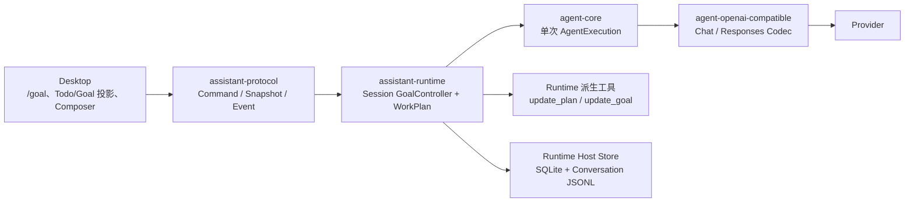
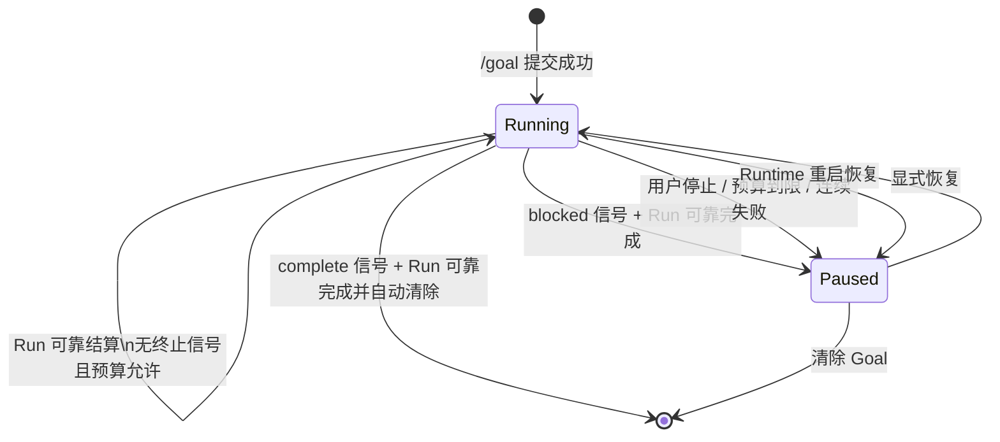

# v0.18.0 技术方案：Todo、Goal 与 Composer 执行入口

## 一、方案信息

- 版本：`v0.18.0`
- 状态：已确认（2026-08-20）
- 关联设计：[`v0.18.0 功能设计`](功能设计.md)
- 实现基线：2026-08-20 当前源码、`cargo metadata --no-deps` 与
  `cargo tree -p assistant-runtime --depth 2` 的实际结果
- 影响模块：`agent-types`、`agent-context`、`agent-openai-compatible`、
  `assistant-runtime`、`assistant-protocol`、Runtime Host 与 Desktop
- 不新增 crate，不引入新的第三方依赖，不修改 Desktop/Runtime 双进程拓扑

本文把功能设计落到当前规范 Conversation、Input/Run 队列、SQLite + JSONL 持久化、
OpenAI-compatible 双协议 Adapter 和 Desktop Composer 上。实施顺序和确认门禁单独见
[`v0.18.0 开发计划`](开发计划.md)。

## 二、源码现状与缺口

### 2.1 可直接复用的基线

- `agent-types::UserMessage` 已由有序 `UserPart` 组成，`UserPart::Injected` 已明确表示
  “对模型可见、对产品转录隐藏”的 Runtime 注入内容，并随规范消息可靠持久化。
- Chat Completions 与 Responses 编码器都按 `UserPart` 顺序投影用户内容；
  Provider wire schema 位于 `agent-openai-compatible`，不需要新增第三种消息角色。
- 新用户输入先以 `inputs.queued_message_json` 持久化，再由 Session queue driver 领取；
  UserMessage、Run 启动、Tool Exchange 与 Run 终态都已有 staged append 和恢复语义。
- 同一 Session 只有一个改变主 Conversation 的活动 Run；`SessionController::mutation_gate`
  和 queue driver 已提供 Goal 状态转换需要的串行化点。
- Runtime 已能在 Host Base ToolSet 上派生 `delegate_task` 等 Runtime 绑定工具，
  因此 Todo 和 Goal 控制工具不需要进入 Host 文件/Shell 工具工厂。
- `SessionViewSnapshot` 已组合 Session、Run、Queue、Approval、Usage 与分页 Conversation；
  Desktop 以 MobX 投影快照，SSE 只负责失效提示和活动增量。
- Desktop 已有 `ComposerDock`、Slash Command、Queue Drawer、Approval Workspace、
  Selection Popover、Context Panel 与统一 overlay/focus 基础，可在现有 feature 内重组。
- Runtime/Protocol 已有 `remove_workspace` 假删命令和 `WorkspaceLifecycle::Removed`；
  本版本只需补齐 Desktop 命令链、确认交互，并从应用快照隐藏已移除 Workspace
  及其 Session，不新增删文件或删 Session 能力。重新登记同一 canonical path 沿用存储层
  现有语义，恢复原 Workspace ID 和关联 Session；`RegisterWorkspaceResult.restored`
  明确区分首次登记与恢复，Desktop 仅在首次登记时创建初始化会话。

### 2.2 必须改造的事实

1. `UserMessage` 目前没有来源和整条消息的 transcript 可见性；Host 的分页 offset、产品投影、
   Recall、搜索和导出会把所有 UserMessage 当作真实用户消息。
2. 当前 `inputs` 只有一条普通用户队列。新输入会解除暂停并唤醒 queue driver，无法在活动 Goal
   中只自动消费 Runtime continuation、同时保留用户指导。
3. Run 终态提交只能结算 Run，不能在同一事务内转换 Goal 并创建下一条内部 Input/Run；
   如果在结算后另行入队，进程崩溃会留下“Run 已完成但 Goal 无后继”的断点。
4. Context compaction 会用新 generation 替换旧 JSONL 并 best-effort 删除旧正文，
   仅保存 `objective_message_id` 不能保证长 Goal 重启后仍能恢复完整附件与正文。
5. 当前没有 Session 工作计划、Goal、暂停原因、世代、跨 Run 预算或对应 RuntimeStore 原子操作。
6. Host 的 Conversation display offset 只按 User/Assistant role 建索引；隐藏 Runtime UserMessage
   会污染分页、消息计数和按消息定位。
7. Composer 仍分别平铺 variant、approval、effort、识图和 model，且收起的 Approval 入口位于
   Queue 下方，与已确认布局相反。

## 三、总体架构与所有权

### 3.1 目标拓扑



所有权固定如下：

- `assistant-runtime` 是 WorkPlan、Goal、输入归属、世代、预算和自动续跑的唯一业务所有者。
- Runtime Host 只实现 `RuntimeStore` 的原子操作与 SQLite/JSONL 物理格式，不运行第二套 Goal 状态机。
- `agent-core` 继续只完成一次 `AgentExecution`，不知道 GoalId、Runtime Run 或跨 Run 预算。
- `agent-types` 只扩展 Provider-neutral 规范 UserMessage 元数据，不依赖 Runtime 或应用协议。
- `agent-openai-compatible` 忽略应用元数据，只编码既有 `user` role 和有序 Parts。
- `assistant-protocol` 只公开 Desktop 所需快照和用户意图，不暴露 objective recovery JSON、
  SQLite 行、内部 Input 或 Goal signal latch。
- Desktop 只保存 `/goal` 提交前的一次性草稿标记与弹层开关；WorkPlan/Goal 成功状态均来自 Runtime。

### 3.2 不建立独立 Judge 或后台 Worker

Goal 不增加独立模型调用，也不在 Agent final answer 上运行第二次判断。当前 Agent 通过
`update_goal` 工具提交 `complete` 或 `blocked` 信号；Runtime 只校验调用归属、世代、预算和
Run 结算事实。自动续跑仍由当前 Session queue driver 驱动，不为每个 Goal 创建常驻线程、
Session 子进程或另一套调度器。

## 四、规范 UserMessage 与内部注入

### 4.1 类型增量

`agent-types/src/conversation.rs` 在 `UserMessage` 上增加两个有安全缺省的值类型：

```rust
pub enum UserMessageOrigin {
    User,
    Runtime,
}

pub enum TranscriptVisibility {
    Visible,
    Hidden,
}

pub struct UserMessage {
    pub id: MessageId,
    #[serde(default)]
    pub origin: UserMessageOrigin,
    #[serde(default)]
    pub transcript_visibility: TranscriptVisibility,
    pub parts: Vec<UserPart>,
}
```

两个 enum 的 `Default` 分别为 `User` 和 `Visible`，因此旧 JSONL、pending exchange fixture、
queued message 和测试数据读取后保持原语义。新写入始终显式序列化字段，避免调试时依赖隐式缺省。

这里的 visibility 只决定产品转录、搜索和“真实用户输入”统计，不决定模型可见性。
模型是否看见内容仍由该消息是否进入 `ConversationSnapshot` 以及具体 `UserPart` 决定。

### 4.2 三类消息构造

1. **普通用户输入**
   - `origin = User`、`transcript_visibility = Visible`；
   - 保留 Text、FileReferences 和当前 variant Injected Part；
   - queue driver 在首次写入 Journal 前按当时最新 WorkPlan 追加冻结的计划 Injected Part。
2. **首次 Goal 输入**
   - 仍是一条可见的普通用户消息；`/goal` 字面量不进入正文；
   - Runtime 在 `accept_input` 前把 Goal 执行说明组装为额外 Injected Part；
   - Goal objective 只取该消息的用户载荷，即 Text 与 FileReferences，不包含任何 Injected Part。
3. **自动 continuation**
   - `origin = Runtime`、`transcript_visibility = Hidden`；
   - 整条消息只有冻结的 Injected Part；
   - Part 至少编码 objective、Goal turn、剩余预算、上轮稳定结果和继续执行要求。

所有内容都在进入 Journal 前完成组装。Goal 启用、暂停、恢复和完成只追加新消息或更新 Goal 表，
不修改已存在的 Conversation 记录，也不重建 Session 的冻结 System Prompt。

### 4.3 注入格式与版本

Runtime 私有模块保存具名常量和确定性编码器：

```text
WORK_PLAN_CONTEXT_V1
GOAL_START_INJECTION_V1
GOAL_CONTINUATION_V1
```

注入使用带 `version="1"` 的确定 XML，所有用户文本、文件名和路径先转义；不得用字符串拼接生成
未转义标签。Goal continuation 中的附件只表达原始名称和稳定 Agent 可读引用，不复制字节、Base64
或 Provider file ID。实际发给模型的文本随 UserPart 一次性冻结，模板升级只影响之后创建的消息。

Chat 与 Responses Adapter 都只遍历 Parts 并编码为现有 `user` 内容：

- `origin` 与 `transcript_visibility` 永不进入 Provider JSON；
- 不新增 `internal` role，不把 Goal 内容移入 `system`/`instructions`；
- Chat 与 Responses 各自增加离线 fixture，断言两种来源产生同样合法的 user wire 形状。

### 4.4 产品可见性统一入口

以下路径统一以 `transcript_visibility == Visible` 作为 UserMessage 产品准入条件：

- Runtime Host `conversation::build_offsets` 的 display offset；
- `assistant-runtime::runtime::product` 的分页、Around Message、Markdown 导出和附件投影；
- Conversation Recall 的候选提取与 Host FTS5 派生索引；
- 标题、用户输入计数、用户原话搜索和后续分析入口。

隐藏消息仍进入 raw offset、Context Layout、Provider 请求、可靠回放和调试审计。
`sessions.message_count` 继续是 JSONL 物理记录数，不偷换持久字段含义；产品分页总数改为
display offset 数，`SessionSummary.queued_input_count` 只统计用户来源的排队输入。

## 五、Todo / Session WorkPlan

### 5.1 Runtime 领域类型

WorkPlan 位于 `assistant-runtime` 私有 `work_plan` 模块：

```rust
pub(crate) struct WorkPlan {
    pub(crate) revision: u64,
    pub(crate) objective: String,
    pub(crate) items: Vec<WorkPlanItem>,
    pub(crate) updated_at_ms: i64,
}

pub(crate) struct WorkPlanItem {
    pub(crate) id: TodoItemId,
    pub(crate) text: String,
    pub(crate) status: TodoItemStatus,
}

pub enum TodoItemStatus {
    Pending,
    InProgress,
    Completed,
}
```

不变量为：objective 非空且有界、最多 100 个单层 item、文本非空且有界、ID 唯一、
同时最多一个 `InProgress`。排序就是 `Vec` 顺序，不额外维护依赖图或父子层级。

### 5.2 `update_plan` Runtime 工具

`update_plan` 是所有父 Agent Run 都可见的 Runtime 派生工具，Goal 是否存在不影响定义；
child Agent 不获得该工具，避免子任务直接修改父 Session 计划。

输入是完整替换，而不是增量 patch：

```rust
struct UpdatePlanInput {
    objective: Option<String>,
    items: Vec<UpdatePlanItemInput>,
}

struct UpdatePlanItemInput {
    text: String,
    status: TodoItemStatus,
}
```

`TodoItemId` 是 Runtime 持久化与 Desktop 列表 key，不进入模型输入、隐藏 WorkPlan Context 或
工具结果。Runtime 对完整替换列表优先按相同文本复用内部 ID，其次按原位置、最后按剩余未占用项
复用，确实新增的项才分配 ID；因此模型不承担内部身份维护，也不会因过期或幻觉 ID 失败。为兼容
已经进入当前 Conversation 的旧工具定义，反序列化仍接受但忽略旧 `id` 字段，新 schema 不公开它。
首次创建必须提供 objective；已有计划更新时省略 objective 表示沿用当前值。

Runtime 读取当前 revision，以 ToolCallId 作为幂等身份执行 Store CAS；Store 成功后才更新 Session
内存并发布 `WorkPlanChanged`。并发的 Desktop 清空若先提交，工具仍得到 revision conflict 并返回
可重试错误，不覆盖用户操作；容错只消除模型冗余字段和内部 ID 耦合，不吞掉真实并发冲突。

若替换结果包含至少一个 item 且全部为 `Completed`，Store 在同一事务中保存以
`(session_id, ToolCallId)` 为键的完成回执并删除当前 WorkPlan。工具仍返回首次完成快照，
但 SessionView 立即投影 `work_plan = None`；同一 ToolCall 重放从回执返回首次结果，不能因计划行
已删除而重复执行或产生 revision 冲突。空 item 的总体目标计划不触发自动清除。

该工具使用 Runtime 私有授权 facts，由 Authorizer 明确允许，不进入 Ask/Auto 审批；
它不访问工作区、Shell 或 Provider。Tool Call 和 Tool Result 仍按普通 Tool Exchange 进入
Conversation，保证 Agent 能观察写入结果。

### 5.3 计划上下文

存在 WorkPlan 时，每个新的父 Run 在其输入首次写入 Journal 前追加一个冻结
`WORK_PLAN_CONTEXT_V1` Injected Part。注入读取 claim 时的最新 revision，不在用户提交排队时提前冻结，
避免前序 Run 更新计划后，后续排队消息仍携带旧计划。对已经进入 Conversation 的消息不做回写；
重试沿用历史上下文，新的 Goal continuation 则携带结算时最新 WorkPlan。

Desktop 清空计划使用 `expected_revision` CAS，只删除 WorkPlan，不清除 Goal。

## 六、Goal 领域模型

### 6.1 类型与预算

Goal 位于 `assistant-runtime` 私有 `goal` 模块：

```rust
pub(crate) struct GoalControl {
    pub(crate) id: GoalId,
    pub(crate) objective: GoalObjectiveSnapshot,
    pub(crate) state: GoalState,
    pub(crate) generation: u64,
    pub(crate) turn: u32,
    pub(crate) budget: GoalBudget,
    pub(crate) consecutive_failures: u32,
    pub(crate) created_at_ms: i64,
    pub(crate) updated_at_ms: i64,
}

pub(crate) enum GoalState {
    Running,
    Paused(GoalPauseReason),
    Completed,
}

pub(crate) enum GoalPauseReason {
    Blocked { summary: String },
    UserStopped,
    RunLimitReached,
    TokenLimitReached,
    ConsecutiveFailures,
    RecoveryRequired,
    Forked,
}
```

“清除”表示 Session 不再存在 GoalControl，不增加 `Cleared` 主状态。任何离开 Running 的转换和
任何恢复都递增 generation，使迟到的 Tool Call、Run supervisor 和已排队 continuation 失效。

首版预算在 Goal 创建时冻结，不随配置热更新：

- 自动 Run 上限：20（首次 Run 计入）；
- Provider 报告的跨 Run total token 上限：500,000；
- 连续 Run 失败上限：3。

token usage 缺失时不估算；Run 上限仍是硬门禁，快照把 usage 完整性显式投影为 unknown。
开发前如果要调整默认数值，只修改版本常量与验收 fixture，不增加首版设置 UI。

### 6.2 objective 的引用与恢复副本

`GoalObjectiveSnapshot` 保存：

- `source_message_id`；
- 从原始 UserMessage 提取的 Text/FileReferences 有序用户载荷；
- 载荷的版本化 SHA-256；
- 创建时的附件稳定引用，不保存 Attachment Registry 私有行或文件字节。

它是在“接受首次 Goal Input + 创建 Goal”同一事务中形成的不可变恢复副本，不是第二个可编辑
objective。正常产品导航仍以 `source_message_id` 指向原用户消息；恢复副本只解决 Context
compaction 会删除旧 generation 的事实。Runtime 每次生成 continuation 前重新校验载荷 hash，
不让 LLM 重述 objective，也不从搜索索引、摘要或 UI preview 模糊提取。

### 6.3 状态机



普通 final answer 不产生状态转换。只有当前 GoalId、generation 和 RunId 绑定的结构化信号，
并且所属 Run 最终可靠结算为 Completed，才能应用 `complete`/`blocked`。

### 6.4 `update_goal` 与 Run signal latch

`update_goal` 始终存在于父 Agent 的 Runtime 派生工具集中，以保持 Run 间工具定义稳定；
这里的“始终”以当前模型支持 Tool Call 为前提；没有活动 Goal 时调用返回受控错误。输入为：

```rust
enum GoalAgentStatus {
    Complete,
    Blocked,
}

struct UpdateGoalInput {
    status: GoalAgentStatus,
    summary: String,
}
```

工具不直接修改持久 Goal。每个 Goal-bound Run 创建一个 `GoalRunSignalLatch`，工具只在以下条件
全部满足时记录一次信号：GoalId、generation、RunId 一致；当前尚无信号；该 Assistant Turn
没有与 `update_goal` 并列的其他工具调用。若同一批次混入其他工具，Authorizer 在任何工具执行前
拒绝整个批次，要求 Agent 单独重试终止调用。信号接受后 Authorizer 拒绝本 Run 的后续副作用工具，
只允许 Agent 生成最终正文。

工具结果明确说明“信号将在 Run 可靠结算后生效”。如果之后模型流失败、Recorder 失败、取消或
进程崩溃，latch 不应用；Goal 按失败或恢复语义暂停/续跑，不会因一条未结算 Tool Call 提前完成。

## 七、Input/Run 调用链与原子续跑

### 7.1 Input 归属

`StoredInput` 增加正交来源和可选 Goal 绑定：

```rust
pub(crate) enum InputOrigin {
    User,
    Runtime,
}

pub(crate) struct GoalRunBinding {
    pub(crate) goal_id: GoalId,
    pub(crate) generation: u64,
    pub(crate) turn: u32,
}
```

- 普通输入：User + 无 Goal binding；
- 首次 `/goal` 与用户恢复消息：User + Goal binding；
- 自动 continuation：Runtime + Goal binding。

Input origin 与 UserMessage origin 必须一致；Runtime continuation 必须是 transcript hidden 且只有
Injected Part。Store 反序列化时校验组合，非法行阻止 Session 自动执行。

### 7.2 首次 `/goal` 提交

`SubmitInputRequest` 增加有缺省值的 `mode`：`normal | start_goal | resume_goal`。
Desktop 消费 `/goal` 后发送 `start_goal`，不发送指令字面量。

```text
Desktop SubmitInput(start_goal)
  → Runtime 校验 Session 无未清除 Goal
  → 解析附件并构造可见 UserMessage + Goal Injected Part
  → 生成 GoalObjectiveSnapshot、GoalControl、Input、Run
  → Store 单事务写入 Goal + queued Input + accepted Run
  → 内存登记 Goal/Input/Run
  → queue driver 领取 Goal-bound Input
  → UserMessage staged append + Run running
  → AgentExecution
```

同一幂等 key 重试必须返回首次 Goal/Input/Run；不得创建第二个 Goal。已有运行或暂停 Goal 时，
`start_goal` 返回 `GoalAlreadyExists`，用户需要先恢复或清除。

Goal 依赖 `update_goal`，因此 `start_goal` 还必须核对当前精确模型能力
`tool_calls = true`；不支持 Tool Call 的模型返回 `GoalUnsupportedByModel`。存在未清除 Goal 时，
Session 模型只允许切换到同样支持 Tool Call 的模型；Desktop 根据 Runtime 提供的
`composer_capabilities.goal_supported` 禁用 `/goal`，但不能仅靠前端门禁保证正确性。

### 7.3 Run 结算与后继创建

Run supervisor 结束后先在 Runtime 内计算唯一 `GoalSettlementEffect`：

```rust
enum GoalSettlementEffect {
    None,
    Continue { next_input: NewStoredInput, next_run: NewStoredRun },
    Pause { reason: GoalPauseReason },
    Complete,
}
```

随后把最终 Assistant messages、Run settlement 和 effect 一次提交给 Store。Host staged append
在切换 JSONL 后的同一个 SQLite 事务中完成：

1. 结算当前 Run；
2. CAS 核对 GoalId + generation + Running；
3. 累加 run/token/failure 预算；
4. 更新暂停 Goal、原子清除完成 Goal，或插入下一条 Runtime Input 与 accepted Run；
5. 如 Goal 进入终态且仍有用户指导，设置用户队列 `resume_required`。

Store 返回权威 `StoredRunSettlementResult`，Runtime 再一次性更新 Session 内存并发布事件。
如果事务失败，Session fail-closed，不在内存猜测续跑；重启以 Store 事实恢复。

这保证不存在以下半状态：Run 已完成但 continuation 未创建、Goal 已完成但迟到 continuation
仍可领取、continuation 已入队但预算尚未扣减。

### 7.4 Queue driver 的双队列投影

`SessionState` 将当前单一 `runnable_inputs` 拆成两个明确队列：

- `user_inputs`：产品 Queue 展示的用户来源输入；
- `goal_inputs`：最多一条、仅供当前 Goal generation 自动领取的 Runtime/恢复输入。

领取规则：

| Goal 状态 | 自动领取 | 用户输入 |
| --- | --- | --- |
| 不存在 | 按现有规则领取 `user_inputs` | 正常排队 |
| Running | 只领取匹配 generation 的 `goal_inputs` | 持久保存并标记 `held_by_goal` |
| Paused | 不自动领取 | 只有 `resume_goal` 明确绑定的消息可恢复 Goal |
| 完成结算后不存在 | 不自动处理旧 held 输入 | 普通队列仍需显式恢复 |

QueueSnapshot 只公开 `user_inputs`；item 增加 `held_by_goal` 展示事实。内部 continuation 不进入
Queue Drawer、`queued_input_count` 或“用户有新输入”指标。任意时刻最多允许一条未领取的
Goal continuation，重复创建由 `(goal_id, generation, turn)` 唯一约束拒绝。

### 7.5 停止、恢复与普通 Retry

- `StopGoal` 原子把 Goal 置为 `Paused(UserStopped)`、递增 generation、取消未领取 continuation，
  并可靠记录活动 Run 的 cancel intent；事务成功后才触发 CancellationToken。
- `ResumeGoal` 核对 GoalId + generation。选择已有 held input 时给该 Input 绑定新 generation；
  新输入则通过 `SubmitInput(mode = resume_goal)` 同时完成恢复和入队；无用户消息的“继续”会创建
  一条 Runtime hidden continuation。
- Goal-bound 的 Failed/Interrupted Run 不走普通 `RetryRun`，统一通过 `ResumeGoal` 创建新 generation，
  避免旧 Run attempt 越过 Goal 世代门禁。
- `ClearGoal` 用于删除 Paused 且无活动 Goal Run 的控制状态；Completed 仅作为结算回执中的终态，
  已在同一事务自动删除。该操作不处理 WorkPlan，
  用户 held queue 保持 `resume_required`。

“停止取消当前 Run、运行中用户输入 held、Fork 后暂停”已作为确认语义进入开发计划。

## 八、持久化与迁移

### 8.1 SQLite 增量

Runtime Host 新增：

```text
session_work_plans
  session_id PK/FK, revision, objective, items_json,
  last_operation_id, updated_at_ms

session_goals
  goal_id PK, session_id UNIQUE/FK, objective_message_id,
  objective_payload_json, objective_hash, state, pause_reason_json,
  generation, turn, max_runs, max_total_tokens, max_consecutive_failures,
  used_runs, used_total_tokens, usage_complete, consecutive_failures,
  created_at_ms, updated_at_ms, completed_at_ms
```

`inputs` 增量列：

```text
origin TEXT NOT NULL DEFAULT 'user'
goal_id TEXT NULL
goal_generation INTEGER NULL
goal_turn INTEGER NULL
```

约束要求 Goal 绑定三列全空或全非空；Runtime origin 必须存在 Goal binding。迁移只新增表/列和索引，
不扫描、不重写旧 Conversation，不回填历史 Goal。旧 Input 使用 `origin = user` 且无 Goal binding。

WorkPlan items 使用单列 JSON，是因为产品只原子读取/替换整份最多 100 项的计划，不存在跨 Session
单项查询、依赖图或统计需求。所有 JSON 反序列化仍经 Runtime 领域校验，不能直接成为协议 DTO。
另设 `work_plan_completion_receipts` 保存已自动清除计划的 operation 幂等结果；它不参与
SessionView 或模型上下文投影，并随 Session 删除级联清理。

### 8.2 JSONL 与 staged append

UserMessage 新字段随 JSONL 自然增量兼容。staged append purpose 增加可序列化的 Goal settlement effect；
恢复时仍遵循“先完成 staged append，再恢复 Runtime”顺序。effect 必须包含足够的 Input/Run/Goal
业务值，不能依赖重启时重新运行模板或 LLM 判断。

WorkPlan 工具写入不改 Conversation；Tool Result 仍通过现有 pending/ready/staged append 结算。
若 WorkPlan 已提交而 Tool Result 尚未可靠写入便崩溃，恢复保留活动 WorkPlan；若该次提交已完成
全部 Todo，则恢复保留完成回执而不恢复当前计划。Tool Exchange 按现有 outcome-unknown 规则收敛，
同 ToolCall 重放只读取首次回执，绝不重复执行该调用。

### 8.3 RuntimeStore 契约

在现有高层业务端口上增加：

- `load_work_plan` / `mutate_work_plan` / `clear_work_plan`；
- `accept_goal_input`（与首次 Input/Run 原子）；
- `settle_run` 返回包含 Goal effect 的权威结果；
- `stop_goal` / `resume_goal` / `clear_goal`；
- Fork 与删除沿用现有高层操作，但扩展结果和级联事实。

不增加通用 SQL、key-value Store 或 GoalRepository 反向泄漏。`VolatileRuntimeStore` 与测试 Store
实现完全相同的原子语义，不能只让 SQLite 实现正确。

## 九、应用协议

### 9.1 ID、快照与命令

`assistant-protocol` 新增不透明 `GoalId`、`TodoItemId` 以及以下最小投影：

- `WorkPlanSnapshot { revision, objective, items, updated_at_ms }`；
- `GoalSnapshot { goal_id, objective_message_id, objective_preview, attachment_count,
  state, pause_reason, generation, turn, budget }`；
- `GoalBudgetSnapshot` 区分 limits、used 和 usage 是否完整；
- `SessionViewSnapshot.work_plan: Option<WorkPlanSnapshot>`；
- `SessionViewSnapshot.goal: Option<GoalSnapshot>`。

`ComposerCapabilitiesSnapshot` 增加 `goal_supported`。它由 Runtime 已编译的精确模型能力产生，
Desktop 不按 model key、Provider 名称或是否展示其他工具自行猜测。

新增命令：

- `ClearWorkPlan { session_id, expected_revision }`；
- `StopGoal { session_id, goal_id, expected_generation }`；
- `ResumeGoal { session_id, goal_id, expected_generation, input_id? }`；
- `ClearGoal { session_id, goal_id, expected_generation }`。

`SubmitInputRequest.mode` 使用 `#[serde(default)]`，旧客户端缺失时等于 `normal`。
响应始终返回最新 Goal/Run 关联事实，Desktop 不乐观切换 Running/Paused。

### 9.2 事件与错误

事件只表达失效事实：

- `WorkPlanChanged { session_id, revision }`；
- `GoalChanged { session_id, goal_id, generation }`；
- 现有 `QueueChanged`、`RunAccepted`、`RunFinished` 和 `ConversationCommitted` 继续使用。

WorkPlan/Goal 正文不进入 SSE。Desktop 收到事件后按现有 sequence 规则刷新 SessionView；未知事件或
gap 继续使投影 stale。

新增稳定错误至少包括：`GoalAlreadyExists`、`GoalNotFound`、`GoalGenerationConflict`、
`GoalNotResumable`、`GoalRunRequiresResume`、`GoalUnsupportedByModel` 和
`WorkPlanRevisionConflict`。内部 objective、注入正文、SQLite 错误和 Provider 内容不进入错误消息。

## 十、Desktop 实现

### 10.1 Store 与组件边界

`RuntimeProjectionStore` 只保存 SessionView 中的 WorkPlan/Goal 快照；`RootStore` 与现有 controller
增加 clear/stop/resume 意图。`/goal` 是否 armed、Todo/Goal 详情是否展开、级联当前分类和 Approval
是否收起属于 Composer local UI state，不进入 MobX 权威投影或 localStorage。

`ComposerDock` 按职责拆出 feature 私有组件：

```text
ComposerDock/
  TodoSummary.tsx
  GoalStatusRow.tsx
  ExecutionSettingsPopover.tsx
  ModelSettingsPopover.tsx
```

这些组件不直接调用 RuntimeClient，只接收快照与意图回调。级联交互先留在 Composer feature；
没有第二个稳定调用方前不扩展公共 `SelectionPopover` 为业务组合组件。

### 10.2 `/goal` 草稿标记

- `SLASH_COMMANDS` 增加 `/goal`；选择后清除指令文本、保留附件并设置 `goal_armed = true`。
- 输入区显示可聚焦的 `Goal` 标签；只有标签 `×` 清除标记，Textarea 的 Esc 逻辑不读取该状态。
- submit 成功后才清除 draft、附件和标签；请求失败保留全部草稿。
- 已存在未清除 Goal 时禁用 `/goal` 选择并说明先恢复或退出，不在前端伪造替换语义。
- 当前模型 `goal_supported = false` 时禁用 `/goal` 并说明需要支持 Tool Call 的模型；Runtime 仍做
  最终能力校验。

### 10.3 Composer 排布

组件顺序固定为：

```text
TodoSummary（absolute/overlay，不占布局高度）
GoalStatusRow（存在时占布局高度）
ApprovalRestore（收起且有审批时占布局高度）
QueueDrawer（有用户输入时占布局高度）
ApprovalWorkspace 或 Composer Input（二者互斥）
```

完整 Approval 打开时关闭 Todo/Goal 详情，但保留 Todo 摘要和 Goal 状态行；Approval 收起入口必须
先于 Queue 渲染。Todo 支持 hover、focus 和 click 展开，详情以摘要中线定位、保持紧凑宽高，
再按实测 DOM 尺寸夹取到视口内；详情设置 `pointer-events: none`，不含关闭或清空计划按钮，
鼠标离开摘要后同步关闭。Goal 仅支持 click/focus。Todo 使用统一 overlay root，
Goal/Queue 详情则为向下内联抽屉并设置 `max-height`、内部滚动和 overscroll containment。两者复用
Composer 私有二级抽屉组件的根容器、无局部 hover 的 header、chevron 与 actions slot；Goal 只提供
业务摘要和详情，不重复 objective header 或操作 footer。Paused 的退出入口收敛为摘要行 `×` 并调用
现有 ClearGoal，调用前由 Desktop 显示二次确认。外壳在收起和展开态都用 10px padding/负 margin
覆盖后续圆角区域；展开态把 padding 增至 16px，正文另保留 10px 底部 padding，避免接缝覆盖量
吞掉可见留白。

### 10.4 底栏级联与 Context Panel

- 添加入口 `+` 直接启动附件选择，不打开二级菜单；指令帮助不占用该入口。
- 执行设置触发器显示 `Build · Auto`，一级两行分别打开 variant 与 approval 二级列表，
  不生成四个组合枚举。
- 模型设置触发器显示 `模型 · effort`，一级两行分别打开 model 与 effort 二级列表；
  model 切换后由 Runtime 投影有效 effort，不在前端猜测兼容性。
- `image_handling` 保留在 Runtime Composer capability，但从底栏移到 Context Panel 模型能力区。
- 上下文圆环与发送/停止保持独立；Goal Running 时无草稿的停止动作调用 `StopGoal`，
  普通 Run 仍调用 `InterruptRun`。

窄宽度优先用 CSS Grid/Flex、`min-width: 0` 和文本截断，不基于 JavaScript 窗口宽度切两套 DOM。
所有图标按钮提供可访问名称，Popover/详情恢复触发器焦点并遵守 reduced motion。

## 十一、重启、压缩、Fork 与删除

### 11.1 重启

Host 在开放 HTTP 前依次完成 staged append、pending Tool Exchange 与非终态 Run 修复，然后加载
WorkPlan/Goal。恢复到 Running 的 Goal 一律原子转换为 `Paused(RecoveryRequired)` 并递增 generation；
开发期旧格式遗留的全完成 WorkPlan 与 Completed Goal 控制行在启动迁移中清除，不恢复为可见状态；
旧 generation 的 accepted continuation 被取消，用户输入仍保留。Runtime 不在启动过程中调用模型、
工具或自动 Resume。

### 11.2 Context compaction

Context compaction 继续把所有 hidden UserMessage 当作模型可见 User Turn，不按 transcript 可见性
删除模型上下文。即使原始 objective 所在旧 generation 被替换，Goal 仍从校验过 hash 的
GoalObjectiveSnapshot 构造下一轮冻结注入。WorkPlan 由独立 SQLite 权威状态恢复，不从摘要反推。

### 11.3 Fork

Fork 在原 Conversation 前缀、附件和 Session 设置之外：

- 复制当前 WorkPlan 为 revision 1 的独立快照；
- 只有 objective source message 位于 fork prefix 时才复制 Goal；否则目标 Session 不创建 Goal；
- 复制 Goal 时分配新 GoalId，保留不可变 objective 载荷和预算使用量，状态固定为
  `Paused(Forked)`、generation 重新从 1 开始，不复制未领取 continuation 或活动 Run；
- hidden UserMessage 随规范前缀复制但继续不进入产品分页。

Fork 的 WorkPlan/Goal 与 Session 创建在同一 Store 操作内提交，任一复制失败不得留下半 Session。

### 11.4 归档、历史重入与删除

- 归档保留 WorkPlan/Goal，但沿用 Session idle 门禁；恢复归档不恢复 Goal。
- 历史重新输入会切换 Conversation generation。若重写点早于 Goal objective，必须先停止并清除 Goal；
  否则保留 Goal 但转换为 `Paused(RecoveryRequired)`，不得让旧 continuation 自动进入新正文。
- Session 永久删除通过外键级联 WorkPlan/Goal/Input 绑定；删除影响预览增加是否存在 WorkPlan/Goal，
  不输出 objective 正文。

## 十二、并发、失败、安全与可观察性

### 12.1 串行化与竞态

- Session mutation gate 串行 submit/start/stop/resume/clear、Run settlement、Fork 和 WorkPlan CAS。
- Goal generation 同时进入 Input binding、signal latch、Store CAS 和事件；任何不匹配都 fail-closed。
- queue driver 与 Run supervisor 继续由 Runtime task tracker 管理；窗口关闭和 SSE 断开不取消 Goal。
- 受控 Runtime shutdown 先停止新命令，再取消活动 Run 并可靠结算，最后 flush/join Store worker。

### 12.2 失败分类

- Agent `blocked` 是语义暂停，不是 Run failure。
- Provider、配置、协议或 Recorder failure 计入连续失败；低于上限时可由 Goal 创建下一轮，
  达到上限后暂停。
- 用户取消、Runtime shutdown 和 generation 失配不计入连续失败，也不创建 continuation。
- WorkPlan 失败不自动完成或阻塞 Goal；Agent 可在后续轮次重试或报告 blocked。
- Store 事务、objective hash 或非法 Input 组合失败使 Session faulted，不以 UI 缓存继续运行。

### 12.3 安全与日志

- Goal 不放宽 Plan/Build、Ask/Auto、权限文件、明确 Deny、Tool approval 或 Shell 边界。
- `update_plan`/`update_goal` 的免审批只适用于 Runtime 私有 facts；Host Base Tool 无法伪造该类型。
- 普通日志和 SSE 只记录 GoalId、状态、generation、turn、预算数值和稳定错误分类，
  不记录 objective、Injected Part、附件路径或 blocked 完整正文。
- Full Trace 仍按高敏能力记录实际规范请求；debug-viewer 不是恢复来源。

## 十三、跨模块改动表

| 模块 | 主要改动 | 明确不负责 |
| --- | --- | --- |
| `agent-types` | UserMessage origin/visibility 与兼容读取 | Goal 状态、UI 文案 |
| `agent-context` | 验证 hidden User 仍按正常 User Turn 参与布局/压缩 | 产品可见性、Goal 预算 |
| `agent-openai-compatible` | Chat/Responses 忽略元数据并验证 user wire；复用已验证图片投影 | Runtime 注入模板、Goal 判断、模型能力推断 |
| `assistant-runtime` | WorkPlan/Goal 领域、派生工具、双队列、结算 effect、协议投影；快照隐藏已移除 Workspace 及其 Session | SQLite 物理 I/O、Desktop 状态 |
| `assistant-protocol` | Goal/Todo ID、快照、命令、事件、错误；沿用 Workspace lifecycle 表达假删 | objective recovery JSON、内部 Input |
| Runtime Host | SQLite 迁移、原子 Store 操作、display/search 过滤 | 第二套状态机、模型判断 |
| Desktop | `/goal` 草稿标记、Todo/Goal、Approval/Queue 顺序、两组级联、Context Panel、工作空间移除确认与投影 | 自动续跑判断、持久化、删除本地目录 |

`agent-core`、`agent-model`、`agent-tools` 与 `agent-tools-local` 不需要公共 API 改动；
Todo/Goal 工具复用现有 `Tool`/`ToolRegistry`，实现归 `assistant-runtime` 私有模块。

## 十四、验证策略

### 14.1 类型、Adapter 与产品过滤

- UserMessage 新字段 round-trip，旧 JSON 缺字段默认 User + Visible，非法组合由 Runtime 拒绝。
- Chat/Responses fixture 断言 hidden Runtime message 进入 user wire，应用元数据不进入 JSON。
- display offset、分页、Around Message、导出、附件投影、FTS、Recall 和标题全部排除 hidden message；
  raw Conversation、Context Layout 和 Provider 请求仍包含它。
- Context replacement、重启和旧 fixture 不改写 System Prompt，也不回写历史消息。

### 14.2 WorkPlan 与 Goal 状态机

- WorkPlan 创建、完整替换、objective 省略沿用、模型侧无 ID、内部 ID 调和/分配、单一 InProgress、CAS conflict、手动清空、
  全完成自动清除、完成回执幂等、重启和 Fork。
- `/goal` 幂等接受、已有 Goal 拒绝、objective hash、附件载荷、20 Run/500k token/3 failure 门禁。
- complete、blocked、无信号 continuation、普通 final answer、迟到 signal、重复 signal、混合工具批次。
- update_goal 后流失败/Recorder 失败/取消/崩溃不会提前转换 Goal。
- Stop、Resume、Clear、generation 竞态和 accepted continuation 清理。

### 14.3 Store 故障注入

在以下边界逐点注入崩溃或错误：

- Goal + 首次 Input/Run 事务提交前后；
- 当前 Run JSONL append、Run settlement、Goal transition、continuation insert 各阶段；
- WorkPlan 写入与 Tool Result ready/append 之间；
- 重启修复、Fork 复制、Context replacement 和 Session 删除。

每个案例核对 SQLite 精确行、当前 JSONL generation、Goal generation、Input 来源、Run 状态和
是否存在孤立 continuation；恢复不得执行历史工具副作用。

### 14.4 Runtime 与 Desktop

- Runtime 单测覆盖 Goal Running 时只领取 goal_inputs，用户输入 held；终态后普通队列需显式恢复。
- 正式 Host 离线端到端使用临时 Runtime Home 和 fake Provider，至少完成三次自动 continuation、
  一次 WorkPlan 更新、一次 blocked/resume、一次重启和一次 Stop 竞态。
- 忽略的真实模型测试只断言模型能够调用 `update_plan`、`update_goal` 并跨 Run 续跑，
  不输出 objective、reasoning、credential 或完整回复。
- Desktop 单元/组件测试覆盖 `/goal` 标签只能点击 `×` 取消、提交失败保留草稿、Todo hover/focus/click
  与离开摘要立即关闭、
  Goal click/focus、Approval 在 Queue 上方、完整 Approval 与输入互斥、级联键盘操作和焦点恢复。
- Playwright/WKWebView 验证 720px 及更窄、长模型名、100%/125%/150% 缩放、Goal 详情滚动、
  中文输入法和高 DPI。

实现阶段执行最小 crate 测试、TypeScript 导出、Desktop lint/test/build、workspace fmt/clippy/test，
以及正式 Host 端到端；文档阶段只检查真实路径、链接、格式与跨文档契约。

## 十五、明确拒绝的备选方案

- 不把 Goal 动态说明追加到 System Prompt，也不为 Provider 发明 `internal` role。
- 不修改历史 UserMessage 以更新 Goal 状态、预算或 Todo；所有模型上下文只追加冻结 Part/消息。
- 不让 LLM 提交证据路径后由 Runtime 模糊提取，也不增加独立 Judge 模型。
- 不用 Todo 全部完成、文本相似度、疑问句或 final answer 猜测 Goal 完成/阻塞。
- 不让 `update_goal` 工具执行时直接完成 Goal；终止信号必须等待所属 Run 可靠结算。
- 不在 Run 结算事务之后 best-effort 创建 continuation。
- 不把 Runtime continuation 伪装成产品用户气泡、Queue item、Recall 文档或标题来源。
- 不在 Host Base ToolFactory、Agent Core、Provider Adapter 或 Desktop 复制 Goal 状态机。
- 不为 WorkPlan 单项查询提前拆多表、引入依赖图或创建新 crate。
- 不用四个 Build/Plan × Ask/Auto 组合枚举，也不建立 model → effort 的业务依赖级联。

## 十六、实施入口

以下产品语义已于 2026-08-20 随功能设计和本方案一并确认：

1. Stop Goal 取消当前 Goal Run；
2. Goal Running 时用户输入只持久 held，之后由用户显式恢复；
3. Fork 只复制满足前缀条件的 Goal，且新 Goal 从 `Paused(Forked)` 开始。

界面交互细节见 [`v0.18.0 界面交互设计指导`](界面交互设计指导.md)；
里程碑、验证入口和逐步确认见 [`v0.18.0 开发计划`](开发计划.md)。
