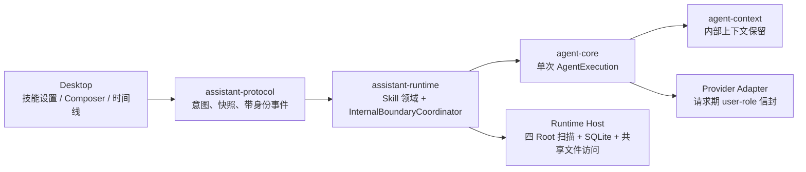

# v0.19.0 技术方案：本地 Skills 与内插消息边界

## 一、方案信息

- 版本：`v0.19.0`
- 状态：已完成并归档（2026-08-25）
- 关联设计：[`v0.19.0 功能设计`](功能设计.md)
- 实现基线：2026-08-24 当前源码、`cargo metadata --no-deps --format-version 1`、
  `cargo tree -p assistant-runtime-host --depth 3` 的实际结果
- 影响模块：`agent-types`、`agent-model`、`agent-core`、`agent-tools`、
  `agent-context`、`agent-openai-compatible`、`assistant-runtime`、
  `assistant-protocol`、Runtime Host 与 Desktop
- 不新增 crate，不改变 Desktop/Runtime 双进程拓扑；新增 YAML 解析依赖只进入
  Runtime Host 文件扫描适配层

本方案使用同一份文档分两部分展开：

1. **Skill 机制**：本地发现、启停、Session Catalog 冻结、共享资源访问、
   用户/Agent 激活、持久化和产品投影；
2. **内插机制修复与整合**：先用结构夹具复现 `read_image` 错位，再建立统一的
   内部消息边界、Run 执行段和实时/可靠对账机制，并把 `load_skill`
   Activation/continuation 接入该机制。

配套界面交互设计已单独形成；本文只固定 UI 所依赖的协议、状态所有权和
对账契约，不展开像素布局。具体交互见
[`v0.19.0 界面交互设计指导`](界面交互设计指导.md)。

## 二、源码现状与可复用基线

### 2.1 Skill 接入基线

- `AssistantRuntime::create_session` 已在 Session 入库前取得 Workspace 冻结绑定、
  Persona/Pinned Memory，并通过 `SessionEnvironmentFactory` 生成不可变目录环境和
  `SystemPromptSnapshot`。Skill Catalog 可以复用这一创建边界，不需要在每个 Model Step 扫描。
- `NewStoredSession` / `StoredSession`、正式 SQLite Store 和易失 Store 已共同承载 Session
  冻结事实；Fork 也有单一 `SessionFork` 高层操作，可以原子继承 Catalog 元数据。
- Runtime 已能在 Host Base ToolSet 上派生 `update_plan`、`update_goal`、`delegate_task`
  等绑定领域状态的工具。`load_skill` 可继续作为 Runtime 派生工具，Core 不需要认识 Skill。
- `SubmitInputRequest`、queued `UserMessage`、Input/Run 原子接受和 idempotency 已完整存在；
  用户显式 Skill 选择可作为正交的一次性提交字段，在 Input accepted 时冻结。
- `Conversation Journal`、pending Tool Exchange 和 `RuntimeRecorder` 已保证 Assistant Tool Call
  在副作用前落账、完整 Tool Result 批次可靠提交；Skill 激活应扩展这一原子边界，不能另写旁路。
- `UserPart::Injected` 已能保存“模型可见、产品隐藏”的文本；但它没有来源、边界和压缩保留元数据，
  不能继续靠字符串前缀承担所有内部消息的一致性职责。

### 2.2 `read_image` 时间线缺口

当前请求与产品时间线经过如下路径：

```text
Conversation Tool Result Image Part
→ Chat / Responses Encoder
→ request-only user-role 图片信封
→ 下一 Model Step 流式 reasoning/text
→ AgentEvent
→ RuntimeEvent
→ Desktop LiveExecutionStore
→ Conversation 可靠快照对账
```

实际代码存在四个必须修正的身份缺口：

1. `AgentEvent::TextDelta`、`ReasoningDelta`、`ToolProposed/Started/Output/Completed`
   都不携带所属 model step；只有独立的 `StepStarted` 有 step。
2. 自动压缩会在同一个 Runtime Run 中重新创建 `AgentExecution`，Core 的 step 从 1 重新计数；
   Runtime 直接把这个局部 step 发布为 Run step，没有 Run 级 offset。
3. `RunRecord` 只保留当前 reasoning/text 和累计 tools，没有可靠的 Run 内全局 step；
   `RunSnapshot` 因此也无法让断线客户端精确恢复活动段。
4. Desktop 通过“当前快照中该 Run 已提交的 AssistantMessage 数量”推断已提交 step，再把无 step
   的 delta 和工具事件追加到 `active_step`。隐藏消息、不同续段、分页窗口和消息提交时机都会
   破坏这一推断。

`read_image` 的 request-only user-role 信封目前没有错误写入 Conversation；问题不能通过
“把信封落库”修复。Provider 编码器仍应只把它作为由可靠 Tool Result 派生的请求期兼容投影。

### 2.3 依赖核查

- `assistant-runtime-host` 已直接依赖 `sha2`、`rusqlite`、`serde`、`serde_json`，适合实现
  Skill 文件扫描、digest 和 SQLite 物理格式；Skill 普通资源仍留在四个共享 Root。
- 当前 workspace 没有 YAML 解析依赖。实现时在 Runtime Host 增加
  `serde-saphyr = { version = "1.1.0", default-features = false, features = ["deserialize"] }`；
  该依赖负责 frontmatter 的 YAML
  语法解析，Runtime 领域仍只接收已经解析的候选 DTO。
- 不使用已标记 deprecated 的 `serde_yml`，也不手写 YAML 子集解析器。
- `assistant-runtime` 继续不知道用户 Home、文件句柄、SQLite 或 YAML crate；
  `agent-core`、`agent-context` 和 Provider Adapter 不增加对 Runtime 的反向依赖。

## 三、总体架构与不变量



必须保持以下不变量：

1. Runtime 是 Skill Catalog、名称启停、Activation、Run segment 和业务恢复的唯一所有者。
2. Host 只扫描、解析共享 Skill 文件并实现 Store；不复制 Skill 包，也不自行决定同名 Winner、
   调用资格或 Activation。
3. Catalog 在 Session 创建时一次冻结；既有 Session 不读取后来变化的文件或 SQLite 启停状态。
4. Skill 启用不是工具授权。`load_skill` 和用户显式激活不进入额外权限审批；Skill 指令触发的
   文件、Shell、网络等操作仍走现有 Authorizer。
5. 所有内插都先形成 Provider-neutral 的 `ContextInsertionPlan`，明确冻结源、
   顺序、存储和可见性；需恢复的内部上下文必须先可靠落账，再启动下一执行段。
6. Provider request-only 信封也使用该计划的 `RequestOnly` 策略，但不落库、不进入
   产品消息，也不创建新的 Run、segment 或 step。
7. 同一 Runtime Run 的产品 step 从 1 开始严格单调递增；新建 AgentExecution、
   内插消息、压缩和 continuation 都不得重置它。事件、可靠 AssistantMessage、
   Tool Call 和快照统一使用 `run_id + step`，Desktop 不接触执行段身份。
8. SSE 仍允许丢失；客户端断线后以 Conversation + Run Snapshot 收敛。

## 第一部分：Skill 机制

### 四、Skill 领域模型与所有权

#### 4.1 Runtime 领域类型

在 `assistant-runtime/src/skill/` 内建立私有领域模块，不新增公共 crate：

```rust
pub struct SkillName(String);

pub enum SkillSource {
    WorkspaceEzAssistant,
    WorkspaceAgents,
    UserEzAssistant,
    UserAgents,
}

pub struct SkillCandidate {
    pub name: SkillName,
    pub description: String,
    pub source: SkillSource,
    pub source_path: String,
    pub definition_digest: String,
    pub body: String,
    pub metadata: SkillMetadata,
    pub model_invocable: bool,
    pub user_invocable: bool,
}

pub struct SessionSkillCatalog {
    pub revision: String,
    pub status: SkillCatalogStatus,
    pub entries: Vec<SkillDefinitionSnapshot>,
    pub diagnostics: Vec<SkillDiagnostic>,
}
```

实际字段按最小使用面收口；类型归属遵循：

- Runtime 私有类型维护 Winner、启停、资格和 Catalog 不变量；
- Store DTO 只为持久化稳定形状服务，不直接暴露 SQL；
- Protocol DTO 只返回 Desktop 所需摘要；
- Host 扫描 DTO 表达文件事实，不携带 Session 状态机。

`SkillSource` 的唯一排序固定为：

```text
WorkspaceEzAssistant
< WorkspaceAgents
< UserEzAssistant
< UserAgents
```

这里的“小于”表示优先级更高。不同来源的同名候选按此选择；完全相同来源层级出现多个同名
有效候选时记录 `ambiguous_same_source` error，该名称不产生 Winner，不依赖文件系统顺序。

#### 4.2 名称启停

SQLite 只保存一张全局名称状态表：

```sql
CREATE TABLE skill_name_states (
    name          TEXT PRIMARY KEY,
    enabled       INTEGER NOT NULL CHECK (enabled IN (0, 1)),
    updated_at_ms INTEGER NOT NULL
);
```

- key 直接使用通过 Agent Skills 格式校验的 `name` 字段值；不拼接 source、scope、path 或 digest。
- 没有行表示启用；只有用户明确切换时写入。
- 禁用时同名全部 Candidate 均不进入 Winner，不回退到较低层。
- 开关变更只影响之后创建的 Session；已有 Session 的 Catalog 不查询此表。
- `set_skill_enabled` 使用单行 upsert 事务；这不是批量数据库操作，实现与测试只使用 Store 高层端口。

### 五、四个固定 Root 的扫描与共享访问

#### 5.1 扫描端口

`assistant-runtime` 定义文件实现无关端口：

```rust
pub trait SkillPackageSource: Send + Sync {
    fn scan(&self, request: SkillScanRequest) -> SkillScanFuture<'_>;
}
```

Host 实现从自身配置取得用户 Home；Runtime 只传入 Session 绑定的可选 Workspace 根。
Host 只扫描以下位置：

```text
<workspace>/.ez-assistant/skills
<workspace>/.agents/skills
~/.ez-assistant/skills
~/.agents/skills
```

- 未绑定 Workspace 时只扫描后两个用户根。
- Root 不存在视为空，不产生 warning。
- Root 无法读取、遍历中断或达到全局上限时返回 incomplete；Runtime 生成 unavailable Catalog，
  不把已扫到的部分结果伪装为完整目录。
- 每个 Root 只把直接子目录视为 Candidate；不沿 Workspace 祖先或其他客户端路径搜索。

#### 5.2 Frontmatter 解析

Host 先以字节级规则定位文件开头的 `---` frontmatter，再交给 YAML 反序列化器。解析结果分为：

- 必填：`name`、`description`；
- 可选：`license`、`compatibility`、`metadata`、`allowed-tools`；
- 扩展：`disable-model-invocation`、`user-invocable`；
- 未识别字段保留为 warning，不进入 Runtime 控制面。

可选字段类型错误且能够直接忽略时使用缺省并产生 warning；YAML、必要字段、名称约束或正文边界
无法确定时记录 error 并跳过 Candidate。不得自动修改名称、补引号或重写原文件。

#### 5.3 有界扫描

首版冻结以下实现上限，常量集中在 Host `resources/skills.rs`，协议只公开用户需要知道的超限诊断：

| 项目 | 上限 |
| --- | ---: |
| 四个 Root 下 Candidate 总数 | 1,024 |
| 有效 Catalog Skill 数 | 256 |
| 单个 `SKILL.md` | 256 KiB |
| frontmatter | 32 KiB |

扫描只读取有界 `SKILL.md`；`SkillCandidate` 保存候选源目录、解析后的正文和定义 digest，
不枚举或读取包内普通资源。Candidate 目录和 `SKILL.md` 必须是普通目录/文件；符号链接或
其他特殊类型记录 error 并跳过。

#### 5.4 共享 Skill 包与按需资源

四个固定 Root 是 Skill 包唯一的物理来源。Session 不创建 `private/skills`，Runtime Home
不创建 Skill 暂存目录，Fork 也不复制 Skill 文件。Catalog 保存扫描时已经解析的精确
`SKILL.md` 正文、definition digest 和共享源目录；绝对源目录不进入模型目录、revision 或协议 DTO。

规则如下：

- Activation 使用 Catalog 已保存的精确 `SKILL.md` 正文，不因共享文件随后变化而改写已冻结定义。
- Activation 可以携带共享 Skill 根目录，供模型按指令通过现有文件、图片或 Shell 工具按需访问资源；
  该路径只存在于 Runtime 内部上下文，不进入产品 DTO。
- 资源路径必须相对共享 Skill 根解析，拒绝 `..`、符号链接和规范化越界；文件大小、输出、权限、
  审批、超时和取消继续由实际工具契约处理，不新增 Skill 专属资源索引或容量预算。
- 普通资源属于共享可变文件：执行时读取当前字节，删除或变化时返回对应工具的正常错误或结果；
  已 accepted Input、已落账 Activation 和 Catalog 中的 `SKILL.md` 正文不随之改写。
- Fork 只复制结构化 Catalog 和 Conversation Activation，不扫描 Root，也不复制、链接或删除共享文件。

### 六、Catalog 构造、持久化与模型投影

#### 6.1 Session 创建流程

新 Session 的顺序固定为：

```text
解析 Workspace 绑定
→ 读取 skill_name_states
→ Host 扫描四个固定 Root
→ Runtime 校验资格、应用名称启停、选择 Winner
→ Runtime 生成完整 Catalog + revision + System Prompt Part
→ Store 原子创建 Session 结构化事实
→ 注册权限 scope
→ 发布 SessionCreated
```

单个 Candidate 错误不会阻止 Session 创建；全局扫描 incomplete 时创建
`SkillCatalogStatus::Unavailable`，Catalog 不含可调用项并保存诊断，Session 其他能力可用。

#### 6.2 Catalog revision

revision 使用：

```text
sha256-v1:<hex>
```

哈希输入是按 Skill name 排序后的稳定 JSON，包含 name、description、调用资格、source 和
definition digest，不包含绝对路径、普通资源、Session ID 或时间。相同定义得到相同 revision，
但每个 Session 仍持有自己的完整 Catalog Snapshot。

#### 6.3 System Prompt 投影

由于 Catalog 在 Session 生命周期内不变，技术方案选择把模型可见目录渲染为
`SystemPromptSnapshot` 的独立版本化 Part，而不是追加可替换的 Conversation SystemMessage：

```text
SKILL_CATALOG_V1
<available-skills revision="sha256-v1:...">
  <skill name="..." description="..." />
</available-skills>
<instruction>Use load_skill with an exact name before relying on a skill.</instruction>
```

- 只列 `model_invocable` Winner；用户可用但模型不可用的技能不进入模型目录。
- 空或 unavailable Catalog 使用明确的空目录说明；`load_skill` 工具仍稳定注册。
- 文本、名称和描述执行确定性 XML 转义；绝对路径、启停 UI 状态和诊断细节不进入模型。
- Catalog 结构化 Snapshot 与渲染成品同时持久化；恢复直接读取，不重新扫描或重新渲染。
- Catalog、基础提示词、Persona、Pinned Memory、Workspace 指令和目录环境继续以独立
  `SystemPromptSnapshot` Part 冻结；OpenAI-compatible Chat Completions 只在请求投影时按冻结顺序
  以空行合并成唯一前导 system message。该 wire 兼容层不改变 Session 快照、Fork 或恢复语义，
  避免 Qwen3.8 等只允许 `messages[0]` 为 system 的严格模板拒绝正式 Agent 请求。

#### 6.4 Store 形状

`sessions` 增量增加：

```sql
skill_catalog_json TEXT NOT NULL
```

JSON 保存 schema version、revision、status、共享源目录、完整 `SKILL.md` 定义和诊断；
不保存或复制普通资源字节。`NewStoredSession`、`StoredSession`、易失 Store、Fork 和恢复校验
同时增加 `SessionSkillCatalog`，不能由 Host 在恢复时重新扫描当前文件补写缺失字段。

旧 Session 迁移为版本化 `unavailable/legacy_session` 空 Catalog；升级后仍可使用其他能力，
不会因启动时扫描当前文件而获得与历史不一致的新 Skill。

### 七、用户显式激活

#### 7.1 协议意图

`SubmitInputRequest` 增加：

```rust
#[serde(default, skip_serializing_if = "Option::is_none")]
pub skill_name: Option<String>;
```

请求只携带用户选择的名称，不允许客户端提交 source、revision、digest、正文或路径。Runtime 在
idempotency 命中检查之后、Input accepted 之前，从目标 Session 的冻结 Catalog 解析：

- 名称存在；
- `user_invocable == true`；
- Catalog status 为 ready。

Runtime 不读取当前 SQLite 开关或文件。任一校验失败则整个 Input 不接受，正文、附件和草稿标签
仍由 Desktop 保留。

#### 7.2 原子冻结

成功时 Runtime 为该可见 UserMessage 追加一个结构化内部上下文 Part：

```text
SKILL_ACTIVATION_V1
trigger = user
name
catalog_revision
definition_digest
shared_skill_root
exact_skill_body
```

`inputs` 增量增加可空 `skill_activation_json`，与 queued message、Input、首次 Run 在同一事务接受。
该列只保存结构化身份和 trigger；精确模型文本已经在 queued `UserMessage` 中，不建立第二份可变正文。

Queue 与用户消息标签均从结构化 activation 投影名称，不解析注入文本。发送成功后清空 Composer
选择只是前端草稿行为，不删除 Input 或 Conversation Activation。

#### 7.3 Goal 与 Skill

`SubmitInputMode::{Normal, StartGoal, ResumeGoal}` 与 `skill_name` 正交。组装顺序固定为：

```text
用户 Text / FileReferences
→ Agent Variant 内部 Part
→ WorkPlan claim-time Part（如有）
→ Goal start/resume Part（如有）
→ Skill Activation Part（如有）
```

Goal objective 仍只读取用户 Text/FileReferences，不读取 Skill 或其他内部 Part。所有 Part 在首次
模型请求前已经随同一 UserMessage 可靠提交。

### 八、Agent `load_skill` 与同 Run continuation

#### 8.1 稳定工具

`load_skill` 是 `assistant-runtime` 私有派生工具，父 Run 和 child 均注册；定义始终存在：

```json
{
  "name": "load_skill",
  "parameters": {
    "type": "object",
    "properties": { "name": { "type": "string" } },
    "required": ["name"],
    "additionalProperties": false
  }
}
```

不把当前列表编译为 enum，不按空 Catalog 动态删除工具。工具只针对该 Conversation 继承的冻结
Catalog 校验 `model_invocable`，返回 `staged`、`already_active`、`not_found`、
`not_model_invocable` 或 `catalog_unavailable` 等简短结构化结果。

#### 8.2 复用现有 Tool Batch 结算边界

`load_skill` 使用既有 `ToolExecutionMode::Serial`，不新增整批调度模式，也不关闭同批其他
`ParallelEligible` 工具原有的并行能力。Core 继续按既有规则完整结算当前 Tool Call 批次；
Skill 是否生效由 Recorder 原子提交和之后的通用 continuation 决定，不与工具调度属性绑定。

每个主/child AgentExecution 持有 Runtime 的 `SkillActivationLatch`。成功执行 `load_skill` 只把
精确定义按 `ToolCallId` 暂存到 latch，不直接写 Store 或 Journal，也不改变当前批次后续工具行为。

#### 8.3 Recorder 原子提交

`ExecutionRecorder::complete_tool_exchange` 从返回 `Result<(), RecordError>` 增量为返回通用结果：

```rust
pub struct ExchangeCompletion {
    pub continuation_required: bool,
}
```

Runtime Recorder 在完整 results 齐备后：

1. 按原 Tool Call 顺序提取成功 staged 的 Activation；
2. 生成一条 Runtime-origin、transcript-hidden 的内部 UserMessage；
3. 让 `CompletedToolExchange` 同时携带 Tool Results、Activation message 和边界记录；
4. Host 在同一 staged append/SQLite 提交中完成 Assistant + Tool Results + Activation；
5. Store 成功后更新内存 Journal并返回 `continuation_required = true`。

没有新 Activation（全部失败或 already active）时返回 false，Core 在当前 AgentExecution 中继续
下一 Model Step。Store 失败时不发布工具成功终态，Session 按现有 Recorder 失败语义 fail-closed。

#### 8.4 通用 continuation 终态

Core 增加不含 Skill 词汇的：

```rust
ExecutionOutcome::ContinuationRequired {
    reason: ContinuationReason::ContextChanged,
    consumption: ExecutionConsumption,
}
```

完整 Tool Exchange 提交后，若 Recorder 要求 continuation，Core 结束当前 AgentExecution；Runtime
从已更新 Journal 构造下一份 `ExecutionInput`，在同一 RunId 下启动新 segment。预算按可靠
`ExecutionConsumption` 扣减，Run 只发布一次 started 和最终 finished。

### 九、Activation 账本、压缩与生命周期

#### 9.1 结构化账本

SQLite 增加：

```sql
CREATE TABLE skill_activations (
    activation_id     TEXT PRIMARY KEY,
    session_id        TEXT NOT NULL REFERENCES sessions(session_id) ON DELETE CASCADE,
    owner_kind        TEXT NOT NULL CHECK (owner_kind IN ('session', 'child_task')),
    owner_id          TEXT NOT NULL,
    run_id            TEXT,
    input_id          TEXT,
    message_id        TEXT NOT NULL,
    name              TEXT NOT NULL,
    catalog_revision  TEXT NOT NULL,
    definition_digest TEXT NOT NULL,
    trigger           TEXT NOT NULL CHECK (trigger IN ('user', 'model')),
    created_at_ms     INTEGER NOT NULL
);
```

账本只用于恢复 Active Skill、产品标签和诊断，不复制正文。用户 Activation 随 Input 接受写入；
模型 Activation 随 Tool Exchange completion 写入。重复同一 `name + digest` 返回 already active，
不新增账本或内部消息；同名新 digest 追加新记录并取代后续上下文中的旧版本。

#### 9.2 压缩保护

`agent-types` 保留旧 `UserPart::Injected(TextPart)` 的反序列化兼容，并增加通用结构化 Part：

```rust
pub struct InternalContextPart {
    pub id: PartId,
    pub boundary_id: String,
    pub kind: String,
    pub retention_key: Option<String>,
    pub text: String,
}

pub enum UserPart {
    Text(TextPart),
    Injected(TextPart), // 旧数据兼容
    InternalContext(InternalContextPart),
    FileReferences(FileReferencesPart),
}
```

本版本新建的 WorkPlan、Goal、压缩 continuation、委派和 Skill Activation 全部通过
`InternalBoundaryCoordinator` 构造 `InternalContext`，功能模块不得自行生成 boundary ID 或直接
拼接隐藏 UserMessage。

`agent-context` 按 `retention_key` 保护每个 key 最新的 InternalContext Part；Skill 使用
`skill:<name>`。旧版本被替换后可以进入摘要，当前生效正文必须保留。若内部 Part 与可见用户正文
位于同一消息，布局器保留整条规范消息，不拆写历史消息。

#### 9.3 Session、Fork、child 与删除

- Runtime 重启从 `skill_catalog_json` 和 activation ledger 恢复，不扫描 Root。
- Fork 复制精确 Catalog 和 fork point 之前的 Activation，不复制共享 Skill 文件；新 Session
  生成独立账本 ID。
- 归档/恢复不改变 Catalog 或 Activation。
- child 继承父 Run 创建时的 Catalog Snapshot；父 Conversation Active Skill 不自动进入 child，
  child 只能自行 `load_skill`，账本 owner 为 child。
- Session 永久删除只清理自身结构化 Catalog/Activation，不删除四个共享 Root 中的 Skill 文件。
- 历史重入按新 generation 截断 Activation ledger 到保留前缀，不能保留已被正文删除的激活记录。

### 十、Skill 应用协议与 Desktop 技术边界

#### 10.1 协议 DTO

`assistant-protocol` 增加最小类型：

- `SkillSummarySnapshot`：name、description、source label、调用资格、health；
- `SkillDiagnosticSnapshot`：severity、code、name/source/path 摘要和中文可映射参数；
- `SessionSkillCatalogSnapshot`：status、冻结技能摘要和诊断；内部 revision 不下发 Desktop；
- `ActiveSkillSnapshot`：name、trigger、activation message ID 和时间；
- `SkillActivationTagSnapshot`：用户消息/Queue 只需冻结 name；
- `ListSkills { workspace_id }`、`GetSkillDetail { workspace_id, name }`、
  `SetSkillEnabled { name, enabled }`。

`ListSkills` 在设置页打开或 scope 变化时读取当前四 Root 并生成管理诊断；它不修改任何 Session。
`GetSkillDetail` 在用户打开详情时重新扫描同一管理范围，只返回目标名称的当前摘要、正文和相关诊断；
正文不进入列表、Composer 或 Session 快照。同名同层冲突或扫描不完整时不返回不可确定的正文。
`SetSkillEnabled` 只改全局名称行并返回新的设置投影，不向已有 Session 发布 Catalog 变化。

`SessionViewSnapshot` 增加冻结 Catalog 摘要与 Active Skills；Queue item 和
`UserMessageSnapshot` 增加可空单个 Skill tag。除显式 `GetSkillDetail` 外，协议不返回 Catalog
revision、definition digest、Skill 正文、资源字节、内部快照目录或 YAML 原文；这些冻结身份
只保留在 Runtime 与持久化层。

#### 10.2 Desktop Store

- Settings Skills Store 只缓存最近一次 Runtime 查询结果；开关成功后使用命令返回值替换，
  不读取本地文件或维护第二份 enabled 状态。
- Composer draft 只有 `selected_skill_name: string | null`；再次选择原子替换，发送成功清空，
  失败保留。发送请求只携带该名称。
- Queue、Conversation 和 Context Panel 均使用 Runtime 快照中的结构化 tag/activation，
  不解析 `SKILL_ACTIVATION_V1` 文本或 `load_skill` Tool Result。
- 所有用户可见固定文案使用中文；技术标识仅在路径、技能原名和详情中出现。

## 第二部分：内插机制修复与整合

### 十一、先复现再修改契约

#### 11.1 脱敏结构夹具

第一项实现工作不是改事件类型，而是把真实数据中已经核对的最小结构写成测试夹具，只保留：

- Run/message/part/call 的伪造 ID；
- Assistant、Tool、request-only user envelope 的相对顺序；
- step、segment、事件 sequence 和 commit 时点；
- reasoning/text/tool 的空或固定短文本。

不得复制真实用户正文、图片、工具参数、绝对路径或 Provider credential。

#### 11.2 三层失败测试

修复前必须至少得到一个稳定失败用例，并分层定位：

1. **Adapter fixture**：Chat 与 Responses 都断言图片 user-role 信封只出现在完整 Tool Result
   批次之后、下一 Assistant 之前，并且不回写 Conversation。
2. **Runtime fixture**：同一 Run 依次产生 tool step、可靠 commit、下一 step reasoning/tool，
   再覆盖同 Run 新 AgentExecution 从局部 step 1 开始的情况。
3. **Desktop fixture**：在 SSE delta、`ConversationCommitted`、SessionView 重读、分页窗口和
   相同 PartId 跨 step 重用时，证明旧实现会把 reasoning 或 Tool Call 归到错误 step。

若稳定失败只在 Desktop 出现，也仍按本方案补足 Runtime 身份；若 Adapter 顺序本身失败，则先修
Adapter，但不能用 Adapter 修复代替产品对账契约。

### 十二、统一内部消息边界

#### 12.1 两层共用的 `ContextInsertionPlan`

不为 `read_image`、`load_skill`、Goal 或 WorkPlan 分别定义“如何插入消息”。
`agent-types` 提供不含 Runtime ID 的 Provider-neutral 插入计划：

```rust
pub struct ContextInsertionPlan<T> {
    pub source_identity: T,
    pub placement: ContextInsertionPlacement,
    pub persistence: ContextInsertionPersistence,
    pub visibility: ContextInsertionVisibility,
    pub payload: ContextInsertionPayload,
}

pub enum ContextInsertionPersistence {
    Canonical,
    RequestOnly,
}
```

- Runtime 内部边界使用 `Canonical` 计划，`source_identity` 是已冻结的
  message/boundary/run/segment 身份；
- Provider 请求信封使用 `RequestOnly` 计划，`source_identity` 是已落账的
  ToolMessage/Part 身份；
- 两者复用相同的 placement、persistence 和 visibility 语义及测试矩阵，但不让
  Provider Adapter 倒向依赖 Runtime 或自行生成产品身份。

#### 12.2 `InternalBoundaryCoordinator`

在 `assistant-runtime` 建立一个通用协调器，输入只包含：

```rust
pub struct InternalBoundaryRequest {
    pub owner: InternalBoundaryOwner,
    pub run_id: Option<RunId>,
    pub source: InternalBoundarySource,
    pub visibility: InternalBoundaryVisibility,
    pub retention_key: Option<String>,
    pub text: String,
}
```

协调器负责：

- 分配稳定 `boundary_id`；
- 构造 `InternalContextPart` 和需要时的 Runtime Hidden UserMessage；
- 绑定 owner、Run segment、前置可靠 message 和存储策略；
- 生成 Store DTO 与产品隐藏策略；
- 禁止功能模块直接发布 step 或 Desktop 时间线事件。

`InternalBoundarySource` 覆盖 Skill Activation、Goal、WorkPlan、Context continuation 和 Delegation；
它是 Runtime 私有领域 enum，不进入 Provider wire。未来新增来源必须接入协调器，而不是复制构造逻辑。

#### 12.3 三种存储/可见性

| 类型 | 规范 Conversation | 产品转录 | 示例 |
| --- | --- | --- | --- |
| 可见规范消息 | 写入 | 显示真实用户气泡 | 带 Skill tag 的用户输入 |
| 隐藏规范消息/Part | 写入 | 不显示正文 | Agent Skill Activation、Goal continuation |
| request-only 投影 | 不写入 | 不显示 | Tool Result 图片 user-role 信封 |

前两类必须先落账再派生模型请求；第三类只能由已冻结规范消息确定性生成。

#### 12.4 Provider 请求期插入

Provider-neutral 请求组装器从规范 Tool Results 生成通用 `RequestOnly`
`ContextInsertionPlan`；Chat 与 Responses 编码器只将其编码为各自 wire 形状：

```text
source Assistant Tool Call batch
→ ordered Tool Results
→ optional request-only user image envelope
→ next canonical message
```

该计划不创建规范 MessageId、Runtime boundary、产品事件或 step。其可测试身份由
source ToolMessage/Part IDs 确定性派生，仅供 request trace/fixture，不落数据库。

### 十三、Run 执行段与单调 Step

#### 13.1 可靠执行消费

`ExecutionOutcome` 的全部终态都返回 `ExecutionConsumption`，不能只在 CompactionRequired 中提供。
Runtime 用 completion 的可靠消费推进游标，不从可能丢失的 `StepStarted` 事件计数。

#### 13.2 Runtime 游标

每个活动主 Run 和 child 各持有：

```rust
pub struct RunExecutionCursor {
    pub segment_ordinal: u32,
    pub next_step: u32,
    pub completed_tool_calls: u32,
}
```

- 首个 AgentExecution 使用 `next_step = 1`；每次 Compaction 或 ContextChanged
  continuation 只增加 Runtime 内部 `segment_ordinal`，不重置 `next_step`。
- Runtime 创建 AgentExecution 时把 `next_step` 作为起始序号一次性传入 Core；
  Core 从该序号直接递增并发出最终产品 step，Runtime 不对每条事件做
  `local_step + offset` 二次映射。
- Core 的直接 SDK 用法缺省从 1 开始；Core 只理解“起始 step”，不识别
  RunId 或 segment。预算仍使用本次 AgentExecution 的 `ExecutionConsumption`。
- AgentExecution 终态返回可靠消费后，Runtime 用已消费 step 数推进
  `next_step`；不从可丢失的 `StepStarted` 计数。
- 新 segment 只能在上一 segment completion 和所需内部边界可靠提交后创建；
  overflow、取消和失败不回退已分配 step。

`segment_ordinal` 只用于 Runtime 恢复、预算和 continuation 诊断，不进入
`assistant-protocol`、RuntimeEvent 或 Desktop Store。

产品序号示例：

```text
Run Step 1：模型调用 read_image 并完成工具落账
→ request-only 图片信封（不分配 step）
Run Step 2：模型读取图片后继续
→ load_skill Activation / continuation 边界（不分配 step）
Run Step 3：新 AgentExecution 的首次模型调用
```

#### 13.3 所有事件显式归属

Core `AgentEvent` 的 delta、usage 和全部工具事件直接携带 Run 内全局 step；
Runtime 只绑定产品 owner，不改写 step：

```text
session_id
run_id / child_task_id
step
part_id 或 call_id
```

`StepStarted` 仍存在，但只是该身份的边界事实；Desktop 即使漏掉它，也能从任意后续事件的
`run_id + step` 创建正确容器。模型 retry attempt 属于同一 step，不分配新 step。

#### 13.4 可靠消息映射

`run_message_refs` 增加可空兼容列：

```sql
segment_ordinal INTEGER,
step            INTEGER,
boundary_id     TEXT
```

新写入的 Assistant Tool Call、Tool Result、内部 Activation 和最终 AssistantMessage 必须带完整
step；`segment_ordinal` 只供 Runtime 恢复和诊断。旧行为空时产品投影保持
`None`，Desktop 只对旧历史使用顺序展示，不把它参与活动对账。

`AssistantMessageSnapshot` 只增加 `step`；Tool Result 仍并入对应 Tool Group，
不单独显示消息。内部 UserMessage 的 boundary 记录用于恢复和调试，但不进入普通 ConversationPage。

### 十四、可靠提交、快照与 Desktop 对账

#### 14.1 工具提交事件顺序

当前工具执行完成事件可能先于 Tool Exchange 可靠提交。改为：

```text
ToolStarted / ToolOutput（观察）
→ 工具执行完成，暂存最终状态
→ Recorder complete_tool_exchange
→ Store + Journal 成功
→ ConversationCommitted
→ ToolCompleted（可靠提交后的活动终态）
→ StepCommitted(run_id, step)
→ 可选 ContinuationRequired
```

Store 失败时 Run 以 Recorder error 收敛，不发布成功 `ToolCompleted`。`ConversationCommitted`
在每次主/child Tool Exchange 和最终 AssistantMessage 提交后发布，而不是只在 Input/Run 结算时发布。
`StepCommitted` 表示该 Run step 的规范消息已可靠落账；它是快速收口信号，
即使 SSE 丢失，Desktop 也能从携带 `run_id + step` 的 Conversation/RunSnapshot 恢复。
无工具的最终回答则在 Runtime 可靠提交 AssistantMessage 后依次发布
`ConversationCommitted`、`StepCommitted` 和 `RunFinished`。

#### 14.2 RunSnapshot

活动 `RunSnapshot` 增加 `active_step`，并只投影尚未进入可靠 Conversation 的
当前 step reasoning/text/tools。开始下一 step 前清空上一 step 的易失活动投影，因为上一 Tool
Exchange 已可靠提交；断线客户端从 Conversation 读取历史，从 RunSnapshot 读取活动尾部。

#### 14.3 Desktop 精确合并

`LiveExecutionStore` 改用 `(run_id, step)` 为唯一 step key：

- delta 用事件自带 step 写入，不调用 `updateCurrentStep` 猜测；
- ToolStarted/Output/Completed 用 `(run_id, step, call_id)` 定位；
- Conversation 快照按可靠 AssistantMessage 的精确 identity 删除对应 live segment/part/call；
- 相同 PartId 在不同 step 可合法重用，不跨 step 合并；
- 分页窗口不完整时只对当前返回的精确 identity 对账，不用 Assistant 数量推导全局 step；
- sequence gap、未知事件或 Runtime 重启继续触发 SessionView 重读。

可靠消息可见后，live delta 无闪烁地被同 identity 的规范 segments 替换；文本相同不是去重条件。

### 十五、`load_skill` 与内插机制的整合点

Skill 机制不得自己实现执行段或 UI 对账。唯一整合路径为：

```text
load_skill Tool Call
→ SkillActivationLatch（Runtime 私有，尚未落账）
→ 通用 Recorder 完成整个 Tool Batch
→ InternalBoundaryCoordinator 生成 Activation
→ Store 原子提交 Tool Results + boundary + hidden message + activation ledger
→ Core 返回通用 ContinuationRequired
→ RunExecutionCursor 推进全局 next_step，开启 Runtime 内部下一 segment
→ 下一 AgentExecution 使用已更新 Conversation
```

用户显式 Skill Activation 不需要 continuation：它在 Input accepted 时已成为首次模型请求所用
UserMessage 的内部 Part。Agent 激活必须 continuation，因为当前 Tool Batch 已按旧上下文执行完毕。

Goal/WorkPlan/压缩/委派逐步迁移到 `InternalBoundaryCoordinator` 后，仍保留各自领域状态机；协调器
只统一消息构造、身份、落账和投影，不接管 Goal generation、WorkPlan revision 或 Skill Winner。

### 十六、迁移、恢复与失败分类

#### 16.1 兼容迁移

- 所有 SQLite 变更为 additive migration；旧 Session Catalog 缺失时写入 legacy unavailable 默认值。
- `UserPart::Injected` 保持可读；新代码只写 `InternalContext`。历史消息不批量重写。
- RuntimeEvent/Protocol 在当前早期阶段直接增量演进并重新生成 TypeScript；所有生产者、Host 转发、
  Desktop 消费和序列化 fixture 同步修改，不保留双轨事件。
- `run_message_refs` 旧行 identity 为空时保持历史只读；不扫描 JSONL 猜 step 回填。

#### 16.2 稳定失败

协议新增或细分以下安全错误/诊断：

- Skill Catalog unavailable、Skill not found、not user/model invocable；
- Skill resource snapshot failed / exceeded；
- Skill name state persistence failed；
- Internal boundary persistence failed；
- Execution identity unavailable（视为 Runtime 内部不变量并 fail-closed）。

路径和 YAML 原始错误只进入本机设置诊断，Run 错误与普通日志使用稳定 code 和受限摘要。

#### 16.3 崩溃恢复

- pending Tool Exchange 已开始但未完成时沿用 started marker 恢复；不重放工具或 `load_skill`。
- Tool Results 与 Activation 在同一 completion 中，因此恢复后不存在“Tool Result 成功、正文缺失”。
- 已持久化 boundary/activation 但未启动下一 segment 时，Run 恢复按现有 interrupted/fail-closed
  语义处理，不在启动时自动调用 Provider；用户通过既有恢复入口继续。
- Runtime 重启不恢复易失 SSE delta，只从 Conversation、Run Snapshot、Catalog 和 activation ledger
  重建产品状态。

### 十七、安全与信任边界

- Skill 包是本地不可信内容；解析有界、拒绝特殊文件和路径逃逸，不执行脚本。
- Skill 来源层级不产生权限差异；只要名称在 Session 冻结 Catalog 中可调用即可激活。
- `allowed-tools` 仅保存和展示，不写 Authorizer allow rule。
- 共享资源路径进入模型前确定性转义；Catalog 产品投影不泄露原始 Home/Workspace 绝对路径。
- Shell 可以绕过结构化文件授权，界面继续明确它以当前用户权限运行，不把共享 Skill Root
  描述为 OS 沙箱。
- SQLite migration、恢复与测试只使用 `TempDir`/内存 fixture；本方案阶段不打开、迁移或写入用户
  实际 Runtime Home 数据库。

### 十八、跨模块改动表

| 模块 | 主要改动 | 明确不承担 |
| --- | --- | --- |
| `agent-types` | `InternalContextPart`、`ContextInsertionPlan`、兼容序列化和消息身份接缝 | Skill Winner、RunId、UI DTO |
| `agent-model` | 消费请求期 insertion plan、公共 placement 规划 | Runtime boundary 持久化 |
| `agent-tools` | 复用既有 `Serial` / `ParallelEligible` 调度属性 | Skill 领域和权限判断 |
| `agent-core` | 可注入起始值的单调 step、带 step 事件、可靠 consumption、通用 continuation | Skill、Session、RunId |
| `agent-context` | 按 retention key 保护最新内部上下文 | 读取 Skill Store 或 SQLite |
| `agent-openai-compatible` | Chat/Responses 共用图片信封 placement helper | 创建产品消息或 step |
| `assistant-runtime` | Skill 领域、Catalog/Activation、boundary coordinator、为 Core 提供 Run step 起始值 | YAML、SQLite、真实文件 I/O |
| `assistant-protocol` | Skill DTO、提交意图、Run 内单调 step 事件与快照 | 执行段身份、正文、路径内部结构、数据库记录 |
| Runtime Host | 四 Root 扫描、YAML、共享路径安全读取、SQLite migration/事务 | Winner/Activation 状态机、Skill 包复制 |
| Desktop | Skill 草稿/设置投影、精确实时对账 | 解析注入文本、推断 Winner/step |

### 十九、验证策略

#### 19.1 Skill 领域与扫描

- 四 Root 精确优先级、缺失 Root、不可读 Root、同名覆盖、同层冲突和确定排序。
- YAML 必填/可选/类型异常、调用扩展缺省、候选特殊文件、symlink 和定义大小/数量上限。
- 名称开关按单一 name 生效、禁用无下层候补、开关只影响新 Session。
- Session Catalog revision 稳定、空/unavailable、共享源目录持久化、Fork 不创建私有 Skill 副本。

#### 19.2 激活与恢复

- Composer 单名称提交、再次选择由 Desktop 替换、失败保留、成功清空草稿。
- Input accepted 原子保存 user Activation，Goal objective 排除内部 Part。
- `load_skill` 稳定 schema、unknown/qualification/already active，且不改变同批其他工具的既有调度。
- 多个 Agent Activation 按 Tool Call 顺序一次落账；全部失败不 continuation。
- Store 各失败点不会形成半 Activation；重启、压缩、Fork、child 和历史重入恢复正确。

#### 19.3 内插边界与事件身份

- 修复前的脱敏 `read_image` fixture 稳定失败，修复后 Chat/Responses placement 都通过。
- Tool Result Image、Skill Activation、Goal、WorkPlan、压缩 continuation 和委派使用同一
  boundary 测试矩阵。
- 同 Run 多 AgentExecution 后 step 仍单调递增、相同 PartId 跨 step、并行 Tool Call、事件丢失、
  sequence gap、分页中段和 Runtime 重启均不串位。
- 故意丢弃 `StepStarted` 但保留后续 reasoning/tool 事件时，Desktop 仍能仅依据
  `run_id + step` 创建正确分组；无任何按消息数量或 segment 的兼容分支。
- ToolCompleted 只在可靠 commit 后成功发布；ConversationCommitted 覆盖每个 Tool Exchange。

#### 19.4 Store、Protocol 与 Desktop

- SQLite migration、旧行默认、约束、事务回滚、孤儿快照清理只在隔离 `TempDir` 验证。
- Protocol Rust/TypeScript round-trip、旧可选字段、事件 JSON fixture 和所有生产/消费点编译。
- Desktop Store 单测、组件测试和 Playwright 覆盖运行中、重读、断线、窄屏和中文文案。
- 正式 Host 离线 E2E 使用 Fake Provider，覆盖用户 Activation、Agent Activation continuation、
  `read_image` 后 reasoning/tool、重启和 Fork，不访问真实 Runtime Home。

实现阶段的版本级门禁仍为：

```bash
cargo fmt --all --check
cargo clippy --workspace --all-targets --all-features -- -D warnings
cargo test --workspace
cd apps/desktop && npm run build
cd apps/desktop && npm run tauri -- build --no-bundle
```

## 二十、明确拒绝的方案

- 不动态注册/移除 `load_skill`，不生成当前名称 enum。
- 不扫描四个固定 Root 之外的位置，不加 watcher 或当前 Session Catalog 替换机制。
- 不按来源保存启停开关，不把 Skill 启用变成权限审批。
- 不在每个 Model Step 重扫文件或重新渲染 Catalog。
- 不把 Skill 正文塞进 Tool Result，也不让 `load_skill` 工具执行时直接写 Conversation。
- 不让 Provider Adapter 创建产品消息、Run segment 或持久 boundary。
- 不持久化 request-only 图片 user-role 信封。
- 不让 Desktop 按 Assistant 数量、事件先后、工具名或文本相等推断 step/去重。
- 不为 `read_image`、`load_skill`、Goal、WorkPlan 分别保留专项时间线补丁。
- 不为减少 Session 快照重复而提前建设全局 Skill blob 引用计数和 GC。

## 二十一、实施入口与已确认取舍

技术方案建议按以下技术依赖顺序进入开发计划：

1. 脱敏结构夹具与修复前稳定复现；
2. 通用内部边界、Run 内单调 step 和 Desktop 对账；
3. 四 Root 扫描、Catalog/SQLite 冻结与共享源绑定；
4. 用户显式 Activation 与产品协议；
5. `load_skill`、原子 Activation 和同 Run continuation；
6. 压缩/Fork/child/恢复与正式 Host/Desktop E2E。

这一顺序只表达技术依赖，不是开发计划或里程碑授权。配套
[`界面交互设计指导`](界面交互设计指导.md)与
[`开发计划`](开发计划.md)已经形成；开发计划确认后仍只能从 M0 开始，
不能据此连续实施后续里程碑。

以下技术取舍已经确认：

1. Catalog 作为 Session 创建时冻结的 `SystemPromptSnapshot` Part，而不是 Conversation 中的
   replacement 消息；
2. Catalog 冻结精确 `SKILL.md` 定义与共享源目录；普通资源不按 Session 复制，始终由四个
   共享 Root 持有并通过既有工具按需访问。
