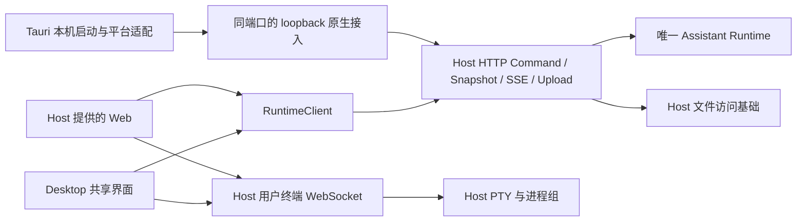

# v0.25.0 技术方案：Host 开放访问与 Web 兼容

## 一、方案信息

- 版本：`v0.25.0`；状态：技术方案已确认并定稿；版本已于 2026-09-07 获用户验收确认并归档，M0—M7 已完成；未执行平台项见验收记录。
- 定稿日期：2026-09-06。
- 依据：[已定稿功能设计](功能设计.md)、[界面交互设计指导](界面交互设计指导.md)、
  [开发流程](../../specs/开发流程规范.md)、[Rust 架构规范](../../specs/Rust架构设计规范.md)。
- 影响：`apps/runtime-host`、`apps/desktop`、`assistant-protocol`，以及 Runtime 配置解析的有限调整。

本文是已确认功能范围对应的技术实施基线，明确职责、接口、配置、生命周期、打包和验证要求。
正文为本版实施基线；版本已获用户验收确认。第十一节保留原验证要求，实际覆盖与未执行项以验收记录为准。
入口页保留已获认可的当前效果，其余交互设计与独立火箭素材按[开发计划](开发计划.md)
安排审阅与接入，不将媒体制作结果自动视为正式功能验收。

## 二、现状核查

### 2.1 代码与依赖依据

下表记录版本启动时的 v0.24 基线；M2 同端口调整以第四节为准。

| 核查对象 | 当前事实 | 本版处理 |
| --- | --- | --- |
| [Host endpoint](../../../apps/runtime-host/src/endpoint.rs) | 动态 `127.0.0.1:0`、私有发现文件、进程 token | 改为唯一固定端口，默认 `7240`；本机与非本机共用 HTTP／HTTPS 服务 |
| [Host server](../../../apps/runtime-host/src/server.rs)、[HTTP 路由](../../../apps/runtime-host/src/http/mod.rs) | 一套 Runtime、Command／SSE／上传／资源接口，无正式 Web 静态页 | 唯一监听复用处理与业务实例，提供同一份 Web |
| [认证](../../../apps/runtime-host/src/http/auth.rs) | 精确 Host／Origin 与进程 Bearer；没有密码、Cookie 登录态 | 在此增加普通登录认证，不向公网分发进程密钥 |
| [配置源](../../../apps/runtime-host/src/config_source.rs)、[模型配置编辑](../../../crates/assistant-runtime/src/config/editor.rs) | 私有文件、原子替换、已有 revision/CAS；`toml_edit` 保结构修改 | 新增 Host 私有配置节，沿用同一写入约束 |
| [Runtime 配置](../../../crates/assistant-runtime/src/config/schema.rs)、[语音配置](../../../apps/runtime-host/src/speech/config.rs) | 同一配置文件中已允许 Host 私有 `[speech]`，Runtime 不编译其凭据 | 沿用此归属方式容纳 `[host_access]` |
| [前端客户端](../../../apps/desktop/src/runtime-client/RuntimeClient.ts) | 指定 base URL 后可复用 HTTP／fetch SSE，但构造输入仍耦合原生 bootstrap | 拆开目标准备与业务客户端，保留命令和事件逻辑 |
| [连接协调](../../../apps/desktop/src/stores/RuntimeLifecycleCoordinator.ts) | 已有 `lifecycle_generation`；重连仍默认调用本机 bootstrap，部分异步结果缺少目标核对 | 重连绑定当前目标，复用已有代次处理迟到响应 |
| [原生资源](../../../apps/desktop/src-tauri/src/native_resource.rs) | 多处自行调用本机 bootstrap，再执行上传、资源读取 | 原生上传绑定已选目标，不能仅修改前端请求地址 |
| [Host 文件资源](../../../apps/runtime-host/src/http/resources.rs) | 会话范围解析、目录读取、预览与限制已有实现 | 提取共用读取部分，保留各入口的路径策略 |
| [用户终端](../../../apps/runtime-host/src/user_terminal/mod.rs)、[进程监督](../../../apps/runtime-host/src/user_terminal/process.rs)（M4 迁移后的路径） | 设计时 portable-pty、进程组清理、输出 ACK 均在 Desktop | M4 已移到 Host，传输由 Tauri Channel 换为 WebSocket |
| [资源快照](../../../apps/desktop/src/features/resource-workspace/resourceWorkspaceSnapshot.ts)、[偏好桥接](../../../apps/desktop/src/native-bridge/desktopPreferences.ts) | 原生偏好可保存；Web 读默认、写空操作；快照包含终端启动描述 | 增加 Web 存储并区分 Host，Web 不保存或恢复终端 |

已执行 `cargo metadata --format-version 1 --no-deps --offline --locked` 和
`cargo tree -p assistant-runtime-host --depth 1 --offline --locked`。当前 workspace 有 20 个包，
产品版本为 `0.24.0`。Host 已有 `axum 0.8.9` 的 `multipart/ws`、`axum-server 0.8.0`
的 `tls-rustls`、`rcgen 0.14.9`、`reqwest 0.13.4`、Tokio、getrandom 和 SHA-256。
TLS／WebSocket 依赖已经由设备接入使用；可复用库，不复用设备配对身份、证书或业务服务。
Desktop 当前持有 `portable-pty 0.9.0` 和 Unix 进程组相关依赖。

初次技术设计核查未读取或写入用户数据库，也未执行产品构建、真实认证或跨机功能测试；后续实施与 M6 问题定位以开发进度及验收记录为准。

### 2.2 最小新增核对

| 必要增量 | 现有能力为什么不足 | 所有者与替代关系 |
| --- | --- | --- |
| 密码校验与内存登录表 | 进程 token 不能作为公开登录密码或浏览器长期凭据 | Host；不新增用户表、账号服务、JWT 或刷新 token |
| 唯一 Host listener | 用户确认本机与远端同端口；原生权限由真实 TCP 来源、Host／Origin 和凭据共同校验 | 默认 `7240`，HTTP／HTTPS 二选一；不增加第二监听或 Runtime |
| 当前目标连接上下文 | 本机启动信息不能代表用户选中的远端地址，原生上传也必须知道目标 | Desktop 客户端；不保存第二份会话业务状态 |
| Host 目录选择入口 | 会话内相对目录接口不能选择未登记目录 | Host 文件适配；复用目录读取，不放宽会话范围 |
| PTY WebSocket 适配 | Tauri Channel 无法服务普通浏览器 | Host 迁入现有 PTY 实现，不增加持久终端实体 |
| 浏览器文件／偏好适配 | 浏览器没有 Tauri dialog、原生临时文件句柄或偏好文件 | 就近扩展现有 bridge；不重写前端框架 |

删除新增层后仍可由现有事实表达的部分不另建机制：不新建节点身份、配对表、文件映射数据库、
通用 Client SDK、事件总线、配置服务、迁移框架或全局连接 revision。

## 三、目标架构与职责

产品组成只有两种：

| 产品形态 | 组成 |
| --- | --- |
| 桌面级 | Desktop + Host + Client |
| 服务器级 | Host + Client |

两种产品中的 Host 使用同一套 Runtime 与 Web 能力，随所属应用一起打包、发布。
“Host 独立进程”描述运行架构，不表示存在单独的 Host 产品或发行包；上述组件组成也不直接
等于进程数量，不据此新增 Client 进程。具体 Client 装配与服务器级交付安排由对应版本设计明确，
本条不改变已经确认的 CLI 版本顺序。



- `assistant-runtime` 继续拥有 Session、Run、配置业务投影和持久化；Host 只做接入、静态资源、
  文件 I/O 与用户 PTY。工具权限与 Agent Shell 不因网页登录而改变。
- Tauri 继续负责本机发现／启动、系统浏览器、原生文件选择、Keychain、窗口与托盘。
  这些本机能力与“当前连接远端 Host”分别表达。
- `assistant-protocol` 只补双方确实使用的 DTO 和能力标记；HTTP Cookie、TLS、Axum、PTY
  进程句柄和登录表均留在 Host。沿用现有协议生成流程，禁止手改生成的 TypeScript。
- Runtime 间通信、设备 Gateway 和客户端直连互不替代。本版不使用 iroh，不新增外层节点协议。

## 四、Host 监听、配置与部署

### 4.1 一个监听，同一端口

2026-09-06 M2 反馈确认：取消本机动态端口与外部端口的分离。一个 Host 只运行一个 HTTP／HTTPS
监听，默认 `0.0.0.0:7240`；Desktop、本机 Web 和其他设备共用端口。同一机器的多个 Host
显式配置不同端口；冲突时报错，不随机改号或连接另一个 Runtime Home。

`run/runtime.json` 继续只交付本机 `127.0.0.1` 地址、所选协议、进程身份及私有 bootstrap token。
`RuntimeServer` 拥有唯一 socket 和受监督服务任务，是关键子系统；Host 访问模块只持有配置命令、
密码、登录表和远程访问策略，不再拥有另一套 listener。开启／关闭远程访问只改变接入策略。

访问 IP 无需登记；自定义域名通过 `server_names` 逐项精确允许。Host Header 的端口必须与当前
监听一致，Origin 需同源或属于既有原生客户端白名单；不信任 Forwarded／X-Forwarded-*。
本机判定同时要求实际 TCP peer 为 loopback 且 Host 是 `127.0.0.1`／`localhost`；bootstrap 还要求
精确发现 authority、原生 Origin 和有效进程 token。仅伪造 Host／Origin 不能获得本机权限。

监听默认接收 IPv4 接口上的 TCP 连接，但非本地请求在访问开关关闭时拒绝，包括静态页与登录。
这是应用层访问开关，不声称关闭了操作系统端口。HTTP／HTTPS 共用全部路由和同一个 Runtime，
不嗅探协议、不在一个端口上同时维护 HTTP 与 HTTPS，也不增加反向代理。

### 4.2 配置位置与生效

沿用既有 `config.toml`、`LocalConfigSource` 与 CAS；本版未发布的中间字段直接统一，不保留
`listen_address`／`public_origins` 别名或自动迁移。示意：

```toml
[host_access]
password_hash = "<Argon2id PHC 字符串，由设置或本机初始化生成>"
remote_enabled = false
scheme = "http"
port = 7240
server_names = [] # 使用域名时填写，例如 ["assistant.example.com"]
# tls_certificate = "/absolute/path/host.crt"
# tls_private_key = "/absolute/path/host.key"
```

- 配置节缺失时使用 HTTP、7240、无密码、远程关闭，不自动覆盖配置文件；端口限 1—65535。
- `host_access` Command 返回脱敏状态；密码／私钥正文不回显。密码即时生效，普通登录沿用原有
  撤销规则；未设置密码禁止开启远程访问，文件配置缺少密码时同样保持关闭。
- 访问开关和域名列表经校验、CAS 后立即生效；关闭或更换允许域名使旧远程 SSE／传输连接结束，
  本机连接继续。已接纳的 Runtime Run 不因访问开关变化取消。
- 端口、协议及证书在启动时冻结。先关闭远程访问才能修改；保存时校验端口、证书形状与可加载性，
  修改端口时检查当前明显占用，但不新增长期监听。保存后 `restart_required=true`，当前地址继续工作，
  必须显式重启 Host 才生效；待重启期间不能开启远程访问。
- 本机 Desktop 复用既有重启确认与活动任务影响提示，不自动重启。其他客户端提示在 Host 所在机器
  重启；重启按既有生命周期结算 Run，不再承诺改端口不影响活动任务。
- 唯一端口被占用或 HTTPS 证书无法加载时启动失败，不再另开本机救援端口、不降级 HTTP；用户通过
  该 Host 的本机配置修正端口或证书后重试。运行中的错误保存不破坏当前监听。
- 状态中 `listener_state` 表示远程接入已开启／关闭／失败；`restart_required` 由已保存配置与当前
  监听配置比较得出，不新增持久化状态或独立版本计数。实际网络可达性仍需连接验证。
- 配置命令由原有有界队列串行处理；普通配置 reload 更新密码和访问策略，监听相关变更仍待重启。
  访问服务异常时拒绝新的远程接入、结束已有远程流；HTTP 服务异常则沿用 HostSupervisor 的关键故障关闭。

### 4.3 应用内 Host 的首次设置

桌面级应用继续通过 Desktop 设置页完成首次设密；服务器级应用没有 Desktop，由其应用启动／
配置入口完成本机初始化。两者复用 Host 的同一配置与密码逻辑，不要求另行安装 Host 产品。

底层沿用现有 `ez-assistant-runtime serve`，增加仅供本机启动时使用的 `--password-stdin` 参数：
读取一次有界标准输入、生成散列、以同一配置编辑流程写入，随后正常启动。取得既有单实例锁后
才允许写入；若 Host 已运行则明确退出，不暗中修改正在运行实例。密码不放命令参数、环境变量、
日志或发现文件，不增加交互式 CLI 客户端、找回密码命令或远程未认证初始化接口。

应用启动／配置入口按此顺序准备包内 Host：配置协议与端口，仅选择 HTTPS 时准备证书路径；
以该启动选项设置密码并启动，按配置的 HTTP／HTTPS 地址用浏览器登录，也可先保持远程关闭。
后续正常启动不再读取密码。该参数是应用组件的启动能力，不是独立 Host 分发或新的会话 CLI；
服务器级应用的具体用户入口随 Client 方案确定。本版开发／验证说明可提供 shell 隐藏输入示例和 stdin 约定
（移除一组行结束符、不裁剪密码本身），用户不需要手算散列。

### 4.4 HTTP 与可选 HTTPS

HTTP 是正式支持的接入方式，不限于 loopback 或开发环境；密码登录、快捷 token、业务接口、
文件和终端使用同一套认证。HTTP 不提供传输加密，HTTPS 提供 TLS 传输加密；不另叠一套应用层
加密，也不增加 HTTP 风险确认页。非本地访问仍需设置密码并显式开启。

用户选择 HTTPS 时，使用其提供的 PEM 证书链与私钥，复用 `axum-server/rustls`。设置页仅在
HTTPS 模式显示证书／私钥的 **Host 文件路径**字段和校验反馈；不把客户端文件路径误当 Host
路径，也不通过页面回传私钥正文。不复用设备 Gateway 的自签名身份或证书指纹体系。
以下证书要求仅适用于 HTTPS：

- 域名访问：证书的 SAN 覆盖该域名，使用客户端已信任的签发链。
- 内网 IP 访问：准备含目标 IP SAN 的证书，可由自己的 CA 签发；通过可信渠道把 CA 安装到
  客户端系统／浏览器信任库，再输入该 IP 连接。单纯生成自签名证书并不等于浏览器已经信任。
- macOS 原生 HTTPS 请求使用当前 reqwest 的平台证书校验，WKWebView 使用系统信任；需实测两条路径
  对同一证书都成功。不会只通过 Rust 请求就宣称 WebView 也可用。Firefox 如有独立证书库需单独导入。
- 证书过期、名称不符、缺少信任链时连接失败，不提供跳过校验。禁止重定向携带凭据到其他 origin。
- 本机发现同样使用所选协议；启用 HTTPS 时证书还须覆盖 `127.0.0.1`，本机客户端也必须信任证书。没有明文本机旁路或跳过证书校验。

选型核对：[reqwest TLS 文档](https://docs.rs/reqwest/0.13.4/reqwest/tls/index.html)。本地已检查
0.13.4 的 `async_impl/client.rs`，默认 rustls 路径调用平台 verifier；实际证书部署仍待实现验证。

## 五、认证与快速登录

### 5.1 两种凭据，单所有者

| 凭据 | 使用方 | 接受范围 |
| --- | --- | --- |
| 既有进程 bootstrap token | 本机受信任 Desktop | 同一监听上的本机请求；真实 loopback TCP peer、精确发现 Host／原生 Origin、有效 token |
| 普通登录 token | 远程 Desktop、所有 Web | 本 Host 登录表校验；通过 Bearer 或 Web Cookie 携带 |

来源为 loopback、同源网页或知道端口都不是身份。进程 token 不被非本机请求或自定义域名请求接受，
无论所选协议是 HTTP 还是 HTTPS。域名列表不放宽浏览器 Origin；Vite 的 localhost origin 只在
显式开发构建启用。业务路由不因返回图片、下载文件或建立 SSE 而绕过认证。

密码使用 Argon2id 散列并保存 PHC 字符串，采用成熟库而非普通 SHA-256；初始参数明确为
19 MiB 内存、2 次迭代、并行度 1、随机 16 字节 salt，受控配置解析拒绝异常大的参数。
新增 `argon2 0.5.3`，符合现有 Rust 下限；这是密码认证缺少的必要依赖。
接口限制密码输入为 1—1024 UTF-8 字节，拒绝全空白但不修改用户密码内容。
登录散列并发上限 2；密码尝试采用 Host 整体 30 次／分钟、突发 5 次的有界限制，超限 `429`
并提供重试时间，不建设持久封禁表。认证不能通过固定 IP 的无限队列拖住 Runtime 执行任务。
参考：[RustCrypto Argon2 0.5.3](https://docs.rs/argon2/0.5.3/argon2/)。

普通 token 用现有随机源生成 32 字节随机值，Host 内存仅保存其摘要、到期时间与所属连接的取消
信号。有效期固定 7 天，不滑动续期、不分 access/refresh token。Host 重启全部失效；退出仅
撤销当前登录，改密撤销全部普通登录。原生进程凭据不因改密失效，本机仍可进入设置。
登录表上限 64，先移除过期项，满时明确拒绝新增，不随机踢掉其他客户端。

每个受保护请求取得当前有效凭据上下文；SSE、PTY 和长上传同时观察撤销及到期信号，不能只在
连接建立时校验。撤销终止客户端传输与所属 PTY，不撤销 Runtime 已接纳的 Agent Run。

### 5.2 最少的登录接口

- `POST /auth/login`：密码方式创建普通登录；token 方式校验并使用已有登录条目。
  已认证 Desktop 也可携带自己的 Bearer 调用同一接口创建另一个普通登录，供浏览器使用。
  三种输入互斥，均走同一登录表；没有快捷入口专用签发／兑换路由。
  Web 同源调用设置 Cookie 并只返回脱敏状态；Native／Tauri 调用返回 token，客户端保存在内存。
- `POST /auth/logout`：撤销当前普通登录并清除 Cookie。原生本机连接不通过此接口清除进程密钥。
- Desktop 打开 Web 所用的是独立的**普通登录 token**，与密码登录使用同一生成、存储、到期
  和撤销逻辑。浏览器退出不会同时退出 Desktop，不需要单独的 Web 票据状态。
- 普通未登录访问业务返回 `401`；登录失败统一显示密码错误或登录已失效，不返回散列／内部诊断。

Cookie 为 host-only、`HttpOnly`、`SameSite=Strict`、`Path=/`，固定到期；HTTPS 使用 `Secure`，
HTTP 不设置 `Secure`，本机和非本机 HTTP 使用同一规则。Cookie 名按协议与访问端口区分，避免同机双 Host 在同一浏览器中覆盖登录；Host 仅读取
当前协议及端口对应的 Cookie，避免切换协议时旧 Secure Cookie 阻止 HTTP 登录 Cookie 写入。
Web 使用同源 `credentials`，不把 Cookie 内容复制进
localStorage；Desktop 使用内存 Bearer，不依赖跨站 Cookie。来源见
[Cookie 属性说明](https://developer.mozilla.org/en-US/docs/Web/HTTP/Reference/Headers/Set-Cookie)。

Cookie 认证的变更请求必须带精确同源 Origin；缺失、`null`、不匹配时拒绝。原生无 Origin 请求
必须用 Bearer。跨源 Desktop 仅允许登记的 Tauri origin，不返回宽泛 credential CORS。
若一个请求混用不同身份的 Cookie 和 Bearer，拒绝歧义而不任意挑选。

### 5.3 快捷链接

流程：Desktop 向**当前 Host**申请普通登录 token → 系统浏览器打开
`<当前 Host Web origin>/#token=...` → 页面立即读入内存并 `history.replaceState` 清除 fragment
→ 同源 POST 登录 → 成功进入工作台，失败展示密码表单。

采用 fragment 避免 token 进入 HTTP 请求路径；不使用 query、密码链接或原生 bootstrap token。
页面引导先清理链接，再初始化业务请求或打开外链，设置 `Referrer-Policy: no-referrer`，
日志与错误中统一剔除凭据。登录接口与 token 响应 `Cache-Control: no-store`。
本方案**没有短时一次性票据或额外兑换系统**：链接里的普通 token 在到期／退出／改密前可以重用，
其有效期与普通登录相同。这是从简方案的明确边界。

本机没有密码时，未经认证 Web 无首次设密权限；本机 Desktop 显式申请的快捷登录仍是有效认证，
可进入设置。非本地监听仍受“必须设置密码”约束。

### 5.4 可选记住密码

首版 macOS Desktop 提供默认关闭的“记住密码”，只在认证成功后保存到系统 Keychain，条目按
规范化的远端 origin 区分。复用锁文件已含的 `security-framework` 库版本作为 macOS 直接依赖，
调用其密码 API；不引入跨平台凭据框架，也不把密码写入偏好 JSON。
参考：[security-framework passwords](https://docs.rs/security-framework/latest/security_framework/passwords/index.html)。

进入入口页仍等待用户选择；读取已保存密码仅预填对应目标，不自动连接或在失效后循环尝试。
取消勾选并成功连接时删除对应保存项；Keychain 不可用时允许本次连接，并说明未记住。
Web 只维持登录态，不提供应用自建的密码存储。未覆盖平台不启用记住密码入口，不回退明文保存。

## 六、Desktop 与 Web 客户端接入

### 6.1 目标准备与业务客户端分离

在现有连接协调模块中区分 `local` 与显式远端 origin。准备目标返回业务客户端所需的 base URL、
认证方式、instance ID 和 capabilities；`started_runtime` 保留在本机生命周期中，不再作为
所有 RuntimeClient 都有的属性。Web 目标固定为 `location.origin`，通过 Cookie 接入。

Desktop 本机 bootstrap 与远端密码验证仍在受信任原生桥完成；HTTP／SSE 业务维持现有前端
RuntimeClient。Native 只保存当前选中目标的不可变连接上下文，供原生上传使用，不复制业务快照。
原生资源调用必须带连接绑定标识并在 Native 核对；标识由原生连接上下文创建，供旧任务拒绝访问新
目标，不是服务器业务 ID、全局计数或新增持久 generation。

远端地址允许显式 `http://` 和 `https://`，不允许 userinfo、query、fragment 或任意路径。
客户端使用用户输入的协议，不因非 loopback HTTP 拒绝连接或擅自改成 HTTPS。API 请求禁止
跨 origin 重定向。前端目标字符串、浏览器任意链接不得直接覆盖原生当前连接及其凭据。

### 6.2 入口、重连与切换

1. App 显示入口时并行准备本机 Runtime；仅更新本机准备状态，不自动进入工作台。
2. 用户提交目标后认证、读 capabilities、建立 SSE，再沿用“订阅后取快照、按 observed sequence
   接续事件”的现有流程；初始数据成功才呈现工作台。失败保留目标与错误。
3. 入口选择另一目标或设置提交切换时，推进已有 `lifecycle_generation`，废弃旧连接意图；
   不增加取消按钮。设置中未提交的选项切换只修改表单。
4. 真正切换即禁用旧工作区交互，丢弃草稿／选中文件，关闭本客户端 PTY、上传与请求、资源 controller
   和 SSE；清空旧投影后加载目标。失败显示当前切换错误，不恢复旧草稿、不静默改连本机。
5. 每次 await 后及事件回调应用前核对现有代次和客户端对象身份，包括 application snapshot、
   session/child、设置、上传、文件预览及图片解码。A→B→A 不能只比较 `instance_id`。
6. 普通断线只重连既定目标；本机目标可重新发现本机，远端目标不能调用本机 bootstrap。
   `401` 或协议不匹配停止自动重试并要求处理；网络故障沿用有界退避。
7. 重连恢复查询与事件订阅，不重放发送消息、审批、上传提交等有副作用操作；不确定的提交结果
   先按原会话快照／既有幂等语义确认。

进入工作台后入口组件卸载，设置中显示同等连接表单；不再导航返回入口页。
本机 Host 在远端连接期间仍可能运行。托盘、本机停止／重启明确指向“本机 Runtime”，不得把
远端当前连接替代本机生命周期目标；客户端退出不向远端发 shutdown。原生本机进程控制命令在
Host 校验原生凭据，普通网页登录不获得本机进程控制权限。

### 6.3 兼容实现的位置

保持原有组件与 bridge 的对外语义，在现有调用边界按客户端能力分支；Host 网络部分交给当前
RuntimeClient／同一连接上下文。Tauri API 延迟载入，Web 初始化不得调用原生插件。

| 能力 | 本机 Desktop | 远端 Desktop | Web |
| --- | --- | --- | --- |
| 上传选择／剪贴板图片 | 原生实现 | 原生选择，上传至选中 Host | `File`／ClipboardEvent 与 FormData |
| 工作区目录选择 | 可保留原生 dialog，Host 最终校验 | Host 目录选择器 | Host 目录选择器 |
| 会话文件、附件、交付预览 | 既有适配与共享预览 | 当前 Host 字节接口 | 同源字节接口 |
| Host 路径在 Finder 打开 | 原生路径能力 | 隐藏；不能打开客户端同名路径 | 隐藏 |
| 内嵌网页 | 保留现有 child WebView | 保留 Desktop 浏览器能力 | 隐藏入口 |
| 用户终端 | Host PTY | Host PTY | Host PTY |
| 打开 Web 快捷图标 | 本机 Host URL | 当前远端 URL | 不重复提供打开自身的入口 |

Web 本身不承诺录音权限跨所有浏览器一致；现有相关入口要按真实浏览器能力判断，不因平台
检测失败阻断聊天、文本输入或文件上传。

### 6.4 Desktop 内嵌网页与浮层（M2 反馈收口）

2026-09-06 用户确认按区域判断遮挡并以网页截图占位。通用 Dialog／DropdownMenu／
SelectionPopover／Tooltip 及 Composer 定位浮层声明 `data-overlay-region`，只描述自身绘制范围；
BrowserSurface 读取 Shell 显式提供的 portal 和网页占位框，在同一 CSS 视口中计算矩形相交。
Dialog 注册遮罩，其他浮层注册内容；未定位、隐藏与零尺寸区域不计入，退场期间仍计入。
这些注册区域按既有 Shell 层级位于正文上方，不从任意业务 DOM 推测层级，也不使用鼠标命中
代替视觉判断（Tooltip 可禁止鼠标命中）。现有遮罩和矩形菜单按此契约处理，异形透明区域不做像素级检测。

原生显隐调用保持串行与去重。HTML 浮层独立渲染，不再等待原生返回后修改整个 portal 的
visibility；滚动、尺寸和定位变化只重新测量，只有网页布局／遮挡结果变化才发调用。
窗口缩放或恢复可能由 Tauri 隐藏 child WebView，因此单独重应用可见布局。

BrowserController 只为当前可见页面保留一张最近截图，原生网页正常显示时最多每秒更新一次；
有遮挡、窗口隐藏或离开资源页时停采样。截图绘制在原生页面下方，原生隐藏后露出，解除遮挡时
恢复同一页面。导航（包括同 URL 重载）、切换、释放都会清理快照和取消其结果所有权，不持久化
图片、不给 Host 增加实体或业务协议。图片是最近画面的静态占位，并非隐藏期间的实时视频。

新增私有 `capture_resource_browser` Tauri command，仅 `main` 可访问受管网页。macOS 使用
WKWebView.takeSnapshot，复用已由 Wry 引入的 objc2 0.6.4、block2 0.6.2 和 Apple bindings 0.3.2，
许可证为 MIT／Zlib／Apache-2.0，MSRV 1.71；仅启用必要 feature，不引入新运行进程或通用截图插件。
截图长边上限 1024 逻辑像素，PNG 编码上限 2 MiB、等待上限 2 秒；单个原生回调持有采样 permit，
超时后也不叠加任务。失败／平台未实现时使用中性占位，原网页和浮层仍可正常操作。
当前原生截图仅实现 macOS，Windows／Linux 使用上述降级，不记为截图验收通过。

用户已明确允许本处原生调用例外：Desktop package 的 unsafe lint 设为 deny，仅截图 FFI
函数局部 allow 并标注安全说明；其他 workspace 成员保留 forbid。对象仅在主线程使用，回调
将图片复制为 owned bytes 后发送，不传播原始指针，不写盘、不申请屏幕录制、不注入外部页面。
同一适配文件提供空值安全的原生 URL 读取，供截图归属校验和既有地址轮询复用：Wry 0.55.1
对尚未提交页面的 nil URL 会直接 unwrap，必须避开该路径。私有 `resource_browser_url` 可以返回
null，此时客户端保留用户输入的地址；页面加载事件使用事件自身的 URL，不重复读取原生地址。

## 七、文件与上传

### 7.1 一套读取基础，不同路径用途

在 Host 现有资源模块内拆出私有文件读取帮助函数，负责目录条目、权限错误、内容嗅探、受限读取
和流式下载。优先复用 `agent-tools-local` 已有受限文件读取能力；不引入另一个文件管理服务。

| 入口 | 输入与限制 | 输出 |
| --- | --- | --- |
| `POST /host-files/list` | 已登录；绝对 Host 目录，可从 home／root 开始，支持 include_hidden | 当前规范路径、父路径、目录／文件条目、truncated |
| `POST /host-files/select-directory` | 已登录；任意 OS 可访问目录，Host 检查确实存在且为目录 | 规范绝对路径，供既有工作区保存命令使用 |
| 既有 session resource list／preview | Session ID + `SessionResourceLocator`；仍受冻结会话根目录限制 | 沿用当前 DTO／资源结果 |
| `POST /host-files/preview`、`POST /host-files/download` | 已登录；Host 绝对路径或合法 file URI；只读 | 共用预览或下载字节，不返回原生文件句柄 |
| 既有附件／tool-file／child preview | 沿用所属 Session／message／resource reference 查询 | 原有内容与来源校验 |

`host-files` 接口之所以允许任意目录，是单所有者已经确认的 Host 文件访问能力；不是把该策略
套用到会话接口。界面不会把 Host 工作目录描述成 Agent Shell 的安全沙盒。
工作区选择后，保存与实际使用仍重新检查路径；选择成功不是永久授权文件句柄。

- 任意目录入口允许符号链接并返回规范目标；会话入口解析链接后仍必须在其授权根内。
  无权限、失效链接、已删除路径分别返回可展示错误，不偷偷换到 home。
- 沿用目录上限 2000 与 `truncated`，只读取一层；不递归扫描磁盘。支持隐藏项开关和手输完整
  路径，条目被截断也不阻止选择已知路径。本版不新增递归索引、分页数据库或导出根目录名单。
- 保持当前协议 UTF-8 路径边界；非 UTF-8 文件名不能错误转成另一个路径，跳过并给出有条目
  无法显示的提示。操作系统无权限目录仍不可选，“任意目录”不意味着提权。
- session 范围路径应通过句柄相对打开／拒绝跟随未经校验的链接来保证校验与读取一致，防止
  canonicalize 后路径被替换造成越界；不要把“先检查、再任意打开”当充分保证。
- 文本预览沿用 4 MiB，图片／PDF 16 MiB，并在读取过程中检查预算；当前 metadata 后一次性
  read 的路径应改为有界读取，不能只相信开始时的大小。图片继续限制边长／像素数。
- 超过预览限制提示下载；下载按固定 chunk 流式发送、有取消与背压，不把整个文件编码为巨型
  base64。Markdown／文本按既有安全渲染规则展示，HTML／SVG 等不作为同源可执行页面返回；
  下载设 attachment、nosniff 和安全文件名，用户内容不进入静态 SPA fallback。

### 7.2 资源归属

Assistant 消息中的相对路径、file URI 和工具交付引用按当前 **Host** 解析。远端连接时，
不能走客户端 `registerLocalFileUri` 然后读取客户端磁盘。原生临时上传选择仍属于客户端，
使用已有 selection ID 与 Host 文件来源区分。
保留 `local_file` 作为既有客户端本机来源，新增 `host_file` 来源分支承载 Host 路径；两者是
不同机器的资源位置，不能只靠显示名或运行平台推断。Host 文件分支只在所属目标的查看状态内
恢复并重新请求 Host；旧 `local_file` 偏好仍只归本机，远端／Web 不把它重解释为有效 Host 路径。
已有 session_file、attachment、tool_file 引用保持原语义，客户端上传继续用 selection ID。

PDF／图片使用认证 fetch 得到的 Blob URL 或同源受保护字节路径；对跨域 Desktop 不把 Bearer
附在资源 URL 上。关闭预览、切换 Host 和卸载时释放 Blob URL／原生临时资源。
Native-only 的路径解析和系统打开接口仅对原生本机上下文提供；远端读取字节无需先换成本机路径。

### 7.3 浏览器上传兼容

现有 selection ID 继续标识待发送附件；Web 私有内存表存 `File/Blob`，界面、草稿和持久偏好
只持有现有元数据。浏览器文件选择或粘贴图片创建该选择，释放选择时删除引用。刷新后不可恢复
已选择文件，也不读取浏览器虚构的路径。

已建会话使用现有 streaming upload；首次发送使用现有 materialization manifest／multipart
流程。浏览器 FormData 必须符合既有字段顺序、引用和提交语义，不先把整文件转 base64。
沿用 1 GiB 上传上限与现有 staging／失败清理规则；fetch 被 abort 不等同于服务端一定未提交。
处理结果必须核对连接上下文，迟到回执不能挂入新 Host 的草稿或会话。

原生上传保留选择文件与本地流式读；Rust 请求从已选目标上下文取 origin/token，移除该路径中
隐式本机 bootstrap。切换时取消旧操作，同时保证关闭旧操作不会误取消新目标操作。

## 八、Host 用户终端

### 8.1 所有权与传输

把现有 `user_terminal` 的 PTY 创建、shell 环境过滤、I/O 与进程组回收迁到 Host 私有模块。
`portable-pty` 及所需 Unix 依赖随实际使用迁移；不放入 `assistant-runtime` 或 Agent Shell。
前端 xterm、标签和 resize 行为继续复用。

采用 `GET /user-terminals/socket`，**一个 WebSocket 对应一个 PTY**，连接就是操作所有权。
WebSocket 地址由当前 Host URL 推导：HTTP 对应 `ws://`，HTTPS 对应 `wss://`；业务 SSE 同样
沿用所选 HTTP／HTTPS，不额外要求 TLS，也不把 HTTPS 页面连接到明文 WS。
不允许凭 terminal ID 从另一个连接接管；不创建持久终端表或运行输出日志。
Web 同源 Cookie 在 upgrade 校验；Desktop 浏览器 WebSocket 无自定义 Authorization Header，
在已校验 Host／Origin 的连接首帧发送 Bearer。首帧认证完成前不创建 PTY，5 秒未认证关闭；
不把 token 放 query 或子协议字符串。使用现有 Axum ws 依赖。

控制帧是有界 JSON：认证／创建来源、resize、ACK、close；输入和输出用二进制帧。
创建来源继续为 session + locator 或 workspace ID，由 Host 查询权威目录，不直接信任
客户端提供的任意 shell 启动路径。创建成功返回原有 terminal ID 与目录显示名；本机和远程
使用同一终端前端接口。退出／错误也是该 socket 控制消息，不塞进 Runtime 会话 SSE。

### 8.2 流控与限制

- 保留现有单个 32 KiB 输出 chunk、最多一个未 ACK chunk；xterm 消化后确认再继续。
  重复 ACK 不累计额度。控制处理与阻塞 PTY 读取分开，等待 ACK 时仍能响应关闭、撤销和心跳。
- 输入单帧不超过现有 16 KiB，Host 写入后返回 `input_ack` 再接收下一块；尺寸继续 cols 2—1000、rows 1—500；其他控制帧不超过 8 KiB。
- 初始限额为 Host 总计 32 个 PTY，单登录最多 8 个；原生本机凭据同样受限。未认证握手
  占用另外 32 个短暂握手额度，全部 socket（含关闭中）最多 64 个，不能耗尽 PTY 任务或无限累积慢关闭连接。限制命中给出可理解错误。
- 心跳每 10 秒一次，30 秒无响应关闭；心跳不依赖输出 ACK。网络写入和关闭有截止时间，
  不因客户端不消费而保留无限消息。

### 8.3 刷新、断线和退出

| 事件 | 行为 |
| --- | --- |
| 关闭终端标签／客户端切换 Host | 关闭该 socket，Host 结束其 PTY 和进程组 |
| Web 刷新／页面离开 | 主动关闭连接，立即丢弃终端标签；新页面不恢复、不自动新建 Shell |
| 普通网络断开 | 检测到断开即回收；无连接恢复／PTY 接管期，用户需要时手动新建 |
| 突然掉线、浏览器崩溃 | 不依赖 unload，最迟在心跳失效后进入回收 |
| 普通登录退出／到期／改密 | 撤销信号关闭该登录对应的 socket 与 PTY |
| Desktop 仅隐藏窗口 | 客户端仍活着时维持自身连接，沿用现有隐藏语义 |
| Host 停止 | Supervisor 停止新建，取消全部 PTY，等待进程组清理，再完成 Runtime 持久化收尾 |

复用现有 PTY close 的 3 秒清理预算、子进程监督与错误上报；这表示刷新发起关闭后立即结束
终端的使用生命周期，不承诺浏览器崩溃时 Host 能在同一毫秒知道。掉线检测最多 30 秒再加回收预算，
不把这段检测时间当成离线保活产品能力。

单 socket 退出不清理整个 Host 的终端。Session 视图切换不等于关闭标签；已有标签所有权仍归
客户端连接。Session／工作区删除不能留下未经管理的 PTY：Host 在既有删除命令成功分支通知
终端 owner 关闭相关来源，创建时重新检查来源并与该清理串行核对，避免刚删除又创建的竞争；
不新增会话事件总线，也不能只依赖某个 Web 页收到事件后的清理。

PTY 子任务及 join handle 归 Host Supervisor 的终端子系统，连接内监督 reader/writer；禁止
无 owner 的 spawn。回收失败保留诊断与受控句柄，不假称子进程已退出，不能妨碍 Runtime Store
最终 flush。终端目录不是权限沙盒，也不改变 Agent Shell 的审批语义。

## 九、Web 页面、偏好与正式打包

### 9.1 同源 Web 与静态资源

复用 `apps/desktop` 的 React/MobX 页面和 Vite 构建。入口按运行环境选择 Desktop 选择页或
Web 登录页，登录后使用同一业务组件。不另建 Web 应用仓库，也不把 Desktop child WebView
改造成 iframe。静态页面公开但不含用户数据；业务 API 始终认证。

正式 Host 二进制内嵌前端构建产物，随所属应用交付：桌面级包含 Desktop、Host、Client，
服务器级包含 Host、Client。两种形态中的 Host 都提供同一套 Web，不单独制作 Host 发行包。
新增小型 Host build script，根据显式前端产物目录生成文件索引和 `include_bytes!`，输出仅在
`OUT_DIR`；不手写生成文件、不把运行时 Runtime Home 当静态根，不额外依赖通用静态网站服务。
脚本校验产物与产品版本一致，并只嵌入发布文件，不包含 source map、源文件或凭据。

本版既有桌面构建链调整为：协议检查／前端 build → Host release build（嵌入前端）→
prepare-sidecar → Tauri 打包。完整桌面级产品按其版本装配 Desktop、Host、Client；服务器级
产品按其版本装配 Host、Client，两者都使用同一份包含 Web 的 Host 构建。
Rust 单元开发构建可在没有页面时提供明确的“Web 资源未构建”响应；release 构建缺少产物
必须失败，不能交付缺失 Web 的 Host 组件。E2E 按相同顺序准备应用内 Host，不新增独立 Host
分发脚本。Client 的具体产物与应用装配步骤留在对应版本方案，不在本版预设另一套构建链。
build script 跟踪文件变化与产物目录，防止嵌入上轮旧页面。该流程不依赖已运行的 Vite/CDN。

静态路由只服务构建清单内文件；`index.html` 禁止缓存，内容 hash 资源可长期缓存。API 路径
不参与 SPA fallback。页面设置 `frame-ancestors 'self'`、`base-uri 'none'`、nosniff 与 referrer
策略；禁止用资源文件路径任意读取 Host 磁盘。

### 9.2 CSP 与平台裁剪

- Web 使用同源 HTTP／SSE／WS；Desktop `connect-src` 在现有 loopback 外允许 HTTP/HTTPS/WS/WSS
  目标，这是手动连接任意服务器所需的具体放宽。认证仍限定请求目标，禁止全局 `*` 和外部脚本。
- Monaco worker、字体、图标、xterm、图片／PDF Blob 等按现有实际用途声明 CSP。
  Web 的 `frame-ancestors 'self'` 允许继承页面策略的 Blob PDF 被自身预览；Desktop 额外列出
  精确的 `tauri://localhost`，兼容 WKWebView 对自定义协议的来源匹配。仍拒绝外站嵌入，
  `frame-src blob:` 与 `object-src 'none'` 保持不变。M6 原生对照验证了原策略导致 PDF 空白。
  保留已修复的 xterm inline style 支持及现有安全脚本策略，不能因“收紧”样式再次破坏正式终端。
- Web 菜单隐藏内嵌浏览器、Finder、托盘、窗口／退出策略及本机 Runtime 启停，处理器也应返回
  明确不支持，不能只隐藏按钮后仍执行 invoke。

HTTP 正式链路同时核查 WKWebView 的 ATS／混合内容限制及打包配置，不能仅凭 Rust 请求成功
或调整 CSP 就宣称 Desktop 可用；也不要求用户关闭浏览器保护。需要的 Web 内容网络配置限定
在 Desktop 平台适配，保持 HTTPS 证书校验。本机 HTTP 通过不代替第二台机器的明文 HTTP 验收。

非 loopback HTTP 页面中的安全上下文 API 需做能力检测：异步剪贴板复制不可用时提供可选中的
文本供手动复制；文件选择继续使用 `<input type="file">`，粘贴图片使用用户触发的 paste 事件；
录音等不可用能力就地说明。检查 MCP 设置等直接调用 `crypto.randomUUID()` 的位置，非安全
上下文复用既有普通请求／行 ID 生成方式；登录 token 仍只由 Host 安全随机源生成。
这些兼容项不能阻断普通 HTTP 登录、聊天、文件上传、目录查看或终端。
依据：[浏览器安全上下文限制](https://developer.mozilla.org/en-US/docs/Web/Security/Defenses/Secure_Contexts/features_restricted_to_secure_contexts)。

### 9.3 查看偏好

沿用当前 `ResourceWorkspaceSnapshot` 的轻量描述和校验；Web 保存到 localStorage，origin
天然隔离 Host，再按现有 session／draft scope 区分。不新建稳定节点 ID；Host 换地址／本机
用户修改端口后不承诺自动找到另一个 origin 的浏览器偏好。

Desktop 的原有偏好字段继续只归本机，不搬动已有本机用户数据；远端按规范化 origin 保存同类
轻量查看状态，目标数设置有界上限。窗口尺寸／全局主题仍是客户端偏好。
所有偏好恢复都重新查询目标资源，不能把旧内容或路径当有效授权；不同客户端不互相同步标签。

Web 保存时排除 browser／terminal 标签、文件正文、PTY 输出、Blob、File、token 和密码；
加载旧描述时同样忽略不适用类型。Desktop 保持已发布的本机轻量偏好行为，恢复终端描述只能
手动激活后新建，绝不恢复旧进程；Web 刷新始终不自动重建终端。
存储不可用或格式损坏时显示默认布局，不影响连接和业务；不增加双读双写迁移层。

### 9.4 已审阅入口视觉的生产接入

当前基准为稀疏 DOTS、淡色规则网格、倾斜侧转视角、减小起伏和轻微鼠标相机跟随，无中央放射球。
正式实现固定 Demo 已验证的 Vanta 0.5.24 与兼容 Three r134，在入口组件内封装；本地
打包脚本与许可证，不保留 CDN 运行依赖。规则网格是对 DOTS 的局部扩展，应固定其几何访问边界，
不猴子补丁全局 Three，不把 Demo 外部调参控件搬进产品。

只在入口可见时创建渲染资源；进入工作台、卸载、失去页面可见性时释放或暂停。限制像素比、
共享点阵几何、降低窄屏负载；粗指针／reduced-motion 禁止鼠标跟随。WebGL 不可用时显示静态
背景，连接表单始终可操作。实际 WKWebView 性能仍需验证，Demo 无脚本错误不是生产性能结论。

M5 已将独立动画任务的 v01 RGBA 序列转换为 10 张透明 WebP 图集（120 帧／30 fps／4 秒，
约 3.2 MiB），懒加载播放器并只缓存当前及下一张解码图集（约 60 MiB 像素缓存）。成功连接及
初始快照就绪后才开始转场；Desktop 首次连接和 Web 密码／token／Cookie 登录共用实现，Web 退出或失效后重新登录重播，Desktop 设置切换不重播。入口在 16—48 帧上移淡出，工作台在 68—100 帧显露；转场期间
工作台 inert，结束后移交焦点。加载超过 1.2 秒、解码停顿超过 200 ms、减少动态或后台切换
时直接收束，不改变连接事实。Desktop CSP 允许同源包内图集请求，macOS WKWebView 已验证
透明播放；2026-09-07 用户确认 Desktop／Web 最终视觉合成，M5 完成；正式包平台验收继续在 M6 记录。

## 十、协议、配置与已有数据影响

| 项目 | 调整与消费者核对 |
| --- | --- |
| Command／SSE 业务基线 | 原有 RuntimeCommand、事件、snapshot、materialization、upload 继续使用；不再封装一个 Runtime 间协议 |
| Host 访问 DTO | 在 assistant-protocol 补客户端共用的配置输入／脱敏状态／普通登录结果；HostCommand 外壳仍由 Host 路由处理，前端对应分支同步 |
| 文件 DTO | 优先复用目录条目／预览结构，仅补任意目录输入和确认结果，不重复 session locator |
| 终端 DTO | 复用原有 source／size／exit 语义；有实际两端使用的帧类型可进 protocol，连接和进程所有权留 Host |
| 能力握手 | 在既有 capabilities 补 Web 登录／Host 目录／Host PTY 标记；同版本客户端要求所需能力，不建旧客户端分支 |
| 协议版本 | 本次接入认证与终端契约同步改动，现有 PROTOCOL_VERSION 从 1 改为 2，沿用既有不匹配错误并提示更新；不是新增版本机制 |
| config.toml | 加可选 Host 私有节，原有模型、MCP、语音与用户配置保留；schema version 1 不因增加可选节自动提升 |
| SQLite／会话持久化 | 本方案不新增表、不修改 Session/Run/Message 数据，不读取或迁移用户数据库 |
| 发现文件 | 本机进程发现和私有 token 继续使用；不放公开登录 token、不建立远端发现注册表 |
| 客户端偏好 | 原本机字段仍归本机；增加远端命名空间和 Web 本地存储，不把旧目录自动归给远端 |

必须核对的消费者包括正式前端、Native 上传／资源／本机进程管理、Host 路由与配置载入、
协议生成／漂移检查、现有 Host 集成夹具、Desktop E2E、sidecar 准备和 macOS 发布脚本。
版本号来自同一产品版本源；HTTP／WS 认证、byte response、缓存和退出都纳入核查。

Host 与 Desktop 同版本发布，不支持新 Host 搭配旧 Desktop；不为此增加兼容别名、旧路由或
双协议。此结论不授权损失已有用户配置和会话：若实现发现必须迁移或破坏已发布数据，先回到
设计说明具体影响，不能把技术方案确认当成数据库破坏性操作授权。

## 十一、验证设计

以下为后续实现应执行的验证，本轮仅完成源码、依赖和文档核查。按直接影响组织定向验证，
再在版本验收阶段跑仓库规定的完整检查，不反复用无关全量测试替代边界验证。

| 对应验收 | 必须覆盖的场景与证据 |
| --- | --- |
| A1—A3、A12 | 同一正式 Host 的本机 Desktop／Web、第二台机器 Desktop／Web；HTTP 与 HTTPS 分别成功，HTTP 无证书也可用；空密码拒绝外部访问；错误密码、HTTPS 证书错误、端口冲突；保存失败保留当前监听，启动失败由本机配置修正 |
| A2、A15 | HTTP／HTTPS 匿名访问 Command/SSE/upload/file/PTY 均失败；loopback Web 不免登录；进程 token 在两种协议的非本机请求中都失败；Origin/Host 错误拒绝；两种协议的 Cookie、fragment 快捷登录及 WS/WSS 可用；退出／到期／改密后失效 |
| A4、A11、A16 | 本机静默启动、无自动连接；设置切换丢弃草稿；A→B→A 的迟到 snapshot、SSE、资源、上传不污染；断线不重新提交输入或回本机；退出不停止旧 Host Run |
| A5 | 真实浏览器 File／粘贴图片；首次 materialization、已建会话上传、取消、提交后断线、容量限制与 staging 清理 |
| A6—A8 | 另一机器 Host 未登记目录、根/home/隐藏项/手输路径/2000 截断；无权限、符号链接、链接替换、读取中增长、超大图片；session 不能越界，客户端同名路径不被误打开 |
| A9、A13 | 真实 PTY echo、resize、退出码、ANSI/中文；暂停消费后的流控；刷新不重建；断网／进程崩溃后有界回收；两个客户端互不清理；改密/Host 停止/来源删除回收 |
| A10、A13 | Web 没有原生调用错误；HTTP 安全上下文 API 缺失不阻断 MCP 设置、上传与基本操作；目录/预览/偏好可用；存储禁用仍能工作；Web 不恢复终端；本机 Desktop 原生浏览器、系统打开、隐藏窗口与原本机偏好不回归 |
| A14—A16 | 正式 release 内嵌资源在无 Vite／无 CDN 时完整可用；缺少静态产物拒绝 release 构建；正式 CSP 下 xterm/Monaco/图片/PDF；Keychain 无明文文件；入口背景降级／释放及 Web 快捷入口 |

平台基线：macOS arm64 正式 Desktop/WKWebView 与同机 Safari、Chromium；第二台独立机器运行
相同应用版本中的 Host，分别以真实 HTTP 与 HTTPS IP 或域名验证跨机器路径；两者都需覆盖正式 WebView
与浏览器，不用 HTTP 通过替代 HTTPS 校验，反之亦然。优先沿用已有受支持 macOS 主机。
Linux 服务器级应用在对应版本交付时须另给包内 Host 的启动、证书和 PTY 回收证据，不作为
本版独立 Host 发行项。Windows 产品入口当前未支持，不能把通用 Web 能打开误记为 Windows
Native 已验收。手机浏览器窄屏可查基础布局，不代替原生 App。

典型检查：前端协议检查与 `npm run build`、定向前端/E2E、Host 认证/资源/PTY 测试；发布前
`cargo fmt --all --check`、`cargo clippy --workspace --all-targets --all-features -- -D warnings`、
`cargo test --workspace`、`npm run tauri -- build --no-bundle`，并验证应用包内 Host 的内嵌页面。
集成测试可直接启动包内 Host 进程，这属于组件验证，不构成独立分发产品。
涉及需要用户实际操作或第二台机器的证据，明确记录未执行项，不用 mock、关闭证书校验或独立
Demo 替代正式链路。

## 十二、定稿结论与实施边界

2026-09-06，用户确认以下七项技术决策并要求整理定稿。正文按此形成统一实施基线：

1. 本机与远程共用唯一端口，默认 `7240`；开关和域名即时生效，端口／协议／证书关闭远程后修改、显式重启生效；HTTPS 可选。
2. 使用现有配置文件与 CAS；桌面级通过设置初始化，服务器级应用可复用包内 Host 的 stdin 初始化能力。
3. 普通登录 token + Web Cookie；快捷入口用普通 token fragment，没有一次性票据或刷新体系。
4. macOS 可选 Keychain 记住密码；用户仍手动选择连接。
5. Host 共用文件读取，任意目录与会话目录分别校验；原生上传也必须绑定当前目标。
6. 一个 socket 一个 Host PTY，断线回收、不恢复；Web 刷新不恢复标签或自动新建 Shell。
7. 同一前端内嵌进正式 Host，随桌面级／服务器级应用交付；现有业务协议延续，本版 Host/Desktop 同版本调整。

接口、参数、限额和依赖采用正文确定的方案。证书接入、监听切换、登录到期、进程回收和媒体
性能属于实现验证项，按第十一节取得证据；不能用设计确认代替产品验证。

技术方案已定稿；用户随后授权按[开发计划](开发计划.md)连续推进到 M2，版本已于 2026-09-07 验收归档。真实跨机器与正式 WKWebView 可信 HTTPS
正向验证未完整执行，保留在验收记录；文件、PTY 与 Desktop／Web 火箭页面合成已获用户确认。

## 十三、M5 补充：MCP／Skill refresh（2026-09-07）

沿用 `SubmitSessionCommand`，增加 `SessionCommand::SkillRefresh`；MCP 的 DTO 与 `/mcp refresh`
保持原样。移除 Composer、RootStore、Runtime 接纳、Store 接纳／提交及恢复中对 Standard role 的限制。
控制指令不依赖模型，Session 控制能力不再以 MCP 服务是否装配作为总开关。

Skill 目录以共享 Root 文件和全局名称开关为唯一来源。`/skill` 每次打开、右侧上下文技能栏每次进入或重新展开均调用既有 `ListSkills`；刷新完成、技能设置变化和窗口重新激活时重新查询。扫描失败显示不可用，不回退会话旧列表。`/mcp` 保持每次打开查询当前 Runtime Registry，不读取会话历史。

Session 不再持有或持久化完整 Skill Catalog，也不维护历史 Catalog。创建时只把目录渲染进既有 SystemPromptSnapshot，之后冻结不变。用户新激活在接纳输入时扫描当前定义；Run 装配时扫描当前目录供 load_skill 使用，执行内保持一致。已进入 Conversation 的激活正文和既有 Activation ledger 继续作为历史事实，恢复／Fork 不依赖当前文件或目录快照证明历史定义。

`/skill refresh` 沿用控制队列执行显式扫描、提交结果消息并触发当前视图重新查询，不替换系统提示词。无新增目录缓存、文件监听器或会话级持久化。旧 SQLite 的 skill_catalog_json 列保留为已弃用字段，运行时不读取历史内容，新写入只给空占位；不批量清理现有数据库。新旧激活均保留原消息正文和 digest，用于历史与执行内去重。

refresh 沿用已约定机制：插入一条 `user` role 消息，不触发 Run，不修改冻结系统提示词。普通目录查询不插入消息。


## M6 补充：按需加载与手动启动（2026-09-07）

本补充依据用户最新确认调整既有全量启动恢复设计，覆盖 `assistant-runtime`、Host Store、
协议查询与 Desktop/Web 消费者。以下边界已实现，回归与交付状态见开发计划和验收记录。

### 修正前事实与需替换的路径

- `AssistantRuntime::open_with_recall_key` 调用 `load_runtime` 全量加载，随后统一结算中断 Run，
  还会调用 `resume_pending_title_generations`。普通恢复队列本来已有手动 resume 门禁，不能
  把启动结算误称为工具自动续跑；历史标题调用则确实需要移除启动触发。
- Host `StorageEngine::load_runtime` 集中执行 pending／正文恢复、工具图片扫描、用量回填，
  并读取全部 Session/Input/Run 等；`recover_tool_images` 会读取各会话当前正文。
- `list_sessions` 从全部内存 SessionController 生成列表，应用快照继而取得所有摘要。
  仅延迟 JSONL 或把全量加载挪到首次快照请求，均不满足按需加载。
- Store 将失败 Session 标为不可用，但 `prepare_interrupted_run_settlements` 未排除这些会话，
  导致它们尚存的 pending exchange 再次阻止结算，并扩大为整个 Host 启动失败。

### 目标读取与执行边界

| 触发 | 读取范围 | 允许的行为 |
| --- | --- | --- |
| Host 启动 | 全局配置、实例身份、访问控制及服务初始化必需事实 | 提供查询与命令服务；不装配全部历史会话，不调用模型执行历史任务 |
| 会话列表／应用快照 | 既有数据库中的有界摘要页与全局状态 | 返回摘要、分页位置及非活动状态；不得展开所有 Input、Run、正文 |
| 打开会话／翻页 | 仅目标会话的 Input／Run 等执行状态；消息按现有分页协议返回 | 只读展示；不出队、不创建新 attempt、不恢复 Goal、不启动标题任务 |
| 用户发送／继续／重试 | 目标会话执行所需状态和有效上下文 | 先按该会话完成必要存储一致性处理，再校验显式命令并开始执行 |
| 历史资源维护 | 被维护会话的可靠引用 | 独立按需清理；失败保留原文件，不阻止 Host 就绪 |

SessionController 仅为已加载／正在操作的会话建立执行状态。摘要从 Store 查询，并与当前进程
真实活动状态合成；不能为摘要再建立第二份持久业务状态。会话首次加载应串行，防止并发的
Web/Desktop 请求重复装配、重复恢复或创建多个队列执行器。加载完成只发布可查询状态，
不能顺带启动队列。历史缓存应允许释放，当前持有任务或变更中的会话不得被回收。

### 存储一致性、隔离与手动执行

1. 不在全局启动路径对所有历史 Run 做终态结算。旧进程的 running/cancelling 不能被当成当前
   活动任务；按既有中断／待恢复语义展示，实际执行句柄只属于当前进程。
2. 对目标会话执行用户命令前，再处理该会话未完成的可靠提交。只完成已记录事实的存储一致性，
   不调用工具重新取得结果；已开始但结果未知仍按既有未知结果语义处理。
3. 一致性处理成功后才允许重试或继续。失败保留 pending 与原正文，复用已有会话不可用状态，
   拒绝该会话执行；查询失败返回会话级诊断，不能被全局应用快照或其他会话请求放大。
4. 不通过“忽略所有异常”绕过数据库不可读、结构不支持等全局故障。真正无法提供服务时返回
   明确启动失败；Desktop 不应把所有退出原因统一替换成超时或重复展示同一条错误。
5. 队列、Goal、子任务、主控恢复报告以及待生成标题都不因启动／查询获得执行授权。正常用户
   命令的幂等和既有当前进程调度保持；客户端重连仍不重放有副作用命令。
6. 本次不默认增加 skip 配置、恢复任务队列、持久加载标记、迁移框架或历史副本。列表分页若需
   调整应用契约，Host/Desktop/Web 同版本统一修改，不增加旧 Desktop 兼容分支。
7. 当前用户数据中的重复 ToolCallId 是单独的待处理事实，按需加载不会自动修好该记录。
   不借本次架构调整清空、改绑或迁移用户数据；实际修复须另行核对范围、备份验证并取得确认。

### 验证要求

- 使用临时 Runtime Home 和合成历史数据；启动后及查询列表、打开会话、重连后，记录到的
  Provider／工具／自动标题调用数均为零。显式继续或重试后才出现预期调用。
- 对 Store 读取范围进行验证：启动不读取历史详情／JSONL；请求列表仅查询摘要页；打开单个
  会话不读取其他会话详情；同一会话并发首次加载只完成一次装配。
- 构造 ready exchange 与已提交正文重复 Call ID：Host 正常就绪，其他会话可查询和手动执行，
  问题会话显示错误且不能执行；原正文和待处理记录保持，工具调用数为零。
- 覆盖 queued Input、已提交未终态 Run、queued Session Command、暂停 Goal、子任务和标题
  pending 的重启场景；验证列表摘要、队列待继续状态、幂等、分页、Fork／删除及主控交互。
- 图片清理、用量回填不阻塞启动；无法完整校验引用时不删除文件。数据库不可读与配置故障仍有
  明确错误。真实数据修复与代码回归分别记录，不用临时目录通过代替用户数据恢复成功。


### 本轮实现状态：启动阻断修复

已补齐不可用 Session 在启动 Run 结算阶段的跳过，并在恢复出的 Session 上设置既有 faulted
执行门禁；旧 Running/Cancelling Run 在隔离会话的内存投影显示为 Interrupted，原存储不改写。
启动不再自动补做标题，也不创建主控恢复报告；入口同一错误仅显示一次。

实际 SQLite／JSONL 合成回归验证：重复 Call ID 的 ready exchange 被保留、原正文逐字节不变，
Runtime 启动与应用快照成功，正常会话可查询，异常会话无法继续。1391 项 Rust 测试通过、24 项
显式外部验证忽略，workspace Clippy 与前端构建通过。

这修复了本轮已定位的启动阻断，不等于完成前述加载架构调整。`load_runtime` 仍全量加载结构化
记录，历史图片扫描尚未移出启动路径；摘要分页和单会话加载仍按本补充实施，不能提前宣称已完成。

### M6 实现落点与查询边界

- `RuntimeStore::load_runtime_globals` 只提供设备／工作空间等全局事实；生产启动不再调用全量
  `load_runtime`。后者保留给既有存储验证，不作为 Runtime 启动或列表的回退路径。
- `query_session_summaries` 从数据库读取有界摘要，不解析 Input／Run JSON 或 Conversation。
  `list_sessions` 默认 100 条、最大 200 条，支持 offset 和标题查询并返回 has_more；应用快照
  分别提供活动／归档首页与下一页位置，固定主控入口额外保留。Desktop 与 Web 共用“加载更多”，
  搜索在 Store 执行；重连时单独查询当前选中会话，避免它在首页之外时被误切换。
- `SessionLoader` 按会话 ID 共享首次装配锁。历史会话只在目标查询时装配，同一时刻不会建立
  两个 Controller；纯查询缓存达到 32 个后可释放无人引用项，执行过或仍被引用的实例保留。
  当前目标会话的 Input／Run 仍整组加载，资源引用投影可能读取该会话正文；本改动消除跨全部
  会话的启动读取，没有把单个超长会话的全部详情再改为细粒度分页存储。
- `prepare_session_execution` 仅在显式业务操作前处理目标会话的已记录提交、旧 Run 结算、
  Goal 暂停、子任务中断与资源一致性。浏览／启动不触发这些写入，不恢复旧轮次执行、不调用
  工具重取结果。未决审批是进程内状态，退出后直接丢弃，不恢复审批交互。
- 旧 Running Goal 只读投影为 RecoveryRequired，投影世代与手动操作时落盘的暂停世代一致，
  保证用户刚读到的 CAS 可正常提交；旧队列和 Goal 不因此获得执行授权。
- Session 目录修复、附件与工具图片扫描移出全局启动；目标资源维护沿用既有实现。全局孤儿
  清理不在启动时执行，不新增自动维护调度。异常会话保留原始记录并阻止该会话执行。


### M6 启动关键路径补充

Host 基本服务的就绪不等待 MCP 外部连接。MCP 初始化由 Host Supervisor 管理的可降级子系统
在监听发布后执行；关闭时取消初始化，随后由既有 Runtime／MCP factory 回收连接资源。
活动目录发布发送 `McpRegistryChanged`，客户端刷新应用能力、设置与服务选择列表。就绪前服务
不可选，基本会话查询和设置可用；不引入模型调用、历史任务续跑或后台工具执行。
启动日志分别记录基本初始化和 MCP 时间，不以 UI 转场时长替代 Host 就绪测量。
