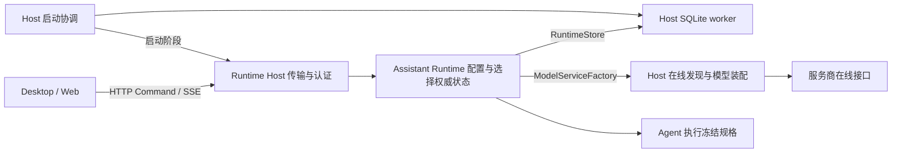

# v0.25.1 技术方案：模型管理与数据库自动升级

## 一、方案信息

- 版本：`v0.25.1`；状态：实施基线，版本进入 `开发中`，M0／M1／M2 已完成；用户授权直接推进到 M3，当前 M3 进行中。
- 日期：2026-09-08。
- 阶段确认：用户在[交互设计](界面交互设计指导.md)两级级联修订后要求“开发方案”，
  按本文进入[开发计划](开发计划.md)阶段；真实字段与验证范围按 2.3／2.5 分别记录。
- 前置：[功能设计](功能设计.md)与开发计划已获确认；M0／M1／M2 已完成，当前实施 M3，完整产品切换尚未完成。
- 范围：Runtime 配置与执行准备、Host 模型接口与 SQLite、应用协议、Desktop/Web 数据流。
- 约束：[开发流程](../../specs/开发流程规范.md)、[Rust 编码](../../specs/Rust编程规范.md)、
  [Rust 架构](../../specs/Rust架构设计规范.md)、[前端规范](../../specs/前端编程规范.md)、
  [Agent 系统](../../modules/agent-system.md)及各模块规范。

本文中的新类型、文件布局、SQL 和命令名是实施约定；已落地部分单独记入 2.2／2.5 节，不能将方案
全文视为已有实现。已按用户追加授权只读使用真实配置验证服务商列表／详情（2.3 节）；未连接
用户数据库或执行版本迁移；最小真实文本调用见 2.5。

## 二、现状核查

| 已核实事实 | 入口 | 技术影响 |
| --- | --- | --- |
| TOML 严格反序列化，default_model 必填，models 保存逐模型配置 | [schema.rs](../../../crates/assistant-runtime/src/config/schema.rs)、原 TOML 编辑器（本版已删除） | 在新配置反序列化前移除废弃键；删除旧模型编辑 API |
| ConfigRegistry 在启动／reload 编译模型快照 | [registry.rs](../../../crates/assistant-runtime/src/config/registry.rs)、[运行模型](../../../crates/assistant-runtime/src/runtime/model.rs) | 启动不依赖在线模型；新 Run 异步准备当前模型规格 |
| 现有 ModelServiceFactory 注入具体 Adapter | [factory.rs](../../../crates/assistant-runtime/src/factory.rs) | 扩展已有宿主替换边界，不将 HTTP 移入 Runtime |
| Responses 适配、effort 字段和 replay 策略仍有 model_id 分支 | [Host 模型装配](../../../apps/runtime-host/src/resources/model.rs) | 改为服务商方言规则，模型能力由接口元数据控制 |
| RuntimeStore 为异步业务接口，SQLite 由 Host 独立 worker 所有 | [存储契约](../../../crates/assistant-runtime/src/storage/contract.rs)、[worker](../../../apps/runtime-host/src/storage/worker/client.rs) | 新业务持久化沿用该边界，迁移留在 Host |
| sessions.model_key 为 NOT NULL；schema::initialize 混有补表、补列与启动恢复 | [schema.rs](../../../apps/runtime-host/src/storage/schema.rs)、[engine.rs](../../../apps/runtime-host/src/storage/engine.rs) | 删除旧列，迁移与每次启动恢复分离 |
| 数据文件为 Runtime Home/data/runtime.sqlite3，当前使用 DELETE journal、FULL synchronous、foreign_keys | [存储模块](../../../apps/runtime-host/src/storage/mod.rs)、[engine.rs](../../../apps/runtime-host/src/storage/engine.rs) | 单连接迁移事务，备份覆盖真实数据文件；不改变 journal 策略 |
| Host 完成 Store、Runtime 初始化后才 bind_and_publish，失败退出进程 | [main.rs](../../../apps/runtime-host/src/main.rs)、[server.rs](../../../apps/runtime-host/src/server.rs) | 先开放受认证的启动状态入口，再初始化业务 |
| 应用协议版本目前为 2 | [协议入口](../../../crates/assistant-protocol/src/lib.rs) | 本版破坏性 DTO 替换升级到 3，并检查全部客户端 |

依赖核查执行了 `cargo metadata --no-deps --format-version 1 --offline` 与 Host 的离线
`cargo tree -e features`：当前 workspace 产品版本为 `0.25.0`；Host 已有 reqwest、
rusqlite 0.40.1（bundled）、toml_edit、tempfile。Runtime 无 rusqlite/reqwest 依赖。
本机锁定的 libsqlite3-sys 0.38.1 随包 SQLite 头文件版本为 3.53.2。

### 2.1 M0 首轮接口取证（2026-09-08）

本轮只核查公开官方接口说明及源码，未使用用户 Runtime 环境或任何 API Key，未执行真实列表／
推理请求。下表区分“文档中有字段”与“独立联调已通过”；当前没有一项被记为后者。

| 接入类型 | 已核查的官方事实 | 当前判断 |
| --- | --- | --- |
| OpenAI | Models 列表／详情对象描述身份、创建时间、归属等，未声明上下文窗口、输出上限或模型能力字段；[Models Reference](https://developers.openai.com/api/reference/resources/models)、[Retrieve](https://developers.openai.com/api/reference/cli/resources/models/methods/retrieve) | 不能假定再请求详情即可补齐执行参数，需报告该来源缺口 |
| DeepSeek | 列表 schema 为 id/object/owned_by，未声明必要运行参数；[Lists Models](https://api-docs.deepseek.com/api/list-models/) | 文档页面已直接读取；列表成功不等于能构造完整执行规格 |
| 百炼／DashScope | 独立 GET /api/v1/models 返回 model_info 中的 context_window、max_output_tokens、思考模式限制，以及模态／能力；[查询模型列表](https://help.aliyun.com/zh/model-studio/list-models) | 有较完整参数的候选来源，但地域／业务空间地址、分页、null 和思考模式差异仍须真实验证 |
| vLLM | 官方 serving 源码构造 ModelCard 时填入 max_model_len；[serving](https://docs.vllm.ai/en/latest/api/vllm/entrypoints/openai/models/serving/) | 可作为部署上下文上限的候选来源，不能据此推断独立输出上限或全部能力 |
| 智谱 | 本轮官方文档索引检索未定位到通用模型列表／详情契约；[官方索引](https://docs.bigmodel.cn/llms.txt) | 尚未核实，不把文档检索未找到表述为接口一定不存在 |
| Moonshot | 已读取[模型参数参考](https://platform.moonshot.cn/docs/api/models-overview)，该页面是参数说明；尚未取得列表 API 返回 schema | 不能把网页参数表当作在线模型列表接口已返回这些值 |
| 通用／local 兼容实例 | 现有 Host 按实例服务商类型选方言；兼容请求格式不保证模型发现元数据格式 | 必须针对实际部署取证，不按地址或模型名猜测参数 |

需要收口的事实：公开 Models API 并不普遍提供本版所需的完整执行规格；百炼提供独立发现接口，
也不能直接假定所有服务商都具有同样的接口。现有“接口缺失则明确不可用”的设计继续有效，
但不能据此宣称原有所有服务商均已完成替代。不会自动使用静态参数、官网抓取回退或手工模型注册。

M0 下一步需要独立联调连接，验证目录与参数映射后再确定拟支持范围。若需要改变参数来源或
缩小原有接入范围，先报告并由用户确认设计调整。当前真实证据仅来自公开文档；以下合成测试
不构成真实接入验收，M0 仍进行中；原有逐模型分支待取得正确替代依据后修改。

### 2.2 M0 首轮实现边界（2026-09-08）

- 复用 `ModelServiceFactory::discover_models` 提供可取消的单次异步发现；Runtime 仅定义内部
  输入／结果／错误契约，HTTP 和原始字段解析位于 Host `resources/model/discovery`。
- 首轮解析 OpenAI 风格列表（openai/deepseek/local）、vLLM 的 `max_model_len`、百炼原生分页
  列表与 `model_info`。百炼只修改显式 服务地址 的路径，保持原主机；不根据地域猜另一地址。
  首轮未接入 Moonshot／智谱发现，当前工厂返回不支持；2.3 节已补真实证据，待映射。不改变旧推理入口，
  也不把首轮实现子集宣称为本版最终支持范围。
- 缺失／null 限制为 Unknown，非正整数／非法类型／超出安全整数／超过上下文的子限制为
  Invalid；二者都不能构造有效执行规格。图片、工具与推理能力区分未知、显式支持和显式不支持。
  此元数据仍是部分事实，尚未完成文本输出筛选、全部思考字段及完整执行能力的组装。
- 单页 1 MiB、整次 8 MiB、最多 100 页／10,000 模型；整次超时覆盖分页和 body。大小超限、
  重复 ID、总数变化或中途失败均整体失败，不发布半份结果；禁止自动重试和重定向。
- 请求不输出凭据；可展示错误仅含固定类型与消息，底层 source 留在内部。无跨请求目录缓存，
  无落库、配置变更或 UI 接入；现有正式运行链路的切换依然归 M3。
- 验证使用合成官方契约夹具和 loopback HTTP，覆盖失败后再次获取、分页与下载边界、取消、
  超时和脱敏。实际命令与结果见本地开发进度；随后追加的真实接口结果见 2.3 节。

### 2.3 M0 真实配置接口验证（2026-09-08）

用户追加授权只读使用 `~/.ez-assistant/config.toml` 的服务商连接。9 条旧模型配置按服务商、
服务地址 与凭据去重为 7 个连接；凭据仅在内存中使用，不复制原配置，不打印密钥。只发送列表／
详情 GET，不执行推理、工具或数据库操作。文件验证前后 SHA-256 一致。

| 实际连接 | 列表接口实测 | 必需参数与补查详情 | 是否满足完整要求 |
| --- | --- | --- | --- |
| DeepSeek | `/models` HTTP 200，3 个模型，3 个配置模型均在列表内 | 仅 id/object/owned_by；逐个配置模型详情也是 HTTP 200，同样没有上下文、输出上限及能力 | 否，参数来源缺失 |
| 百炼 Token Plan | `/compatible-mode/v1/models` HTTP 200，12 个模型，has_more=false，配置模型在内 | 当前套餐主机 `/api/v1/models` HTTP 404；兼容列表仅身份字段，配置模型详情 HTTP 400 | 否，不能将通用百炼文档的原生元数据接口套用于当前套餐地址 |
| Kimi Coding | `/coding/v1/models` HTTP 200，4 个模型，has_more=false，k3 在内 | k3 的 context_length=1,048,576；有推理／图片／视频／动态工具声明及思考强度，未返回输出上限；`/models/k3` HTTP 404 | 部分满足，输出上限仍无来源 |
| 智谱 Coding | `/api/coding/paas/v4/models` HTTP 200，10 个模型，配置的 glm-5.3 在内 | 列表和配置模型详情均仅身份／归属／创建时间，没有上下文或输出上限 | 否，参数来源缺失 |
| 智谱标准 API | `/api/paas/v4/models` HTTP 200，10 个模型，glm-5.3-flash 在内 | 配置模型详情 HTTP 200，仍无上下文或输出上限 | 否，参数来源缺失 |
| 用户 OpenAI 兼容中转 | 配置根地址 `/models` HTTP 404；同主机 `/v1/models` HTTP 200，1 个模型且与配置匹配 | 列表／详情有 supported_endpoint_types，但没有上下文或输出上限；这是中转服务，不能代表 OpenAI 官方接口实测 | 否，发现路径与参数均有缺口 |
| 本地 vLLM | 配置 `127.0.0.1:8000/v1/models` 连接被拒绝 | 未取得响应；没有启动或更改本地服务 | 未验证，不能判断部署实际元数据 |

Kimi 特殊字段实际值：`supports_reasoning=true`、`supports_image_in=true`、
`supports_video_in=true`、`supports_dynamic_tools=true`、`supports_thinking_type="only"`；
`think_efforts` 声明 support=true、valid_efforts=[low, high, max]、default_effort=high。
这是该连接当前模型的接口声明，尚未用真实推理验证其语义；不能把它泛化为全部 Kimi 模型固定值。

**实现验证与外部事实分开：** 新增默认忽略的
`explicitly_configured_live_connections_supply_required_model_limits`，必须显式传入
`EZ_MODEL_DISCOVERY_CONFIG`，不读取默认 Home。它调用当前真实 ModelServiceFactory，检查
配置模型是否存在以及在线上下文／输出上限是否完整；不使用旧 TOML 手填参数补齐。
实测 7 个连接均未通过，门禁 exit 101：DeepSeek 取得列表但限制未知；百炼／中转的当前发现
路径返回不支持；Moonshot／智谱尚未适配；vLLM 不可用。这些结果不等价于远端都没有列表接口。

**当时结论（已由下方 2.4 修订）：** 当前证据不足以实现“全部必需参数均从各服务商在线接口获得”，不能把任意
统一数值、旧配置值、模型名推断或错误响应中的猜测值作为上线补丁。需要继续寻找有明确契约的
参数接口，或由用户确认缺参数时的处理规则。百炼套餐／标准入口与中转路径也需要明确实例级
发现策略，不做任意错误后的多路径盲试或跨主机转发凭据。M0 仍未通过，不进入 M1。

实测摘要仅保留状态、数量、字段类型和已配置模型的必要字段，无完整在线目录持久化；本地证据
位于 `/tmp/ez-assistant-v0251-live/`，请求与工厂结果、命令及未执行项见本地开发进度。

### 2.4 用户修订：在线发现＋固定配置

用户根据 2.3 的实测结果明确允许编辑在线模型的参数并落库，重置即删除固定配置。以下第 4 节
为新实施基线，替代此前“参数只能来自 API、禁止手填”的约束。参数证据补充为
[厂商文档核查](../../resources/v0.25.1-服务商参数文档核查.md)，不将文档自动转成运行时静态目录。
M0 的旧纯在线参数门禁失败记录保留；后续验收须覆盖固定配置优先／重置后在线缺失的行为，
不把旧测试改成无条件通过。数据库与 UI 尚未实现，版本仍开发中，M1 未开始。

### 2.5 M0 修订实现与验证（2026-09-08）

本节为当前实现状态；2.1—2.3 保留首轮过程证据，不用后续结果覆盖旧失败。

- 发现请求携带 models_path（可为空的同源路径覆盖）与 discovery_format；未覆盖时使用适配器默认接口，不按显示名称推导。
  现有 Host 工厂实测通过六个远端连接的列表解析：DeepSeek、百炼 Token Plan、Kimi Coding、
  智谱标准／Coding、OpenAI 兼容中转；本地 vLLM 连接拒绝，仅有离线解析证据。
- Kimi context_length、图片／工具能力、始终思考、强度集合及默认值已标准化。上下文已取得，
  输出仍未知。六个远端的必需参数均不完整，旧纯在线诊断仍失败，不能据此直接执行。
- Runtime 增加 ModelParameters 与惰性来源解析：有固定快照时不调用在线获取、不合并未知字段；
  无固定快照时只使用本次结果。非法固定值不回退，输出上限必须能无损表示为执行契约的 u32。
  数值与思考设置校验及固定快照不可变性已有测试；用途能力和方言兼容检查仍由 M3 接通。
- 最小真实文本验证通过：在线列表确认 qwen3.8-max 后，使用官方文档整数窗口 1,000,000、
  输出上限 131,072 作为测试显式固定的内存参数，生成预算限制为 32，收到非空最终文本，
  服务返回输出用量 25。没有写入用户固定配置；没有验证极限窗口、工具或图片能力。
- 固定优先、删除记录后以 None 进入在线分支、缺字段／缺模型／接口失败、非法参数均有隔离测试。
  这里的重置仅验证来源契约；真实单键 DELETE、版本迁移和三级页面属于后续 M1／M3。
- 真实测试只读获准的连接配置，前后摘要一致；未打开用户数据库、启动用户 Runtime 或修改配置。
  常规回归屏蔽用户 Runtime Home，真实网络测试默认 ignored，必须显式提供配置路径才执行。

M0 交付范围已完成并获用户确认；各家完整推理与本地 vLLM 的实机验收仍按 M3／M4 执行，不能将
上述文本调用扩大表述为整版通过。最终回归数量见开发计划与本地开发进度。

### 2.6 接入方式与厂商元数据复核（2026-09-08，M3 阶段）

本轮复核发现以下事实，驱动协议与实现的本次修正；与 2.1—2.5 不矛盾，是对接入方式与厂商能力的补充取证。

- **OpenAI 兼容列表不解析规格**：当前在线发现仅对 vLLM（`max_model_len`）、Moonshot、DashScope 原生
  三类解析元数据；标准 OpenAI 兼容格式（`openai_page`）只取 model_id，不解析任何规格。DeepSeek、
  智谱、OpenAI 兼容中转均走此格式，故其详情页规格字段为空属预期，须由内置模板预填补齐（见 4.3）。
- **类型→发现格式映射需修正**：现有映射将 Kimi 归为 openai、百炼归为 openai，使其元数据字段未被
  解析。修正为服务商类型即确定 discovery_format：Kimi→moonshot、百炼 API→dashscope_native；
  百炼套餐与智谱保持 openai（其列表本就只返回身份字段）。
- **百炼拆分为两个类型**：百炼 Token Plan（套餐）是独立产品——专用主机 `token-plan.*.maas.aliyuncs.com`、
  凭据前缀 `sk-sp-`（与通用 `sk-` 不可混用）、仅提供对话端点，不部署原生 `/api/v1/models`
  （实测返回 404，为路径不存在而非权限不足）。它与百炼 API（dashscope 原生列表返回完整规格）无法
  用同一类型自动匹配，故拆为“百炼 API”与“百炼套餐”两个 ProviderType，各绑定正确接入方式。
- **DeepSeek 思考档位（官方文档）**：DeepSeek 支持 `reasoning_effort: low/high/max`，思考默认开启
  （默认 high），`thinking.type` 控制开关，存在请求→实际映射（medium→high、xhigh→high）。故思考
  强度采用“档位→线上值”映射而非勾选；`x_high` 档的线上值为 `xhigh`。
- **强度枚举大小写不一致需修正**：现有 `XHigh.as_str()` 返回 `xhigh`（无下划线），与前端使用的
  `x_high` 不一致。固定配置保存档位 key、编译期使用该档位配置的线上值，不再硬编码 wire 值。

## 三、目标架构与依赖



- 复用 RuntimeStore 保存服务商、固定配置与选择，复用 ModelServiceFactory 提供在线发现及模型构造。
  不新建通用 Provider 管理服务 trait、迁移框架 crate 或模型注册服务。
- 业务配置仍由 Runtime 单一 owner 管理；Host 负责 HTTP、SQL、凭据使用和启动迁移。
  agent-core、agent-model、agent-context 不引入用户服务商配置、应用 DTO 或数据库知识。
- 现有 ConfigRegistry 保留非模型 TOML 管理；数据库模型设置使用独立不可变快照，避免一次
  模型网络请求阻塞全部配置加载。启动空服务商是合法状态。
- rusqlite 保持锁定版本，拟增开已有 `backup` feature；Host 显式依赖锁文件已有的
  semver 1.0.28 解析版本，避免自行实现或使用字符串排序。二者许可均兼容项目当前使用方式，
  semver 的 MSRV 1.68 低于 Host 声明的 1.89；不引入新的运行进程或系统 SQLite 依赖。

## 四、分模块实现方案

### 4.1 数据模型与唯一性

新增 `ProviderInstanceId`，区分用户连接实例与现有描述服务商类型的 `agent_types::ProviderId`。
模型引用统一为 `ModelSelection { provider_instance_id, model_id }`，model_id 保持服务商原值，
不使用显示名称、数组下标或拼接字符串作为身份。

| 持久化对象 | 拟定字段与规则 |
| --- | --- |
| providers | provider_instance_id TEXT PRIMARY KEY、display_name TEXT NOT NULL、provider_type TEXT NOT NULL、endpoint TEXT NOT NULL、api_key TEXT NOT NULL、protocol_preference TEXT NOT NULL、models_path TEXT NOT NULL、discovery_format TEXT NOT NULL；ID 由 Runtime 分配，删除后不复用 |
| model_fixed_configs | PRIMARY KEY(provider_instance_id, model_id)；context_window_tokens、max_output_tokens 正整数 NOT NULL；max_input_tokens 可空；origin 为 online/manual、创建后不可变；mode_limits_json、capabilities_json 为有界标准化结构；updated_at_ms；provider_instance_id 外键 ON DELETE CASCADE |
| model_settings | singleton_key INTEGER PRIMARY KEY CHECK = 1；default_provider_instance_id/default_model_id、vision_provider_instance_id/vision_model_id；两对引用分别可空 |
| sessions | 增加 model_provider_instance_id TEXT NULL、model_id TEXT NULL；物理删除 model_key，不复制其内容 |
| schema_migrations | version TEXT PRIMARY KEY、applied_at_ms INTEGER NOT NULL；每行仅代表已完成版本，无第二份 current_version |

`provider_type` 取 `openai / deepseek / dashscope_api / dashscope_plan / moonshot / zhipu / vllm /
local_openai` 等；百炼拆为 `dashscope_api`（百炼 API，原生列表）与 `dashscope_plan`（百炼套餐，
兼容列表）两个类型。类型确定 discovery_format 与推理方言；models_path 默认空字符串，适配器负责默认接口，实例不再单独手选
列表格式。`protocol_preference` 取 `auto / responses / chat_completions`，含义属于服务商实例。
需要其他已有方言的实例由服务商类型确定适配规则，不能在模型选择里覆盖协议。
非空引用的 model_id 必须非空；成对空值使用数据库 CHECK 与 Runtime 校验双重保证，例如：

```sql
CHECK (
  (default_provider_instance_id IS NULL AND default_model_id IS NULL)
  OR (default_provider_instance_id IS NOT NULL AND default_model_id IS NOT NULL
      AND length(default_provider_instance_id) > 0 AND length(default_model_id) > 0)
)
```

会话增量加列时将成对 CHECK 放在第二个新增列的约束中，空库 DDL 使用同一最终约束；
迁移测试验证实际 SQLite 接受该写法与约束行为。不通过重建整个数据库解决一个旧列问题。

模型引用不建立到 providers 的删除级联外键：用户删除服务商后保留显式选择，显示“服务商已删除”，
直到主动重选或清除。这样不会把失效的新显式选择变成“跟随默认”。应用层负责引用有效性检查。
空会话选择表示跟随当前默认；默认为空则需要配置。辅助识图空值始终表示未配置，不继承普通默认。

不保存在线目录或原始详情响应。仅用户显式保存时，model_fixed_configs 保存完整标准化运行参数；
没有这条记录表示使用在线参数，不用额外 enabled 标志、注册 ID、历史副本或第二 schema 版本。
内部参数值共用 ModelParameters，固定配置记录与在线条目分别校验，持久化 JSON 只承载模式限制和能力，不保存供应商原始 JSON。
上下文／输出必填且有界，输入与模式限制可空；能力保留未知／支持／不支持，不把未知写成 false。显示名称缺失时使用保存的
model_id；它只表示用户选择，不表示服务商当前仍提供该模型。既有 usage 中 provider/model_id
属于历史事实，予以保留，不当作配置重新加载。

固定配置表在尚未发布的 v0.25.1 初始 SQL 中直接加入，旧库初始化为空，不导入 TOML 模型值。
下列为目标 DDL 草案，不代表已执行迁移；JSON 的领域字段／组合约束由 Runtime 校验，数据库负责
类型、范围、JSON 形状和复合键约束。

```sql
CREATE TABLE model_fixed_configs (
    origin TEXT NOT NULL DEFAULT 'online' CHECK(origin IN ('online', 'manual')),
    provider_instance_id TEXT NOT NULL REFERENCES providers(provider_instance_id) ON DELETE CASCADE,
    model_id TEXT NOT NULL CHECK(length(model_id) > 0),
    context_window_tokens INTEGER NOT NULL CHECK(
        typeof(context_window_tokens) = 'integer' AND context_window_tokens BETWEEN 1 AND 9007199254740991),
    max_output_tokens INTEGER NOT NULL CHECK(
        typeof(max_output_tokens) = 'integer' AND max_output_tokens BETWEEN 1 AND 4294967295
        AND max_output_tokens <= context_window_tokens),
    max_input_tokens INTEGER CHECK(max_input_tokens IS NULL OR (
        typeof(max_input_tokens) = 'integer' AND max_input_tokens BETWEEN 1 AND context_window_tokens)),
    mode_limits_json TEXT NOT NULL CHECK(json_valid(mode_limits_json)),
    capabilities_json TEXT NOT NULL CHECK(json_valid(capabilities_json)),
    updated_at_ms INTEGER NOT NULL,
    PRIMARY KEY (provider_instance_id, model_id)
);
```

没有独立固定配置 ID、启用标志、删除标志或额外数据版本号；同键保存整体 upsert，重置只执行单键
DELETE，作用域由 Runtime 的目标服务商和模型引用确定。用户选择不外键关联这张表，保证 reset
不会级联清除默认／会话／辅助引用。备份与迁移验证矩阵纳入该表及其外键、精确行数和固定字段。

### 4.2 配置写入、凭据与并发

RuntimeStore 增加按业务命名的服务商增删改、固定配置读取／整体 upsert／删除、模型设置更新方法；写入成功后才替换 Runtime 快照并
发布设置变化事件。Volatile Store、Host worker 消息及 SQLite 实现一起调整，不增加通用 SQL 执行接口。
只加载少量服务商与全局选择，固定配置按选定二元键加载；不为初始化配置恢复全量历史会话。

服务商读取 DTO 只返回 `has_api_key`，不返回密钥。更新请求中密钥缺席表示保持，设置新值表示替换；
明确清除操作与空表单区分，允许无鉴权的本地服务商。配置数据库及备份延续私有目录／文件权限；
本版不额外引入加密密钥管理系统，不将“私有文件”描述为数据库内容已加密。请求凭据不实现普通
Debug 输出，远程传输沿用当前 Host 的认证与 HTTPS 边界，错误正文和日志必须脱敏。

配置修改由已有 Runtime 调用边界下的异步写门串行，数据库提交与快照发布为该门内的短步骤。
HTTP 发现不持有同步锁或配置写门：先捕获对应服务商 Arc，返回后在接纳点核对它仍是当前实例快照；
编辑或删除后迟到结果返回“配置已变化，请重试”。不增加 provider revision/generation/CAS 字段。
UI 同时使用 AbortController 和当前请求对象身份阻止旧请求覆盖状态；后端校验不能由 UI 替代。
两个客户端同时保存采用服务器接纳顺序，后接纳的完整配置生效，不承诺多端字段合并。
固定配置与服务商共用已有配置写门和 Arc 身份校验：保存／重置先提交 Store，再发布配置快照
与变化事件。执行准备同时捕获服务商及该模型固定记录，期间任一变化都需重试。reset 是
DELETE WHERE provider_instance_id=? AND model_id=?，重复删除不存在记录成功；不调用网络决定删除是否成功。
服务商删除和其固定记录级联在同一事务，GetProviderUsage 同时返回固定记录数量。修改连接不
自动删除用户固定值；跨类型修改先验证所有固定能力在新方言可表达，否则拒绝并给出待调整项。

### 4.3 在线发现与统一方言

在 ModelServiceFactory 增加异步在线发现能力，沿用已有 boxed Send Future 风格；输入为冻结的
服务商连接，输出为标准化目录条目或单模型详情。具体 HTTP 与解析位于 Host 的 resources/model
所属模块，按职责拆文件，避免继续扩展现有大文件。同步 create_model 保留为已校验规格的构造步骤。

标准化目录条目包含 model_id、可选显示名、可选能力、可选 context_window_tokens /
max_output_tokens，以及缺失或非法字段的结构化说明。这里的“可选”只使目录可以展示；执行前仍
必须满足当前 ModelService 与 agent-context 的必要参数约束，不把 unknown 转成 false 或零。
数值必须为正、有界、类型可解析；输出上限与上下文关系不合法时拒绝该规格。

发现流程为“服务商列表接口 → 必要时该服务商模型详情／能力接口 → 标准化校验”。在线接口仅提供预填事实；用户固定配置是独立的显式来源。静态服务商规则仅描述请求路径、鉴权、
协议支持和字段映射，不含模型 ID 白名单或自动参数兜底。服务商特殊字段映射必须有脱敏响应夹具及联调证据。

**内置厂商规格模板**作为第三条参数来源（在线、固定之外）：随版本维护一份按“服务商类型 → 模型 →
已知规格”的只读表，内容全部来自官方文档并标注核查日期。在线接口缺字段时，用模板预填该项并标注
“模板”来源；模板与在线值、用户固定值按“固定 > 在线 > 模板”的优先级合并展示，固定值一经保存
即不再被模板或在线覆盖。模板不是运行时猜测或参数兜底：只收录文档明确的规格，没有依据的字段保持
“待配置”；运行与校验使用固定记录，或本次在线加模板补齐后的参数。模板覆盖本版支持的接入类型与代表型号，
维护时同步更新核查日期；新增厂商或型号须有对应文档出处，不凭经验填写。

- 方言按 provider_type 与实例 protocol_preference 解析。auto 在该服务商接入规则明确支持
  Responses 时优先使用，否则在明确支持 Chat Completions 时使用后者；未知支持状态返回不支持。
  任意推理请求报错不得触发跨协议或跨服务商重发。
- 移除 Host responses_adapter、reasoning_effort_field、reasoning_replay_policy 中按模型名称
  分叉的策略；字段位置和编码方式由服务商规则决定，是否开启 reasoning/vision/tool 等由生效的在线或固定
  能力控制。需要与当前 Adapter 既有能力回归对照，不能简单把所有模型视作同一能力。
- 分页全部属于一次发现，限制请求时长、页数和响应体大小；分页中途失败则该服务商整次失败，
  不展示前半页伪装成完整成功。取消、超时与解析失败返回安全的业务错误。
- 不建立结果缓存。每个请求生命周期内可以去重／合并自己的分页，返回后仅交给当前视图或当前
  执行准备消费；刷新开始清空旧列表，失败不保留旧结果，也不落库或写客户端持久存储。
- 未固定模型不在本次目录时标记不可用；已固定模型保留配置及原选择，可提示“本次列表未返回”。
  在线缺字段可以进入第三级编辑补齐，保存成功后才可作为有效选择。不把固定记录追加进在线列表。

2.3 实测驱动 2.4 修订，2.5 已补发现映射及路径输入；服务商持久化仍待 M3。实例增加 models_path
（空字符串表示适配器默认接口；非空为同源绝对路径，禁止完整 URL、query、fragment、..）和 discovery_format（openai/vllm/moonshot/dashscope_native）。
**discovery_format 由 provider_type 唯一确定并预填，用户不再在“接口选项”手选列表格式**；本次修正
类型映射：Kimi→moonshot、百炼 API（dashscope_api）→dashscope_native，使二者的上下文、能力、思考
强度等元数据字段能被解析；百炼套餐（dashscope_plan）与智谱保持 openai（其列表仅返回身份字段）。
路径输入框不预填，切换类型不覆盖用户输入。原生百炼适配器默认 /api/v1/models；OpenAI 兼容、Moonshot、vLLM 在 服务地址 基础路径后追加 /models（保留套餐路径）。用户填写时直接使用同源覆盖路径；默认值不写回配置，禁止失败后盲试。字段归
providers 增量列，与模型固定配置分开。


M3 移除现有模型名分支时采用下列实例级映射；这里只确定替代方案，M0 不切换旧推理入口。

| 实例接入类型 | Responses Adapter（显式采用该协议时） | Chat 思考字段／历史规则 |
| --- | --- | --- |
| DeepSeek | deepseek | reasoning_effort；沿用 DeepSeek Adapter 的回放规则 |
| 百炼 API（dashscope_api） | qwen | reasoning_effort；开启思考时 PreserveAll |
| 百炼套餐（dashscope_plan） | qwen | reasoning_effort；开启思考时 PreserveAll |
| Moonshot／Kimi | kimi | reasoning_effort；开启思考时 PreserveAll |
| 智谱 | 仅在对应套餐明确支持时开放，未核实不选用 | reasoning_effort；当前兼容 Adapter 规则 |
| OpenAI 兼容中转 | openai（由实例明确选择协议，不从模型 ID 判断） | reasoning_effort；当前兼容 Adapter 规则 |
| vLLM | 当前不预设支持 | reasoning_effort；vLLM Adapter 规则 |

是否启用思考、可用强度、是否允许关闭由生效模型参数决定；字段名和回放策略不允许模型覆盖。
百炼旧 thinking_budget 编码不再因模型名自动选用；若接入确实只支持该方言，必须先定义明确的
实例接入规则及强度映射，不能把 low/high/max 字符串直接塞入整数预算字段。当前六个远端列表
可用不证明上表全部推理协议可用，M3 须按实例与所选能力运行 Adapter 回归及最小真实验证。

### 4.4 模型固定、选择与执行准备

首次创建在线来源固定记录时，Runtime 验证服务商存在并独立获取本次在线列表确认 model_id。
手动来源无需在线身份校验，但同样验证模型 ID、完整参数和服务商方言。即使元数据不完整，用户仍可提交补齐后的参数；不把表单值当作在线事实。
已有固定记录允许直接编辑／重置，无需网络。保存为完整标准化配置：上下文／运行输出必填，
可选字段留空就是未知，不是每次从在线或模板补齐。持久化和业务层校验均拒绝非法数值、无效强度映射、
默认强度不属于已填档位、仅思考却允许关闭、启用 Adapter 不支持能力等形状。参数总窗口共同约束实际
输入＋输出。上下文最多 9,007,199,254,740,991，输出及思考模式输出最多 4,294,967,295，
保存与执行校验一致，不截断转换。不要求“最大输入＋最大输出”两个独立最大值相加仍小于窗口。

固定字段白名单：context_window_tokens、max_output_tokens、可选 max_input_tokens；mode_limits_json
承载已存在的普通／思考输入、输出、思考 Token 限制。capabilities_json 明确图片输入、流式、工具调用、
工具选择 auto/none/required/named、工具结果多模态、思考模式（未知／不支持／可开关／始终开启）、
思考强度映射（固定五档各自的字符串线上值，空置表示该档不支持；x_high 档线上值为 xhigh）与默认强度。沿用现有能力契约，新增“始终思考”等事实时只补需要的内部／协议字段；不提供
任意 provider 参数透传。未知能力在保存值和界面中仍为未知；只有当前用途必要的能力缺失才阻止该用途。
基础文本执行要求窗口、输出上限与流式能力，图片、工具及思考能力未知时不启用对应功能；
未声明 named／required 不阻止使用已声明的 auto，工具图片传递未知不阻止普通文本工具。
来源是可观察状态：用户固定／本次在线／待配置，并显示字段缺失与用途不可用原因。保存固定值
不代表已完成真实推理验证，客户端不得把它显示为“厂商认证支持”。

来源解析按“固定 > 在线 > 模板”的优先级：有固定记录则整份取固定值；无记录时先用本次在线元数据，
接口未提供的字段以内置模板预填并标注来源。固定记录损坏或不满足执行条件时显示修复错误，
不自动回退在线。刷新不能更改固定参数，运行中不抓取官网。编译推理请求时，思考强度发送生效配置中
该档位的字符串线上值（固定五档各自独立配置），不再由 Adapter 硬编码 wire 值；未配置线上值的档位
视为该模型不支持，不出现在可选集合。
服务商官方文档链接在编辑页供用户参考，无精确整数依据时不自动将 K/M 转成硬编码 Token 数。

新选择优先读取固定记录，无固定记录才需本次列表证明模型存在；保存默认／会话／辅助时，Runtime 用生效配置验证用途，并只保存
二元引用。已有选择有完整固定配置时，可直接执行，即使列表接口失败或本次列表已不含该模型；
实际推理若报模型下线／无权限等错误就按业务错误反馈，不擅自删固定配置或换模型。

新 Run 的准备顺序：

1. 在现有会话串行链中决定会话显式选择或全局默认，并捕获服务商和该二元键的固定记录快照。
2. 有固定配置则直接验证并使用；没有固定配置时在线获取当前模型及参数。缺字段指向第三级
   配置页，网络失败提供重试；不改写消息、不使进程退出。
3. 在短接纳步骤核对服务商与固定记录仍是捕获时的配置（含原先无记录期间发生新增），再构造
   冻结规格并调用 create_model。准备中保存／重置／连接变化需重试，不混用两份状态。
4. 活动 Run 的 Loop、压缩、辅助模型准备后快照不受后续配置变化影响；新 Run 重新解析来源。
   定时、继续／重试等新 Run 共用该路径；Run 内子任务和自动压缩复用冻结模型。

标题、手动压缩、Goal 能力检查及推理强度设置不调用在线发现：复用当前会话已确定的执行参数，
进程重启或配置改变后只读取已有固定配置。没有可复用参数时提示手动重新选择或补齐固定配置，
不通过联网修复。Session 仅保留当前进程内的已解析参数引用，不保存在线列表或增加数据库字段。
用户选择在线模型时，以及新 Run 接纳模型准备时，更新该引用；重选会话模型会替换或清除它。

辅助识图只在需要时准备其独立引用，固定或在线的有效能力均可用于校验。未配置仍需手动选择；
TOML 现有辅助任务 timeout/max_output_tokens 保留为请求预算，不能冒充模型运行上限。

reset 只删除固定记录，不改默认、会话或辅助引用，也不请求在线成功后才删除。返回删除事实后，
UI 独立重新获取在线参数，失败可显示“固定配置已重置，在线参数获取失败”；用户可重试。重置
后没有必要字段的新执行被阻止并提示补齐，活动执行仍使用原冻结值。已有引用在重置后即使目录
失败仍可进入详情，在线来源重新建立固定记录必须先确认当前在线身份；手动来源不依赖目录。

### 4.5 协议与客户端数据流

assistant-protocol 提供轻量 DTO，不依赖 SQLite、reqwest 或具体 Adapter。拟定命令：

| 命令组 | 契约 |
| --- | --- |
| ListProviders / CreateProvider / UpdateProvider / DeleteProvider | 维护服务商连接，读取脱敏摘要；删除先展示影响并确认，执行结果返回实际影响摘要 |
| GetProviderUsage | 删除确认前只读查询默认、辅助及全部会话引用；返回用途、精确会话数量、固定记录数量与有界标题摘要，包含未加载／归档会话，不靠前端 active_sessions 推断 |
| ListProviderModels | 单服务商本次在线发现；展开该服务商二级时请求，空列表与失败区分，切换服务商取消旧请求并丢弃结果 |
| GetModelConfiguration / SaveModelFixedConfig / ResetModelFixedConfig | 指定服务商＋model_id；请求携带 origin（缺省 online），读取生效值并按字段标注参数来源（固定／在线／模板／待配置），模板值随版本核查日期；保存完整参数、重置物理删除，分别返回可靠写入结果；不更改默认或会话引用 |
| ListFixedModelConfigs | 只返回某服务商用户已固定记录的有界摘要，供离线管理，不与在线发现合并 |
| GetModelSettings / SetDefaultModel / SetVisionModel | 全局选择读写；允许显式清除，写入由 Runtime 结合本次目录与生效固定／在线参数验证 |
| 既有会话模型切换命令 | 将旧 model_key 替换为可空 ModelSelection；空值明确表示跟随默认 |

会话投影返回已保存选择与当前生效选择的来源（session/default/unconfigured），失效原因单独表达；
不在事件或会话投影内嵌一份可跨请求复用的在线目录。配置变更事件使客户端重读设置，相关打开的
列表丢弃并重新获取；页面关闭取消网络请求。Runtime 仍是选择权威，前端表单草稿不直接改会话状态。

移除旧 ModelKey、ModelCatalog、逐模型 CRUD、默认 TOML 写入的正式产品生产者和消费者。
逐一检查 protocol 导出、Desktop RuntimeClient、Host command 路由、Runtime、Volatile Store、
harness 及测试夹具；独立 demo 私有协议只在共享 API 编译受影响处调整，不强迫改成产品数据库。
历史归档与无执行作用的历史用量描述不改写。

本版协议字段随接入复核调整：`provider_type` 枚举新增 `dashscope_api`、`dashscope_plan`（替代原单一
百炼类型）；模型配置 DTO 的 `reasoning_efforts` 由“档位名列表”改为“档位 → 线上值”键值映射
（空值表示该档不支持，线上值统一为字符串），档位 key 统一为 `x_high`（修正既有 `xhigh` 不一致）。

应用 PROTOCOL_VERSION 从 2 升至 3，更新 required capabilities，统一重新导出 TypeScript；
旧客户端连新 Host 显示升级提示，禁止继续提交旧形状命令。服务商管理、默认／辅助选择与 Composer
复用同一在线选择状态组件；页面布局、键盘及窄屏交互见[界面交互设计指导](界面交互设计指导.md)。

交互设计按用户审阅收敛为“服务商 → 模型”两级级联：结合已有 SettingsCascadePopover 能力扩展
统一选择原语及二级异步状态，复用 Portal、焦点和定位；不新增全局分组搜索或预取全部服务商。
固定参数编辑通过第三级设置页承载，模型网络状态留在业务 feature。GetProviderUsage 复用 RuntimeStore
查询边界，不加载全量 SessionView，不新增引用计数持久表或 revision；影响为查询时快照，删除
结果以实际执行时为准，不将展示引用数量当作并发锁定承诺。

### 4.6 数据库版本链与 v0.25.1 初始迁移

用户进一步明确：后续升级流程一律在人工构造的模拟库和隔离 Runtime Home 中验证，不直接操作生产环境。包括 M2 启动联调、M3 正式迁移代码验证、M4 升级验收与失败恢复；不得启动指向生产 Home 的候选 Host／客户端来间接触发升级。
本文“启用正式迁移入口”指代码接入，其开发与验收执行目标仍为模拟库，不构成生产升级授权。

迁移归 Host storage，新建私有 migrations 模块，按 `v0_25_1/` 等版本组织随二进制嵌入的 SQL
和必要结构检查。固定有序 manifest 注册每个发布版本的入口，版本字符串使用软件包形式
`0.25.1`，用户展示为 `v0.25.1`。目标取 Host 的 `CARGO_PKG_VERSION`，不取客户端版本。
不按文件名临时扫描，不下载 SQL，不执行用户目录脚本。

schema_migrations 是唯一已完成版本事实：按 SemVer 比较而非 TEXT MAX；读取后校验其恰为
manifest 的已完成前缀，不能只取最大值忽略缺口。无表或空表都表示从固定 `0.25.1` 开始。
有记录但缺失／重复语义版本、无法解析或不在发布链中则报告异常；高于 Host 则报告需升级软件。
新版本没有 DDL 也登记显式空入口，最后一条成功版本必须等于 Host 版本；已发布入口不可改写。

v0.25.1 一个入口同时处理空库和既有无版本库：

1. 在运行 SQL 前只检查实际表、列、索引、触发器及外键，用于决定安全 DDL 分支，不据此推断
   或补记历史版本。结构冲突则停止，绝不因为无法识别而清库重建。
2. 复用现有 schema 初始化所需 DDL 和历史增量补列，构成本入口的固定 SQL 批次。空库创建最终
   schema；已有表只补缺少的仍有效字段、索引与必要投影，保留既有内容。
3. 新增 providers、model_settings、model_fixed_configs（初始为空），初始默认／辅助选择为空，旧 TOML 配置不导入。sessions
   增加新引用列，旧会话引用为空；删除旧 model_key 列，不解析其值或生成占位模型。
4. 校验完整目标投影、成对引用约束、外键和精确数据保留数量；全部通过后，在同一事务写入
   schema_migrations，再提交。不在每次启动重复清空新选择。

当前 schema 未见索引或外键引用 sessions.model_key，优先使用 `ALTER TABLE ... DROP COLUMN`；
执行前仍检查实际结构。SQLite 对受索引、约束、视图或触发器引用的列会拒绝删除，不能开启
writable_schema 绕过检查；非预期引用作为诊断失败。见 [SQLite ALTER TABLE](https://www.sqlite.org/lang_altertable.html)。

每个版本独立 `BEGIN IMMEDIATE`：执行 SQL → 该版本校验 → 插入记账 → COMMIT。中途失败回滚
当前版本并停止，已成功的前序版本保留；下次启动重新读取账本，仅重试未完成版本。批次执行者
拥有事务，SQL 文件禁止自行提交、改变外键模式或绕过正常 schema 校验。

新增 version 字段的真实顺序消费者为启动迁移器；不匹配语义为“执行待升级前缀”或“拒绝异常／
更高版本”，恢复依据为事务内成功记录。缺口、乱序、失败记账回滚及跨版本恢复均有专项测试。
不额外新增 schema generation、每表版本号或配置 revision。

### 4.7 备份、清理顺序与启动恢复

迁移由取得 RuntimeInstanceGuard 后的唯一 storage worker 执行；此时业务尚未开放，没有
第二个业务写连接。启动检查拿到文件路径后显示源库与升级目标均为本机当前 Runtime Home 的
`data/runtime.sqlite3`（SQLite 无 TCP 主机／端口），目标表与步骤来自 manifest；远程客户端
操作的是目标 Host 的库。进程级独占锁与数据库事务锁共同避免并发启动迁移。

在任何迁移写入（包含首次创建版本表）前，为既有库创建独立、唯一命名的备份目录，拟位于
Runtime Home/backups/database/<时间与随机标识>/；保存数据库、原 config.toml（如有）及备份清单。
使用 SQLite Backup API 获取可读快照，避免假定复制单个打开文件就是一致备份。
见 [SQLite Online Backup API](https://www.sqlite.org/backup.html)。

备份完成必须重新只读打开，执行 integrity_check；对源库和备份中全部已有普通业务表逐表
精确 COUNT(*) 比较，并记录待变更表关键字段核验。附件／会话正文文件本版不改动，记录相关引用
核验，不宣称数据库备份包含附件实体。备份不存在、不可读、数量不符、空间不足均在写迁移前停止。
真正新库没有旧数据可备份，清单明确“新建库”，不能把失败打开的既有文件当作新库。

数据库与配置文件不能共享一个事务，采用以下固定顺序：

1. 完成数据库版本链并校验，期间不编译旧模型 TOML。
2. 用 toml_edit 按精确路径幂等移除顶层 default_model、models 以及 agent.vision.model_key；
   复用 LocalConfigSource 的受保护原子替换和既有文件 revision 检查。保留非模型配置、注释及
   辅助执行预算，不因为旧字段内部内容非法而尝试构造旧 RawModelConfig。
3. 清理成功后按新 schema 反序列化配置，再执行日常恢复和 Runtime 初始化。

即使数据库版本已经对齐，每次启动仍执行这一有限的废弃键清理检查，以覆盖 DB 已提交而文件
尚未清理时的断电。无旧键时不重写文件；只清理旧路径、不重新初始化数据库选择。这是一次性
迁移之外的幂等收尾，不是恢复旧字段读写能力。文件清理失败只重试收尾，不倒退账本或谎称数据库
也已回滚；若清理要修改尚未备份的文件，先保存可读原件。并发外部编辑发生冲突时停止并提示重试。

旧字段值无效不妨碍清理；整个 TOML 语法破损时不得猜测重写，显示配置诊断并保留原文件。
同样不把任意数据库损坏表述为本版可以自动修复。成功前禁止业务读取未对齐的 schema。

将 schema::initialize 中的一次性历史补列／回填移入初始版本入口；将中断状态恢复（例如
recall rebuilding → dirty）、必要的每启动派生设施检查和 FTS 初始化留在迁移后的启动恢复阶段。
逐句分类原有清理 SQL，未经本版目标授权的数据删除不得顺带迁入。失败时不连续自动补救、
不自动恢复覆盖数据库，保留经过验证的备份供明确恢复操作使用。

### M1 当前实现边界（2026-09-08）

- 新增 Host 私有 `storage/migrations`，M1 通过 cfg(test) 编译并从隔离 SQLite 测试调用；
  不向原 engine::open 接入，不注册生产 0.25.1 manifest，软件包版本仍为 0.25.0。
- manifest 逐项解析 SemVer，固定首版本 0.25.1、严格升序、终点必须匹配目标；账本必须为完成
  前缀。拒绝 build metadata、异常表形状、无效记录、中间缺口及比软件更新的库。
- 每版本独立 Immediate 事务；apply、只读校验、账本插入一起提交。失败版本回滚、停止后继，
  错误携带失败版本与已验证备份目录。SQL authorizer 拒绝事务控制、直接修改账本和危险 PRAGMA；
  允许 SQLite ALTER 所需的只读 quick_check。已对齐时仍只读校验当前投影，不重放 SQL。
- 既有库在迁移写入前生成独立私有备份，Backup API 在源读快照内复制；重新只读打开并执行
  integrity_check／foreign_key_check，对全部普通表精确 COUNT(*) 与有序全字段 SHA256 比较。
  清单保存各表数量／摘要、目标版本和配置文件摘要；不记录字段明文，不声明包含外部文件实体。
  配置原件存在时复制并回读核验。失败留下半成品供诊断，不自动替换旧备份或还原源库。
- 新库通过实际文件不存在判定，报告 new_database；既有零字节／损坏／不可读文件不能被静默
  当作新库。M1 的目标 SQL 为明确命名的测试夹具，只验证增量引用列、DROP COLUMN 与固定参数
  约束；完整正式 SQL、进程独占锁接入、配置清理与启动 Ready 门禁仍在后续里程碑。
- [初始化分类](../../resources/v0.25.1-数据库初始化分类.md)覆盖现有 31 条建表、9 条基础索引、
  43 个增量字段以及种子、回填、只读核验、FTS 和每启动恢复；M3 按该清单拆分，不重复清空选择。

依赖仅在 Host 扩展既有 rusqlite 的 backup/hooks feature，并直接使用已在 lockfile 的 semver
1.0.28（MIT/Apache-2.0，MSRV 1.68）做正确版本比较；不在 Runtime 引入数据库依赖，不新增公共迁移 trait。
备份和迁移在单一阻塞存储 owner 内串行执行，M1 不创建新异步任务或第二份业务状态。

### 4.8 启动诊断与业务准入

调整 Host 启动顺序为“目录与实例锁 → 认证准备 → 同一 HTTP/HTTPS 监听与端点发布 →
数据库检查／备份／迁移 → 配置收尾 → 日常恢复与 Runtime 装配 → Ready”。不新建诊断端口。

现有 HttpState 拆分传输／认证必需状态与仅 Ready 后存在的业务服务集合；Host 持有单一启动
状态 `Starting(stage) / Ready(services) / Unavailable(diagnostic)`。storage worker 通过有界
进度通道上报阶段，Host 发布当前状态，UI 没有迁移权威。失败诊断保持监听可达，退出仍由正常
Supervisor 生命周期负责；不创建假的 Runtime，也不先启动调度再暂停。

- 扩展现有受认证 `/health` 返回启动阶段、当前／目标版本和安全错误码；`/capabilities` 支持
  就绪前协议检查。复用登录与静态 Web 入口，不要求数据库成功才能展示升级失败。
- 未 Ready 时所有业务 commands、SSE 业务订阅、上传和 WS 入口统一拒绝，返回明确暂不可用；
  不能只拦 UI 或只拦写命令。运行时准备完毕后一次性发布业务服务。
- Desktop runtime_bootstrap 区分“端点可达但正在升级”与“进程不存在”，前者只等待／显示阶段，
  不反复拉起 Host、不因旧启动超时杀死正在迁移的进程。应用连接 Store 延迟 RootStore 业务加载。
- Web 登录后使用同一 health 状态；失败显示重试连接、升级软件或修复配置的指引。迁移失败后
  不提供会反复执行 SQL 的自动重试循环；修复后重新启动 Host 才重新尝试迁移。
- 缺省模型属于 Ready 下的可修复设置状态，历史与设置可用；schema 异常属于 Unavailable，
  此时只承诺启动诊断。磁盘路径等细节按既有本机／远程权限脱敏。

认证配置本身语法破损、端口占用或 TLS 初始化失败可能发生在监听前：由 Desktop bootstrap
显示安全启动错误，不能为了 Web 诊断绕过认证、临时开放远程访问。独立 Web 此时显示连接失败；
该边界与能成功认证但数据库升级失败的情况区分，不声称所有启动错误都能经 HTTP 反馈。

## 五、配置与运行约定

- config.toml 保留 Runtime、Agent 非模型执行选项、MCP、Host access、speech 等职责；模型连接
  与选择不再从配置文件提供，配置模板、帮助、导出和设置页同步删除相关旧字段。
- 删除正式产品对静态 ModelCatalog 的启动依赖；若目录文件同时用于独立 demo，则隔离私有消费，
  不把它作为产品在线参数来源。正式领域 ResolvedModel 等能表达冻结规格的结构可调整后复用，
  不能为了名称统一强行把应用数据库类型下沉到 Agent crate。
- Host 才是数据库版本目标；发布时 Cargo workspace、Desktop package/Tauri、随包 Host 与迁移
  终点一起检查。后续任何软件版本都必须新增其迁移入口，空 SQL 也不能省略记录。
- 本机和远程设置操作都使用目标 Runtime；正常产品启动自动迁移不额外要求每次人工批准。
  开发者手动操作数据库仍遵守根 AGENTS.md 的确认和备份规则，不能把本设计当作用户库写入授权。
- 测试使用临时 Runtime Home。开发 GUI 的真实 `~/.ez-assistant` 和历史 `.ez-assistant-dev`
  都不是自动化数据源；不得启动默认开发脚本来间接触发真实库升级。

## 六、测试与验证

以下为后续必须执行的验证，不是本次通过记录；对应功能设计 A01—A27。

| 验证层 | 必须覆盖 | 验收点 |
| --- | --- | --- |
| Runtime + Volatile Store | 同类型双实例、默认／显式／辅助引用、删除失效、提交失败不发布、活动 Run 冻结、准备中编辑竞争 | A01、A08、A09、A12、A13 |
| Host HTTP 夹具 | 列表／详情／分页、成功后失败清空、单组失败、特殊字段／溢出／缺字段、超时取消、方言与模型能力分离 | A03—A07 |
| 固定配置生命周期 | 在线首次验证身份、手动离线新增、来源不可变、同 ID 合并去重、跨实例隔离、完整固定不混在线、离线编辑／执行、重置仅删记录、并发保存／重置、活动冻结、Provider 级联 | A23—A27 |
| SQLite 隔离夹具 | 新库、无表／空账本旧库、旧非法 model_key、全表保留、旧列消失、辅助不转换、成对引用约束 | A10、A11、A14 |
| 迁移器故障注入 | 空版本、跳版本、二次启动、SQL／校验／提交失败、缺口与高版本、备份不可读／数量不符、断电后恢复 | A15—A18、A22 |
| Host 启动集成 | 双启动独占、迁移前全部业务禁入、认证仍有效、状态可见、Ready 后恢复、同版本日常恢复 | A19、A20 |
| 配置文件集成 | 旧键任意合法 TOML 值、其他配置保留、语法损坏诊断、原子替换冲突、DB 成功但清理中断重启 | A10、A11、A20 |
| Desktop/Web | 三级参数表单、两级快速选择与按需获取／重试、失效与未配置、迟到请求、删除影响、辅助重选、升级等待与失败 | A02、A04、A05、A12、A13、A21 |
| 真实服务商联调 | 每类接入提供脱敏接口证据：列表、在线字段、固定参数与文档来源、方言、真实文本／工具／识图；失败项单列 | A06、A07、A13、A21 |

数据库验证每张保留表使用精确 COUNT(*)；关键字段和消息／附件引用对照迁移前夹具，并调用实际
历史查询与选择接口验证。故障注入检查事务与版本行，不只断言返回 error。备份验证独立只读打开，
不以文件存在替代内容有效。跨文件断点至少覆盖 DB 提交前、提交后清理前、文件替换后 Ready 前。

实现时按模块运行最小有效测试；协议执行 `npm run generate:protocol` 与 `npm run check:protocol`，
前端执行 `npm run build`。版本验收按仓库约定运行 fmt、workspace Clippy／tests、Desktop 构建；
原生与远程矩阵分别记录实测范围，不能把 Chromium 或 HTTP 夹具当作全部平台已验证。

设计阶段已核查源码与模块边界、离线 metadata/tree、锁定依赖本地源码及 SQLite 官方文档。
M0 实现与实际验证另记于 2.2 节及本地进度；上表是整版验收目标，不是已通过清单。
2.5 已验证显式固定参数的最小真实文本调用与来源解析；数据库保存／重置、完整产品执行仍未实现／验证。

## 七、风险、兼容与排除项

1. **参数可获得性是主要实施风险。** 列表可用不代表上下文／输出参数可用。真实证据不足时报告
   缺口；用户现已允许显式固定参数，但不能静默用静态值或失败目录填充。
2. **初始迁移需要空库和既有库双路径。** 固定起点不是清库授权；源表冲突、未知约束和数据损坏
   必须安全停止。不新增旧模型引用转换，不保留废弃列或 API。
3. **数据库事务不涵盖 TOML。** 分阶段收尾和可读备份是恢复依据；不能承诺已提交前序版本全链
   回滚，也不自动覆盖恢复。备份容量失败必须早于写入。
4. **启动监听提前是有限的 Host 改造。** 只增加启动阶段可见性与业务准入，不建设系统 daemon、
   新管理端口或第二份业务状态；保持现有远程访问开关、认证及 Supervisor 退出路径。
5. **破坏性协议替换需要同版交付。** 本版更新实际生产者、消费者、schema 投影和导出类型；旧
   客户端要求升级，旧模型配置需要重建，但已有历史保留可读。

开发计划已获确认，当前按用户授权推进 M3；M4/M5 尚未开始，技术偏差须先修订设计。
长期模块规范、重要决策和发布检查的正式变更随对应实施同步，不提前改写已归档版本。


### M2 完成与 M3 在途实现（2026-09-08）

Host 已实现认证／监听先行、Starting/Ready/Unavailable 唯一状态和业务准入，应用协议为 3；
Desktop/Web 查询启动状态至 Ready，失败停止重试。原生 bootstrap 复用未就绪的已认证实例；
本机原生关闭命令在业务不可用时仍可受控关闭进程。M2 隔离集成、两端页面与原生构建通过。

M3 已接入服务商／固定配置存储、Runtime 并发接纳、唯一初始迁移、执行绑定和设置页面，详细现状
见下节。ConfigRegistry 持有服务商与选择快照，不缓存在线目录；固定记录按需读 Store，其变化
替换对应 Provider Arc，使在途准备失效，无新增 revision 字段。尚未完成的执行边界核验仍属于 M3，
当前构建不能用于升级用户数据库。


### M3 当前接入与验证状态（2026-09-08）

Runtime/Host 已删除静态 ModelCatalog、逐模型 TOML 编译和 CRUD，连接验证改用 ModelSelection。
ApplicationSnapshot 提供 providers/model_settings，Session 的空模型引用在执行时跟随当前默认。
全局配置文件缺失使用明确的全局缺省值；损坏文件受控报告无效。模型连接、默认／辅助引用和用户
固定参数由数据库提供；普通固定执行不访问在线目录，新选择有固定记录即可使用，无固定记录才确认当次在线身份。

StorageEngine 使用唯一 v0.25.1 初始 manifest，正式业务连接前逐版本对齐。数据库成功后精确清理
TOML 的 default_model、models、agent.vision.model_key，独立备份并通过 CAS 替换，保留其他值与
非模型注释；失败保留已提交数据库和诊断监听。日常 FTS 初始化负责将上次进程未完成的重建标记为
待重建，正文仍在搜索时按既有上限懒加载。历史 DDL 只用于人工升级夹具，不作为第二套正式入口。

普通 Run 在 Session 操作锁外准备模型，短接纳时核验队首、正文 generation、会话选择、
服务商／固定参数、全局配置和默认／辅助引用；取消或队首改变丢弃旧准备。已领取执行使用冻结值。
独立输入上限现已由当前思考模式编译结果传入 Host 双协议服务，重试／观察／图片包装器保持该值；
Core 的共享 Evaluator 继续按实际上下文窗口判断压缩阈值；独立输入上限作为参数保留，
不增加提前压缩策略。实际输入计数仍由服务商校验，不引入静态 Tokenizer、隐藏估算或内容截断。
标题、手动压缩、Goal 检查及强度设置已移除在线发现依赖，不引入标题网络准备任务或额外状态机。

Desktop 已接入服务商→模型列表→固定参数三级设置页和两级模型选择器。未知参数留空；刷新在线
参考只展示差异，用户采用后仍需保存。重置删除固定记录，随后在线失败不恢复旧值。默认、辅助与
会话选择共用级联；关闭、刷新、换服务商会取消并丢弃上次请求结果。跟随默认与具体模型选择共用
异步提交门禁，拒绝重复提交；迟到成功不会关闭重新打开或已切换分类的菜单。一级动作、分类和
管理入口共享方向键、Home/End 与 Escape 行为。

GetProviderUsage 在同一存储读取事务内统计全部显式引用会话（含归档／未加载）、默认／辅助用途与
固定记录数量，标题摘要最多 20 条。统计失败时确认按钮禁用，可取消或重试。DeleteProvider 在写事务
内重新统计后删除服务商及固定记录，返回实际影响；保留默认／辅助／会话引用和历史。父页面负责
删除完成后的导航，详情页卸载不会吞掉成功提示。

Runtime 和 Host 的离线测试夹具已改为显式服务商、固定参数和默认选择；Host Ready 后通过正式
模型管理命令安装人工夹具，重启直接读取数据库，不通过旧 TOML 转换构造测试运行链路。
MCP 凭据检查逐表逐列检查 SQLite 逻辑内容，仅允许 providers.api_key 保存模型凭据；公开响应、
会话、工具、其他持久数据与日志继续检查泄漏。

已通过协议 44 项、Runtime 306 项、Host 单元 305 项，以及新配置下的会话重启、Responses、识图、
Goal、MCP、启动升级和访问控制集成测试。前端定向 62 项通过；真实 Host 页面已覆盖固定参数保存／
重置、删除影响和模型选择。完整 M3 尚未完成：其他入口并发核验、原生 UI 和真实服务商联调仍待完成。此前 workspace 1430 项、全仓 Clippy、前端定向 62 项
及真实 Host Web 页面验证属于简化前的回归证据。本次简化仅验证受影响的 Runtime／Context：
336 项通过；收尾调整未知思考强度后，4 项模型编译测试复测通过。不重复运行全仓或 GUI，
详细证据见本地开发进度。


辅助识图结果已改为完整 ModelSelection：内部工具元数据分别保存宿主提供的服务来源标识和原始
模型 ID，由 Runtime 映射到服务商实例。带斜杠、冒号的 ID 不再经过旧配置 key 校验。
旧 model_key 元数据只作为未知字段丢弃，不转成默认模型，不妨碍正文读取；新序列化不产生旧字段。
旧 ModelKey 类型及无生产者的 TOML 模型诊断已移除。历史 Run 错误码仍用于读取既有失败记录，
不再代表旧模型配置入口。工具详情继续显示原始模型 ID，不新增设置或查询流程。


启动诊断的 database_version 由存储线程在账本核验及每次迁移提交后更新，表示最后已提交版本。
失败版本不会提前发布；失败回滚后保留前序版本。配置清理或恢复失败也保留已取得的版本，
无账本或账本无法核验时仍为未知。初始化结束时先读取进度通道最后一值，避免完成通知先到而丢失版本。
这只调整既有启动健康投影，不增加迁移重试、数据库写入或新的对外协议字段。

### M3 本次复核修正实现（2026-09-09）

类型拆分与发现格式校验、强度字符串映射、字段来源及配置页规格模板、模型行内固定状态、可折叠区块
与窄屏级联返回已接入。模板由 config/model_templates.rs 提供，配置详情与 prepare_model 共用；
无固定记录时补齐本次在线未知字段，参数完整即可直接选择与执行，不要求进入详情或保存固定配置。
不生成在线身份、不覆盖在线非法值或固定记录，不自动把模板写入数据库。未核实的 K/M 换算和本地部署限制继续未知。
本轮使用隔离 Host Web 与模拟服务商验证功能点，包含实际请求 xhigh 映射；单元测试按用户最新要求
集中到版本验收，本节不将模拟接口成功记为厂商真实联调。详细过程与日志见本地开发进度。

人工反馈补充（2026-09-09）：模型列表接口默认空字符串，由 Host 适配器取默认值；前端详情入口校验
field_sources 及思考映射形状，旧 Host 响应显示局部格式错误与重试，不触发整页错误边界。
DeepSeek Flash／Pro 模板补充官方 Pi 配置的上下文 1,000,000／运行输出 384,000，Vision Exp
采用官方 Codex 配置上下文 1,048,576，中文规格表确认同样支持最大输出 384K，运行输出预填 384,000；出处及示例差异见服务商参数文档核查。隔离 Web 功能验证已通过。


### 模型响应工具调用 ID 校验（2026-09-09）

按用户确认：每次响应与本轮实际请求 snapshot 的工具调用 ID 比较，重复则拒绝本次响应，
提示重试，不改写 ID、不自动重试、不创建 pending 或执行其中的工具。检查由 Core 在完整响应
接纳后、Recorder begin 前复用 ConversationSnapshot 完成。

压缩前的消息不进入请求，不参与本次 ID 比较；产品历史的 ToolCallId 唯一性相应以
ContextSummary 为边界，仍逐批校验结果配对，不能用压缩边界掩盖未完成的 exchange。
主 Run 与子任务将该失败映射为 ModelExecutionFailed，正常结束本轮，保留会话可用状态。
不增加历史 ID 缓存、存储查询、Recorder 接口或数据库字段；现有异常会话数据恢复另行处理。

### 手动来源契约补充

`ModelConfigOrigin = online | manual` 独立于参数来源；ModelFixedConfig、详情与保存请求携带 origin。创建后由 Runtime 拒绝来源修改，SQLite 冲突更新不改来源。详情查询增加 origin（缺省 online），manual 草稿只使用静态模板，不拉在线目录；已存在记录始终返回数据库来源。
沿用 model_fixed_configs 的二元主键和删除命令，不新增模型注册表或缓存。选择、执行先读取完整固定记录，无记录才验证当前在线身份。UI 合并实时目录与固定记录，按二元键去重，在线错误不屏蔽已保存模型。
本次字段纳入 v0.25.1 初始 SQL，既有固定记录来源为 online。已安装的 v0.25.1 中间结构不伪装成完整结构，不在版本校验中隐式改库；其升级需要独立确认、备份和验证，开发验收仅使用隔离库。

模型管理行右侧使用紧凑 Tag 区分两个维度：创建来源“在线发现／手动添加”，参数状态“在线参数／模板预填／已自定义／待补全”。在线目录摘要由 Runtime 结合静态模板计算，不额外逐模型请求；保留原始在线 metadata。存在固定记录时展示“已自定义”，不宣称曾修改过每个字段。模板不能补齐必需参数时同时标记“模板预填”和“待补全”；在线来源固定项本次未返回时另标“本次未返回”。

已安装 v0.25.1 中间包的字段补齐方案（尚未执行）：仅在确认目标库版本为 0.25.1、model_fixed_configs 尚无 origin 列并完成独立备份核验后，在事务中执行下列增量 SQL。应用实际使用的 providers、model_settings、model_fixed_configs 和 sessions 数量及引用须前后核对；不修改已有参数、引用和版本号。新库直接使用本版完整初始 SQL，不执行此人工补齐步骤。

```sql
ALTER TABLE model_fixed_configs
ADD COLUMN origin TEXT NOT NULL DEFAULT 'online'
CHECK (origin IN ('online', 'manual'));
```


### OpenAI Responses 能力补齐（2026-09-09）

- OpenAI Responses 推理请求显式发送 `reasoning.summary: auto`，展示返回的推理摘要，不能将其称为完整原始思考过程。其余兼容方言不自动附加该字段。
- 支持图片的已知 OpenAI 模型在 Auto／Responses 接入时预填 `native_tool_result`；显式 Chat Completions 接入仍预填 `follow_up_user_message`。Responses 原生工具结果以 `function_call_output.output` 内容数组携带图片，复用现有编码。
- 已保存固定配置不被模板覆盖；人工验收前手动修改图片传递方式或重置后重新保存。CLI Proxy 透传行为由用户实测，不等同于官方接口能力。
- GPT-6 Astra 模板使用精确 ID `gpt-6-astra`，窗口 1,050,000、输出上限 128,000，始终推理，默认 medium，支持 low/medium/high/xhigh/max；不添加裸 `gpt-6` 别名。
- 依据：[推理摘要](https://developers.openai.com/api/docs/guides/reasoning#reasoning-summaries)、[工具返回值](https://developers.openai.com/api/docs/guides/function-calling#formatting-results)、[GPT-6 Astra](https://developers.openai.com/api/docs/models/gpt-6-astra)。


### 无可见摘要的加密推理状态（2026-09-09）

Responses reasoning 的加密状态与可见摘要独立：允许 `summary: []` 且有非空 encrypted_content。
只保存真实 ProviderState，不创建空的或虚构的 ReasoningPart；related_part_id 可缺省，但精确路由指纹仍必须存在。
有摘要时仍验证关联 Part、文本一致性与重复绑定；无摘要时按原 item 顺序在工具调用前回传。
本次复用已有可选字段，不新增数据库字段或执行数据库迁移。旧固定模型配置不受影响。
