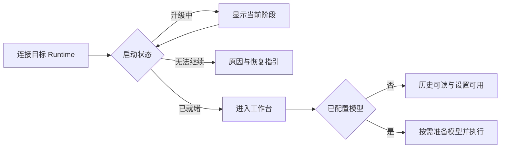

# v0.25.1 界面交互设计指导：模型管理与数据库自动升级

## 一、设计信息

- 版本：`v0.25.1`；状态：三级设置＋固定参数修订后的实施基线；版本进入 `开发中`，界面尚未实现。
- 日期：2026-09-08。
- 关联：[已确认功能设计](功能设计.md)、[技术方案](技术方案.md)。
- 阶段确认：用户根据接口实测要求允许编辑并固定参数、重置删除记录；设置改为三级页面，
  快速选择沿用两级级联。[开发计划](开发计划.md)同步修订，尚未开始界面实现。
- 范围：Desktop/Web 设置、服务商详情与编辑、在线模型选择、Composer、启动升级与故障反馈。
- 依据：[前端规范](../../specs/前端编程规范.md)、[Desktop 约束](../../modules/desktop.md)、
  [桌面端设计语言](../../resources/桌面端设计语言.md)。

本文规定目标行为与验收状态，不代表界面已实现。沿用当前产品组件与 Token；旧设计语言中的
“逐模型 CRUD／删除时替代默认”等语义由本版功能设计替代，归档记录保留历史原貌。

## 二、页面与入口

| 入口 | 目标页面／动作 | 返回位置 |
| --- | --- | --- |
| 设置侧栏原“模型” | 改为“模型与服务商”；顶部默认模型、辅助识图，下方服务商列表 | 关闭返回原会话或草稿 |
| “添加服务商” | 二级新增表单 | 保存成功进入新服务商详情；取消返回列表 |
| 服务商列表行 | 二级服务商详情，打开时获取在线模型 | 返回列表，保留本次列表滚动位置 |
| 在线模型行 | 第三级“模型配置”，编辑运行参数、保存固定配置／重置 | 返回服务商详情，重新取得本次在线结果 |
| 已保存引用（默认／会话／辅助）或已固定项的“配置” | 定位该服务商与模型的第三级，可在获取失败时管理已有固定值 | 返回进入时的服务商、设置首页或 Composer 草稿 |
| 详情“编辑” | 二级编辑表单 | 保存／取消返回原详情 |
| 默认／辅助选择字段 | 同一个“服务商 → 模型”两级级联，按用途判断可选状态 | 选中并保存成功后返回原字段 |
| Composer 模型按钮、`/model` | 同一会话模型选择流程 | 返回当前 Composer，不改变全局默认 |
| 无模型提示“配置模型” | 设置“模型与服务商” | 设置完成后返回原草稿，正文和附件保留 |
| 启动／连接检查 | 在现有 Runtime 入口显示升级阶段或故障 | Ready 后按已有进入工作台流程继续 |

Desktop/Web 的模型业务入口一致。设置属于当前连接的 Runtime，沿用壳层已有目标标识；远端设置
时在必要位置显示当前目标名称／地址，不把设置误写入本机。Web 不出现本机原生重启或文件打开按钮。

已核查的复用入口：

- [SettingsDialog](../../../apps/desktop/src/features/settings/SettingsDialog/index.tsx)已有导航与脏表单保护。
- [SettingsPageContainer](../../../apps/desktop/src/features/settings/SettingsDialog/SettingsPageContainer.tsx)
  已提供统一页头、返回动作与单一内容滚动区。
- [ModelsSettingsPage](../../../apps/desktop/src/features/settings/SettingsDialog/ModelsSettingsPage.tsx)
  当前含模型 Key、参数手填和逐模型编辑，本版替换其内容。
- [ModelSettingsPopover](../../../apps/desktop/src/features/composer/ComposerDock/ModelSettingsPopover.tsx)
  与 [SettingsCascadePopover](../../../apps/desktop/src/components/SettingsCascadePopover/index.tsx)
  已有模型／推理强度分类，保留入口与分类语义。
- [SelectionPopover](../../../apps/desktop/src/components/SelectionPopover/index.tsx)已有搜索、焦点及 Portal，
  但当前扁平 options 不支持两级级联；结合已有 SettingsCascadePopover 的交互能力扩展统一选择
  原语，二级支持加载／失败状态，业务请求归模型 feature，不另外造一套表单选择浮层。

## 三、布局与信息结构

### 3.1 设置首页

沿用实际设置壳层：最大宽度 900px、导航 190px、页头与正文使用现有布局 Token；不回退到早期
视觉资料中更小的设置尺寸。右侧从上到下为默认选择、辅助识图选择、服务商列表，添加按钮位于
页头右侧。选择行与列表保持紧凑分隔，不增加大型介绍卡片或常驻教程。

```text
┌ 设置 ─────────────────────────────────────────────────────── × ┐
│ Runtime       │ 模型与服务商                    [添加服务商]   │
│ 智能终端      │ 默认模型        [团队服务 / model-a        ▾]   │
│ 模型与服务商  │ 辅助识图        [未选择                    ▾]   │
│ 记忆          │                                                │
│ …             │ 服务商                                         │
│               │ 团队服务          OpenAI-compatible         ›   │
│               │ 本地服务          本地兼容接口              ›   │
└────────────────────────────────────────────────────────────────┘
```

图中的服务商与模型名称均为占位例子，不承诺这些类型或参数已经联调可用。

- 默认字段使用“服务商名称 / 模型 ID”，空值“未选择”；失效时保留原引用文本并就地标记原因。
- 辅助识图字段同样独立展示；空值不展示普通默认模型。仅在未选择或用户请求帮助时说明用途：
  “用于需要辅助识图的操作，可单独选择。”
- 首页不为显示服务商行而自动获取全部模型。行只展示名称、类型和进入详情动作，不用历史列表
  成功状态绘制“在线”绿点，也不展示未经本次获取的模型数量。
- 服务商行不显示 服务地址（详情页保留完整连接信息）；模型长名称省略，完整内容可聚焦查看，不只依靠 hover。
- 无服务商显示“还没有服务商”和添加入口；默认字段可打开后引导添加，不呈现没有解释的禁用框。

### 3.2 服务商详情与编辑

详情页头为返回、服务商名称、编辑及删除服务商；删除入口使用通用 Button 的 danger 样式。连接摘要折为名称／类型／服务地址，已保存凭据
只显示“已设置”或“未设置”。下方“在线模型”区域固定搜索与刷新，结果区独立展示当前请求状态。
首屏不展开完整协议与能力 JSON；低频技术诊断放在错误详情中。

模型行显示 ID／显示名与“在线参数／已固定／待配置”摘要，已固定项在行内打标，点击进入第三级
模型配置；缺少参数不阻止进入编辑。固定配置不另设独立列表或入口，就在在线模型行内呈现与管理，
目录失败或模型下线时仍可进入该行；固定记录独立参与选择列表合并，并明确来源，不伪装为失败目录的在线返回。
辅助识图仍从首页专用入口选择，参数保存不会自动改变模型用途或全局默认。

新增／编辑表单字段顺序：

| 字段 | 展示与校验 |
| --- | --- |
| 名称 | 必填，可由服务商类型预填；用户修改后不再随类型改变覆盖 |
| 服务商类型 | SelectionPopover field；候选来自实际支持的接入规则，不列未实现占位项；选定即自动匹配发现格式、列表路径与协议 |
| 服务地址 | HTTP／HTTPS 地址，拒绝 URL 内凭据、query 和 fragment；保留接口需要的路径 |
| API Key | 新建可按类型允许为空；编辑显示“已设置，留空保持”，不回显已保存值 |
| 接口协议 | 由服务商类型决定并预填，低频时折叠在“接口选项”供高级调整；只给出该服务商支持的选项，同一实例下所有模型共用 |
| 模型列表接口 | 由服务商类型自动匹配，不提供“列表格式”手选；列表路径输入框默认留空，提示“留空使用适配器默认接口”，用户可显式填写同源覆盖路径；切换类型保留用户输入；不逐模型设置、不失败后盲试其他路径 |

API Key 的显示开关集成在输入框右侧，用眼睛／划线眼睛图标切换，不另占复选框一行；
支持键盘操作，保存中或待清除时禁用，只作用于用户本次输入；清除已保存密钥通过明确“清除密钥”操作进入待保存状态，
可取消。保存后清空表单中的新密钥。普通错误反馈、复制诊断和日志不包含该值。
取消清除与“留空保持”含义清楚区分，不能把提交空框当作误删凭据。

表单主操作为“保存”，保存与在线获取分开反馈。页头高度及按钮位置不因错误或返回层级跳动。
错误放在字段下或表单首部，定位第一个无效字段；不以 Toast 代替持续校验。脏表单的返回、切页、
关闭均复用既有“放弃未保存的修改？”产品弹窗。

### 3.3 模型配置（第三级）

导航路径固定为“模型与服务商 → 服务商详情 → 模型配置”，不嵌套第三个弹窗。页头只显示返回与
模型 ID（归属在上一级已明确，不再重复服务商名称副标题），模型 ID 只读；主体分为运行限制、能力与
思考设置。表单顶部不显示来源提示，字段 label 只显示名称，不附来源或待配置副标题；
来源元数据仍由 Runtime 保留，模板与固定值都不标成实时厂商上限。
分组标题清除浏览器默认 margin，由表单容器统一控制：标题到字段 14px，上一组字段到下一组标题 20px。
思考设置／高级能力等折叠标题使用自然文本外观，默认最小行高 24px，无外部 margin 和水平 padding，
箭头与内容左边缘对齐；展开内容顶部间距 12px，收起不保留内容留白，键盘焦点保持可见。

```text
‹ model-a                              模型配置
上下文窗口（Token）      [          ]
运行输出上限（Token）    [          ]
输入上限（可选）         [          ]
模型能力                [图片] [工具调用] [思考模式]
思考模式                [不支持／可开关／始终开启／未知]
思考强度（档位 → 线上值；空置 = 不支持）
  low      [      ]    medium  [      ]
  high     [ high ]    x_high  [      ]
  max      [      ]    默认强度 [high ▾]
高级 ▸ 输入／输出模式限制、工具选择能力（可折叠区块）
[查看厂商文档]
[重置配置]                           [保存固定配置]
```

上述枚举与例值仅示意；控件选项由当前适配能力给出，思考强度固定列出五档（low/medium/high/x_high/max），
各档线上值可空、空置即该档不支持。图片、工具等声明可选“未知／支持／不支持”；只有实际支持的字段才开放，
未知不默认变成支持。
默认思考强度与五个档位字段使用同一个两列网格，占一列并与 max 并排；窄屏统一变为单列。
模型选择字段复用统一字段标签样式和 6px 标签间距，不使用正文样式作为 label。

- 无固定记录时先用本次在线字段预填，接口未提供的字段用内置模板预填，来源仅保留在元数据中，二者均缺的
  留空并显示“待配置，请核对文档后填写”；已有固定记录时优先显示保存值，即使在线获取失败也可编辑，
  不用新响应覆盖脏草稿或固定值。
- 必填上下文和运行输出上限使用明确整数 Token；可选输入／模式限制展开后编辑。正数、范围、
  输出不大于窗口且不超过 4,294,967,295、默认强度属于集合、始终思考不可关闭等错误就地显示。最大输入与最大输出不
  代表可以同时达到；说明真正执行仍按剩余窗口和请求预算限制。
- “查看厂商文档”为普通下划线链接，与模板核查日期及说明排在同一行，窄屏允许自然换行。
  桌面端通过现有原生外链命令调用系统默认浏览器，不在 Tauri WebView 内导航；Web 端使用新标签页。
  型号、套餐与单位由用户核对。文档不自动填表，
  不把 API 默认输出值冒充绝对上限。没有可靠链接时如实显示暂无参考。
- “保存固定配置”只保存这一模型的完整标准化参数，不自动选择默认或辅助模型；保存成功显示
  “已固定，下次执行生效”，来源变为用户固定。允许值未变化时显式固定在线值，不能误判成无操作。
- 已固定时提供“刷新在线参考”，显示本次在线值及与固定值的差异；若要采用它，用户明确点击
  “使用本次在线值”仅更新草稿，仍需保存。刷新失败不影响固定记录、不恢复上次在线参考。
- “重置配置”仅有固定记录时启用。确认文案说明将删除固定参数、恢复在线来源，在线缺参数可能
  需要重新填写，模型选择和历史保留。成功后显示“固定配置已重置”，重新获取在线值；若获取
  失败独立提示，不把删除已成功误报为重置失败。重置不能退回旧 TOML 或上次保存值。
- 原记录不存在时，在线来源新建必须验证目标仍在在线列表；手动添加不依赖列表接口。已有固定记录
  可以离线编辑／重置。模型从在线目录消失后仍可经已固定入口管理，但不伪装为在线候选。
- 返回、关闭或换 Runtime 的脏表单保护复用现有逻辑；保存结果未知先重读固定记录确认。重新
  进入服务商详情按需获取，不把第三级暂存的旧目录恢复为新列表；可在新结果中定位原模型行。

### 3.4 统一在线选择器

按用户审阅意见收敛为两级级联：一级列服务商，二级列该服务商的在线模型。普通默认、辅助识图
与会话选择复用这一结构。一级不再增加“模型”分类入口，不展示跨服务商分组列表或搜索工具栏。
一级服务商不显示 服务地址；模型所属服务商由当前一级活动项表达。二级不重复标题、不提供刷新按钮，
直接显示模型列表；返回后重新进入或关闭重开即可重新获取。窄屏保留返回一级按钮。

```text
一级                        二级
默认模型              ✓
团队服务              ›    model-a               ✓
本地服务              ›    model-b
─────────────────────
推理强度              ›
管理服务商
```

- 点击服务商或键盘展开后才获取它的模型，不预取所有服务商。一级服务商选项仅展开，不写入模型选择；
  点击二级模型才验证并保存。指针经过一级条目不发网络请求。
- 加载、空列表、获取失败和重试都在当前二级面板内呈现；需要刷新时重新进入该服务商。一级始终可切换
  其他服务商，不因为一个接口失败而禁用整个选择器。“管理服务商”仅在会话选择器保留为一级底部普通动作；模型管理页的默认／默认识图选择器不显示该入口。
- 选中标记仅依据保存成功的引用；暂时高亮的键盘活动项不等于已选择。旧引用摘要不补进在线结果。
- 模型不符合当前用途时显示不可选原因，如“需配置输出上限”“不支持图片”；未知能力不伪装为支持。
  提供独立“配置模型”动作关闭浮层并进入第三级，保留原选择；不能在不可选 option 内嵌按钮。
  辅助识图以有效固定或在线能力判定；非对话模型不可作为普通默认。
- “默认模型”作为与服务商同级的首项，仅出现在会话选择器；直接选择即跟随全局默认，
  不展开二级菜单，保存成功后显示选中标记。普通默认和辅助选择器不显示该项；普通默认和辅助选择器将清除操作集成到触发器尾部：
  有值时箭头区域悬停或键盘聚焦变为关闭图标，点击／Enter／Space 清空；无值时不显示清除操作。
  点击文本区域仍展开菜单，清除不触发展开；可靠成功后显示“未配置”并将焦点恢复到触发器，失败保留原值。
  触摸设备直接显示关闭图标；移除外侧“清除默认模型／清除默认识图模型”文字按钮，不把空值写成虚构模型。
  当前没有默认时仍允许会话清除显式选择，但提前显示“尚未设置默认模型，发送前需要选择模型”。
- 选中时显示行内“正在验证并保存…”，成功后关闭，失败保留原选择与局部错误；不能先换标题再回滚。
  关闭浮层只停止展示，不暗示已经发出的保存命令会被撤销；结果按 Runtime 最终投影更新。

### 3.5 Composer 与上下文说明

底栏继续保留添加、执行设置、上下文用量、模型设置、发送／停止五个常驻视觉项。
模型按钮显示模型简名；所属服务商与“跟随默认”来源在弹层摘要中完整展示，同名模型必须可区分。
推理强度保持独立设置，不按“模型 × 强度 × 协议”生成组合选项，也不添加服务商独立底栏按钮。

Composer 模型按钮和 `/model` 直接打开服务商一级，选择路径固定为“服务商 → 模型”，不再套
“模型 → 服务商 → 模型”三层。推理强度作为一级底部独立条目，以分割线与上方“默认模型”及服务商选项区隔，
其候选使用同一个二级面板；没有可用强度时不显示该条目与分割线。
可用空间不足时，二级内容在同一浮层内替换一级并提供返回按钮，不把两个面板强行横排出视口。
推理强度候选仅使用当前有效能力；无固定配置且本次无法获取能力时显示原因，不能拿其他模型的候选继续保存。

缺模型时允许输入、粘贴、附件和草稿切换；模型按钮显示“选择模型”。发送入口可聚焦并给出配置指引，
不偷偷切换其他服务商或清空草稿。若进入发送准备后才发现网络／参数失败，在现有发送错误区提供
“重试”或“选择模型”，消息是否已接纳以 Runtime 为准，不因重试创建重复会话或重复消息。
停止按钮在活动 Run 期间仍可操作，服务商变更不使停止入口失效。

活动 Run 存在时，模型切换遵循 Runtime 当前允许条件；若接纳下一次选择，提示“下次执行生效”，
若当前阶段禁止则展示服务端原因。右侧上下文用量属于当前冻结执行，不因设置默认变化提前跳动；
无可用参数时显示“暂无上下文信息”，不用零或猜测百分比填充。

## 四、交互流程

### 4.1 首次配置与旧版本升级后配置

1. 进入已就绪的工作台，无有效模型时可查看历史，在模型入口提示选择；不弹不可关闭的配置向导。
2. 从“配置模型”进入设置，添加并保存服务商；数据库保存失败停留表单，输入保留。
3. 保存成功进入详情，自动获取列表；失败显示“服务商已保存，模型获取失败”，提供编辑与重试。
4. 点击在线模型进入第三级；若参数不全，参考文档补齐并保存固定配置，再设为全局默认。
   在线参数加模板补齐后已完整时可直接选择并使用，不强制进入详情或保存固定配置；
   需要修改参数时再主动固定。参数仍不完整时才提示编辑。
5. 用户需要辅助识图时主动单独选择；关闭设置回到原会话和原草稿，不自动发送。

升级导致旧选择被废弃时，在本次客户端观察到升级完成后展示一次简短说明：“模型设置已更新，
请添加服务商并重新选择模型。历史会话已保留。”不反复弹窗、不为说明新增数据库标志；没有观察到
升级过程的新客户端按普通未配置状态引导。旧辅助选择不迁移、不预选普通默认。

### 4.2 获取、刷新与重试

进入详情或展开某个服务商二级时开始本次获取，立即清空上一轮结果并显示加载状态；详情页刷新按钮在
本次请求未结束时防重复触发。选择器不提供刷新按钮，重新进入时获取；重试／详情刷新只请求当前服务商，不提供全局刷新。切换服务商释放前一个
二级的请求和结果，再次展开重新获取；关闭选择器同样释放结果。详情页刷新保留其本次搜索输入。

服务商编辑、删除或目标 Runtime 切换使旧请求失效；迟到响应不得插入新列表。若选择验证期间
配置变化，显示“服务商配置已变化，请重新获取模型”，原已保存选择保持原样。
网络失败不删除服务商、固定配置或用户选择，不恢复之前在线列表；本次成功数不作长期在线状态。

### 4.3 默认与会话切换

默认选择成功后只改变跟随默认的后续执行；新格式显式选择保持不变。设置成功反馈写“默认模型
已更新”，会话切换写“会话模型已更新”，不使用含糊的“已切换模型”掩盖作用范围。
从会话入口进入服务商管理先关闭原浮层；返回 Composer 时重新打开会重新获取，不重叠两层选择器。

推理强度不适用于新模型时，由 Runtime 按既有能力规则校验／调整，UI 展示最终结果；发生调整
提供一次“推理强度已恢复为模型默认”的反馈，不在前端猜测并先写入另一项选择。

### 4.4 编辑与删除服务商

编辑保存后清除该实例旧在线视图并重新获取；页面只报告保存和本次获取的各自结果。活动 Run
继续使用已冻结连接，后续执行重新验证。不会出现“编辑成功但旧目录仍标为可用”的混合状态。

删除从详情更多菜单进入确认框，打开时向 Runtime 只读查询默认、辅助及所有会话的引用影响，
包括未加载和归档会话；不能只数前端 active_sessions。加载失败时不显示猜测数量，保留重试，
确认动作暂不可用。结果显示查询时的引用数量、受影响用途和有界会话标题，更多引用使用数量摘要。

确认文案说明：“删除后，这些模型选择需要重新设置。历史消息保留，已经开始的执行继续使用
原连接；该服务商下的固定配置也将删除。”同时展示固定记录数量。按钮为“取消”和“删除服务商”。不要求先选替代默认，不做批量切换或强制停止活动 Run。
影响数字是查询时快照，多客户端并发期间可能变化；不宣称它锁定了会话，删除响应与后续投影反映
实际结果。删除失败留在确认框，成功返回列表，失效选择保留原引用并显示重选入口。

### 4.5 升级与连接



首次连接或登录后，在现有 RuntimeEntryLayout 内容区呈现“正在升级数据”，阶段使用 Host 实际
投影：检查数据、备份、升级至某版本、整理配置、准备工作台。显示当前／目标版本即可，详细 SQL、
表名和文件计数不进入普通流程；只有完成备份校验才可显示“备份已验证”。没有精确进度时使用
阶段和不定进度指示，不伪造百分比或剩余时间，不播放已成功进入工作台的转场。

已进入工作台后因 Host 重启遇到升级，保留现有已加载内容并显示持续状态条，禁止发起业务请求；
尚未加载的历史不能声称可查询。Ready 后正常重连刷新，不把旧业务投影当作新 schema 已就绪。
升级失败显示持久原因与恢复动作；“重新连接”只重新检查连接状态，不能包装成重新执行迁移。
本机原有受控重启能力可以在故障详情中按既有确认流程使用；远程与 Web 提示在目标主机修复并
重启 Runtime，不发送未经设计的远程系统操作。

关闭客户端或离开页面不取消 Host 正在执行的迁移；升级页不新增“取消升级／跳过升级”按钮。
数据库比 Host 新时显示“请升级 Runtime 后重试”，不能提示只升级当前浏览器或以清库恢复。
认证、TLS 或监听本身失败时沿用连接错误；不展示尚未取得的数据库状态。

## 五、视觉与组件规范

- 使用现有 surface、text、border、primary、danger、radius、shadow、control-height Token；
  常规控件沿用 32px 基准。错误小范围用红色，状态同时用文字表达，不靠颜色区别加载与失效。
- 服务商／模型行默认浅分隔，hover 使用现有浅背景；不增加品牌大图、连接拓扑卡片或动效仪表盘。
  名称和模型 ID 可选取／复制，密钥不出现在详情或复制诊断中。
- 级联一级建议宽度 200px、二级 260px，单面板最大宽度为视口减 16px；最大高度取 420px 与
  可视剩余高度的较小值。定位以实际 DOM 和 visual viewport 夹取，放不下两列时同层返回。
- 设置沿用现有 760px 断点的一列表单与 560px 断点的单栏内容／导航处理；720px 桌面宽度下
  Composer 主操作不被挤出，长模型名收缩；390px Web 下选择器改用同层返回，不能横向溢出。
  触屏命中区可增大而不改变桌面基准，虚拟键盘出现时当前面板和活动项必须仍可见。
- 共享选择原语的级联、加载、空结果与错误能力使用组合 slot；模型服务请求、作用范围
  及错误文案留在业务 feature。现有 DropdownMenu、Dialog、SettingsPageContainer、层级 Token 和
  原生网页遮挡标记继续复用，不在模型页复制 Portal／焦点／定位实现。
- 本次新增与修复的通用组件：基于现有 Collapse 封装带触发头的“可折叠区块”，替换设置页中的原生
  details／fieldset 分组；修复 SettingsCascadePopover 触发器缺内联布局导致的基线错位（在组件层补
  inline-flex 居中对齐，而非各调用方自行补丁）；文字链接与次要按钮收敛进设计系统（统一字号、颜色
  与 hover 态），不再使用浏览器默认蓝色链接或裸露原生控件。
- 一级服务商声明可展开及展开状态，二级选择使用一致的 menu/listbox 语义；刷新、重试操作与
  模型项分开，不把可点击按钮塞进 option。不可选条目可被阅读并获知原因，但不可提交。
- 键盘支持上下、Home/End、Enter、左右展开／返回、Esc；输入法组合 Enter 不触发选择。
  Esc 先关闭二级并返回一级，最终恢复触发器焦点；Tab 可访问返回、重试和管理入口。
  删除及脏表单确认使用产品 Dialog，取消为默认安全焦点，不通过遮罩误触执行确认。
- 加载／保存用适量 aria-live 通知，错误关联到对应控件；结果更新不反复抢走焦点，活动项
  被删除时转到下一可操作项或所属服务商。减少动态效果模式沿用静态状态指示。

## 六、状态与异常

| 状态 | 用户看到的内容 | 可用动作与结果 |
| --- | --- | --- |
| 没有服务商 | 还没有服务商 | 添加服务商；历史与草稿可用 |
| 服务商已存、正在获取 | 正在获取模型… | 可返回；关闭停止视图请求，保存事实保持 |
| 当前成功空列表 | 该服务商没有返回模型 | 刷新、编辑服务商 |
| 详情页搜索无匹配 | 没有匹配的模型 | 修改搜索；不误报接口空列表 |
| 刷新失败 | 无法获取模型，附可理解原因 | 本组重试、编辑；不显示上次结果 |
| 不支持列表接口 | 此服务商暂不支持获取模型列表 | 编辑服务商；不提供手工注册兜底 |
| 缺少必需参数 | 需配置上下文窗口／输出上限 | 进入第三级，参考文档补齐并固定；原草稿保留 |
| 已有固定配置、目录失败 | 在线列表显示失败；已固定项经行内标识进入管理 | 管理固定配置，原选择可用固定值执行 |
| 重置成功但在线失败 | 固定配置已重置；在线参数获取失败 | 重试；没有完整参数时新执行需先配置 |
| 默认为空 | 未选择默认模型 | 选择；会话已有显式选择仍可使用 |
| 已存引用失效 | 模型需要重选，说明服务商已删除或本次未找到 | 重选／明确跟随默认；不自动替换 |
| 辅助识图未选 | 未选择辅助识图模型 | 需要此能力时配置；文本与原生识图可用 |
| 保存被明确拒绝 | 就地错误，保留草稿和原选择 | 修复后重试；无成功 Toast |
| 保存响应中断 | 结果尚未确认 | 重读 Runtime 配置核对；不自动重复创建服务商或清空草稿 |
| 在线获取中配置变化 | 服务商配置已变化，请重新获取模型 | 重试；忽略旧响应 |
| 升级中 | 当前实际阶段与版本 | 查看状态；不开放正常业务 |
| 升级失败／备份失败 | 无法完成数据升级，附步骤与恢复指引 | 复制脱敏诊断、重新连接；不清库或自动循环迁移 |
| 数据版本更高 | 请升级 Runtime 后重试 | 查看目标版本与连接信息；无降级入口 |

诊断可包含错误码、目标 Runtime、当前／目标版本、失败阶段和关联 ID；备份路径只在有权限的
本机诊断显示。不可将完整 Provider 响应、凭据、消息正文或原始 TOML 填入普通错误／剪贴板。

## 七、验收口径

| 编号 | 交互检查 | 对应功能验收 |
| --- | --- | --- |
| U01 | 首页按服务商管理，服务商页允许手动添加模型，不恢复 Model Key；选定类型自动匹配接入方式、无列表格式手选；第三级可编辑上下文、输出、能力与思考强度映射 | A01、A02、A07、A28 |
| U02 | 新增保存成功／获取失败分别反馈；修改密钥、留空保持与明确清除可区分，退出脏表单受保护 | A01、A04、A21 |
| U03 | 全部选择入口为“服务商 → 模型”两级；按展开获取，二级空／失败可重试，仍可切换其他服务商 | A03、A05、A21 |
| U04 | 成功后刷新失败旧列表立即消失；关闭重开重新获取，目标切换与迟到请求不串数据 | A04、A21 |
| U05 | 未提供参数（含模板未覆盖）与明确不支持均有来源或原因标注，不伪造数值或开放不符合用途的选项 | A06、A07、A13、A29 |
| U06 | 默认、会话与辅助选择的保存范围清楚；跟随默认与失效显式选择行为不同 | A08、A09、A12、A13 |
| U07 | 删除前影响来自完整 Runtime 查询，删除后提示重选，历史与活动 Run 不被误改 | A09、A11、A12 |
| U08 | 旧选择废弃后可查看历史、配置并继续；缺模型与发送失败保留草稿，不要求重建会话 | A10—A13 |
| U09 | 升级阶段实际可见，失败与更高版本可处理，不误触业务、不无限加载或反复重启 | A14—A20、A22 |
| U10 | 默认更新与会话切换不改变活动 Run 的上下文显示；停止入口始终可用 | A09 |
| U11 | 1280px、720px Desktop 与 390px Web，长名称、中文输入法、键盘／触屏、缩放和虚拟键盘无溢出或焦点丢失 | A02、A21 |
| U12 | 保存响应不确定时先核对服务端；不重复创建服务商或固定记录，重置后获取失败不误报删除失败 | A01、A08、A21、A24、A26 |
| U13 | 三级设置返回／脏表单／窄屏正确；保存后固定来源可见，刷新不覆盖固定值或草稿 | A23、A27 |
| U14 | 重置只删固定参数，重复操作幂等；离线仍可管理已有记录，未固定的缺参数模型引导编辑 | A24、A25 |

实施验证需覆盖正式页面、真实 Host 集成与 macOS WKWebView；Web 单独检查认证入口、目标配置和
窄屏。截图至少包含设置首页、服务商详情的成功与失败、第三级参数编辑／固定／重置、两级选择器与二级失败、缺模型 Composer、
升级中与升级失败。浏览器夹具通过不代表全部平台或真实服务商接口已通过。

界面目前为设计稿，尚未实现或运行 UI 构建；M0 已完成来源解析与最小真实链路，证据见技术方案
2.3／2.5，M0 已确认，M1 待确认。交付检查包含链接、状态及跨文档一致性；界面实现归 M3，不提前实施后续里程碑。

### 手动模型交互

服务商详情“模型”标题右侧增加“添加模型”。第三级页面先填写模型 ID，点击“配置参数”后复用现有参数表单，静态模板可预填。已存在的 ID 提示进入原记录编辑，来源不得切换。

添加页复用设置表单的标签与输入宽度，进入时聚焦模型 ID；操作区与输入框间隔 20px，提供“取消”和主按钮“配置参数”。空值或纯空白时禁用继续，回车与点击行为一致，提交去除首尾空白。取消与返回共用未保存确认；进入参数页沿用读取中、错误和重试反馈，此时尚未保存模型。
列表合并在线及持久化模型，手动来源标记“手动添加”；在线列表后来返回同 ID 时仍只显示一条并保留此标记。在线失败提示与已保存模型并存。手动详情的操作为“删除模型”（danger），在线固定详情为“重置配置”，确认文案分别说明删除身份和删除覆盖参数的效果。

在线及手动模型使用同一个连续列表和行组件，名称字重、行高、内边距与分隔线一致；不因来源不同另起带间距的分组，来源差异通过 Tag 表达。

模型管理行右侧使用紧凑 Tag 区分两个维度：创建来源“在线发现／手动添加”，参数状态“在线参数／模板预填／已自定义／待补全”。在线目录摘要由 Runtime 结合静态模板计算，不额外逐模型请求；保留原始在线 metadata。存在固定记录时展示“已自定义”，不宣称曾修改过每个字段。模板不能补齐必需参数时同时标记“模板预填”和“待补全”；在线来源固定项本次未返回时另标“本次未返回”。
