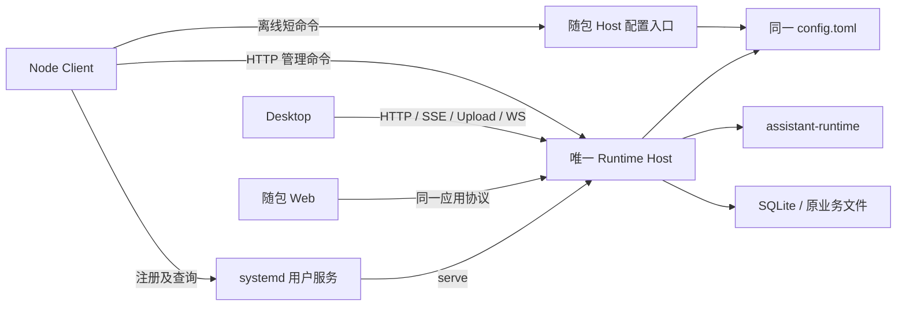

# v0.25.2 技术方案：Client 本机 Host 管理与兼容保护

> 归档状态：v0.25.2 已完成，2026-09-11 用户确认验收限制并授权归档。下文阶段过程保留当时事实，最终结论见[版本总结](版本总结.md)和[验收记录](验收记录.md)。


## 一、方案信息

- 版本：v0.25.2；状态：已作为[开发计划](开发计划.md)编制基线，版本为 `开发中`，M0—M2 已确认，M3 已确认，M4 正式 Node Client 已确认；M5 按 Docker 范围已确认，M6 npm 分发进行中。
- 日期：2026-09-10。用户在功能设计评审中补充 Linux 自启要求，随后要求进入技术方案。
- 依据：[功能设计](功能设计.md)、[原型记录](Client交互原型.md)、
  [输入记录](../../inputs/260910-Client语言选型分发与最小兼容版本机制.md)；正式行为见
  [M0 交互指导](界面交互设计指导.md)，已获本里程碑确认。
- 约束：[开发流程](../../specs/开发流程规范.md)、[Rust 架构规范](../../specs/Rust架构设计规范.md)、
  [Rust 编程规范](../../specs/Rust编程规范.md)、[前端规范](../../specs/前端编程规范.md)、
  [Agent 系统架构](../../modules/agent-system.md)，以及各受影响模块约束。
- 本文确定技术落点与验证要求；M1 存储保护、M2 协议及隔离验证已确认；M3 已确认，M4 正式 Client 已实现并完成 macOS 隔离验收；M5 Linux 服务已实现，M6 npm 分发进行中。

本稿采用“受支持 Node + npm TypeScript Client + 平台包 Rust Host”。Client 负责命令、终端交互、
本机连接与 Linux 服务配置；Host 保留配置校验、存储和业务的权威实现。Linux 自启采用
systemd 用户服务，默认关闭，直接运行 Host。双方应用协议兼容与数据库兼容分别检查。

智能终端与 Host 的版本兼容不纳入 v0.25.2；用户明确该能力需要本项目与智能终端项目同步
开展设计、改造和联调，后续版本另行安排。本文的 Desktop／Web Shell（PTY）终端属于本仓库
应用客户端功能，和智能终端 Device Gateway 的设备连接分别说明。

用户已认可 systemd 用户服务加 linger 的方向，并进一步明确：Client 未来更换架构不能影响
Host 与 Desktop 的正常使用。本稿据此补充 3.3 的独立性约束和 A23 验收。
用户随后要求编写开发计划；Node 补丁版本、首批平台及其他实现细节按本稿安排，实施条件在
计划 M0 核对，不将方案选型视为平台或正式分发已经验证。

## 二、现状核查

本轮只读检查源码、配置、依赖和 `cargo metadata --offline --no-deps --format-version 1`。
当前 workspace 版本为 `0.25.1`，workspace metadata 尚无兼容声明。

| 实际位置 | 已有事实 | 本版调整 |
| --- | --- | --- |
| Client Demo（临时原型已在归档时删除） | TS ESM、Commander、Clack、Ora；只有内存模拟 | 提炼交互组件，正式应用另建 `apps/client`，不复制场景夹具进入产品 |
| [Host CLI](../../../apps/runtime-host/src/main.rs)、[Unix 启动](../../../apps/runtime-host/src/platform/unix.rs) | `launch`／`serve`；后台启动仅设置独立进程组 | 增加短时离线配置入口；补 Unix 会话脱离和 SIGTERM 收敛 |
| [发现与锁](../../../apps/runtime-host/src/endpoint.rs) | Runtime Home 内的内核锁、私有 discovery、随机 instance/token | 沿用唯一实例所有权，补可执行来源；不增加实例注册库 |
| [启动编排](../../../apps/runtime-host/src/startup.rs) | 先建立诊断监听，再初始化业务；失败保留诊断 | 存储下限失败接入原启动状态，不创建第二状态机 |
| [Desktop bootstrap](../../../apps/desktop/src-tauri/src/runtime_bootstrap.rs) | 设计核查时 restart 调用自己的 `launch()`；校验协议整数相等 | 改为双向版本检查及保留运行来源的重启 |
| [Host 访问配置](../../../apps/runtime-host/src/access/mod.rs)、[文件来源](../../../apps/runtime-host/src/config_source.rs) | 单份 TOML，SHA-256 revision、进程内写门、原子替换 | 在线复用；离线短命令持实例锁，复用解析和保存 |
| [协议能力](../../../crates/assistant-protocol/src/host.rs) | 设计核查时 capabilities 有 runtime_version、protocol_version；旧协议整数为 3 | 使用软件版本号及最低兼容软件版本，移除独立协议整数及其检查 |
| [认证](../../../apps/runtime-host/src/http/auth.rs)、[登录](../../../apps/runtime-host/src/http/login.rs) | 本机 bootstrap 与普通 token／Cookie；已有登录会话 | 在原认证路径上准入，不增第二种凭据或连接注册表 |
| [Desktop／Web Shell（PTY）终端](../../../apps/runtime-host/src/user_terminal/socket.rs) | WS 首帧 Open 认证，之后创建 PTY | 本仓库应用客户端的首帧加入兼容声明，检查通过前不创建 PTY |
| [智能终端 Device Gateway](../../../apps/runtime-host/src/device/gateway.rs) | 独立设备连接入口 `/device`，已有设备握手与认证 | 版本兼容本版不纳入，后续由本项目与智能终端项目同步设计和联调 |
| [迁移编排](../../../apps/runtime-host/src/storage/migrations/mod.rs)、[存储初始化](../../../apps/runtime-host/src/storage/engine.rs) | manifest 前缀、拒绝高版本、备份验证、分版本事务；随后设置 DELETE journal 与 FTS | 既有数据库先只读准入，再执行原流程；新增独立存储下限 |
| [TS 导出](../../../crates/assistant-protocol/examples/export_typescript.rs) | ts-rs 导出路径固定到 Desktop，`--check` 检查生成结果 | 改为两端共同消费的 TS 投影，保留生成一致性检查 |
| [Host 构建脚本](../../../apps/desktop/scripts/build-host.mjs) | 通过 EZ_ASSISTANT_WEB_DIST 嵌入 Web | Client 构建复用 Web 与 Host 装配，不依赖 Tauri 安装产物 |

依赖关系仍为 Desktop → assistant-protocol ← Host → assistant-runtime → Agent crate。
Client 不依赖 Rust Runtime 库；通过同一 HTTP 应用协议连接。Host 已依赖 `semver 1.0.28`、
`rusqlite 0.40.1` 及 Unix 进程／文件能力，优先复用。协议 crate 不引入数据库或平台依赖。

## 三、目标架构与最小新增



离线入口与运行 Host 互斥，不同时写配置；图中的两条配置路径不是两个配置所有者。
systemd 只负责进程，业务就绪仍以 Host health 为准。

### 3.1 计划目录与依赖

下列为拟新增位置，当前尚不存在：

```text
apps/client/
  src/cli.ts                   命令与退出码
  src/commands/                start/status/stop/restart/config/web
  src/host/                    discovery、HTTP、启停及离线 helper 调用
  src/config/                  草稿、校验提示与保存流程
  src/platform/                systemd 用户服务与浏览器打开
  src/terminal/                Clack、Ora、取消清理
  scripts/                    构建、安装、卸载与分发装配
  tests/                      命令、PTY、真实 Host 集成
packages/assistant-protocol/
  src/generated/              Rust 导出的 DTO 与发布常量
  src/compatibility.ts        两个 TS 消费方共用的纯版本判定
  fixtures/                   Rust 与 TS 共用的版本判定向量
```

TS 包仅承担共享协议投影和纯兼容函数，通过 npm 本地依赖由 Client 和 Desktop 消费；
不发布通用 SDK，不搬入 Desktop 的 DOM、Session、SSE 生命周期或连接状态。
Rust 类型仍只有 `crates/assistant-protocol` 一个定义来源；旧 Desktop 生成文件路径和导入
一次性迁移，所有构建入口先检查生成内容，无手写 DTO 副本。
该包独立于 `apps/client`：源码、生成器、构建脚本与依赖树不得引用 Client，不能依赖 Commander、
Clack、Ora 或 Client 配置。DTO 与兼容函数使用语言无关的契约及纯数据；TS 包只是消费便利，
其他架构的 Client 可直接实现同一契约，Host 和 Desktop 无须改变。

正式 Client 运行依赖沿用原型锁定的 Commander 15.0.0、Clack prompts 1.8.0、Ora 9.4.1、
Picocolors 1.1.1；开发沿用 TypeScript 7.0.2、tsx 4.23.13。精确锁入 package-lock，
严格 TS、ESM、标准 Node API；不用 Bun、Ink／全屏 TUI、Node 原生扩展或额外常驻进程。
构建选择 Node **24.21.0 LTS**，这是本次核查的官方发布值；打包时核验各架构官方包及摘要，
补丁更新须同步清单和验收，不能在构建中使用浮动 `latest`。
[Node 发布依据](https://nodejs.org/en/about/previous-releases)、
[固定版本与目标平台清单](https://nodejs.org/dist/index.json)、
[官方摘要清单](https://nodejs.org/dist/v24.21.0/SHASUMS256.txt)。

M0 复核上述版本可取得，Node 24 满足各包声明的 engines；这仅是发布元数据核查，
不代表正式构建或各平台运行通过。Commander 要求 Node ≥22.12.0，Clack ≥20.12.0，
Ora ≥20，TypeScript ≥16.20.0，tsx ≥18；Picocolors 未声明 engines，不能据此承诺任意版本支持。
依据：[Commander](https://registry.npmjs.org/commander/15.0.0)、
[Clack](https://registry.npmjs.org/@clack%2Fprompts/1.8.0)、[Ora](https://registry.npmjs.org/ora/9.4.1)、
[TypeScript](https://registry.npmjs.org/typescript/7.0.2)、[tsx](https://registry.npmjs.org/tsx/4.23.13)、
[Picocolors](https://registry.npmjs.org/picocolors/1.1.1)。M4 已锁定正式依赖并通过隔离 Node 24.21.0 的 macOS arm64 构建及终端／Host／Web 验证；各平台随包分发仍归 M6。

M4 编译落地：共享协议包自有 `tsconfig.json` 和 `build`，将 TS 投影编译为 ESM JS 与声明文件，
通过 `@ez-assistant/protocol/node` 导出；Desktop 保留根 TS 导出。构建依赖归共享包，Client 仅调用，
不向 Host 或 Desktop 引入 Commander、Clack 或 Client 源码。

### 3.2 新增项必要性

| 新增项 | 现有机制不足之处与实际消费者 |
| --- | --- |
| 正式 Client 与 TS 协议投影包 | 缺少独立终端产品；Client、Desktop 均消费 DTO 与兼容函数 |
| 当前软件版本号与最低兼容软件版本号 | Client、Desktop、Host 均直接使用软件发布版本比较兼容范围，例如 0.25.2；不另设协议版本号 |
| discovery 的可执行来源 | 现有 PID／instance_id 不能让另一产品准确重启原 Host |
| Host 私有离线配置子命令 | 现有访问命令依赖在线就绪服务；Node 不能另写 TOML／密码规则 |
| 数据库兼容单行表 | 迁移版本记录已执行步骤，不能独立表达最低可写 Host |
| systemd unit 文件及短提交锁 | 系统启动所需的原生配置；锁防止两个 Client 配置提交交错，状态仍由 systemd 查询 |

本版不增加 Host 控制 daemon、生命周期操作账本、通用跨平台服务框架、全局 revision、
客户端业务数据库或跨端配置缓存。适配函数在现有应用内就近组织，没有实际替换方时不抽 trait。

### 3.3 Client 可替换性与独立运行

用户明确该项为架构约束。允许各产品依赖共享协议和 Host 提供的本机管理契约；
Client 的框架、运行时、状态管理、交互库和工程布局均只属于 Client 自身实现。
更换这些实现时，由 Client 适配既有契约，不能要求 Host／Desktop 增加对应分支或同步重构。

| 边界 | 必须满足的约束 | 本次核查与方案收紧 |
| --- | --- | --- |
| 源码与依赖 | Host／Runtime／Desktop／共享协议不导入 Client 源码、包或内部类型 | cargo metadata 中现有三组件无 Client 依赖；新增 TS 协议包继续独立，不成为 Client SDK 的别名 |
| 独立构建 | Host、Web、Desktop 的构建和协议生成不执行 Client 脚本、不安装 Client 依赖 | 现有 Web／Host 构建未引用 Client；新增发布校验按目标隔离，不让 Client 构建故障阻塞独立构建 |
| 运行与生命周期 | Host 不通过 Client 代理通信，不依赖其在线、心跳、退出清理或 Node 常驻；Desktop 直接连接 Host | Host 的 launch／serve、诊断、数据库准入和受控关闭独立存在，Client 只是调用方 |
| 配置与认证 | Runtime Home、Host 配置、实例发现和凭据规则由 Host／平台契约确定 | 不读取 Client 草稿、偏好、私有缓存或 token 副本；Client 不成为 Host 设置的唯一访问通道 |
| 系统服务 | unit 直接执行 Host；Client 管理服务器服务，Desktop 保留自身桌面启动和 Host 连接逻辑 | ExecStart／ExecStop 等钩子、运行环境均不得指向 Client 的 JS、Node 或包装脚本 |
| 安装与版本切换 | 当前 Host 的可执行来源通过 discovery／unit 明确提供，各产品独立保有 Host | Desktop 不猜 Client 的安装目录结构、不解析其 manifest；Client 重构升级保留在用 Host 文件、unit 和 Runtime Home |
| 兼容与发布 | 同一发布版共用软件版本事实；兼容下限只随对应契约改变 | Client 内部架构调整本身不提高应用协议或数据库下限，也不强迫已运行 Host／Desktop 升级 |

Host 嵌入 Web 的构建仍可使用现有前端工具链，工具／MCP 所需外部程序仍按已有配置处理；
这些依赖均不得由 Client 安装包里的 Node 或私有依赖目录隐式提供。
共享协议生成和发布常量由协议／发布层拥有，Client 是消费者，不拥有生成其他产品所需文件的职责。

M2 已建立独立共享包，M4 正式 Client 消费其 Node 投影；真实 Desktop 原生函数可管理 Client 启动的 Host，Client 退出后 Host 继续运行。完整 A23 的禁用 Client／Node、独立分发与服务验收仍归 M6／M7。

## 四、版本定义与应用协议准入

### 4.1 单一发布来源

继续以根 `Cargo.toml` 的 `workspace.package.version` 为软件版本权威；新增
`workspace.metadata.ez-assistant.min_compatible_version` 为同次发布允许兼容的最低软件版本号。
本版建议两者均为 `0.25.2`。Desktop、Client、Host 及同包 Web 均从此处生成常量。

用户在本稿评审中明确使用软件版本号：当前版本和最低兼容版本均属于同一套软件发布版本体系。
“应用协议兼容下限”只说明该下限判断应用协议能否兼容，不表示另有协议版本号或协议代际。
数据库的最低兼容 Host 版本同样使用软件版本号，但按存储兼容性独立维护下限值。

协议 crate 的构建步骤读取根 manifest，导出下限常量；TS 导出器同时输出发布常量。
读取 TOML 的依赖限于构建期。版本校验脚本核对 Cargo、Tauri 配置、两个应用 package.json、
TS 常量和分发 manifest；发布不一致即失败。设计阶段不提前提升当前源码版本。
校验按构建目标执行：Host／Desktop 独立构建只校验公共发布源及自身产物，不要求 Client
package.json、依赖安装或构建成功。整版联合发布可汇总各产品的产物清单核对一致性；
未来 Client 更换工程格式时，只调整其清单适配，不修改 Host／Desktop 的构建入口。

发布值使用规范 `major.minor.patch`，无 `v` 前缀、前导零、预发布或 build 后缀；每段为
0 到 u32::MAX 的整数。开发构建沿用目标发布值，构建标识另作诊断，不能参与兼容比较。
Rust 基于 semver 解析后执行同一限制；TS 用数值三元组比较，禁止字符串排序或 npm 范围表达式。
最低版本不能高于组件自己的版本；无效声明拒绝准入。未来预发布分发若需要独立语义，应另行设计。

### 4.2 判断与失败结果

客户端携带 `ClientCompatibility { version, min_compatible_version }`；Host capabilities
保留 `runtime_version` 并新增 `min_compatible_version`。其中 version／runtime_version 是
当前软件版本号，min_compatible_version 是最低兼容对端软件版本号。C 表示调用方，H 表示目标 Host：

```text
C.version >= H.min_compatible_version
且 H.runtime_version >= C.min_compatible_version
```

例如 Client 软件版本为 `0.25.3`、Host 为 `0.25.2`，双方最低兼容软件版本均为 `0.25.2`，
则允许连接；若 Client 的最低兼容软件版本为 `0.25.3`，则拒绝连接该 Host。

本机、远端 Desktop 和随包 Web 使用同一判断；Client 只发现本机。每次初始化、重新发现、
应用客户端的 SSE／Shell（PTY）WS 重建或目标 instance 改变，重新校验，不将之前“兼容”缓存为永久授权。
旧连接的断开仍不取消已经接纳的 Run。

客户端先读取 capabilities 自检；Host 在认证后的请求边界独立检查调用方声明。
错误采用 HTTP 409 和轻量 `RuntimeCompatibilityError`：`missing_declaration`、
`invalid_declaration`、`client_too_old`、`host_too_old`，附有效的双方版本／下限。
这些信息不含 token、路径、密码或内部错误链；缺失值标为未知，不伪造版本。
未认证访问仍走原认证错误，不增加匿名诊断能力。

### 4.3 声明如何覆盖实际传输

本节仅覆盖 Client、Desktop 和随包 Web 的应用连接。智能终端 `/device` 走独立的
Device Gateway，本版不向其握手增加最低兼容版本字段，也不套用本节的新准入规则。

普通受控 HTTP 请求携带 `X-Ez-Client-Version` 与 `X-Ez-Min-Compatible-Version`。
两者必须成对，重复或冲突值拒绝；补充现有 CORS 允许头。它们声明软件兼容性，不替代
TCP 来源、Origin、Host authority、token／Cookie 或权限检查。

| 路径 | 传递和核验规则 |
| --- | --- |
| 原生 bootstrap HTTP | 每次请求携带版本头；通过原生认证后执行双向检查 |
| Web／远端 Desktop 登录 | 在 `/auth/login` 上携带版本头；密码登录、token 快捷登录和 Desktop 签发普通 token 均先检查，再继续原认证流程 |
| Command、列表、SSE、Upload、POST 下载 | 各调用方统一 HTTP 入口自动加头；Host 每次检查，长连接在建立时检查 |
| 浏览器原生图片／音视频／GET 下载 | 无法自定义请求头的既有 GET 资源路由，允许使用已认证 LoginSession 中保存的版本对；不得将豁免扩大到命令、上传或 SSE个 |
| Desktop／Web Shell（PTY）WS：`/user-terminals/socket` | 现有 Open 首帧增加 `client_compatibility`；保持 5 秒首帧限时，在认证与兼容均通过后才解析目录和创建 PTY；此处不指智能终端 |
| health／capabilities | 保留原鉴权，可在缺少或不兼容声明时读取，用于说明失败；不开放业务命令 |
| 静态 Web 入口、预检、logout | 保留既有静态页／CORS／退出认证行为，不要求成功建立业务连接才能退出 |

复用 `access/credentials.rs` 已有 LoginSession，成功签发普通会话时附加不可变版本对，
与 token 同生共灭，不额外持久化或签发握手票据。token 快捷登录仍核验当前页面携带的版本头；
不以 token 曾经可用代替页面准入。有版本头时必须检查该头，不能失败后退回 Cookie 里的旧声明。
GET 资源豁免使用明确的路由白名单；实现时逐项核查下载、预览、缩略图和音视频消费者。
本机原生凭据不享有“省略版本头”的豁免。

智能终端现有发现、配对、设备认证与消息处理保持原有契约；设备握手中的现有版本信息
不自动变成本版的最低兼容版本机制。后续由两个项目共同确定版本声明、握手、拒绝行为及
发布验收，不在本版单方面要求另一项目增加字段或升级。

同包 Web 从构建常量读取自身版本，不能从 Host 响应抄回后冒充客户端版本。
入口 HTML 使用不缓存策略，哈希静态资源按既有构建方式缓存。旧标签页重连失败提示刷新；
保留未发送草稿的现有行为，不自动替用户提交。移除所有 `protocol_version === 3` 等硬编码，
统一改为软件版本及最低兼容软件版本的双向比较，包含 Rust bootstrap、远端连接、TS RuntimeClient 和 Web 登录。

### 4.4 首版与旧端的衔接

本版移除应用客户端协议的 `PROTOCOL_VERSION` 及 capabilities 的 `protocol_version` 字段；不再提升、维护或
保留独立协议整数作为诊断字段。双方只按当前软件版本和最低兼容软件版本进行版本准入。
以后应用协议破坏兼容时，将最低兼容软件版本提高到相应发布版本；兼容扩展可保持下限不变。
此调整不扩展到智能终端 Device Gateway 的现有设备协议。

- 新端连接 v0.25.1：发现缺少下限，明确拒绝，保留旧 Host。
- v0.25.1 Desktop 连接新 Host：旧端所需的 protocol_version 已不存在，可能表现为 capabilities
  解析或校验失败；旧业务请求仍因缺少软件兼容声明被 Host 拒绝，不为旧端额外保留协议整数。
- 旧 Web 缓存：登录／命令／流初始化缺声明被拒绝；静态页仍能用于刷新到新版本。
- v0.25.2 之后的不同版本：用成对满足、边界相等和两种不满足夹具验证，不以修改运行时配置伪造真实发布常量。

不建立任意历史 DTO 翻译层，也不宣称所有历史二进制都具备新保护。已发布 v0.25.1 的
实际拒绝行为必须用隔离 Home 验证，不能仅靠源码推断作为最终验收。
旧端可能尝试自己的启动回退路径，须验证原实例锁仍阻止第二个同库 Host；不承诺旧端具有新版本的失败文案。

## 五、本机发现、启停与来源

### 5.1 Runtime Home 与 discovery

同一 OS 用户、同一规范化 Runtime Home 共享 `run/runtime.lock` 与 `run/runtime.json`。
优先级为显式 `--runtime-home`、`EZ_ASSISTANT_RUNTIME_HOME`、产品默认目录；开发入口按
[仓库环境约定](../../../AGENTS.md)显式使用开发 Home，自动化始终传临时目录。
规范化路径别名后再计算服务名；不因不同调用方、版本、端口或安装路径创建另一份共享数据库。

Node 读取 discovery 对齐现有 Rust 检查：目录及文件归属、权限、普通文件、O_NOFOLLOW、
打开前后 inode、大小限制；URL 仅允许 `http(s)://127.0.0.1:<port>/`，无账号、查询或 fragment。
不跟随重定向、不使用代理转发原生凭据。PID 存活仅供诊断，认证和 instance 身份才是目标依据。
Host 内核锁是最终唯一性裁决者，Node 不自行删除锁或仅凭 PID 判定可写数据库。

本机 HTTPS 保留标准链与主机名校验；证书须覆盖实际 loopback 地址并受客户端信任。
Node 22.15+ 的 Client HTTPS Agent 显式合并 `tls.getCACertificates("default")` 与 `getCACertificates("system")`，支持附加 CA 配置 `NODE_EXTRA_CA_CERTS`，不关闭验证，
Node 22.12–22.14 使用 Node 默认信任路径，私有 CA 通过 `NODE_EXTRA_CA_CERTS` 显式指定，不自动导入系统 CA。
不读取私钥建立信任。证书错误独立展示；Desktop 和 Web 继续遵循已有平台信任路径。
本版不顺带新增远程证书信任管理 UI。
[Node CA API 依据](https://nodejs.org/download/release/v22.15.0/docs/api/tls.html#tlsgetcacertificatestype)。

discovery 新增私有 `executable_path`、`executable_sha256`；当前版本取自认证后的 capabilities。
Host 发布前从自身实际可执行文件解析绝对路径和摘要，不接受客户端自报来源。
这些字段仅在私有 discovery 使用，不进入远端 capabilities 或业务 DTO。systemd 管理状态
由本机查询 unit 的 MainPID／ExecStart 与该实例比对，不在 discovery 再保存服务状态副本。
discovery 的位置、字段与 Host 启动参数属于两产品共用的本机管理契约，不由 Client 的
目录布局或实现语言决定；Desktop 不需要 Client 提供来源解析、认证或启动代理。

### 5.2 启停流程

下表涉及 unit 的分支属于 Client 服务器管理。Desktop 沿用独立的桌面 bootstrap、原来源重启及应用协议受控停止，本版不新增 Desktop systemd 管理。共享 Host 的发现、实例唯一性、版本准入和来源保护继续适用于两产品；共存不要求自启策略一致。

| 操作 | 具体步骤 |
| --- | --- |
| start，已有实例 | 校验 discovery、认证、双向兼容；消费 Starting／Ready／Unavailable；不重复启动 |
| start，无实例 | 查询本 Home 的自启注册；已启用时启动登记 unit，否则启动调用方随包 Host；随后重新发现并检查真实结果 |
| status | 一次读取实例、版本、health、访问配置及平台服务状态；不启动、不迁移、不修复 |
| stop | 捕获并固定原 instance、原生 token 与地址；兼容检查后受控停止，等待该实例退出；不能重发现新实例后向它补发 shutdown |
| restart | 停止前校验原可执行文件存在、可执行、摘要与版本一致；固定来源；停止原实例后从该来源启动并核对新实例 |

手动启动由随包 Host `launch` 完成，不让 Node 持有长期子进程。修正当前仅
`.process_group(0)` 的路径：内部 child 在进入任何初始化前调用安全 Unix `setsid`，
以独立 session 启动，标准输入关闭、输出不连接终端；不能同时先把 child 设为进程组 leader
再调用 setsid。复用 nix 的安全接口，不新增 unsafe `pre_exec`。Desktop 同样受益。
Node 只等待短启动器退出，然后轮询 Host；退出或 Ctrl+C 不向已启动 Host 发送取消。
独立 session 的用途参照 [Node 子进程说明](https://nodejs.org/api/child_process.html#optionsdetached)。
系统管理员额外配置的会话 cgroup 清理仍可能终止手动进程；Linux 无登录常驻使用第七节的服务。

停止服务实例时，同样向固定原 instance 提交原生 ShutdownRuntime；Restart=no 使服务随
Host 正常退出而停止。Client 额外等待 unit 不再活动且没有残留进程，避免 Host PID
消失就误报完整停止。不在检查 MainPID 后补发可能打到后继实例的 systemctl stop。
Host 同时支持 SIGINT、SIGTERM 进入既有 Supervisor shutdown，用于系统关机和管理员服务操作。
HTTP 兼容失败或无法连接时不自动改走 OS 信号来绕过本次 stop／restart 的准入限制。
关闭自启是独立平台设置，不受业务兼容失败阻止。

重启服务实例也拆为“验证 → stop → 确认原实例与 unit 停止 → start 原 unit → health”，
不用一条不可观察中间状态的 restart 命令。即使 unit 已 disabled，当前服务实例的显式 restart
仍沿用其 unit；不因此重新开启开机自启。unit 文件的 ExecStart 与运行文件不一致时先失败。

### 5.3 竞争、超时与取消

继续使用原 instance_id、每实例随机 token 和内核锁，**不新增生命周期锁或操作账本**。
两个同时 start 由锁决定赢家；同时 restart 不得第二次停止新 instance。停止期间若第三方
已启动另一来源，复查结果后报告“期间实例已变化”，保留现状，不能反复杀掉赢家争抢来源。
服务处于 activating／deactivating 时等待已有 job，不能回退为手动 spawn。

HTTP 单次连接／请求上限 3 秒；启动就绪等待默认 60 秒；停止等待默认 30 秒；轮询间隔
250 毫秒递增至 1 秒。可用命令超时参数延长等待，但不缩短 Host 内部收敛保护。
超时、SIGINT 或 Esc 只终止 UI 等待；请求已提交但回执丢失时报告“结果待查询”，重新读取
真实状态，不能将写请求、迁移或进程重启自动重放。

成功必须同时满足目标版本／来源、兼容和 health Ready；systemctl 成功或 PID 存在均不足。
Unavailable 保留原安全诊断，等待超时不伪装成已经停止。重启来源丢失在 stop 前报告；
stop 后来源发生变化则报告“已停止、无法重新启动”，不改用调用方的新版本补救。

## 六、在线与离线 config

### 6.1 在线配置

复用既有 `HostAccessService` 命令与配置 revision。Client 只持有脱敏当前投影、草稿和原
revision；模型／Agent 配置不进入 Client 菜单。密码独立确认保存；成功后重新读取 revision，
保留其他未提交草稿但要求基于新状态再预览。

端口／协议／证书保存后待重启；密码、允许域名、非本地开关按原规则即时生效。
开启远程期间不能同时改监听；沿用“关闭并保存 → 修改保存 → 显式重启 → 再开启”。
TLS 文件可读性、证书私钥配对、端口预检和密码要求由 Host 判定，Node 的输入提示不替代最终校验。
Starting／Unavailable 不冒充离线，提示等待或显式停止。

### 6.2 离线短命令

在 Host CLI 增加私有 `access read`、`access configure`、`access set-password` 入口。
M4 补充只读 `access probe`，返回 `{ lock_held: boolean }`：安全打开现有锁文件并尝试内核锁，
缺失时返回 false，不创建目录／文件或修复权限。Node 标准库没有 flock，复用该 Host 契约，
不添加原生扩展、第二把锁或基于 PID 的数据库可写判断。
由本机客户端适配调用，不增加 HTTP 管理监听，不初始化 Store、Runtime、Agent 或业务目录。
另增无副作用的 `--build-info-json`，供打包和启动前检查编译版本／下限。
这里的“私有”表示本机 Host 管理契约，不是 TypeScript Client 的内部对象协议。
入口、校验与配置所有权均在 Host，输入输出为有界 JSON；Client 更换架构后可直接复用，
不向 Host 传递菜单、交互库状态或要求其回调 Client。该入口不依赖 Client 安装存在。

写入请求采用有界 JSON stdin（上限 64 KiB），包含已有 `expected_revision` 和必要配置字段；
密码不进入 argv、环境变量、日志或错误。stdout 仅一份有界 JSON 结果，stderr 仅脱敏诊断。
Host 复用现有密码长度、域名、端口、TLS 限制；Client 不实现 Argon2 或 TOML 序列化。
这是同包私有 IPC，不纳入远端应用协议，也不引入额外的 helper version 计数。

M3 实际 JSON 契约：configure 接收 `{ expected_revision, configuration }`，set-password 接收
`{ expected_revision, password }`；缺失配置的 revision 为 null，已有配置必须传读取到的 revision。
成功返回 `{ revision, password_configured, configuration, effective_on_next_start }`；read 的
最后一项为 false，成功保存为 true。错误返回 `{ error: { code, message } }` 并非零退出，
现有锁被占用统一返回 busy，不靠 discovery 猜测持锁者类型；CAS 冲突返回 configuration_conflict。
离线 read 接受当前用户的只读私有配置（如 0400），拒绝公开权限且不自行修复。


1. read 使用无写入的文件读取分支，检查类型和权限但不执行现有读取函数中的 chmod；
   缺少配置返回默认投影，读取或权限错误直接返回错误，不创建 Home、lock 或配置文件。
2. 用户确认保存后，helper 准备安全目录并尝试取得现有 RuntimeInstanceGuard；
   若 Host 已启动或另一个写入者持锁，返回 `host_running`／`busy`，不自动切换在线重放。
3. 持锁重新读取配置，比较原 SHA-256 revision。配置已变化则 `configuration_conflict`，
   保留正式文件，返回要求重新读取的结果；不能在内部用新 revision 静默重试。
4. 复用 access 配置解析、校验、Argon2、私有临时文件、fsync、原子替换和回读。
   缺失配置按既有 schema_version 初始化，只修改 host_access，保留其他 TOML 内容。
5. 回读成功后返回“供下次启动使用”，释放锁并退出；整个过程不发布 discovery。

只读草稿不持锁等待用户；跨进程提交由原实例锁串行，进程内仍复用原 write_gate。
离线模式没有活动监听，不必执行“重启当前监听”的在线过渡，但端口占用和 TLS 校验必须一致。
保存预检不保证随后启动仍能占用端口。

helper 默认等待上限 15 秒。用户取消后不强杀正在原子保存的 helper：关闭交互输入并等待其
提交结果／退出；出现无响应则退出 Client 并说明提交结果未知，下次只读核验。不得取消后误称
已撤销或重新提交密码。短命令不启动监听和业务线程，正常完成即退出。

### 6.3 自启设置与配置保存边界

config 中“访问设置”和“启动设置”分别提交、分别回读。密码、自启开关都是独立保存动作，
退出访问草稿不撤销已经成功的系统服务操作。启动设置以 unit 和 systemd 实际状态为权威，
不写 `config.toml` 或数据库中的 `autostart=true`。
服务文件被人工改动、来自其他安装或无法读取时展示冲突，不能当成默认关闭后覆盖。

### 6.4 IP／域名输入与 Docker 转发访问

M5 手测发现：真实 TCP 来源为转发容器时，请求中的 127.0.0.1 被既有 remote_connection 排除，普通 Web 登录页因此返回403。本版修正为：显式开启非本地访问后，所有格式合法的 IP 地址均可走普通登录路径，不按 IP 类别过滤；域名继续按允许列表校验。用户进一步要求不限制 IP／域名输入，server_names 允许 IPv4、IPv6（带或不带方括号）、大小写和国际化域名，只保留地址格式与最多16项检查。Host 校验和请求匹配共用地址规范化，IP 按标准表示、域名按 URL 的小写／IDNA 结果比较；不改持久化原文、不新增字段或兼容分支。Client 和 Web 提示统一为“允许的 IP 或域名”。

访问目标和本机权限是两件事：进程 token 仍同时要求真实 loopback TCP 来源和精确本机 authority；Docker 转发连接不因 Host 头为127.0.0.1而获得本机权限。远程开关关闭及未登记域名继续拒绝；跨源请求按 6.5 的显式凭据／Cookie 规则处理。

### 6.5 统一访问限制修订（2026-09-11，已确认并实施）

用户要求重新整理限制，避免按 Client、Desktop、Web 或开发／正式构建维护不同机制。
用户随后要求发布新版供测试，确认本节修订实施并发布私有候选；本节覆盖此前按页面来源／
Host 构建模式放行的旧规则。本机管理权限和普通登录权限保持分离。

#### 修订前的实现与问题

- `http/auth.rs::native_origin` 同时参与 CORS、登录、bootstrap 和 WS 握手准入。
  它允许三个 Tauri 来源，并仅在 Host debug 构建时允许 `http://localhost:1420`。
  因而同一 Desktop、同一密码／Token 会因 Host 构建类型不同而被拒绝。
- `http/login.rs` 已设置 `HttpOnly; SameSite=Strict`，HTTPS 下增加 `Secure`，不设置 Domain；
  `auth.rs` 已要求 Cookie 写请求同源。不能把当前安全性全部归功于页面来源白名单。
- 普通 Cookie 和 Bearer 已使用同一内存登录表、过期及撤销机制；无需再建客户端身份库。
  `HostLoginRequest::Password.native` 实际决定返回 Token 还是设置 Cookie，并不能证明原生身份。
- 本机进程凭据具有独立用途：允许经过本机核验的进程执行停止 Host、读取原生路径等操作。
  普通密码登录即使来自本机，也不应自动获得这些权限。

#### 统一规则

Host 只依据真实网络来源、凭据、接口权限和应用兼容性作判断。客户端产品名、框架、
User-Agent、页面端口、debug／Release 标记均不能授予权限或改变认证结果。

| 检查层 | 统一规则 | 明确不承担的职责 |
| --- | --- | --- |
| 网络与目标地址 | 保留非本地访问开关、合法目标 authority／IP／域名校验及 TLS 证书验证；本机资格取真实 TCP peer，不信任转发头自报本机 | 允许访问某个 Host 地址，不等于信任从该地址打开的页面，更不等于登录 |
| 登录与凭据 | 密码验证后复用现有普通登录会话；每次请求验证凭据有效性、过期和撤销 | Origin、来源 IP、客户端名称均不替代凭据 |
| 接口权限 | 普通登录权限一致；本机管理权限要求真实 loopback、受核验的本机 authority 和该实例私有进程凭据同时成立 | 普通 Token、本机密码登录或伪造 Tauri Origin 均不能升级为本机管理权限 |
| 浏览器自动凭据保护 | 仅在实际使用 Cookie 认证、建立 Cookie 登录或使用 Cookie 建立 WS 时执行相应同源保护 | 不把 Cookie 的限制套在所有显式 Token 请求上 |
| 应用协议兼容 | 所有产品沿用软件版本／最低兼容版本双向检查；HTTP、SSE、上传及 PTY 使用既有声明位置 | 不增加独立的客户端白名单或开发模式豁免 |

客户端差异仅限如何取得／携带凭据，服务端不按产品分叉。普通会话的 Cookie 与 Bearer
是同一种身份的两种传递方式；本机进程凭据是本机权限证明，由 Client 与 Desktop 共用。

#### HTTP 与 CORS

1. **显式 Bearer**：校验有效 Token 后按其权限处理，不限制页面来源。不再以
   `tauri://localhost` 或 `localhost:1420` 识别受信任产品。调用方使用 `credentials: "omit"`。
2. **Cookie**：保留现有 Cookie 属性；API 请求若携带 Origin，必须与当前 Host 同源。
   所有 Cookie 状态变更请求必须提供匹配的 Origin，缺失／`null`／跨源均拒绝；
   GET／HEAD 保持无业务副作用。普通同源读取或导航没有 Origin 时可按已有 Cookie 认证。
   不能仅依赖 SameSite，因为它和同源的边界不同，端口也不由 Cookie 隔离。
3. **双凭据**：有 Authorization 时只认显式凭据；无效 Bearer 必须报错，不能回退 Cookie。
   有效 Bearer 不受附带 Cookie 的身份影响，也不据此提高权限。没有 Bearer 才走 Cookie 规则。
   不把同一请求当作两次登录，客户端应避免无意混发。
4. **CORS**：允许通用 API 的无自动凭据跨源调用，响应使用 `Access-Control-Allow-Origin: *`，
   不返回 `Access-Control-Allow-Credentials: true`。方法和请求头按实际路由支持范围明确列出，
   `Authorization` 必须显式列入允许头；预检只核验网络与请求形状，不授予业务权限。
   合法跨源请求的认证／兼容错误也带一致的 CORS 头，便于页面得到实际错误。
5. **公开入口**：静态登录页及资源不要求业务登录；health、capabilities、会话、文件、SSE、
   上传等继续需要有效凭据。CORS 放行不改变哪些路由公开，也不关闭业务权限检查。

这意味着任意页面在用户明确提供有效密码／Token 后可以进行普通 API 调用；不能借助用户
在随包 Web 中已有的 Cookie 跨源读取或操作 Host。受控 API 不接受跨源 Cookie 认证，
也不靠“浏览器读不到响应”代替服务端拒绝副作用。

#### 登录、快捷入口与 WS

- 保留现有密码登录与会话签发实现，以及当前 wire 字段。`native: true` 只表示请求显式
  Token 响应，不授予本机特权；允许任意来源在通过密码与兼容检查后获得普通 Token。
  该入口要求 JSON 正文和现有限流，不能因页面来源不同免除密码或改变错误规则。
- 设置 Cookie 的登录／Token 交换只服务同源 Web，要求匹配 Origin，包括首次没有 Cookie
  的登录。退出、密码变更、会话撤销继续沿用既有生命周期。持有效凭据创建快捷 Web 登录
  凭据的接口按凭据权限验证，不再按 Tauri 来源放行；不得由普通会话签发本机进程凭据。
- Desktop 与 Web 的 PTY 复用同一鉴权函数。WS 不适用 CORS：升级请求使用 Cookie 认证时
  必须同源；未携带可用凭据的连接只能进入有数量上限、5 秒超时的首帧认证等待，不能
  因 Origin 看起来像 Desktop 就认为已登录。跨源 Cookie 不作为有效握手身份。
- 首帧显式 Token 按 HTTP 的凭据／权限规则验证；如果握手已认证为另一个身份，拒绝切换身份。
  网络检查始终生效，认证与应用兼容通过前不解析业务目录、不创建 PTY。保留连接限额、
  撤销断连和超时，不将本节延伸为智能终端 Device Gateway 协议改造。

#### 实施范围与删除项

- 在既有 `auth.rs` 中分开网络准入、凭据选择、Cookie 来源保护、权限判定和 CORS 响应，
  login 与 PTY 调用同一认证规则；不另建认证服务、身份表或按客户端命名的策略模块。
- 删除 `WEBVIEW_ORIGINS`、`native_origin` 及基于 `cfg!(debug_assertions)` 的访问放行分支。
  本机特权依赖真实连接与私有凭据，普通访问依赖普通登录，不依赖 Origin 自报身份。
- Desktop／Web RuntimeClient 在有显式 Token 时使用 omit，无 Token 时走同源 Cookie；
  SSE 与 Upload 复用该选择。Node Client 保持既有 Bearer 调用，不增加产品专属 header。
- 统一错误区分网络策略拒绝、未认证、权限不足、Cookie 来源不匹配和版本不兼容；浏览器
  只给出网络失败时不伪造为密码错误。保留上一轮已补充的原生连接阶段提示。
- 临时 `dev:remote` 和 `tauri.remote-dev.conf.json` 已删除。真实浏览器在 1420 来源登录
  新 Release Host、读取 health／capabilities／SSE 与同源 Cookie 登录已通过；普通 `tauri dev`
  使用统一规则并保留前端热更新，用户进行最终开发 GUI 连接验收。
- 不新增业务数据库或迁移，不改变密码算法及 Token 格式，不取消最低兼容版本机制。
  实施前核对已发布 v0.25.1 和当前 npm 候选的 Cookie、Bearer、快捷入口与 PTY 行为；
  同源 Web 和现有原生凭据调用应继续工作，不以本次整理为由增加客户端注册流程。

#### 定向验收

| 场景 | 预期 |
| --- | --- |
| 同一有效 Bearer，来源为 1420、Tauri、其他页面或无 Origin | 相同普通权限与响应；debug／Release 结果一致 |
| 伪造 Tauri Origin，但无凭据或凭据无效 | 不能访问业务；缺少／失效凭据与版本错误各自可辨认 |
| 跨源 Cookie 的读取、写入、首次 Cookie 登录及 WS | 按 Cookie 同源规则拒绝；无副作用；不靠 CORS 响应屏蔽代替校验 |
| 有效 Cookie 加无效 Bearer／有效另一会话 Bearer | 前者失败；后者仅使用显式 Bearer 的身份，不回退、不合并权限 |
| 普通 Token 调停止 Host／原生路径接口 | 拒绝，包括在本机调用和伪造 Origin 的情况 |
| 进程凭据来自远程 TCP／本机凭据与本机 authority 均匹配 | 前者拒绝；后者按本机管理权限处理，不依赖产品名称 |
| HTTP、SSE、Upload、PTY 的过期／撤销／兼容失败 | 同一语义，PTY 失败不创建进程；只读和流式连接不绕过认证 |
| 普通开发 Desktop 连接 Release Host，以及随包 Web 登录 | 均完成实际 GUI／浏览器连接验证，不以 curl 预检代替登录验收 |

本节参考浏览器规范说明：[MDN CORS](https://developer.mozilla.org/en-US/docs/Web/HTTP/Guides/CORS)、
[MDN Set-Cookie](https://developer.mozilla.org/en-US/docs/Web/HTTP/Reference/Headers/Set-Cookie)。
SameSite 限制自动凭据的发送范围，CORS 控制脚本跨源读取；两者均不能替代 Host 的认证与授权。

## 七、Linux 自启服务

本节仅定义 Client 面向 Linux 服务器的 Host 自启。2026-09-10 用户明确 Desktop 与 Client 自启逻辑不同；Desktop 的桌面启动／登录策略独立，本版不新增相应功能或 systemd 适配。

### 7.1 运行身份与系统启动

2026-09-11 用户确认按运行身份选择托管范围：root 使用系统级 systemd，普通用户使用用户级服务 + linger。
两者均沿用当前 Runtime Home，默认不启用自启；不自动提权、迁移数据或改变 Host 运行身份。
系统级服务写入 /etc/systemd/system，无需用户总线与 linger；本轮固定 User=0，不新增代其他用户配置入口。
普通用户服务保留当前目录与 linger 机制。跨范围发现同一 Home 的固定名称注册时拒绝自动切换，
用户先显式处理原服务，不能把管理器不可用当作可覆盖已有注册。

[systemd loginctl 依据](https://raw.githubusercontent.com/systemd/systemd/main/man/loginctl.xml)。

开启前查询 systemd 用户管理器、用户 UID、Linger、unit 来源和包路径。Linger 未开启时，在
自启提交预览中明确列出对当前用户执行 `loginctl enable-linger <uid>`；提交时通过系统自身
权限流程处理，Client 不收集 sudo 密码、不把整个 Client 提升为 root。策略拒绝或 SSH 环境
无法授权时，返回具体管理员操作和待完成状态，不能报“自启已开启”。
关闭本产品自启不自动 disable-linger，因为该用户可能有其他服务。

unit 名称为 `ez-assistant-<canonical-home-sha256>.service`，摘要只用于稳定文件名，
不作为用户／Host 身份或版本。系统级文件位于 /etc/systemd/system，用户级文件位于 systemd 的当前用户配置目录；运行信息查询
UnitFileState、ActiveState、SubState、MainPID、ExecStart、FragmentPath 与最后 Result。
只有实际 enable、来源吻合且（系统级或用户级 linger 可用）时，才显示“开机自启已开启”。

### 7.2 unit 约定

以下为用户级模板示意；系统级使用 Type=simple、User=0、WantedBy=multi-user.target，兼顾旧 systemd 不支持 Type=exec 的情况；业务就绪均由 Host health 核实。实际路径通过 systemd 参数规则转义，不能拼 shell 字符串，不能使用可随升级
变化的 `current` 软链接作为 ExecStart。版本安装目录必须在开机时可用；需要交互解锁才挂载的
Home／证书不满足本版无登录自启条件。

```ini
[Unit]
Description=ez-assistant Runtime Host

[Service]
Type=exec
ExecStart="/absolute/versioned/host/ez-assistant-runtime" serve --runtime-home "/absolute/runtime-home"
WorkingDirectory=/absolute/runtime-home/.
UMask=0077
Restart=no
KillSignal=SIGTERM
KillMode=mixed
SendSIGKILL=no
TimeoutStopSec=30s
StandardOutput=journal
StandardError=journal

[Install]
WantedBy=default.target
```

M5 实测约束：`WorkingDirectory` 使用原始路径并转义 `%`，不加 argv 引号；末尾追加 `/.` 避免反斜杠续行。systemd 255 执行器会截掉工作目录尾部空格，故自启注册应在写入前拒绝该路径。Host 可执行路径包含 `$`、单／双引号或反斜杠时同样明确拒绝；Runtime Home 内部的中文、空格、美元、引号、反斜杠及百分号已通过真实 systemd 夹具验证。

Type=exec 只表示可执行文件启动成功，业务 Ready 另读 health；Restart=no 使崩溃和显式 stop
均不自动拉起。首版仅交付开机自启，不增加崩溃重试配置。
[服务语义依据](https://raw.githubusercontent.com/systemd/systemd/main/man/systemd.service.xml)。

Client 仅在配置提交时生成／更新原生 unit。已注册服务的启动、停止与状态查询不需要 Client
可执行入口或 Node；Desktop 继续使用自身启动逻辑和 Host 连接，不管理该服务器 unit。
Client 单独升级交互框架、运行时或工程布局时，不重写现有 unit 或更换其 Host 来源。

SIGTERM 进入 Host 的受控关闭；mixed 先通知主进程，Host 自行收敛所属工具和子系统。
禁用超时后的自动 SIGKILL，避免正常管理入口强杀数据库进程；超时保留失败诊断、阻止后续
restart，残留子进程需要明确处理，不能标记完整停止。系统关机最终强制终止仍由 OS 决定。
[停止语义依据](https://raw.githubusercontent.com/systemd/systemd/main/man/systemd.kill.xml)。

不增加网络在线依赖：Host 可先监听本机，外部 Provider 连接失败沿用业务错误处理。
不继承 SSH 的临时凭据或完整 shell 环境；服务与手动启动的 PATH、语言、HOME、代理以及
Host 必需变量采用明确白名单，启动诊断记录缺失项但不输出值。模型／工具依赖的外部可执行
文件应使用现有配置明确定位，验证中包含 SSH 环境与服务环境差异。

### 7.3 注册、开关与部分失败

开启：预检并形成提交摘要 → 用户级处理 linger 前提（系统级跳过）→ 安全写入本产品 unit → daemon-reload →
enable（不带 `--now`）→ 回读 enable、来源和 linger。已有手动实例继续运行。
关闭：核对来源 → disable（不带 `--now`）→ 回读；当前服务进程继续运行。
enable／disable 与 start／stop 分离符合 systemctl 的原生语义。
[systemctl 依据](https://raw.githubusercontent.com/systemd/systemd/main/man/systemctl.xml)。

没有配置文件与 OS 管理器的跨系统事务。任一步失败立即停止后续改变，重新查询并分别说明
“unit 已写入／是否 enabled／linger 是否开启／运行状态”；未知不得显示关闭或成功。
只清理本次创建且尚未启用的临时文件，不递归修改已有 unit，也不撤销其他服务需要的 linger。
下次操作基于真实状态继续；相同内容已生效时 no-op，不新建状态计数器。

并发编辑采用本产品 unit 的排他提交锁（用户级在当前用户私有运行目录内，系统级在 /run/ez-assistant-client，短时间持有；预览不创建目录）。Linux 平台
调用 util-linux 的 `flock --exclusive --nonblock`，在锁内运行当前 Client 所用 Node 的一次内部提交入口；
提交逻辑仍是 TypeScript，文件描述符关闭即释放内核锁，不通过删除 lock 文件解锁。
文件写前再比较进入提交时读取的原内容；取消和异常必须收敛短子进程并释放锁。
预检同时检查 flock 可用性；不引入 Node 原生扩展或自建 PID 锁。该锁只保护服务配置提交，
不延伸到 Host 业务或全生命周期；Host 单实例仍由 runtime.lock 负责。
对 systemd 人工命令引起的变化以提交后回读为准，无法形成一致结果就报告冲突。
[flock 行为依据](https://raw.githubusercontent.com/util-linux/util-linux/master/sys-utils/flock.1.adoc)。

已注册来源与当前 Client 安装不同，不在普通 start、config 读取或升级安装时自动重绑。
首次注册使用当前 Client 安装内的固定版本 Host，预览其路径和版本，并区分当前运行来源；
注册预检不启动业务或迁移数据库，真实启动仍执行存储兼容检查。
切换来源通过启动设置明确展示旧、新路径及版本后提交；有活动 unit 时先要求显式停止，
避免 unit 已指向新版本但旧进程仍运行。开启自启但当前为手动实例时，显式 stop → start
按已注册来源转入服务管理。开机竞争遇到其他已运行 Host 时，实例锁拒绝第二份，不循环重试。

macOS 本版提供手动 Host 管理；自启项显示该平台暂不支持，不创建 launchd 项。
无 systemd／用户管理器不可用的 Linux，在固定名称的 Client 自启注册经读取确认不存在时支持手动管理；已有注册、不安全或不可读注册仍拒绝。状态查询保留用户管理器不可用，不伪装自启关闭，不能宣称完成服务器自启验收。

## 八、数据库最低兼容 Host

### 8.1 独立元数据与所有权

在现有 SQLite 内新增单行 `database_compatibility` 表，由 Host 存储迁移控制层独占写入：

```sql
CREATE TABLE database_compatibility (
    id INTEGER PRIMARY KEY CHECK (id = 1),
    min_compatible_host_version TEXT NOT NULL
);
```

恰好一行、id=1、版本合法是有效条件；不存在、空行、多行或表结构不符分别识别。
下限表达持久化结构、字段语义及序列化格式的最低 Host 软件版本，与应用协议下限使用同一软件版本体系、独立取值。
它不是“最后打开数据库的软件版本”，不能在每次启动时覆盖为当前 Host 版本。

保留 `schema_migrations(version, applied_at_ms)` 结构不变。每个编译内 migration entry
显式声明执行完成后的存储下限；历史基线 v0.25.1 声明无下限表，v0.25.2 首次建立该表并写入 `0.25.2`。后续兼容迁移可以
保持原值，破坏存储兼容才提高；不允许降低，也不由 Client 传值或提供修改下限的命令。

新表与账本职责不同：账本验证已提交步骤完整且被本 Host 认识；单行表提供写入前独立准入值。
**下限通过是必要条件，不足以授权旧 Host 打开未知新库**；本版保留现有高版本账本拒绝。
将来若支持回退到较旧但兼容的 Host，需要另外证明它认识后续账本和数据格式。

### 8.2 写入前的顺序

```text
持有 RuntimeInstanceGuard
  → 建立原有诊断能力（不写业务存储）
  → 核对数据库路径／文件类型与只读准入条件
  → 只读读取兼容表、迁移账本和必要结构
  → Host 版本达到库下限，且账本／旧库分类有效
  → 需要升级时按原路径建立并验证独立备份
  → 分版本事务执行迁移 + 校验 + 下限更新 + 记账
  → 打开业务 Store、设置日志模式、初始化 FTS 和 Runtime
  → Ready
```

既有数据库使用 `SQLITE_OPEN_READ_ONLY` 进行预检；完成前不得创建业务表、更新 PRAGMA
日志模式、启动 FTS、迁移、修复或恢复业务文件。打开失败不能回退到 CREATE。
只读失败沿用 Unavailable 诊断，可保留原生停止能力，但不开放配置或业务命令来绕过准入。

SQLite 的只读连接在 WAL 场景仍可能需要 sidecar，因此不能仅凭 READ_ONLY flag 宣称磁盘无写入。
本产品当前使用 DELETE journal；预检先检查数据库头部日志格式与 sidecar，任何 WAL／SHM
文件、非 DELETE 头部模式或非空 rollback journal 均停止，保留所有文件，报告
DatabaseUnsafeJournal。无法在无锁读取时可靠区分冷热 journal，因此非空冷日志也保守拒绝。不自动切日志模式、删 sidecar，
也不用 `immutable=1` 忽略日志取得可能过时的版本。此策略意味着异常日志恢复需要单独处理，
是写入前保护优先的明确限制，验收须覆盖崩溃遗留文件。
[SQLite 只读 WAL 依据](https://www.sqlite.org/wal.html#read_only_databases)。

SQLite NOFOLLOW 会同时拒绝祖先目录别名。先确认 data 是真实目录，再解析其规范路径并
拼接最终数据库文件名；不解析最终文件链接，继续保留 NOFOLLOW 和既有文件身份核对。

只读预检与后续写连接都在同一实例锁内；打开写连接后在事务中再次核对账本和下限，
防止使用过期结果。锁不授权外部 SQLite 编辑器并行修改，检测到文件身份或版本变化立即停止。

### 8.3 新旧库分类与原子性

| 输入状态 | 处理 |
| --- | --- |
| 数据库文件不存在 | 仅明确 NotFound 进入新库创建；执行已有基线和本版迁移后形成下限 |
| 已知 v0.25.1 库，无兼容表 | 只读校验完整旧账本与结构；进入有备份的已知升级路径 |
| 更早的已知旧库，无兼容表 | 只读核对已知 v0.25.0 保留表读取投影和旧 model_key；未知、残缺或任意无表文件拒绝 |
| 账本含 v0.25.2，却无有效兼容表 | 数据不一致，拒绝；不自动补表、补值或降级为旧库 |
| 库下限高于 Host | 在写连接及迁移前失败，返回独立的 DatabaseHostTooOld 启动错误和安全版本信息 |
| 下限满足，但账本高于 Host 或不完整 | 保留 DatabaseNewer／MigrationFailed 拒绝，不猜测可兼容 |
| 元数据损坏、非法版本、无法安全读取 | 拒绝并保留文件；不将错误解释为首次安装 |

迁移控制器在同一个版本事务内负责“应用迁移 → 只读校验 → 建立／提高下限 → 写账本 →
完整检查 → commit”。通用迁移回调仍不能直接改账本或兼容表；扩展现有 authorizer 保护，
首次创建兼容表由控制器的受信记账路径执行。回滚时当前版本的数据、下限和账本一起回滚，
前序已经提交的版本与其下限保留；中途失败不继续后继迁移或自动恢复备份。

备份继续使用现有 SQLite Backup API、独立文件、完整性检查和逐表精确数量核验，新增表
加入备份验证；不将会话正文／附件算入 SQLite 备份。生产数据操作继续遵守根 AGENTS.md 的
逐步核对、用户确认与备份验证要求；本设计不授权运行用户数据库的迁移。

v0.25.1 没有新下限检查，但其现有账本校验会拒绝包含 `0.25.2` 的数据库；本版升级事务
保证下限建立与该行共同提交。实施验收必须用真实旧 Host 检查拒绝前是否发生其他持久写入，
发现不满足时暂停并修订升级方案，不能靠新增一个字段就宣称旧程序已受到新逻辑约束。

## 九、分发、安装与卸载

2026-09-10 用户明确分发主要走 npm 渠道。本节替代先前以随包 Node 归档、install.sh／uninstall.sh 为主的方案；M5 已有归档仅保留测试证据。本轮 M6 不再实现另一套 Client 安装器。

### 9.1 npm 产品包

用户入口为 `npm install -g @ez-assistant/client`，升级可安装指定版本，卸载为 `npm uninstall -g @ez-assistant/client`。包名沿用工程名，发布前仍需核实 scope 权限；这些是目标使用方式，不能表述为已发布。

npm 渠道使用用户预装的受支持 Node（`^22.12.0 || ^24.0.0`），不再重复携带 Node。2026-09-11 按用户要求纳入 Node 22；最低版本按 Commander 的 22.12 下限确定；系统 CA API 按上述规则检测可用性。入口执行时检查版本，不放行 22.12 之前及未支持主版本。发布构建仍固定 Node 24.21.0，运行验证覆盖最低 Node 22.12 和 Node 24；其他分发渠道暂不作为本轮交付。

- 主包 `@ez-assistant/client` 携带编译后的 Client 与生产依赖，提供 `ez-assistant` bin；共享协议仅包含 Node 编译产物，不分发仓库 `file:` 引用、TypeScript 源码或开发依赖。
- 同发布版本的平台包 `@ez-assistant/client-darwin-arm64`、`@ez-assistant/client-linux-arm64`、`@ez-assistant/client-linux-x64` 携带编译好的 Host（内嵌 Web）、版本和 SHA256 清单、许可证。平台包是 Client 的分发附件，不把 Host 改为独立产品。
- 主包以精确版本 optionalDependencies 引用平台包，平台包声明 os／cpu；Linux 当前面向 glibc。缺失适配包、架构不符或摘要错误时明确失败，不回退到下载脚本或现场编译。
- 安装无需 postinstall，不下载第三方地址的二进制，不启动 Host、不设置自启、不修改 Runtime Home。`--ignore-scripts` 安装也应可用。

依据：[npm package.json 的 bin、optionalDependencies、os 和 cpu 约定](https://docs.npmjs.com/cli/v11/configuring-npm/package-json/)。optionalDependencies 允许安装失败，因此 Client 必须自行诊断当前平台附件缺失。

构建从 Client 当次编译产物、锁定生产依赖及独立 Web／Host 构建产物装配，再用 npm pack 形成可核验 tgz。Host／Web 和 Desktop 各自保留独立构建入口及依赖范围，禁止反向依赖 Client。逐目标保留平台、版本、摘要和实际运行证据；未验证平台不标为可发布。macOS 核验有效代码签名、正式 Release 及实际 npm 安装运行；Developer ID／公证按渠道信任策略处理，不作为 npm 无条件前置，详见[Client npm 发布流程](../../release/Client-npm发布流程.md)。

### 9.2 npm 生命周期与随包 Host 来源

2026-09-10 用户确认 Host 直接放在 npm 平台附件的 `node_modules` 中，替代此前复制到用户保留目录的方案。Client 的 start、短时离线 helper 和新建/显式更新的 systemd ExecStart 都使用同一随包二进制；保留版本、清单、SHA256 核验，不复制程序，不新增保留目录或清理器。

Host 仍是独立进程，关闭 Client 或终端不停止它；但可执行文件的安装生命周期由 npm 管理。升级之前显式停止对应 Host；卸载之前关闭自启并停止 Host，然后 npm 删除 Client 和平台附件。不能承诺 npm 替换/删除程序期间 Host 继续可用，也不能假称 npm uninstall 自动停止进程、禁用或删除 unit。用户数据和 Desktop 安装不由 npm 删除。

新注册的自启服务直接执行 npm 平台包的绝对 Host 路径，不经 Node 或 Client CLI 启动。npm 安装前缀变化时，停止原 Host 后在启动设置中显式更新随包来源；原路径未变则仍在下次启动时校验实际来源。普通 restart 保持原实例来源校验，不在运行中自动换程序。

历史候选包已经复制的 Host 和已登记 unit 不自动搬移或删除；用户需要切换时先停止原实例，再通过启动设置显式改为当前随包来源。旧目录只作为已发布候选的遗留文件，不保留双读或新建副本逻辑。

npm 不提供 uninstall 生命周期钩子，因此停止/禁用服务是包管理前的显式操作，不依赖隐含安装卸载脚本，参见 [npm 官方说明](https://docs.npmjs.com/cli/v11/using-npm/scripts/#a-note-on-a-lack-of-npm-uninstall-scripts)。

## 十、终端行为、版本字段核查与实施影响

### 10.1 终端与 Web

命令保留 start／status／stop／restart／config／web，无参数帮助。Clack 负责提示，Ora
负责动画并设置 `discardStdin: false`；统一 finally 恢复 raw mode、光标和 SIGINT 监听。
非 TTY 下普通命令使用静态文本；config 立即说明需要终端，不阻塞等待输入，也不新增明文密码参数。
退出码：0 为命令完成，1 为业务／连接失败，2 为用法错误，130 为用户取消；status 的
“未运行”属于成功查询，未知／认证失败属于失败查询。颜色尊重 NO_COLOR 和终端能力。
命令名、参数、各阶段等待与 config 内可恢复错误的退出行为以交互指导第二、六节为准。

web 不自动启动 Host；先确认兼容及 Ready，输出真实运行地址，再尝试打开本机浏览器。
服务器无浏览器时输出可操作地址及非本地访问限制；不把 127.0.0.1 宣称为其他设备地址。
本版 Client 打开普通密码登录页，不在终端、argv 或日志输出 bootstrap token；不新增快捷票据。
现有 credentials 在未设置密码时拒绝普通登录，Web 页面亦只提供密码入口；因此首次 Web 使用
先在 config 设置密码，本机访问也一样。web 发现未设置密码时输出地址及配置路径，返回 1，
不打开无法登录的页面。无浏览器或打开调用失败时保留已核实地址、提示手动打开，地址交付成功返回 0。
Desktop 原有普通登录 token 快捷入口保留，按第四节补版本检查。
具体排版、窄终端布局、配置菜单和失败文案已在开发计划 M0 的交互指导形成，代码实现前确认。

### 10.2 新版本字段与 CAS 的逐项说明

| 字段／机制 | 实际问题及消费者 | 不匹配／恢复／测试 |
| --- | --- | --- |
| 软件 version、min_compatible_version | 用户明确要求不同已发布应用能否交流；客户端初始化和 Host 请求准入读取，不是并发 revision | 编译时初始化，兼容破坏时人工提高；不匹配拒绝连接；同源生成、两种方向、相等和重连测试 |
| 库 min_compatible_host_version | 旧 Host 写入新格式会损坏正式持久数据；存储预检消费 | 本版迁移首次持久化，与迁移原子提高；不匹配禁止写入；新旧库、事务失败、旧二进制测试 |
| 既有 config revision／expected_revision | Desktop、Web、Client 可能从同一旧草稿并发提交；LocalConfigSource 执行 CAS | 复用文件摘要，不新增自增字段；冲突重读再确认；在线／离线交叉竞争测试 |
| 既有 instance_id 和随机 token | stop 等待期间旧进程退出、新进程复用端口；生命周期与认证消费 | 每个进程重建；固定原目标，不向新实例补发停止；双 start／restart 竞争测试 |
| unit 文件摘要比较与短提交锁 | 两个 config 编辑同一系统服务文件，旧内容不能覆盖新来源 | 使用原文件内容比较，不新增持久 generation；冲突回读；双配置与人工 unit 改动测试 |

应用／数据库版本是已发布契约的兼容门槛，不能伪装成 CAS 来解决并发；配置与实例仍使用
已有 CAS／纪元。以上对应 Rust 架构规范 4.3 的实际消费者、初始化、提升、恢复与验证要求。

### 10.3 预计源码影响

| 模块 | 实施落点 |
| --- | --- |
| assistant-protocol | host capabilities、兼容 DTO／错误、纯判定、Desktop／Web Shell（PTY）WS Open；生成器与发布常量 |
| Runtime Host | endpoint 来源；CLI 离线入口；access 复用；应用 HTTP／Shell（PTY）WS 准入；Unix 启动和信号；storage 只读预检及 v0.25.2 迁移；不增加智能终端兼容握手 |
| Desktop Rust | bootstrap、远端连接、原生转发版本头、固定来源重启；保留桌面启动逻辑，不新增服务器 systemd 适配 |
| Desktop TS／Web | 共享协议导入、所有初始化与请求头、登录会话／资源路径回归、缓存旧页失败提示 |
| Client | 正式命令、配置、HTTP、本机发现、服务文件管理、分发和隔离测试 |
| 发布与模块约束 | 版本同步校验、分发构建、Client 模块约束和根模块表；归档删除 Demo |

systemd 文件注册和服务生命周期协调归 Client 服务器平台适配；Desktop 不新增该服务管理逻辑或设置 UI。Runtime、Agent Core、工具和会话持久化领域不新增 Client 分支逻辑。

## 十一、验证与后续阶段

下表是待执行计划，不是本轮测试结果。所有真实 Host 与数据库夹具使用临时 Runtime Home。

| 验证组 | 对应功能验收 | 必要证据 |
| --- | --- | --- |
| 版本／协议 | A06–A08、A18 | Rust／TS 共用判定向量；缺失／畸形头；已发布 v0.25.1 双向拒绝；登录、SSE、Upload、GET 资源、Desktop／Web Shell（PTY）WS 和旧 Web 缓存回归 |
| 存储 | A09–A10 | 只读拒绝前后数据库及业务文件摘要一致；新库／已知旧库／损坏表／高下限／高账本／热日志；事务注入失败；备份可读、逐表 COUNT(*)；旧 Host 实测 |
| 生命周期 | A03–A05、A14、A17 | 双产品不同启动顺序及并发；SSH 断开；Starting／Unavailable；固定来源、路径丢失、期间实例被替换、超时及取消 |
| 配置 | A02、A11–A13 | 在线与离线结果一致；只读不创建或 chmod；编辑期间 Host 启动、跨端 CAS 冲突、密码独立保存、TLS 失败、取消时结果核验 |
| 终端／浏览器 | A15–A16 | 真实 PTY、48 列中文、非 TTY、NO_COLOR、130 退出和光标恢复；无浏览器、当前／待生效地址、日志无秘密 |
| Linux 服务 | A20–A22 | 默认无 unit；enable／disable 不改变运行状态；linger 权限拒绝及部分失败；机器重启后不登录即可访问；服务／手动竞争、stop 不重启、来源卸载和停止超时 |
| 产品包／归档 | A01、A17–A19 | 干净机器具备受支持 Node/npm、npm 成品包安装和独立 Web Agent 闭环；各目标包摘要及签名、升级／卸载；Demo 删除且归档链接有效 |
| Client 独立性 | A23 | Host／Desktop／协议依赖树不含 Client；不安装 Client 依赖即可分别构建 Host／Web／Desktop；隔离包中保留在用 Host 文件，使 Client 入口及Node 不可用后，服务器服务仍直接启动 Host，Desktop 的既有启动、连接、使用和受控启停不受影响，不要求 Desktop 管理服务器 unit |

正式实现按受影响范围执行 Rust fmt／clippy／测试、协议生成 `--check`、Desktop build、
Client 类型检查／构建／测试；跨传输改动必须补真实 Desktop／Web 回归，不能只跑 mock。
本机 macOS 结果不能替代 Linux 开机服务、Linux arm64 或未取得条件的平台验证。

A23 不要求预先开发另一套 Client 框架。通过依赖图、目标构建和隔离环境中移除 Client 专属
运行组件的场景验证边界；不得在用户安装或在用 Host 目录直接删文件做验收。
整体卸载仍按 A17／A22 处理活动 Host 来源，不能把删除了在用 Host 二进制的结果算作 Client 架构解耦测试。

智能终端的版本兼容矩阵、设备握手升级及两项目联合验收不属于本版交付或验收项，
也不作为本版完成的前置条件；后续同步推进时单独确定目标版本与共同验收口径。

技术设计阶段完成源码与官方资料核查及文档编写；未构建应用、启动 Host、注册服务、连接或修改
实际数据库。用户评审修订后要求编写[开发计划](开发计划.md)，随后确认计划并进入 M0。
M0 交互指导及条件核查已获确认；M1 发布源与数据库保护实现及 macOS 隔离实测已完成，待里程碑确认。实际验证状态见本地进度。
